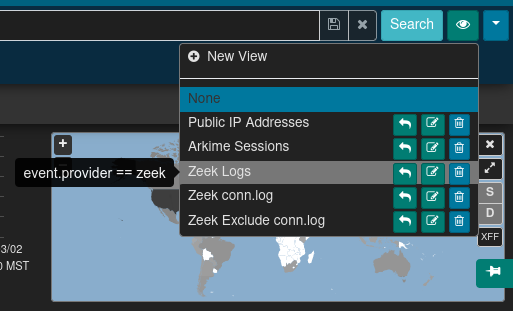
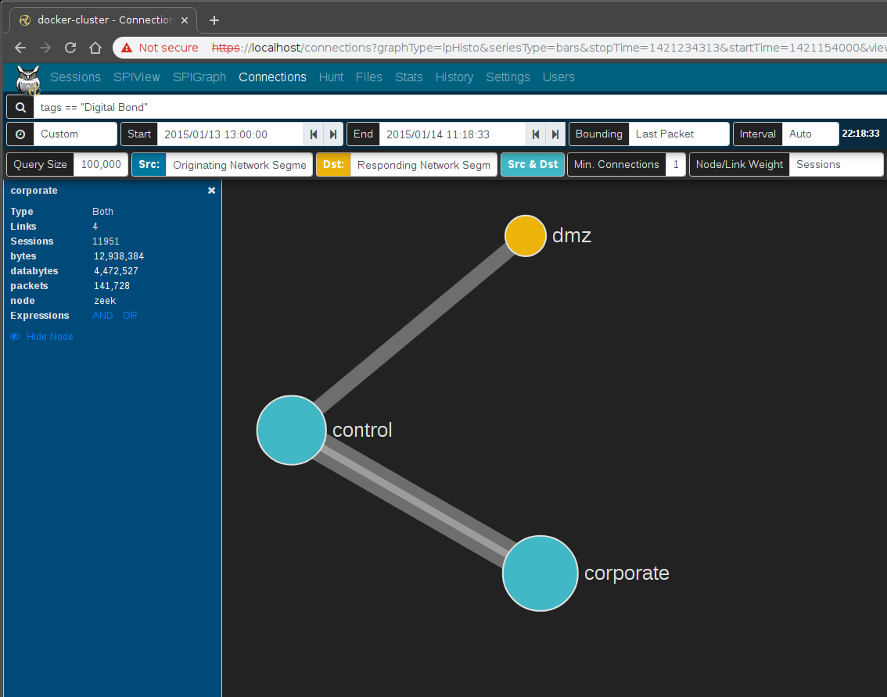
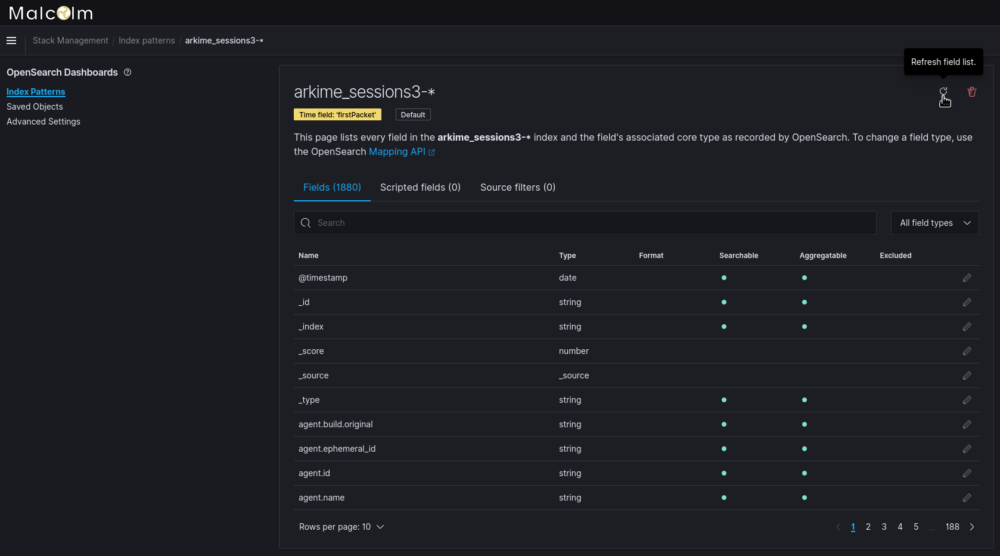

# Malcolm


[Malcolm](https://github.com/idaholab/Malcolm) is a powerful network traffic analysis tool suite designed with the following goals in mind:

* **Easy to use** – Malcolm accepts network traffic data in the form of full packet capture (PCAP) files and Zeek (formerly Bro) logs. These artifacts can be uploaded via a simple browser-based interface or captured live and forwarded to Malcolm using lightweight forwarders. In either case, the data is automatically normalized, enriched, and correlated for analysis.
* **Powerful traffic analysis** – Visibility into network communications is provided through two intuitive interfaces: OpenSearch Dashboards, a flexible data visualization plugin with dozens of prebuilt dashboards providing an at-a-glance overview of network protocols; and Arkime (formerly Moloch), a powerful tool for finding and identifying the network sessions comprising suspected security incidents.
* **Streamlined deployment** – Malcolm operates as a cluster of Docker containers, isolated sandboxes which each serve a dedicated function of the system. This Docker-based deployment model, combined with a few simple scripts for setup and run-time management, makes Malcolm suitable to be deployed quickly across a variety of platforms and use cases, whether it be for long-term deployment on a Linux server in a security operations center (SOC) or for incident response on a Macbook for an individual engagement.
* **Secure communications** – All communications with Malcolm, both from the user interface and from remote log forwarders, are secured with industry standard encryption protocols.
* **Permissive license** – Malcolm is comprised of several widely used open source tools, making it an attractive alternative to security solutions requiring paid licenses.
* **Expanding control systems visibility** – While Malcolm is great for general-purpose network traffic analysis, its creators see a particular need in the community for tools providing insight into protocols used in industrial control systems (ICS) environments. Ongoing Malcolm development will aim to provide additional parsers for common ICS protocols.

Although all of the open source tools which make up Malcolm are already available and in general use, Malcolm provides a framework of interconnectivity which makes it greater than the sum of its parts. And while there are many other network traffic analysis solutions out there, ranging from complete Linux distributions like Security Onion to licensed products like Splunk Enterprise Security, the creators of Malcolm feel its easy deployment and robust combination of tools fill a void in the network security space that will make network traffic analysis accessible to many in both the public and private sectors as well as individual enthusiasts.

In short, Malcolm provides an easily deployable network analysis tool suite for full packet capture artifacts (PCAP files) and Zeek logs. While Internet access is required to build it, it is not required at runtime.

## <a name="TableOfContents"></a>Table of Contents

* [Automated Build Workflows Status](#BuildBadges)
* [Quick start](#QuickStart)
    * [Getting Malcolm](#GetMalcolm)
    * [User interface](#UserInterfaceURLs)
* [Overview](#Overview)
* [Components](#Components)
* [Supported Protocols](#Protocols)
* [Development](#Development)
    * [Building from source](#Build)
* [Pre-Packaged installation files](#Packager)
* [Preparing your system](#Preparing)
    * [Recommended system requirements](#SystemRequirements)
    * [System configuration and tuning](#ConfigAndTuning)
        * [`docker-compose.yml` parameters](#DockerComposeYml)
        * [Linux host system configuration](#HostSystemConfigLinux)
        * [macOS host system configuration](#HostSystemConfigMac)
        * [Windows host system configuration](#HostSystemConfigWindows)
* [Running Malcolm](#Running)
    * [Configure authentication](#AuthSetup)
        * [Local account management](#AuthBasicAccountManagement)
        * [Lightweight Directory Access Protocol (LDAP) authentication](#AuthLDAP)
            - [LDAP connection security](#AuthLDAPSecurity)
    * [Starting Malcolm](#Starting)
    * [Stopping and restarting Malcolm](#StopAndRestart)
    * [Clearing Malcolm's data](#Wipe)
    * [Temporary read-only interface](#ReadOnlyUI)
* [Capture file and log archive upload](#Upload)
    - [Tagging](#Tagging)
    - [Processing uploaded PCAPs with Zeek](#UploadPCAPZeek)
* [Live analysis](#LiveAnalysis)
    * [Capturing traffic on local network interfaces](#LocalPCAP)
    * [Using a network sensor appliance](#Hedgehog)
    * [Manually forwarding Zeek logs from an external source](#ZeekForward)
* [Arkime](#Arkime)
    * [Zeek log integration](#ArkimeZeek)
        - [Correlating Zeek logs and Arkime sessions](#ZeekArkimeFlowCorrelation)
    * [Help](#ArkimeHelp)
    * [Sessions](#ArkimeSessions)
        * [PCAP Export](#ArkimePCAPExport)
    * [SPIView](#ArkimeSPIView)
    * [SPIGraph](#ArkimeSPIGraph)
    * [Connections](#ArkimeConnections)
    * [Hunt](#ArkimeHunt)
    * [Statistics](#ArkimeStats)
    * [Settings](#ArkimeSettings)
* [OpenSearch Dashboards](#Dashboards)
    * [Discover](#Discover)
        - [Screenshots](#DiscoverGallery)
    * [Visualizations and dashboards](#DashboardsVisualizations)
        - [Prebuilt visualizations and dashboards](#PrebuiltVisualizations)
            - [Screenshots](#PrebuiltVisualizationsGallery)
        - [Building your own visualizations and dashboards](#BuildDashboard)
            + [Screenshots](#NewVisualizationsGallery)
* [Search Queries in Arkime and OpenSearch](#SearchCheatSheet)
* [Other Malcolm features](#MalcolmFeatures)
    - [Automatic file extraction and scanning](#ZeekFileExtraction)
    - [Automatic host and subnet name assignment](#HostAndSubnetNaming)
        + [IP/MAC address to hostname mapping via `host-map.txt`](#HostNaming)
        + [CIDR subnet to network segment name mapping via `cidr-map.txt`](#SegmentNaming)
        + [Defining hostname and CIDR subnet names interface](#NameMapUI)
        + [Applying mapping changes](#ApplyMapping)
    - [OpenSearch index management](#IndexManagement)
    - [Event severity scoring](#Severity)
        + [Customizing event severity scoring](#SeverityConfig)
    - [Zeek Intelligence Framework](#ZeekIntel)
        + [STIX™ and TAXII™](#ZeekIntelSTIX)
    - [Alerting](#Alerting)
    - ["Best Guess" Fingerprinting for ICS Protocols](#ICSBestGuess)
    - [API](#API)
        + [Examples](#APIExamples)
* [Using Beats to forward host logs to Malcolm](#OtherBeats)
* [Malcolm installer ISO](#ISO)
    * [Installation](#ISOInstallation)
    * [Generating the ISO](#ISOBuild)
    * [Setup](#ISOSetup)
    * [Time synchronization](#ConfigTime)
    * [Hardening](#Hardening)
        * [STIG compliance exceptions](#STIGExceptions)
        * [CIS benchmark compliance exceptions](#CISExceptions)
* [Known issues](#Issues)
* [Installation example using Ubuntu 20.04 LTS](#InstallationExample)
* [Upgrading Malcolm](#UpgradePlan)
* [Modifying or Contributing to Malcolm](#Contributing)
* [Forks](#Forks)
* [Copyright](#Footer)
* [Contact](#Contact)

## <a name="BuildBadges"></a>Automated Builds Status

See [**Building from source**](#Build) to read how you can use GitHub [workflow files](./.github/workflows/) to build Malcolm.


## <a name="QuickStart"></a>Quick start

### <a name="GetMalcolm"></a>Getting Malcolm

For a `TL;DR` example of downloading, configuring, and running Malcolm on a Linux platform, see [Installation example using Ubuntu 20.04 LTS](#InstallationExample).

The scripts to control Malcolm require Python 3.

#### Source code

The files required to build and run Malcolm are available on its [GitHub page](https://github.com/idaholab/Malcolm/tree/main). Malcolm's source code is released under the terms of a permissive open source software license (see see `License.txt` for the terms of its release).

#### Building Malcolm from scratch

The `build.sh` script can build Malcolm's Docker images from scratch. See [Building from source](#Build) for more information.

#### Initial configuration

You must run [`auth_setup`](#AuthSetup) prior to pulling Malcolm's Docker images. You should also ensure your system configuration and `docker-compose.yml` settings are tuned by running `./scripts/install.py` or `./scripts/install.py --configure` (see [System configuration and tuning](#ConfigAndTuning)).
    
#### Pull Malcolm's Docker images

Malcolm's Docker images are periodically built and hosted on [Docker Hub](https://hub.docker.com/u/malcolmnetsec). If you already have [Docker](https://www.docker.com/) and [Docker Compose](https://docs.docker.com/compose/), these prebuilt images can be pulled by navigating into the Malcolm directory (containing the `docker-compose.yml` file) and running `docker-compose pull` like this:
```
$ docker-compose pull
Pulling api               ... done
Pulling arkime            ... done
Pulling dashboards        ... done
Pulling dashboards-helper ... done
Pulling file-monitor      ... done
Pulling filebeat          ... done
Pulling freq              ... done
Pulling htadmin           ... done
Pulling logstash          ... done
Pulling name-map-ui       ... done
Pulling nginx-proxy       ... done
Pulling opensearch        ... done
Pulling pcap-capture      ... done
Pulling pcap-monitor      ... done
Pulling upload            ... done
Pulling zeek              ... done
```

You can then observe that the images have been retrieved by running `docker images`:
```
$ docker images
REPOSITORY                                                     TAG             IMAGE ID       CREATED      SIZE
malcolmnetsec/api                                              5.2.4           xxxxxxxxxxxx   2 days ago   155MB
malcolmnetsec/arkime                                           5.2.4           xxxxxxxxxxxx   2 days ago   811MB
malcolmnetsec/dashboards                                       5.2.4           xxxxxxxxxxxx   2 days ago   970MB
malcolmnetsec/dashboards-helper                                5.2.4           xxxxxxxxxxxx   2 days ago   154MB
malcolmnetsec/filebeat-oss                                     5.2.4           xxxxxxxxxxxx   2 days ago   621MB
malcolmnetsec/file-monitor                                     5.2.4           xxxxxxxxxxxx   2 days ago   586MB
malcolmnetsec/file-upload                                      5.2.4           xxxxxxxxxxxx   2 days ago   259MB
malcolmnetsec/freq                                             5.2.4           xxxxxxxxxxxx   2 days ago   132MB
malcolmnetsec/htadmin                                          5.2.4           xxxxxxxxxxxx   2 days ago   242MB
malcolmnetsec/logstash-oss                                     5.2.4           xxxxxxxxxxxx   2 days ago   1.27GB
malcolmnetsec/name-map-ui                                      5.2.4           xxxxxxxxxxxx   2 days ago   142MB
malcolmnetsec/nginx-proxy                                      5.2.4           xxxxxxxxxxxx   2 days ago   117MB
malcolmnetsec/opensearch                                       5.2.4           xxxxxxxxxxxx   2 days ago   1.18GB
malcolmnetsec/pcap-capture                                     5.2.4           xxxxxxxxxxxx   2 days ago   122MB
malcolmnetsec/pcap-monitor                                     5.2.4           xxxxxxxxxxxx   2 days ago   214MB
malcolmnetsec/zeek                                             5.2.4           xxxxxxxxxxxx   2 days ago   938MB
```

#### Import from pre-packaged tarballs

Once built, the `malcolm_appliance_packager.sh` script can be used to create pre-packaged Malcolm tarballs for import on another machine. See [Pre-Packaged Installation Files](#Packager) for more information.

### Starting and stopping Malcolm

Use the scripts in the `scripts/` directory to start and stop Malcolm, view debug logs of a currently running
instance, wipe the database and restore Malcolm to a fresh state, etc.

### <a name="UserInterfaceURLs"></a>User interface

A few minutes after starting Malcolm (probably 5 to 10 minutes for Logstash to be completely up, depending on the system), the following services will be accessible:

* Arkime: [https://localhost:443](https://localhost:443)
* OpenSearch Dashboards: [https://localhost/dashboards/](https://localhost/dashboards/) or [https://localhost:5601](https://localhost:5601)
* Capture File and Log Archive Upload (Web): [https://localhost/upload/](https://localhost/upload/)
* Capture File and Log Archive Upload (SFTP): `sftp://<username>@127.0.0.1:8022/files`
* [Host and Subnet Name Mapping](#HostAndSubnetNaming) Editor: [https://localhost/name-map-ui/](https://localhost/name-map-ui/)
* Account Management: [https://localhost:488](https://localhost:488)

## <a name="Overview"></a>Overview


Malcolm processes network traffic data in the form of packet capture (PCAP) files or Zeek logs. A [sensor](#Hedgehog) (packet capture appliance) monitors network traffic mirrored to it over a SPAN port on a network switch or router, or using a network TAP device. [Zeek](https://www.zeek.org/index.html) logs and [Arkime](https://molo.ch/) sessions are generated containing important session metadata from the traffic observed, which are then securely forwarded to a Malcolm instance. Full PCAP files are optionally stored locally on the sensor device for examination later.

Malcolm parses the network session data and enriches it with additional lookups and mappings including GeoIP mapping, hardware manufacturer lookups from [organizationally unique identifiers (OUI)](http://standards-oui.ieee.org/oui/oui.txt) in MAC addresses, assigning names to [network segments](#SegmentNaming) and [hosts](#HostNaming) based on user-defined IP address and MAC mappings, performing [TLS fingerprinting](#https://engineering.salesforce.com/tls-fingerprinting-with-ja3-and-ja3s-247362855967), and many others.

The enriched data is stored in an [OpenSearch](https://opensearch.org/) document store in a format suitable for analysis through two intuitive interfaces: OpenSearch Dashboards, a flexible data visualization plugin with dozens of prebuilt dashboards providing an at-a-glance overview of network protocols; and Arkime, a powerful tool for finding and identifying the network sessions comprising suspected security incidents. These tools can be accessed through a web browser from analyst workstations or for display in a security operations center (SOC). Logs can also optionally be forwarded on to another instance of Malcolm.

For smaller networks, use at home by network security enthusiasts, or in the field for incident response engagements, Malcolm can also easily be deployed locally on an ordinary consumer workstation or laptop. Malcolm can process local artifacts such as locally-generated Zeek logs, locally-captured PCAP files, and PCAP files collected offline without the use of a dedicated sensor appliance.

## <a name="Components"></a>Components

Malcolm leverages the following excellent open source tools, among others.

* [Arkime](https://arkime.com/) (formerly Moloch) - for PCAP file processing, browsing, searching, analysis, and carving/exporting; Arkime itself consists of two parts:
    * [capture](https://github.com/arkime/arkime/tree/master/capture) - a tool for traffic capture, as well as offline PCAP parsing and metadata insertion into OpenSearch
    * [viewer](https://github.com/arkime/arkime/tree/master/viewer) - a browser-based interface for data visualization
* [OpenSearch](https://opensearch.org/) - a search and analytics engine for indexing and querying network traffic session metadata 
* [Logstash](https://www.elastic.co/products/logstash) and [Filebeat](https://www.elastic.co/products/beats/filebeat) - for ingesting and parsing [Zeek](https://www.zeek.org/index.html) [Log Files](https://docs.zeek.org/en/stable/script-reference/log-files.html) and ingesting them into OpenSearch in a format that Arkime understands and is able to understand in the same way it natively understands PCAP data
* [OpenSearch Dashboards](https://opensearch.org/docs/latest/dashboards/index/) - for creating additional ad-hoc visualizations and dashboards beyond that which is provided by Arkime viewer
* [Zeek](https://www.zeek.org/index.html) - a network analysis framework and IDS
* [Yara](https://github.com/VirusTotal/yara) - a tool used to identify and classify malware samples
* [Capa](https://github.com/fireeye/capa) - a tool for detecting capabilities in executable files
* [ClamAV](https://www.clamav.net/) - an antivirus engine for scanning files extracted by Zeek
* [CyberChef](https://github.com/gchq/CyberChef) - a "swiss-army knife" data conversion tool 
* [jQuery File Upload](https://github.com/blueimp/jQuery-File-Upload) - for uploading PCAP files and Zeek logs for processing
* [List.js](https://github.com/javve/list.js) - for the [host and subnet name mapping](#HostAndSubnetNaming) interface
* [Docker](https://www.docker.com/) and [Docker Compose](https://docs.docker.com/compose/) - for simple, reproducible deployment of the Malcolm appliance across environments and to coordinate communication between its various components
* [Nginx](https://nginx.org/) - for HTTPS and reverse proxying Malcolm components
* [nginx-auth-ldap](https://github.com/kvspb/nginx-auth-ldap) - an LDAP authentication module for nginx
* [Mark Baggett](https://github.com/MarkBaggett)'s [freq](https://github.com/MarkBaggett/freq) - a tool for calculating entropy of strings
* [Florian Roth](https://github.com/Neo23x0)'s [Signature-Base](https://github.com/Neo23x0/signature-base) Yara ruleset
* These Zeek plugins:
    * some of Amazon.com, Inc.'s [ICS protocol](https://github.com/amzn?q=zeek) analyzers
    * Andrew Klaus's [Sniffpass](https://github.com/cybera/zeek-sniffpass) plugin for detecting cleartext passwords in HTTP POST requests
    * Andrew Klaus's [zeek-httpattacks](https://github.com/precurse/zeek-httpattacks) plugin for detecting noncompliant HTTP requests
    * ICS protocol analyzers for Zeek published by [DHS CISA](https://github.com/cisagov/ICSNPP) and [Idaho National Lab](https://github.com/idaholab/ICSNPP)
    * Corelight's ["bad neighbor" (CVE-2020-16898)](https://github.com/corelight/CVE-2020-16898) plugin
    * Corelight's ["OMIGOD" (CVE-2021-38647)](https://github.com/corelight/CVE-2021-38647) plugin
    * Corelight's ["Log4Shell" (CVE-2021-44228)](https://github.com/corelight/cve-2021-44228) plugin
    * Corelight's [Microsoft Excel privilege escalation detection (CVE-2021-42292)](https://github.com/corelight/CVE-2021-42292) plugin
    * Corelight's [Apache HTTP server 2.4.49-2.4.50 path traversal/RCE vulnerability (CVE-2021-41773)](https://github.com/corelight/CVE-2021-41773) plugin
    * Corelight's [bro-xor-exe](https://github.com/corelight/bro-xor-exe-plugin) plugin
    * Corelight's [callstranger-detector](https://github.com/corelight/callstranger-detector) plugin
    * Corelight's [community ID](https://github.com/corelight/zeek-community-id) flow hashing plugin
    * Corelight's [HTTP protocol stack vulnerability (CVE-2021-31166)](https://github.com/corelight/CVE-2021-31166) plugin
    * Corelight's [pingback](https://github.com/corelight/pingback) plugin
    * Corelight's [ripple20](https://github.com/corelight/ripple20) plugin
    * Corelight's [SIGred](https://github.com/corelight/SIGred) plugin
    * Corelight's [Zerologon](https://github.com/corelight/zerologon) plugin
    * J-Gras' [Zeek::AF_Packet](https://github.com/J-Gras/zeek-af_packet-plugin) plugin
    * Johanna Amann's [CVE-2020-0601](https://github.com/0xxon/cve-2020-0601) ECC certificate validation plugin and [CVE-2020-13777](https://github.com/0xxon/cve-2020-13777) GnuTLS unencrypted session ticket detection plugin
    * Lexi Brent's [EternalSafety](https://github.com/0xl3x1/zeek-EternalSafety) plugin
    * MITRE Cyber Analytics Repository's [Bro/Zeek ATT&CK®-Based Analytics (BZAR)](https://github.com/mitre-attack/car/tree/master/implementations) script
    * Salesforce's [gQUIC](https://github.com/salesforce/GQUIC_Protocol_Analyzer) analyzer
    * Salesforce's [HASSH](https://github.com/salesforce/hassh) SSH fingerprinting plugin
    * Salesforce's [JA3](https://github.com/salesforce/ja3) TLS fingerprinting plugin
    * Zeek's [Spicy](https://github.com/zeek/spicy) plugin framework
* [GeoLite2](https://dev.maxmind.com/geoip/geoip2/geolite2/) - Malcolm includes GeoLite2 data created by [MaxMind](https://www.maxmind.com)

## <a name="Protocols"></a>Supported Protocols

Malcolm uses [Zeek](https://docs.zeek.org/en/stable/script-reference/proto-analyzers.html) and [Arkime](https://github.com/arkime/arkime/tree/master/capture/parsers) to analyze network traffic. These tools provide varying degrees of visibility into traffic transmitted over the following network protocols:

| Traffic | Wiki | Organization/Specification | Arkime | Zeek |
|---|:---:|:---:|:---:|:---:|
|Internet layer|[🔗](https://en.wikipedia.org/wiki/Internet_layer)|[🔗](https://tools.ietf.org/html/rfc791)|[✓](https://github.com/arkime/arkime/blob/master/capture/packet.c)|[✓](https://docs.zeek.org/en/stable/scripts/base/protocols/conn/main.zeek.html#type-Conn::Info)|
|Border Gateway Protocol (BGP)|[🔗](https://en.wikipedia.org/wiki/Border_Gateway_Protocol)|[🔗](https://tools.ietf.org/html/rfc2283)|[✓](https://github.com/arkime/arkime/blob/master/capture/parsers/bgp.c)||
|Building Automation and Control (BACnet)|[🔗](https://en.wikipedia.org/wiki/BACnet)|[🔗](http://www.bacnet.org/)||[✓](https://github.com/cisagov/icsnpp-bacnet)|
|Bristol Standard Asynchronous Protocol (BSAP)|[🔗](https://en.wikipedia.org/wiki/Bristol_Standard_Asynchronous_Protocol)|[🔗](http://www.documentation.emersonprocess.com/groups/public/documents/specification_sheets/d301321x012.pdf)[🔗](http://www.documentation.emersonprocess.com/groups/public/documents/instruction_manuals/d301401x012.pdf)||[✓](https://github.com/cisagov/icsnpp-bsap)|
|Distributed Computing Environment / Remote Procedure Calls (DCE/RPC)|[🔗](https://en.wikipedia.org/wiki/DCE/RPC)|[🔗](https://pubs.opengroup.org/onlinepubs/009629399/toc.pdf)||[✓](https://docs.zeek.org/en/stable/scripts/base/protocols/dce-rpc/main.zeek.html#type-DCE_RPC::Info)|
|Dynamic Host Configuration Protocol (DHCP)|[🔗](https://en.wikipedia.org/wiki/Dynamic_Host_Configuration_Protocol)|[🔗](https://tools.ietf.org/html/rfc2131)|[✓](https://github.com/arkime/arkime/blob/master/capture/parsers/dhcp.c)|[✓](https://docs.zeek.org/en/stable/scripts/base/protocols/dhcp/main.zeek.html#type-DHCP::Info)|
|Distributed Network Protocol 3 (DNP3)|[🔗](https://en.wikipedia.org/wiki/DNP3)|[🔗](https://www.dnp.org)||[✓](https://docs.zeek.org/en/stable/scripts/base/protocols/dnp3/main.zeek.html#type-DNP3::Info)[✓](https://github.com/cisagov/icsnpp-dnp3)|
|Domain Name System (DNS)|[🔗](https://en.wikipedia.org/wiki/Domain_Name_System)|[🔗](https://tools.ietf.org/html/rfc1035)|[✓](https://github.com/arkime/arkime/blob/master/capture/parsers/dns.c)|[✓](https://docs.zeek.org/en/stable/scripts/base/protocols/dns/main.zeek.html#type-DNS::Info)|
|EtherCAT|[🔗](https://en.wikipedia.org/wiki/EtherCAT)|[🔗](https://www.ethercat.org/en/downloads/downloads_A02E436C7A97479F9261FDFA8A6D71E5.htm)||[✓](https://github.com/cisagov/icsnpp-ethercat)|
|EtherNet/IP / Common Industrial Protocol (CIP)|[🔗](https://en.wikipedia.org/wiki/EtherNet/IP) [🔗](https://en.wikipedia.org/wiki/Common_Industrial_Protocol)|[🔗](https://www.odva.org/Technology-Standards/EtherNet-IP/Overview)||[✓](https://github.com/cisagov/icsnpp-enip)|
|FTP (File Transfer Protocol)|[🔗](https://en.wikipedia.org/wiki/File_Transfer_Protocol)|[🔗](https://tools.ietf.org/html/rfc959)||[✓](https://docs.zeek.org/en/stable/scripts/base/protocols/ftp/info.zeek.html#type-FTP::Info)|
|Google Quick UDP Internet Connections (gQUIC)|[🔗](https://en.wikipedia.org/wiki/QUIC#Google_QUIC_(gQUIC))|[🔗](https://www.chromium.org/quic)|[✓](https://github.com/arkime/arkime/blob/master/capture/parsers/quic.c)|[✓](https://github.com/salesforce/GQUIC_Protocol_Analyzer/blob/master/scripts/Salesforce/GQUIC/main.bro)|
|Hypertext Transfer Protocol (HTTP)|[🔗](https://en.wikipedia.org/wiki/Hypertext_Transfer_Protocol)|[🔗](https://tools.ietf.org/html/rfc7230)|[✓](https://github.com/arkime/arkime/blob/master/capture/parsers/http.c)|[✓](https://docs.zeek.org/en/stable/scripts/base/protocols/http/main.zeek.html#type-HTTP::Info)|
|IPsec|[🔗](https://en.wikipedia.org/wiki/IPsec)|[🔗](https://zeek.org/2021/04/20/zeeks-ipsec-protocol-analyzer/)||[✓](https://github.com/corelight/zeek-spicy-ipsec)|
|Internet Relay Chat (IRC)|[🔗](https://en.wikipedia.org/wiki/Internet_Relay_Chat)|[🔗](https://tools.ietf.org/html/rfc1459)|[✓](https://github.com/arkime/arkime/blob/master/capture/parsers/irc.c)|[✓](https://docs.zeek.org/en/stable/scripts/base/protocols/irc/main.zeek.html#type-IRC::Info)|
|Lightweight Directory Access Protocol (LDAP)|[🔗](https://en.wikipedia.org/wiki/Lightweight_Directory_Access_Protocol)|[🔗](https://tools.ietf.org/html/rfc4511)|[✓](https://github.com/arkime/arkime/blob/master/capture/parsers/ldap.c)|[✓](https://github.com/zeek/spicy-ldap)|
|Kerberos|[🔗](https://en.wikipedia.org/wiki/Kerberos_(protocol))|[🔗](https://tools.ietf.org/html/rfc4120)|[✓](https://github.com/arkime/arkime/blob/master/capture/parsers/krb5.c)|[✓](https://docs.zeek.org/en/stable/scripts/base/protocols/krb/main.zeek.html#type-KRB::Info)|
|Modbus|[🔗](https://en.wikipedia.org/wiki/Modbus)|[🔗](http://www.modbus.org/)||[✓](https://docs.zeek.org/en/stable/scripts/base/protocols/modbus/main.zeek.html#type-Modbus::Info)[✓](https://github.com/cisagov/icsnpp-modbus)|
|MQ Telemetry Transport (MQTT)|[🔗](https://en.wikipedia.org/wiki/MQTT)|[🔗](https://mqtt.org/)||[✓](https://docs.zeek.org/en/stable/scripts/policy/protocols/mqtt/main.zeek.html)|
|MySQL|[🔗](https://en.wikipedia.org/wiki/MySQL)|[🔗](https://dev.mysql.com/doc/internals/en/client-server-protocol.html)|[✓](https://github.com/arkime/arkime/blob/master/capture/parsers/mysql.c)|[✓](https://docs.zeek.org/en/stable/scripts/base/protocols/mysql/main.zeek.html#type-MySQL::Info)|
|NT Lan Manager (NTLM)|[🔗](https://en.wikipedia.org/wiki/NT_LAN_Manager)|[🔗](https://docs.microsoft.com/en-us/openspecs/windows_protocols/ms-nlmp/b38c36ed-2804-4868-a9ff-8dd3182128e4?redirectedfrom=MSDN)||[✓](https://docs.zeek.org/en/stable/scripts/base/protocols/ntlm/main.zeek.html#type-NTLM::Info)|
|Network Time Protocol (NTP)|[🔗](https://en.wikipedia.org/wiki/Network_Time_Protocol)|[🔗](http://www.ntp.org)||[✓](https://docs.zeek.org/en/latest/scripts/base/protocols/ntp/main.zeek.html#type-NTP::Info)|
|Oracle|[🔗](https://en.wikipedia.org/wiki/Oracle_Net_Services)|[🔗](https://docs.oracle.com/cd/E11882_01/network.112/e41945/layers.htm#NETAG004)|[✓](https://github.com/arkime/arkime/blob/master/capture/parsers/oracle.c)||
|Open Platform Communications Unified Architecture (OPC UA) Binary|[🔗](https://en.wikipedia.org/wiki/OPC_Unified_Architecture)|[🔗](https://opcfoundation.org/developer-tools/specifications-unified-architecture)||[✓](https://github.com/cisagov/icsnpp-opcua-binary)|
|Open Shortest Path First (OSPF)|[🔗](https://en.wikipedia.org/wiki/Open_Shortest_Path_First)|[🔗](https://datatracker.ietf.org/wg/ospf/charter/)[🔗](https://datatracker.ietf.org/doc/html/rfc2328)[🔗](https://datatracker.ietf.org/doc/html/rfc5340)||[✓](https://github.com/corelight/zeek-spicy-ospf)|
|OpenVPN|[🔗](https://en.wikipedia.org/wiki/OpenVPN)|[🔗](https://openvpn.net/community-resources/openvpn-protocol/)[🔗](https://zeek.org/2021/03/16/a-zeek-openvpn-protocol-analyzer/)||[✓](https://github.com/corelight/zeek-spicy-openvpn)|
|PostgreSQL|[🔗](https://en.wikipedia.org/wiki/PostgreSQL)|[🔗](https://www.postgresql.org/)|[✓](https://github.com/arkime/arkime/blob/master/capture/parsers/postgresql.c)||
|Process Field Net (PROFINET)|[🔗](https://en.wikipedia.org/wiki/PROFINET)|[🔗](https://us.profinet.com/technology/profinet/)||[✓](https://github.com/amzn/zeek-plugin-profinet/blob/master/scripts/main.zeek)|
|Remote Authentication Dial-In User Service (RADIUS)|[🔗](https://en.wikipedia.org/wiki/RADIUS)|[🔗](https://tools.ietf.org/html/rfc2865)|[✓](https://github.com/arkime/arkime/blob/master/capture/parsers/radius.c)|[✓](https://docs.zeek.org/en/stable/scripts/base/protocols/radius/main.zeek.html#type-RADIUS::Info)|
|Remote Desktop Protocol (RDP)|[🔗](https://en.wikipedia.org/wiki/Remote_Desktop_Protocol)|[🔗](https://docs.microsoft.com/en-us/windows/win32/termserv/remote-desktop-protocol?redirectedfrom=MSDN)||[✓](https://docs.zeek.org/en/stable/scripts/base/protocols/rdp/main.zeek.html#type-RDP::Info)|
|Remote Framebuffer (RFB)|[🔗](https://en.wikipedia.org/wiki/RFB_protocol)|[🔗](https://tools.ietf.org/html/rfc6143)||[✓](https://docs.zeek.org/en/stable/scripts/base/protocols/rfb/main.zeek.html#type-RFB::Info)|
|S7comm / Connection Oriented Transport Protocol (COTP)|[🔗](https://wiki.wireshark.org/S7comm) [🔗](https://wiki.wireshark.org/COTP)|[🔗](https://support.industry.siemens.com/cs/document/26483647/what-properties-advantages-and-special-features-does-the-s7-protocol-offer-?dti=0&lc=en-WW) [🔗](https://www.ietf.org/rfc/rfc0905.txt)||[✓](https://github.com/amzn/zeek-plugin-s7comm/blob/master/scripts/main.zeek)|
|Secure Shell (SSH)|[🔗](https://en.wikipedia.org/wiki/Secure_Shell)|[🔗](https://tools.ietf.org/html/rfc4253)|[✓](https://github.com/arkime/arkime/blob/master/capture/parsers/ssh.c)|[✓](https://docs.zeek.org/en/stable/scripts/base/protocols/ssh/main.zeek.html#type-SSH::Info)|
|Secure Sockets Layer (SSL) / Transport Layer Security (TLS)|[🔗](https://en.wikipedia.org/wiki/Transport_Layer_Security)|[🔗](https://tools.ietf.org/html/rfc5246)|[✓](https://github.com/arkime/arkime/blob/master/capture/parsers/socks.c)|[✓](https://docs.zeek.org/en/stable/scripts/base/protocols/ssl/main.zeek.html#type-SSL::Info)|
|Session Initiation Protocol (SIP)|[🔗](https://en.wikipedia.org/wiki/Session_Initiation_Protocol)|[🔗](https://tools.ietf.org/html/rfc3261)||[✓](https://docs.zeek.org/en/stable/scripts/base/protocols/sip/main.zeek.html#type-SIP::Info)|
|Server Message Block (SMB) / Common Internet File System (CIFS)|[🔗](https://en.wikipedia.org/wiki/Server_Message_Block)|[🔗](https://docs.microsoft.com/en-us/windows/win32/fileio/microsoft-smb-protocol-and-cifs-protocol-overview)|[✓](https://github.com/arkime/arkime/blob/master/capture/parsers/smb.c)|[✓](https://docs.zeek.org/en/stable/scripts/base/protocols/smb/main.zeek.html)|
|Simple Mail Transfer Protocol (SMTP)|[🔗](https://en.wikipedia.org/wiki/Simple_Mail_Transfer_Protocol)|[🔗](https://tools.ietf.org/html/rfc5321)|[✓](https://github.com/arkime/arkime/blob/master/capture/parsers/smtp.c)|[✓](https://docs.zeek.org/en/stable/scripts/base/protocols/smtp/main.zeek.html#type-SMTP::Info)|
|Simple Network Management Protocol (SNMP)|[🔗](https://en.wikipedia.org/wiki/Simple_Network_Management_Protocol)|[🔗](https://tools.ietf.org/html/rfc2578)|[✓](https://github.com/arkime/arkime/blob/master/capture/parsers/smtp.c)|[✓](https://docs.zeek.org/en/stable/scripts/base/protocols/snmp/main.zeek.html#type-SNMP::Info)|
|SOCKS|[🔗](https://en.wikipedia.org/wiki/SOCKS)|[🔗](https://tools.ietf.org/html/rfc1928)|[✓](https://github.com/arkime/arkime/blob/master/capture/parsers/socks.c)|[✓](https://docs.zeek.org/en/stable/scripts/base/protocols/socks/main.zeek.html#type-SOCKS::Info)|
|STUN (Session Traversal Utilities for NAT)|[🔗](https://en.wikipedia.org/wiki/STUN)|[🔗](https://datatracker.ietf.org/doc/html/rfc3489)|[✓](https://github.com/arkime/arkime/blob/main/capture/parsers/misc.c#L147)|[✓](https://github.com/corelight/zeek-spicy-stun)|
|Syslog|[🔗](https://en.wikipedia.org/wiki/Syslog)|[🔗](https://tools.ietf.org/html/rfc5424)|[✓](https://github.com/arkime/arkime/blob/master/capture/parsers/tls.c)|[✓](https://docs.zeek.org/en/stable/scripts/base/protocols/syslog/main.zeek.html#type-Syslog::Info)|
|Tabular Data Stream (TDS)|[🔗](https://en.wikipedia.org/wiki/Tabular_Data_Stream)|[🔗](https://www.freetds.org/tds.html) [🔗](https://docs.microsoft.com/en-us/openspecs/windows_protocols/ms-tds/b46a581a-39de-4745-b076-ec4dbb7d13ec)|[✓](https://github.com/arkime/arkime/blob/master/capture/parsers/tds.c)|[✓](https://github.com/amzn/zeek-plugin-tds/blob/master/scripts/main.zeek)|
|Telnet / remote shell (rsh) / remote login (rlogin)|[🔗](https://en.wikipedia.org/wiki/Telnet)[🔗](https://en.wikipedia.org/wiki/Berkeley_r-commands)|[🔗](https://tools.ietf.org/html/rfc854)[🔗](https://tools.ietf.org/html/rfc1282)|[✓](https://github.com/arkime/arkime/blob/master/capture/parsers/misc.c#L336)|[✓](https://docs.zeek.org/en/current/scripts/base/bif/plugins/Zeek_Login.events.bif.zeek.html)[❋](https://github.com/idaholab/Malcolm/blob/main/zeek/config/login.zeek)|
|TFTP (Trivial File Transfer Protocol)|[🔗](https://en.wikipedia.org/wiki/Trivial_File_Transfer_Protocol)|[🔗](https://tools.ietf.org/html/rfc1350)||[✓](https://github.com/zeek/spicy-analyzers/blob/main/analyzer/protocol/tftp/tftp.zeek)|
|WireGuard|[🔗](https://en.wikipedia.org/wiki/WireGuard)|[🔗](https://www.wireguard.com/protocol/)[🔗](https://www.wireguard.com/papers/wireguard.pdf)||[✓](https://github.com/corelight/zeek-spicy-wireguard)|
|various tunnel protocols (e.g., GTP, GRE, Teredo, AYIYA, IP-in-IP, etc.)|[🔗](https://en.wikipedia.org/wiki/Tunneling_protocol)||[✓](https://github.com/arkime/arkime/blob/master/capture/packet.c)|[✓](https://docs.zeek.org/en/stable/scripts/base/frameworks/tunnels/main.zeek.html#type-Tunnel::Info)|

Additionally, Zeek is able to detect and, where possible, log the type, vendor and version of [various](https://docs.zeek.org/en/stable/scripts/base/frameworks/software/main.zeek.html#type-Software::Type) other [software protocols](https://en.wikipedia.org/wiki/Application_layer).

As part of its network traffic analysis, Zeek can extract and analyze files transferred across the protocols it understands. In addition to generating logs for transferred files, deeper analysis is done into the following file types:

* [Portable executable](https://docs.zeek.org/en/stable/scripts/base/files/pe/main.zeek.html#type-PE::Info) files
* [X.509](https://docs.zeek.org/en/stable/scripts/base/files/x509/main.zeek.html#type-X509::Info) certificates

See [automatic file extraction and scanning](#ZeekFileExtraction) for additional features related to file scanning.

See [Zeek log integration](#ArkimeZeek) for more information on how Malcolm integrates [Arkime sessions and Zeek logs](#ZeekArkimeFlowCorrelation) for analysis. 

## <a name="Development"></a>Development

Checking out the [Malcolm source code](https://github.com/idaholab/Malcolm/tree/main) results in the following subdirectories in your `malcolm/` working copy:

* `api` - code and configuration for the `api` container which provides a REST API to query Malcolm
* `arkime` - code and configuration for the `arkime` container which processes PCAP files using `capture` and which serves the Viewer application
* `arkime-logs` - an initially empty directory to which the `arkime` container will write some debug log files
* `arkime-raw` - an initially empty directory to which the `arkime` container will write captured PCAP files; as Arkime as employed by Malcolm is currently used for processing previously-captured PCAP files, this directory is currently unused
* `Dockerfiles` - a directory containing build instructions for Malcolm's docker images
* `docs` - a directory containing instructions and documentation
* `opensearch` - an initially empty directory where the OpenSearch database instance will reside
* `opensearch-backup` - an initially empty directory for storing OpenSearch [index snapshots](#IndexManagement) 
* `filebeat` - code and configuration for the `filebeat` container which ingests Zeek logs and forwards them to the `logstash` container
* `file-monitor` - code and configuration for the `file-monitor` container which can scan files extracted by Zeek
* `file-upload` - code and configuration for the `upload` container which serves a web browser-based upload form for uploading PCAP files and Zeek logs, and which serves an SFTP share as an alternate method for upload
* `freq-server` - code and configuration for the `freq` container used for calculating entropy of strings
* `htadmin` - configuration for the `htadmin` user account management container
* `dashboards` - code and configuration for the `dashboards` container for creating additional ad-hoc visualizations and dashboards beyond that which is provided by Arkime Viewer
* `logstash` - code and configuration for the `logstash` container which parses Zeek logs and forwards them to the `opensearch` container
* `malcolm-iso` - code and configuration for building an [installer ISO](#ISO) for a minimal Debian-based Linux installation for running Malcolm
* `name-map-ui` - code and configuration for the `name-map-ui` container which provides the [host and subnet name mapping](#HostAndSubnetNaming) interface
* `nginx` - configuration for the `nginx` reverse proxy container
* `pcap` - an initially empty directory for PCAP files to be uploaded, processed, and stored
* `pcap-capture` - code and configuration for the `pcap-capture` container which can capture network traffic
* `pcap-monitor` - code and configuration for the `pcap-monitor` container which watches for new or uploaded PCAP files notifies the other services to process them
* `scripts` - control scripts for starting, stopping, restarting, etc. Malcolm
* `sensor-iso` - code and configuration for building a [Hedgehog Linux](#Hedgehog) ISO
* `shared` - miscellaneous code used by various Malcolm components 
* `zeek` - code and configuration for the `zeek` container which handles PCAP processing using Zeek
* `zeek-logs` - an initially empty directory for Zeek logs to be uploaded, processed, and stored

and the following files of special note:

* `auth.env` - the script `./scripts/auth_setup` prompts the user for the administrator credentials used by the Malcolm appliance, and `auth.env` is the environment file where those values are stored
* `cidr-map.txt` - specify custom IP address to network segment mapping
* `host-map.txt` - specify custom IP and/or MAC address to host mapping
* `net-map.json` - an alternative to `cidr-map.txt` and `host-map.txt`, mapping hosts and network segments to their names in a JSON-formatted file
* `docker-compose.yml` - the configuration file used by `docker-compose` to build, start, and stop an instance of the Malcolm appliance
* `docker-compose-standalone.yml` - similar to `docker-compose.yml`, only used for the ["packaged"](#Packager) installation of Malcolm

### <a name="Build"></a>Building from source

Building the Malcolm docker images from scratch requires internet access to pull source files for its components. Once internet access is available, execute the following command to build all of the Docker images used by the Malcolm appliance:

```
$ ./scripts/build.sh
```

Then, go take a walk or something since it will be a while. When you're done, you can run `docker images` and see you have fresh images for:

* `malcolmnetsec/api` (based on `python:3-slim-bullseye`)
* `malcolmnetsec/arkime` (based on `debian:bullseye-slim`)
* `malcolmnetsec/dashboards` (based on `opensearchproject/opensearch-dashboards`)
* `malcolmnetsec/dashboards-helper` (based on `alpine:3.15`)
* `malcolmnetsec/file-monitor` (based on `debian:bullseye-slim`)
* `malcolmnetsec/file-upload` (based on `debian:bullseye-slim`)
* `malcolmnetsec/filebeat-oss` (based on `docker.elastic.co/beats/filebeat-oss`)
* `malcolmnetsec/freq` (based on `debian:bullseye-slim`)
* `malcolmnetsec/htadmin` (based on `debian:bullseye-slim`)
* `malcolmnetsec/logstash-oss` (based on `opensearchproject/logstash-oss-with-opensearch-output-plugin`)
* `malcolmnetsec/name-map-ui` (based on `alpine:3.15`)
* `malcolmnetsec/nginx-proxy` (based on `alpine:3.15`)
* `malcolmnetsec/opensearch` (based on `opensearchproject/opensearch`)
* `malcolmnetsec/pcap-capture` (based on `debian:bullseye-slim`)
* `malcolmnetsec/pcap-monitor` (based on `debian:bullseye-slim`)
* `malcolmnetsec/pcap-zeek` (based on `debian:bullseye-slim`)

Alternately, if you have forked Malcolm on GitHub, [workflow files](./.github/workflows/) are provided which contain instructions for GitHub to build the docker images and [sensor](#Hedgehog) and [Malcolm](#ISO) installer ISOs. The resulting images are named according to the pattern `ghcr.io/owner/malcolmnetsec/image:branch` (e.g., if you've forked Malcolm with the github user `romeogdetlevjr`, the `arkime` container built for the `main` would be named `ghcr.io/romeogdetlevjr/malcolmnetsec/arkime:main`). To run your local instance of Malcolm using these images instead of the official ones, you'll need to edit your `docker-compose.yml` file(s) and replace the `image:` tags according to this new pattern, or use the bash helper script `./shared/bin/github_image_helper.sh` to pull and re-tag the images.

## <a name="Packager"></a>Pre-Packaged installation files

### Creating pre-packaged installation files

`scripts/malcolm_appliance_packager.sh` can be run to package up the configuration files (and, if necessary, the Docker images) which can be copied to a network share or USB drive for distribution to non-networked machines. For example:

```
$ ./scripts/malcolm_appliance_packager.sh 
You must set a username and password for Malcolm, and self-signed X.509 certificates will be generated

Store administrator username/password for local Malcolm access? (Y/n): 

Administrator username: analyst
analyst password: 
analyst password (again): 

(Re)generate self-signed certificates for HTTPS access (Y/n): 

(Re)generate self-signed certificates for a remote log forwarder (Y/n): 

Store username/password for forwarding Logstash events to a secondary, external OpenSearch instance (y/N): 

Store username/password for email alert sender account (y/N): 

Packaged Malcolm to "/home/user/tmp/malcolm_20190513_101117_f0d052c.tar.gz"

Do you need to package docker images also [y/N]? y
This might take a few minutes...

Packaged Malcolm docker images to "/home/user/tmp/malcolm_20190513_101117_f0d052c_images.tar.gz"


To install Malcolm:
  1. Run install.py
  2. Follow the prompts

To start, stop, restart, etc. Malcolm:
  Use the control scripts in the "scripts/" directory:
   - start         (start Malcolm)
   - stop          (stop Malcolm)
   - restart       (restart Malcolm)
   - logs          (monitor Malcolm logs)
   - wipe          (stop Malcolm and clear its database)
   - auth_setup    (change authentication-related settings)

A minute or so after starting Malcolm, the following services will be accessible:
  - Arkime: https://localhost/
  - OpenSearch Dashboards: https://localhost/dashboards/
  - PCAP upload (web): https://localhost/upload/
  - PCAP upload (sftp): sftp://USERNAME@127.0.0.1:8022/files/
  - Host and subnet name mapping editor: https://localhost/name-map-ui/
  - Account management: https://localhost:488/
```

The above example will result in the following artifacts for distribution as explained in the script's output:

```
$ ls -lh
total 2.0G
-rwxr-xr-x 1 user user  61k May 13 11:32 install.py
-rw-r--r-- 1 user user 2.0G May 13 11:37 malcolm_20190513_101117_f0d052c_images.tar.gz
-rw-r--r-- 1 user user  683 May 13 11:37 malcolm_20190513_101117_f0d052c.README.txt
-rw-r--r-- 1 user user 183k May 13 11:32 malcolm_20190513_101117_f0d052c.tar.gz
```

### Installing from pre-packaged installation files

If you have obtained pre-packaged installation files to install Malcolm on a non-networked machine via an internal network share or on a USB key, you likely have the following files:

* `malcolm_YYYYMMDD_HHNNSS_xxxxxxx.README.txt` - This readme file contains a minimal set up instructions for extracting the contents of the other tarballs and running the Malcolm appliance.
* `malcolm_YYYYMMDD_HHNNSS_xxxxxxx.tar.gz` - This tarball contains the configuration files and directory configuration used by an instance of Malcolm. It can be extracted via `tar -xf malcolm_YYYYMMDD_HHNNSS_xxxxxxx.tar.gz` upon which a directory will be created (named similarly to the tarball) containing the directories and configuration files. Alternatively, `install.py` can accept this filename as an argument and handle its extraction and initial configuration for you.
* `malcolm_YYYYMMDD_HHNNSS_xxxxxxx_images.tar.gz` - This tarball contains the Docker images used by Malcolm. It can be imported manually via `docker load -i malcolm_YYYYMMDD_HHNNSS_xxxxxxx_images.tar.gz`
* `install.py` - This install script can load the Docker images and extract Malcolm configuration files from the aforementioned tarballs and do some initial configuration for you.

Run `install.py malcolm_XXXXXXXX_XXXXXX_XXXXXXX.tar.gz` and follow the prompts. If you do not already have Docker and Docker Compose installed, the `install.py` script will help you install them.

## <a name="Preparing"></a>Preparing your system

### <a name="SystemRequirements"></a>Recommended system requirements

Malcolm runs on top of [Docker](https://www.docker.com/) which runs on recent releases of Linux, Apple macOS and Microsoft Windows 10.

To quote the [Elasticsearch documentation](https://www.elastic.co/guide/en/elasticsearch/guide/current/hardware.html), "If there is one resource that you will run out of first, it will likely be memory." The same is true for Malcolm: you will want at least 16 gigabytes of RAM to run Malcolm comfortably. For processing large volumes of traffic, I'd recommend at a bare minimum a dedicated server with 16 cores and 16 gigabytes of RAM. Malcolm can run on less, but more is better. You're going to want as much hard drive space as possible, of course, as the amount of PCAP data you're able to analyze and store will be limited by your hard drive.

Arkime's wiki has a couple of documents ([here](https://github.com/arkime/arkime#hardware-requirements) and [here](https://github.com/arkime/arkime/wiki/FAQ#what-kind-of-capture-machines-should-we-buy) and [here](https://github.com/arkime/arkime/wiki/FAQ#how-many-elasticsearch-nodes-or-machines-do-i-need) and a [calculator here](https://molo.ch/#estimators)) which may be helpful, although not everything in those documents will apply to a Docker-based setup like Malcolm.

### <a name="ConfigAndTuning"></a>System configuration and tuning

If you already have Docker and Docker Compose installed, the `install.py` script can still help you tune system configuration and `docker-compose.yml` parameters for Malcolm. To run it in "configuration only" mode, bypassing the steps to install Docker and Docker Compose, run it like this:
```
./scripts/install.py --configure
```

Although `install.py` will attempt to automate many of the following configuration and tuning parameters, they are nonetheless listed in the following sections for reference:

#### <a name="DockerComposeYml"></a>`docker-compose.yml` parameters

Edit `docker-compose.yml` and search for the `OPENSEARCH_JAVA_OPTS` key. Edit the `-Xms4g -Xmx4g` values, replacing `4g` with a number that is half of your total system memory, or just under 32 gigabytes, whichever is less. So, for example, if I had 64 gigabytes of memory I would edit those values to be `-Xms31g -Xmx31g`. This indicates how much memory can be allocated to the OpenSearch heaps. For a pleasant experience, I would suggest not using a value under 10 gigabytes. Similar values can be modified for Logstash with `LS_JAVA_OPTS`, where using 3 or 4 gigabytes is recommended.

Various other environment variables inside of `docker-compose.yml` can be tweaked to control aspects of how Malcolm behaves, particularly with regards to processing PCAP files and Zeek logs. The environment variables of particular interest are located near the top of that file under **Commonly tweaked configuration options**, which include:

* `PUID` and `PGID` - Docker runs all of its containers as the privileged `root` user by default. For better security, Malcolm immediately drops to non-privileged user accounts for executing internal processes wherever possible. The `PUID` (**p**rocess **u**ser **ID**) and `PGID` (**p**rocess **g**roup **ID**) environment variables allow Malcolm to map internal non-privileged user accounts to a corresponding [user account](https://en.wikipedia.org/wiki/User_identifier) on the host.

* `NGINX_BASIC_AUTH` - if set to `true`, use [TLS-encrypted HTTP basic](#AuthBasicAccountManagement) authentication (default); if set to `false`, use [Lightweight Directory Access Protocol (LDAP)](#AuthLDAP) authentication

* `NGINX_LOG_ACCESS_AND_ERRORS` - if set to `true`, all access to Malcolm via its [web interfaces](#UserInterfaceURLs) will be logged to OpenSearch (default `false`)

* `MANAGE_PCAP_FILES` – if set to `true`, all PCAP files imported into Malcolm will be marked as available for deletion by Arkime if available storage space becomes too low (default `false`)

* `ZEEK_AUTO_ANALYZE_PCAP_FILES` – if set to `true`, all PCAP files imported into Malcolm will automatically be analyzed by Zeek, and the resulting logs will also be imported (default `false`)

* `ZEEK_INTEL_REFRESH_CRON_EXPRESSION` - specifies a [cron expression](https://en.wikipedia.org/wiki/Cron#CRON_expression) indicating the refresh interval for generating the [Zeek Intelligence Framework](#ZeekIntel) files (defaults to empty, which disables automatic refresh)

* `ZEEK_INTEL_ITEM_EXPIRATION` - specifies the value for Zeek's [`Intel::item_expiration`](https://docs.zeek.org/en/current/scripts/base/frameworks/intel/main.zeek.html#id-Intel::item_expiration) timeout as used by the [Zeek Intelligence Framework](#ZeekIntel) (default `-1min`, which disables item expiration)

* `ZEEK_DISABLE_...` - if set to any non-blank value, each of these variables can be used to disable a certain Zeek function when it analyzes PCAP files (for example, setting `ZEEK_DISABLE_LOG_PASSWORDS` to `true` to disable logging of cleartext passwords)

* `ZEEK_DISABLE_BEST_GUESS_ICS` - see ["Best Guess" Fingerprinting for ICS Protocols](#ICSBestGuess)

* `MAXMIND_GEOIP_DB_LICENSE_KEY` - Malcolm uses MaxMind's free GeoLite2 databases for GeoIP lookups. As of December 30, 2019, these databases are [no longer available](https://blog.maxmind.com/2019/12/18/significant-changes-to-accessing-and-using-geolite2-databases/) for download via a public URL. Instead, they must be downloaded using a MaxMind license key (available without charge [from MaxMind](https://www.maxmind.com/en/geolite2/signup)). The license key can be specified here for GeoIP database downloads during build- and run-time.

* `ARKIME_ANALYZE_PCAP_THREADS` – the number of threads available to Arkime for analyzing PCAP files (default `1`)

* `ZEEK_AUTO_ANALYZE_PCAP_THREADS` – the number of threads available to Malcolm for analyzing Zeek logs (default `1`)

* `LOGSTASH_OUI_LOOKUP` – if set to `true`, Logstash will map MAC addresses to vendors for all source and destination MAC addresses when analyzing Zeek logs (default `true`)

* `LOGSTASH_REVERSE_DNS` – if set to `true`, Logstash will perform a reverse DNS lookup for all external source and destination IP address values when analyzing Zeek logs (default `false`)

* `LOGSTASH_SEVERITY_SCORING` - if set to `true`, Logstash will perform [severity scoring](#Severity) when analyzing Zeek logs (default `true`)

* `FREQ_LOOKUP` - if set to `true`, domain names (from DNS queries and SSL server names) will be assigned entropy scores as calculated by [`freq`](https://github.com/MarkBaggett/freq) (default `false`)

* `FREQ_SEVERITY_THRESHOLD` - when [severity scoring](#Severity) is enabled, this variable indicates the entropy threshold for assigning severity to events with entropy scores calculated by [`freq`](https://github.com/MarkBaggett/freq); a lower value will only assign severity scores to fewer domain names with higher entropy (e.g., `2.0` for `NQZHTFHRMYMTVBQJE.COM`), while a higher value will assign severity scores to more domain names with lower entropy (e.g., `7.5` for `naturallanguagedomain.example.org`) (default `2.0`)

* `TOTAL_MEGABYTES_SEVERITY_THRESHOLD` - when [severity scoring](#Severity) is enabled, this variable indicates the size threshold (in megabytes) for assigning severity to large connections or file transfers (default `1000`)

* `CONNECTION_SECONDS_SEVERITY_THRESHOLD` - when [severity scoring](#Severity) is enabled, this variable indicates the duration threshold (in seconds) for assigning severity to long connections (default `3600`)

* `QUESTIONABLE_COUNTRY_CODES` - when [severity scoring](#Severity) is enabled, this variable defines a comma-separated list of countries of concern (using [ISO 3166-1 alpha-2 codes](https://en.wikipedia.org/wiki/ISO_3166-1_alpha-2#Current_codes)) (default `'CN,IR,KP,RU,UA'`)

* `OS_EXTERNAL_HOSTS` – if specified (in the format `'10.0.0.123:9200'`), logs received by Logstash will be forwarded on to another external OpenSearch instance in addition to the one maintained locally by Malcolm

* `OS_EXTERNAL_SSL` –  if set to `true`, Logstash will use HTTPS for the connection to external OpenSearch instances specified in `OS_EXTERNAL_HOSTS`

* `OS_EXTERNAL_SSL_CERTIFICATE_VERIFICATION` – if set to `true`, Logstash will require full SSL certificate validation; this may fail if using self-signed certificates (default `false`)

* `AUTO_TAG` – if set to `true`, Malcolm will automatically create Arkime sessions and Zeek logs with tags based on the filename, as described in [Tagging](#Tagging) (default `true`)

* `BEATS_SSL` – if set to `true`, Logstash will use require encrypted communications for any external Beats-based forwarders from which it will accept logs; if Malcolm is being used as a standalone tool then this can safely be set to `false`, but if external log feeds are to be accepted then setting it to true is recommended (default `false`)

* `ZEEK_EXTRACTOR_MODE` – determines the file extraction behavior for file transfers detected by Zeek; see [Automatic file extraction and scanning](#ZeekFileExtraction) for more details

* `EXTRACTED_FILE_IGNORE_EXISTING` – if set to `true`, files extant in `./zeek-logs/extract_files/`  directory will be ignored on startup rather than scanned

* `EXTRACTED_FILE_PRESERVATION` – determines behavior for preservation of [Zeek-extracted files](#ZeekFileExtraction)

* `VTOT_API2_KEY` – used to specify a [VirusTotal Public API v.20](https://www.virustotal.com/en/documentation/public-api/) key, which, if specified, will be used to submit hashes of [Zeek-extracted files](#ZeekFileExtraction) to VirusTotal

* `EXTRACTED_FILE_ENABLE_YARA` – if set to `true`, [Zeek-extracted files](#ZeekFileExtraction) will be scanned with [Yara](https://github.com/VirusTotal/yara)

* `EXTRACTED_FILE_YARA_CUSTOM_ONLY` – if set to `true`, Malcolm will bypass the default [Yara ruleset](https://github.com/Neo23x0/signature-base) and use only user-defined rules in `./yara/rules`

* `EXTRACTED_FILE_ENABLE_CAPA` – if set to `true`, [Zeek-extracted files](#ZeekFileExtraction) that are determined to be PE (portable executable) files will be scanned with [Capa](https://github.com/fireeye/capa)

* `EXTRACTED_FILE_CAPA_VERBOSE` – if set to `true`, all Capa rule hits will be logged; otherwise (`false`) only [MITRE ATT&CK® technique](https://attack.mitre.org/techniques) classifications will be logged

* `EXTRACTED_FILE_ENABLE_CLAMAV` – if set to `true`, [Zeek-extracted files](#ZeekFileExtraction) will be scanned with [ClamAV](https://www.clamav.net/)

* `EXTRACTED_FILE_UPDATE_RULES` – if set to `true`, file scanner engines (e.g., ClamAV, Capa, Yara) will periodically update their rule definitions

* `EXTRACTED_FILE_HTTP_SERVER_ENABLE` – if set to `true`, the directory containing [Zeek-extracted files](#ZeekFileExtraction) will be served over HTTP at `./extracted-files/` (e.g., [https://localhost/extracted-files/](https://localhost/extracted-files/) if you are connecting locally)

* `EXTRACTED_FILE_HTTP_SERVER_ENCRYPT` – if set to `true`, those Zeek-extracted files will be AES-256-CBC-encrypted in an `openssl enc`-compatible format (e.g., `openssl enc -aes-256-cbc -d -in example.exe.encrypted -out example.exe`)

* `EXTRACTED_FILE_HTTP_SERVER_KEY` – specifies the AES-256-CBC decryption password for encrypted Zeek-extracted files; used in conjunction with `EXTRACTED_FILE_HTTP_SERVER_ENCRYPT`

* `PCAP_ENABLE_NETSNIFF` – if set to `true`, Malcolm will capture network traffic on the local network interface(s) indicated in `PCAP_IFACE` using [netsniff-ng](http://netsniff-ng.org/)

* `PCAP_ENABLE_TCPDUMP` – if set to `true`, Malcolm will capture network traffic on the local network interface(s) indicated in `PCAP_IFACE` using [tcpdump](https://www.tcpdump.org/); there is no reason to enable *both* `PCAP_ENABLE_NETSNIFF` and `PCAP_ENABLE_TCPDUMP`

* `PCAP_IFACE` – used to specify the network interface(s) for local packet capture if `PCAP_ENABLE_NETSNIFF` or `PCAP_ENABLE_TCPDUMP` are enabled; for multiple interfaces, separate the interface names with a comma (e.g., `'enp0s25'` or `'enp10s0,enp11s0'`)

* `PCAP_ROTATE_MEGABYTES` – used to specify how large a locally-captured PCAP file can become (in megabytes) before it closed for processing and a new PCAP file created 

* `PCAP_ROTATE_MINUTES` – used to specify an time interval (in minutes) after which a locally-captured PCAP file will be closed for processing and a new PCAP file created

* `PCAP_FILTER` – specifies a tcpdump-style filter expression for local packet capture; leave blank to capture all traffic

#### <a name="HostSystemConfigLinux"></a>Linux host system configuration

##### Installing Docker

Docker installation instructions vary slightly by distribution. Please follow the links below to docker.com to find the instructions specific to your distribution:

* [Ubuntu](https://docs.docker.com/install/linux/docker-ce/ubuntu/)
* [Debian](https://docs.docker.com/install/linux/docker-ce/debian/)
* [Fedora](https://docs.docker.com/install/linux/docker-ce/fedora/)
* [CentOS](https://docs.docker.com/install/linux/docker-ce/centos/)
* [Binaries](https://docs.docker.com/install/linux/docker-ce/binaries/)

After installing Docker, because Malcolm should be run as a non-root user, add your user to the `docker` group with something like:
```
$ sudo usermod -aG docker yourusername
```

Following this, either reboot or log out then log back in.

Docker starts automatically on DEB-based distributions. On RPM-based distributions, you need to start it manually or enable it using the appropriate `systemctl` or `service` command(s).

You can test docker by running `docker info`, or (assuming you have internet access), `docker run --rm hello-world`.

##### Installing docker-compose

Please follow [this link](https://docs.docker.com/compose/install/) on docker.com for instructions on installing docker-compose.

##### Operating system configuration

The host system (ie., the one running Docker) will need to be configured for the [best possible OpenSearch performance](https://www.elastic.co/guide/en/elasticsearch/reference/master/system-config.html). Here are a few suggestions for Linux hosts (these may vary from distribution to distribution):

* Append the following lines to `/etc/sysctl.conf`:

```
# the maximum number of open file handles
fs.file-max=2097152

# increase maximums for inotify watches
fs.inotify.max_user_watches=131072
fs.inotify.max_queued_events=131072
fs.inotify.max_user_instances=512

# the maximum number of memory map areas a process may have
vm.max_map_count=262144

# decrease "swappiness" (swapping out runtime memory vs. dropping pages)
vm.swappiness=1

# the maximum number of incoming connections
net.core.somaxconn=65535

# the % of system memory fillable with "dirty" pages before flushing
vm.dirty_background_ratio=40

# maximum % of dirty system memory before committing everything
vm.dirty_ratio=80
```

* Depending on your distribution, create **either** the file `/etc/security/limits.d/limits.conf` containing:

```
# the maximum number of open file handles
* soft nofile 65535
* hard nofile 65535
# do not limit the size of memory that can be locked
* soft memlock unlimited
* hard memlock unlimited
```

**OR** the file `/etc/systemd/system.conf.d/limits.conf` containing: 

```
[Manager]
# the maximum number of open file handles
DefaultLimitNOFILE=65535:65535
# do not limit the size of memory that can be locked
DefaultLimitMEMLOCK=infinity
```

* Change the readahead value for the disk where the OpenSearch data will be stored. There are a few ways to do this. For example, you could add this line to `/etc/rc.local` (replacing `/dev/sda` with your disk block descriptor):

```
# change disk read-adhead value (# of blocks)
blockdev --setra 512 /dev/sda
```

* Change the I/O scheduler to `deadline` or `noop`. Again, this can be done in a variety of ways. The simplest is to add `elevator=deadline` to the arguments in `GRUB_CMDLINE_LINUX` in `/etc/default/grub`, then running `sudo update-grub2`

* If you are planning on using very large data sets, consider formatting the drive containing `opensearch` volume as XFS.

After making all of these changes, do a reboot for good measure!

#### <a name="HostSystemConfigMac"></a>macOS host system configuration

##### Automatic installation using `install.py`

The `install.py` script will attempt to guide you through the installation of Docker and Docker Compose if they are not present. If that works for you, you can skip ahead to **Configure docker daemon option** in this section.

##### Install Homebrew

The easiest way to install and maintain docker on Mac is using the [Homebrew cask](https://brew.sh). Execute the following in a terminal.

```
$ /bin/bash -c "$(curl -fsSL https://raw.githubusercontent.com/Homebrew/install/master/install.sh)"
$ brew install cask
$ brew tap homebrew/cask-versions
```

##### Install docker-edge

```
$ brew cask install docker-edge
```
This will install the latest version of docker and docker-compose. It can be upgraded later using `brew` as well:
```
$ brew cask upgrade --no-quarantine docker-edge
```
You can now run docker from the Applications folder.

##### Configure docker daemon option

Some changes should be made for performance ([this link](http://markshust.com/2018/01/30/performance-tuning-docker-mac) gives a good succinct overview).

* **Resource allocation** - For a good experience, you likely need at least a quad-core MacBook Pro with 16GB RAM and an SSD. I have run Malcolm on an older 2013 MacBook Pro with 8GB of RAM, but the more the better. Go in your system tray and select **Docker** → **Preferences** → **Advanced**. Set the resources available to docker to at least 4 CPUs and 8GB of RAM (>= 16GB is preferable).

* **Volume mount performance** - You can speed up performance of volume mounts by removing unused paths from **Docker** → **Preferences** → **File Sharing**. For example, if you're only going to be mounting volumes under your home directory, you could share `/Users` but remove other paths.

After making these changes, right click on the Docker 🐋 icon in the system tray and select **Restart**.

#### <a name="HostSystemConfigWindows"></a>Windows host system configuration

#### <a name="HostSystemConfigWindowsDocker"></a>Installing and configuring Docker Desktop for Windows

Installing and configuring [Docker to run under Windows](https://docs.docker.com/desktop/windows/wsl/) must be done manually, rather than through the `install.py` script as is done for Linux and macOS.

1. Be running Windows 10, version 1903 or higher
1. Prepare your system and [install WSL](https://docs.microsoft.com/en-us/windows/wsl/install) and a Linux distribution by running `wsl --install -d Debian` in PowerShell as Administrator (these instructions are tested with Debian, but may work with other distributions)
1. Install Docker Desktop for Windows either by downloading the installer from the [official Docker site](https://hub.docker.com/editions/community/docker-ce-desktop-windows) or installing it through [chocolatey](https://chocolatey.org/packages/docker-desktop).
1. Follow the [Docker Desktop WSL 2 backend](https://docs.docker.com/desktop/windows/wsl/) instructions to finish configuration and review best practices
1. Reboot
1. Open the WSL distribution's terminal and run run `docker info` to make sure Docker is running

#### <a name="HostSystemConfigWindowsMalcolm"></a>Finish Malcolm's configuration

Once Docker is installed, configured and running as described in the previous section, run [`./scripts/install.py --configure`](#ConfigAndTuning) to finish configuration of the local Malcolm installation. Malcolm will be controlled and run from within your WSL distribution's terminal environment.

## <a name="Running"></a>Running Malcolm

### <a name="AuthSetup"></a>Configure authentication

Malcolm requires authentication to access the [user interface](#UserInterfaceURLs). [Nginx](https://nginx.org/) can authenticate users with either local TLS-encrypted HTTP basic authentication or using a remote Lightweight Directory Access Protocol (LDAP) authentication server.

With the local basic authentication method, user accounts are managed by Malcolm and can be created, modified, and deleted using a [user management web interface](#AccountManagement). This method is suitable in instances where accounts and credentials do not need to be synced across many Malcolm installations.

LDAP authentication are managed on a remote directory service, such as a [Microsoft Active Directory Domain Services](https://docs.microsoft.com/en-us/windows-server/identity/ad-ds/get-started/virtual-dc/active-directory-domain-services-overview) or [OpenLDAP](https://www.openldap.org/).

Malcolm's authentication method is defined in the `x-auth-variables` section near the top of the [`docker-compose.yml`](#DockerComposeYml) file with the `NGINX_BASIC_AUTH` environment variable: `true` for local TLS-encrypted HTTP basic authentication, `false` for LDAP authentication.

In either case, you **must** run `./scripts/auth_setup` before starting Malcolm for the first time in order to:

* define the local Malcolm administrator account username and password (although these credentials will only be used for basic authentication, not LDAP authentication)
* specify whether or not to (re)generate the self-signed certificates used for HTTPS access
    * key and certificate files are located in the `nginx/certs/` directory
* specify whether or not to (re)generate the self-signed certificates used by a remote log forwarder (see the `BEATS_SSL` environment variable above)
    * certificate authority, certificate, and key files for Malcolm's Logstash instance are located in the `logstash/certs/` directory
    * certificate authority, certificate, and key files to be copied to and used by the remote log forwarder are located in the `filebeat/certs/` directory
* specify whether or not to store the username/password for forwarding Logstash events to a secondary, external OpenSearch instance (see the `OS_EXTERNAL_HOSTS`, `OS_EXTERNAL_SSL`, and `OS_EXTERNAL_SSL_CERTIFICATE_VERIFICATION` environment variables above)
    * these parameters are stored securely in the Logstash keystore file `logstash/certs/logstash.keystore`
* specify whether or not to [store the username/password](https://opensearch.org/docs/latest/monitoring-plugins/alerting/monitors/#authenticate-sender-account) for [email alert senders](https://opensearch.org/docs/latest/monitoring-plugins/alerting/monitors/#create-destinations)
    * these parameters are stored securely in the OpenSearch keystore file `opensearch/opensearch.keystore`

##### <a name="AuthBasicAccountManagement"></a>Local account management

[`auth_setup`](#AuthSetup) is used to define the username and password for the administrator account. Once Malcolm is running, the administrator account can be used to manage other user accounts via a **Malcolm User Management** page served over HTTPS on port 488 (e.g., [https://localhost:488](https://localhost:488) if you are connecting locally).

Malcolm user accounts can be used to access the [interfaces](#UserInterfaceURLs) of all of its [components](#Components), including Arkime. Arkime uses its own internal database of user accounts, so when a Malcolm user account logs in to Arkime for the first time Malcolm creates a corresponding Arkime user account automatically. This being the case, it is *not* recommended to use the Arkime **Users** settings page or change the password via the **Password** form under the Arkime **Settings** page, as those settings would not be consistently used across Malcolm.

Users may change their passwords via the **Malcolm User Management** page by clicking **User Self Service**. A forgotten password can also be reset via an emailed link, though this requires SMTP server settings to be specified in `htadmin/config.ini` in the Malcolm installation directory.

#### <a name="AuthLDAP"></a>Lightweight Directory Access Protocol (LDAP) authentication

The [nginx-auth-ldap](https://github.com/kvspb/nginx-auth-ldap) module serves as the interface between Malcolm's [Nginx](https://nginx.org/) web server and a remote LDAP server. When you run [`auth_setup`](#AuthSetup) for the first time, a sample LDAP configuration file is created at `nginx/nginx_ldap.conf`. 

```
# This is a sample configuration for the ldap_server section of nginx.conf.
# Yours will vary depending on how your Active Directory/LDAP server is configured.
# See https://github.com/kvspb/nginx-auth-ldap#available-config-parameters for options.

ldap_server ad_server {
  url "ldap://ds.example.com:3268/DC=ds,DC=example,DC=com?sAMAccountName?sub?(objectClass=person)";

  binddn "bind_dn";
  binddn_passwd "bind_dn_password";

  group_attribute member;
  group_attribute_is_dn on;
  require group "CN=Malcolm,CN=Users,DC=ds,DC=example,DC=com";
  require valid_user;
  satisfy all;
}

auth_ldap_cache_enabled on;
auth_ldap_cache_expiration_time 10000;
auth_ldap_cache_size 1000;
```

This file is mounted into the `nginx` container when Malcolm is started to provide connection information for the LDAP server.

The contents of `nginx_ldap.conf` will vary depending on how the LDAP server is configured. Some of the [avaiable parameters](https://github.com/kvspb/nginx-auth-ldap#available-config-parameters) in that file include:

* **`url`** - the `ldap://` or `ldaps://` connection URL for the remote LDAP server, which has the [following syntax](https://www.ietf.org/rfc/rfc2255.txt): `ldap[s]://<hostname>:<port>/<base_dn>?<attributes>?<scope>?<filter>`
* **`binddn`** and **`binddn_password`** - the account credentials used to query the LDAP directory
* **`group_attribute`** - the group attribute name which contains the member object (e.g., `member` or `memberUid`)
* **`group_attribute_is_dn`** - whether or not to search for the user's full distinguished name as the value in the group's member attribute
* **`require`** and **`satisfy`** - `require user`, `require group` and `require valid_user` can be used in conjunction with `satisfy any` or `satisfy all` to limit the users that are allowed to access the Malcolm instance

Before starting Malcolm, edit `nginx/nginx_ldap.conf` according to the specifics of your LDAP server and directory tree structure. Using a LDAP search tool such as [`ldapsearch`](https://www.openldap.org/software/man.cgi?query=ldapsearch) in Linux or [`dsquery`](https://social.technet.microsoft.com/wiki/contents/articles/2195.active-directory-dsquery-commands.aspx) in Windows may be of help as you formulate the configuration. Your changes should be made within the curly braces of the `ldap_server ad_server { … }` section. You can troubleshoot configuration file syntax errors and LDAP connection or credentials issues by running `./scripts/logs` (or `docker-compose logs nginx`) and examining the output of the `nginx` container.

The **Malcolm User Management** page described above is not available when using LDAP authentication.

##### <a name="AuthLDAPSecurity"></a>LDAP connection security

Authentication over LDAP can be done using one of three ways, [two of which](https://docs.microsoft.com/en-us/openspecs/windows_protocols/ms-adts/8e73932f-70cf-46d6-88b1-8d9f86235e81) offer data confidentiality protection: 

* **StartTLS** - the [standard extension](https://tools.ietf.org/html/rfc2830) to the LDAP protocol to establish an encrypted SSL/TLS connection within an already established LDAP connection
* **LDAPS** - a commonly used (though unofficial and considered deprecated) method in which SSL negotiation takes place before any commands are sent from the client to the server
* **Unencrypted** (cleartext) (***not recommended***)

In addition to the `NGINX_BASIC_AUTH` environment variable being set to `false` in the `x-auth-variables` section near the top of the [`docker-compose.yml`](#DockerComposeYml) file, the `NGINX_LDAP_TLS_STUNNEL` and `NGINX_LDAP_TLS_STUNNEL` environment variables are used in conjunction with the values in `nginx/nginx_ldap.conf` to define the LDAP connection security level. Use the following combinations of values to achieve the connection security methods above, respectively:

* **StartTLS**
    - `NGINX_LDAP_TLS_STUNNEL` set to `true` in [`docker-compose.yml`](#DockerComposeYml)
    - `url` should begin with `ldap://` and its port should be either the default LDAP port (389) or the default Global Catalog port (3268) in `nginx/nginx_ldap.conf` 
* **LDAPS**
    - `NGINX_LDAP_TLS_STUNNEL` set to `false` in [`docker-compose.yml`](#DockerComposeYml)
    - `url` should begin with `ldaps://` and its port should be either the default LDAPS port (636) or the default LDAPS Global Catalog port (3269) in `nginx/nginx_ldap.conf` 
* **Unencrypted** (clear text) (***not recommended***)
    - `NGINX_LDAP_TLS_STUNNEL` set to `false` in [`docker-compose.yml`](#DockerComposeYml)
    - `url` should begin with `ldap://` and its port should be either the default LDAP port (389) or the default Global Catalog port (3268) in `nginx/nginx_ldap.conf` 

For encrypted connections (whether using **StartTLS** or **LDAPS**), Malcolm will require and verify certificates when one or more trusted CA certificate files are placed in the `nginx/ca-trust/` directory. Otherwise, any certificate presented by the domain server will be accepted.

### <a name="Starting"></a>Starting Malcolm

[Docker compose](https://docs.docker.com/compose/) is used to coordinate running the Docker containers. To start Malcolm, navigate to the directory containing `docker-compose.yml` and run:
```
$ ./scripts/start
```
This will create the containers' virtual network and instantiate them, then leave them running in the background. The Malcolm containers may take a several minutes to start up completely. To follow the debug output for an already-running Malcolm instance, run:
```
$ ./scripts/logs
```
You can also use `docker stats` to monitor the resource utilization of running containers.

### <a name="StopAndRestart"></a>Stopping and restarting Malcolm

You can run `./scripts/stop` to stop the docker containers and remove their virtual network. Alternatively, `./scripts/restart` will restart an instance of Malcolm. Because the data on disk is stored on the host in docker volumes, doing these operations will not result in loss of data. 

Malcolm can be configured to be automatically restarted when the Docker system daemon restart (for example, on system reboot). This behavior depends on the [value](https://docs.docker.com/config/containers/start-containers-automatically/) of the [`restart:`](https://docs.docker.com/compose/compose-file/#restart) setting for each service in the `docker-compose.yml` file. This value can be set by running [`./scripts/install.py --configure`](#ConfigAndTuning) and answering "yes" to "`Restart Malcolm upon system or Docker daemon restart?`."

### <a name="Wipe"></a>Clearing Malcolm's data

Run `./scripts/wipe` to stop the Malcolm instance and wipe its OpenSearch database (**including** [index snapshots and management policies](#IndexManagement) and [alerting configuration](#Alerting)).

### <a name="ReadOnlyUI"></a>Temporary read-only interface

To temporarily set the Malcolm user interaces into a read-only configuration, run the following commands from the Malcolm installation directory.

First, to configure [Nginx] to disable access to the upload and other interfaces for changing Malcolm settings, and to deny HTTP methods other than `GET` and `POST`:

```
docker-compose exec nginx-proxy bash -c "cp /etc/nginx/nginx_readonly.conf /etc/nginx/nginx.conf && nginx -s reload"
```

Second, to set the existing OpenSearch data store to read-only:

```
docker-compose exec dashboards-helper /data/opensearch_read_only.py -i _cluster
```

These commands must be re-run every time you restart Malcolm.

Note that after you run these commands you may see an increase of error messages in the Malcolm containers' output as various background processes will fail due to the read-only nature of the indices. Additionally, some features such as Arkime's [Hunt](#ArkimeHunt) and [building your own visualizations and dashboards](#BuildDashboard) in OpenSearch Dashboards will not function correctly in read-only mode.

## <a name="Upload"></a>Capture file and log archive upload

Malcolm serves a web browser-based upload form for uploading PCAP files and Zeek logs at [https://localhost/upload/](https://localhost/upload/) if you are connecting locally.


Additionally, there is a writable `files` directory on an SFTP server served on port 8022 (e.g., `sftp://USERNAME@localhost:8022/files/` if you are connecting locally).

The types of files supported are:

* PCAP files (of mime type `application/vnd.tcpdump.pcap` or `application/x-pcapng`)
    - PCAPNG files are *partially* supported: Zeek is able to process PCAPNG files, but not all of Arkime's packet examination features work correctly
* Zeek logs in archive files (`application/gzip`, `application/x-gzip`, `application/x-7z-compressed`, `application/x-bzip2`, `application/x-cpio`, `application/x-lzip`, `application/x-lzma`, `application/x-rar-compressed`, `application/x-tar`, `application/x-xz`, or `application/zip`)
    - where the Zeek logs are found in the internal directory structure in the archive file does not matter

Files uploaded via these methods are monitored and moved automatically to other directories for processing to begin, generally within one minute of completion of the upload.

### <a name="Tagging"></a>Tagging

In addition to be processed for uploading, Malcolm events will be tagged according to the components of the filenames of the PCAP files or Zeek log archives files from which the events were parsed. For example, records created from a PCAP file named `ACME_Scada_VLAN10.pcap` would be tagged with `ACME`, `Scada`, and `VLAN10`. Tags are extracted from filenames by splitting on the characters "," (comma), "-" (dash), and "_" (underscore). These tags are viewable and searchable (via the `tags` field) in Arkime and OpenSearch Dashboards. This behavior can be changed by modifying the `AUTO_TAG` [environment variable in `docker-compose.yml`](#DockerComposeYml).

Tags may also be specified manually with the [browser-based upload form](#Upload).

### <a name="UploadPCAPZeek"></a>Processing uploaded PCAPs with Zeek

The browser-based upload interface also provides the ability to specify tags for events extracted from the files uploaded. Additionally, an **Analyze with Zeek** checkbox may be used when uploading PCAP files to cause them to be analyzed by Zeek, similarly to the `ZEEK_AUTO_ANALYZE_PCAP_FILES` environment variable [described above](#DockerComposeYml), only on a per-upload basis. Zeek can also automatically carve out files from file transfers; see [Automatic file extraction and scanning](#ZeekFileExtraction) for more details.

## <a name="LiveAnalysis"></a>Live analysis

### <a name="LocalPCAP"></a>Capturing traffic on local network interfaces

Malcolm's `pcap-capture` container can capture traffic on one or more local network interfaces and periodically rotate these files for processing with Arkime and Zeek. The `pcap-capture` Docker container is started with additional privileges (`IPC_LOCK`, `NET_ADMIN`, `NET_RAW`, and `SYS_ADMIN`) in order for it to be able to open network interfaces in promiscuous mode for capture.

The environment variables prefixed with `PCAP_` in the [`docker-compose.yml`](#DockerComposeYml) file determine local packet capture behavior. Local capture can also be configured by running [`./scripts/install.py --configure`](#ConfigAndTuning) and answering "yes" to "`Should Malcolm capture network traffic to PCAP files?`."

Note that currently Microsoft Windows and Apple macOS platforms run Docker inside of a virtualized environment. This would require additional configuration of virtual interfaces and port forwarding in Docker, the process for which is outside of the scope of this document.

### <a name="Hedgehog"></a>Using a network sensor appliance

A remote network sensor appliance can be used to monitor network traffic, capture PCAP files, and forward Zeek logs, Arkime sessions, or other information to Malcolm. [Hedgehog Linux](https://github.com/idaholab/Malcolm/tree/main/sensor-iso/) is a Debian-based operating system built to

* monitor network interfaces
* capture packets to PCAP files
* detect file transfers in network traffic and extract and scan those files for threats
* generate and forward Zeek logs, Arkime sessions, and other information to [Malcolm](https://github.com/idaholab/Malcolm)

Please see the [Hedgehog Linux README](https://github.com/idaholab/Malcolm/blob/main/sensor-iso/README.md) for more information.

### <a name="ZeekForward"></a>Manually forwarding Zeek logs from an external source

Malcolm's Logstash instance can also be configured to accept Zeek logs from a [remote forwarder](https://www.elastic.co/products/beats/filebeat) by running [`./scripts/install.py --configure`](#ConfigAndTuning) and answering "yes" to "`Expose Logstash port to external hosts?`." Enabling encrypted transport of these logs files is discussed in [Configure authentication](#AuthSetup) and the description of the `BEATS_SSL` environment variable in the [`docker-compose.yml`](#DockerComposeYml) file.

Configuring Filebeat to forward Zeek logs to Malcolm might look something like this example [`filebeat.yml`](https://www.elastic.co/guide/en/beats/filebeat/current/filebeat-reference-yml.html):
```
filebeat.inputs:
- type: log
  paths:
    - /var/zeek/*.log
  fields_under_root: true
  fields:
    type: "session"
  compression_level: 0
  exclude_lines: ['^\s*#']
  scan_frequency: 10s
  clean_inactive: 180m
  ignore_older: 120m
  close_inactive: 90m
  close_renamed: true
  close_removed: true
  close_eof: false
  clean_renamed: true
  clean_removed: true

output.logstash:
  hosts: ["192.0.2.123:5044"]
  ssl.enabled: true
  ssl.certificate_authorities: ["/foo/bar/ca.crt"]
  ssl.certificate: "/foo/bar/client.crt"
  ssl.key: "/foo/bar/client.key"
  ssl.supported_protocols: "TLSv1.2"
  ssl.verification_mode: "none"
```

## <a name="Arkime"></a>Arkime

The Arkime interface will be accessible over HTTPS on port 443 at the docker hosts IP address (e.g., [https://localhost](https://localhost) if you are connecting locally).

### <a name="ArkimeZeek"></a>Zeek log integration

A stock installation of Arkime extracts all of its network connection ("session") metadata ("SPI" or "Session Profile Information") from full packet capture artifacts (PCAP files). Zeek (formerly Bro) generates similar session metadata, linking network events to sessions via a connection UID. Malcolm aims to facilitate analysis of Zeek logs by mapping values from Zeek logs to the Arkime session database schema for equivalent fields, and by creating new "native" Arkime database fields for all the other Zeek log values for which there is not currently an equivalent in Arkime:


In this way, when full packet capture is an option, analysis of PCAP files can be enhanced by the additional information Zeek provides. When full packet capture is not an option, similar analysis can still be performed using the same interfaces and processes using the Zeek logs alone.

One value of particular mention is **Zeek Log Type** (`event.dataset` in OpenSearch). This value corresponds to the kind of Zeek `.log` file from which the record was created. In other words, a search could be restricted to records from `conn.log` by searching `event.dataset == conn`, or restricted to records from `weird.log` by searching `event.dataset == weird`. In this same way, to view *only* records from Zeek logs (excluding any from PCAP files), use the special Arkime `EXISTS` filter, as in `event.dataset == EXISTS!`. On the other hand, to exclude Zeek logs and only view Arkime Sessions, use `fileId != EXISTS!`. 

Click the icon of the owl **🦉** in the upper-left hand corner of to access the Arkime usage documentation (accessible at [https://localhost/help](https://localhost/help) if you are connecting locally), click the **Fields** label in the navigation pane, then search for `zeek` to see a list of the other Zeek log types and fields available to Malcolm.


The values of records created from Zeek logs can be expanded and viewed like any native Arkime session by clicking the plus **➕** icon to the left of the record in the Sessions view. However, note that when dealing with these Zeek records the full packet contents are not available, so buttons dealing with viewing and exporting PCAP information will not behave as they would for records from PCAP files. Other than that, Zeek records and their values are usable in Malcolm just like native PCAP session records.

#### <a name="ZeekArkimeFlowCorrelation"></a>Correlating Zeek logs and Arkime sessions

The Arkime interface displays both Zeek logs and Arkime sessions alongside each other. Using fields common to both data sources, one can [craft queries](#SearchCheatSheet) to filter results matching desired criteria.

A few fields of particular mention that help limit returned results to those Zeek logs and Arkime session records generated from the same network connection are [Community ID](https://github.com/corelight/community-id-spec) (`network.community_id` and `network.community_id` in Arkime and Zeek, respectively) and Zeek's [connection UID](https://docs.zeek.org/en/stable/examples/logs/#using-uids) (`zeek.uid`), which Malcolm maps to both Arkime's `rootId` field and the [ECS](https://www.elastic.co/guide/en/ecs/current/ecs-event.html#field-event-id) `event.id` field.

Community ID is specification for standard flow hashing [published by Corelight](https://github.com/corelight/community-id-spec) with the intent of making it easier to pivot from one dataset (e.g., Arkime sessions) to another (e.g., Zeek `conn.log` entries). In Malcolm both Arkime and [Zeek](https://github.com/corelight/zeek-community-id) populate this value, which makes it possible to filter for a specific network connection and see both data sources' results for that connection.

The `rootId` field is used by Arkime to link session records together when a particular session has too many packets to be represented by a single session. When normalizing Zeek logs to Arkime's schema, Malcolm piggybacks on `rootId` to store Zeek's [connection UID](https://docs.zeek.org/en/stable/examples/logs/#using-uids) to crossreference entries across Zeek log types. The connection UID is also stored in `zeek.uid`.

Filtering on community ID OR'ed with zeek UID (e.g., `network.community_id == "1:r7tGG//fXP1P0+BXH3zXETCtEFI=" || rootId == "CQcoro2z6adgtGlk42"`) is an effective way to see both the Arkime sessions and Zeek logs generated by a particular network connection.


### <a name="ArkimeHelp"></a>Help

Click the icon of the owl 🦉 in the upper-left hand corner of to access the Arkime usage documentation (accessible at [https://localhost/help](https://localhost/help) if you are connecting locally), which includes such topics as [search syntax](https://localhost/help#search), the [Sessions view](https://localhost/help#sessions), [SPIView](https://localhost/help#spiview), [SPIGraph](https://localhost/help#spigraph), and the [Connections](https://localhost/help#connections) graph.

### <a name="ArkimeSessions"></a>Sessions

The **Sessions** view provides low-level details of the sessions being investigated, whether they be Arkime sessions created from PCAP files or [Zeek logs mapped](#ArkimeZeek) to the Arkime session database schema.


The **Sessions** view contains many controls for filtering the sessions displayed from all sessions down to sessions of interest:

* [search bar](https://localhost/help#search): Indicated by the magnifying glass **🔍** icon, the search bar allows defining filters on session/log metadata
* [time bounding](https://localhost/help#timebounding) controls: The **🕘**, **Start**, **End**, **Bounding**, and **Interval** fields, and the **date histogram** can be used to visually zoom and pan the time range being examined.
* search button: The **Search** button re-runs the sessions query with the filters currently specified.
* views button: Indicated by the eyeball **👁** icon, views allow overlaying additional previously-specified filters onto the current sessions filters. For convenience, Malcolm provides several Arkime preconfigured views including filtering on the `event.dataset` field. 



* map: A global map can be expanded by clicking the globe **🌎** icon. This allows filtering sessions by IP-based geolocation when possible.

Some of these filter controls are also available on other Arkime pages (such as SPIView, SPIGraph, Connections, and Hunt).

The number of sessions displayed per page, as well as the page currently displayed, can be specified using the paging controls underneath the time bounding controls.

The sessions table is displayed below the filter controls. This table contains the sessions/logs matching the specified filters.

To the left of the column headers are two buttons. The **Toggle visible columns** button, indicated by a grid **⊞** icon, allows toggling which columns are displayed in the sessions table. The **Save or load custom column configuration** button, indicated by a columns **◫** icon, allows saving the current displayed columns or loading previously-saved configurations. This is useful for customizing which columns are displayed when investigating different types of traffic. Column headers can also be clicked to sort the results in the table, and column widths may be adjusted by dragging the separators between column headers.

Details for individual sessions/logs can be expanded by clicking the plus **➕** icon on the left of each row. Each row may contain multiple sections and controls, depending on whether the row represents a Arkime session or a [Zeek log](#ArkimeZeek). Clicking the field names and values in the details sections allows additional filters to be specified or summary lists of unique values to be exported.

When viewing Arkime session details (ie., a session generated from a PCAP file), an additional packets section will be visible underneath the metadata sections. When the details of a session of this type are expanded, Arkime will read the packet(s) comprising the session for display here. Various controls can be used to adjust how the packet is displayed (enabling **natural** decoding and enabling **Show Images & Files** may produce visually pleasing results), and other options (including PCAP download, carving images and files, applying decoding filters, and examining payloads in [CyberChef](https://github.com/gchq/CyberChef)) are available.

See also Arkime's usage documentation for more information on the [Sessions view](https://localhost/help#sessions).

#### <a name="ArkimePCAPExport"></a>PCAP Export

Clicking the down arrow **▼** icon to the far right of the search bar presents a list of actions including **PCAP Export** (see Arkime's [sessions help](https://localhost/help#sessions) for information on the other actions).  When full PCAP sessions are displayed, the **PCAP Export** feature allows you to create a new PCAP file from the matching Arkime sessions, including controls for which sessions are included (open items, visible items, or all matching items) and whether or not to include linked segments. Click **Export PCAP** button to generate the PCAP, after which you'll be presented with a browser download dialog to save or open the file. Note that depending on the scope of the filters specified this might take a long time (or, possibly even time out).


See the [issues](#Issues) section of this document for an error that can occur using this feature when Zeek log sessions are displayed.View

### <a name="ArkimeSPIView"></a>SPIView

Arkime's **SPI** (**S**ession **P**rofile **I**nformation) **View** provides a quick and easy-to-use interface for  exploring session/log metrics. The SPIView page lists categories for general session metrics (e.g., protocol, source and destination IP addresses, sort and destination ports, etc.) as well as for all of various types of network understood by Arkime and Zeek. These categories can be expanded and the top *n* values displayed, along with each value's cardinality, for the fields of interest they contain.


Click the the plus **➕** icon to the right of a category to expand it. The values for specific fields are displayed by clicking the field description in the field list underneath the category name. The list of field names can be filtered by typing part of the field name in the *Search for fields to display in this category* text input. The **Load All** and **Unload All** buttons can be used to toggle display of all of the fields belonging to that category. Once displayed, a field's name or one of its values may be clicked to provide further actions for filtering or displaying that field or its values. Of particular interest may be the **Open [fieldname] SPI Graph** option when clicking on a field's name. This will open a new tab with the SPI Graph ([see below](#ArkimeSPIGraph)) populated with the field's top values.

Note that because the SPIView page can potentially run many queries, SPIView limits the search domain to seven days (in other words, seven indices, as each index represents one day's worth of data). When using SPIView, you will have best results if you limit your search time frame to less than or equal to seven days. This limit can be adjusted by editing the `spiDataMaxIndices` setting in [config.ini](./etc/arkime/config.ini) and rebuilding the `malcolmnetsec/arkime` docker container.

See also Arkime's usage documentation for more information on [SPIView](https://localhost/help#spiview).

### <a name="ArkimeSPIGraph"></a>SPIGraph

Arkime's **SPI** (**S**ession **P**rofile **I**nformation) **Graph** visualizes the occurrence of some field's top *n* values over time, and (optionally) geographically. This is particularly useful for identifying trends in a particular type of communication over time: traffic using a particular protocol when seen sparsely at regular intervals on that protocol's date histogram in the SPIGraph may indicate a connection check, polling, or beaconing (for example, see the `llmnr` protocol in the screenshot below).


Controls can be found underneath the time bounding controls for selecting the field of interest, the number of elements to be displayed, the sort order, and a periodic refresh of the data.

See also Arkime's usage documentation for more information on [SPIGraph](https://localhost/help#spigraph).

### <a name="ArkimeConnections"></a>Connections

The **Connections** page presents network communications via a force-directed graph, making it easy to visualize logical relationships between network hosts.


Controls are available for specifying the query size (where smaller values will execute more quickly but may only contain an incomplete representation of the top *n* sessions, and larger values may take longer to execute but will be more complete), which fields to use as the source and destination for node values, a minimum connections threshold, and the method for determining the "weight" of the link between two nodes. As is the case with most other visualizations in Arkime, the graph is interactive: clicking on a node or the link between two nodes can be used to modify query filters, and the nodes themselves may be repositioned by dragging and dropping them. A node's color indicates whether it communicated as a source/originator, a destination/responder, or both.

While the default source and destination fields are *Src IP* and *Dst IP:Dst Port*, the Connections view is able to use any combination of any of the fields populated by Arkime and Zeek. For example:

* *Src OUI* and *Dst OUI* (hardware manufacturers)
* *Src IP* and *Protocols*
* *Originating Network Segment* and *Responding Network Segment* (see [CIDR subnet to network segment name mapping](#SegmentNaming))
* *Originating GeoIP City* and *Responding GeoIP City*

or any other combination of these or other fields.

See also Arkime's usage documentation for more information on the [Connections graph](https://localhost/help#connections).

### <a name="ArkimeHunt"></a>Hunt

Arkime's **Hunt** feature allows an analyst to search within the packets themselves (including payload data) rather than simply searching the session metadata. The search string may be specified using ASCII (with or without case sensitivity), hex codes, or regular expressions. Once a hunt job is complete, matching sessions can be viewed in the [Sessions](#ArkimeSessions)  view.

Clicking the **Create a packet search job** on the Hunt page will allow you to specify the following parameters for a new hunt job:

* a packet search job **name**
* a **maximum number of packets** to examine per session
* the **search string** and its format (*ascii*, *ascii (case sensitive)*, *hex*, *regex*, or *hex regex*)
* whether to search **source packets**, **destination packets**, or both
* whether to search **raw** or **reassembled** packets

Click the **➕ Create** button to begin the search. Arkime will scan the source PCAP files from which the sessions were created according to the search criteria. Note that whatever filters were specified when the hunt job is executed will apply to the hunt job as well; the number of sessions matching the current filters will be displayed above the hunt job parameters with text like "ⓘ Creating a new packet search job will search the packets of # sessions."


Once a hunt job is submitted, it will be assigned a unique hunt ID (a long unique string of characters like `yuBHAGsBdljYmwGkbEMm`) and its progress will be updated periodically in the **Hunt Job Queue** with the execution percent complete, the number of matches found so far, and the other parameters with which the job was submitted. More details for the hunt job can be viewed by expanding its row with the plus **➕** icon on the left.


Once the hunt job is complete (and a minute or so has passed, as the `huntId` must be added to the matching session records in the database), click the folder **📂** icon on the right side of the hunt job row to open a new [Sessions](#ArkimeSessions) tab with the search bar prepopulated to filter to sessions with packets matching the search criteria.


From this list of filtered sessions you can expand session details and explore packet payloads which matched the hunt search criteria.

The hunt feature is available only for sessions created from full packet capture data, not Zeek logs. This being the case, it is a good idea to click the eyeball **👁** icon and select the **Arkime Sessions** view to exclude Zeek logs from candidate sessions prior to using the hunt feature.

See also Arkime's usage documentation for more information on the [hunt feature](https://localhost/help#hunt).

### <a name="ArkimeStats"></a>Statistics

Arkime provides several other reports which show information about the state of Arkime and the underlying OpenSearch database.

The **Files** list displays a list of PCAP files processed by Arkime, the date and time of the earliest packet in each file, and the file size:


The **ES Indices** list (available under the **Stats** page) lists the OpenSearch indices within which log data is contained:


The **History** view provides a historical list of queries issues to Arkime and the details of those queries:


See also Arkime's usage documentation for more information on the [Files list](https://localhost/help#files), [statistics](https://localhost/help#files), and [history](https://localhost/help#history).

### <a name="ArkimeSettings"></a>Settings

#### General settings

The **Settings** page can be used to tweak Arkime preferences, defined additional custom views and column configurations, tweak the color theme, and more.

See Arkime's usage documentation for more information on [settings](https://localhost/help#settings).


## <a name="Dashboards"></a>OpenSearch Dashboards

While Arkime provides very nice visualizations, especially for network traffic, [OpenSearch Dashboards](https://opensearch.org/docs/latest/dashboards/index/) (an open source general-purpose data visualization tool for OpenSearch) can be used to create custom visualizations (tables, charts, graphs, dashboards, etc.) using the same data.

The OpenSearch Dashboards container can be accessed at [https://localhost/dashboards/](https://localhost/dashboards/) if you are connecting locally. Several preconfigured dashboards for Zeek logs are included in Malcolm's OpenSearch Dashboards configuration.

OpenSearch Dashboards has several components for data searching and visualization:

### <a name="Discover"></a>Discover

The **Discover** view enables you to view events on a record-by-record basis (similar to a *session* record in Arkime or an individual line from a Zeek log). See the official [Kibana User Guide](https://www.elastic.co/guide/en/kibana/7.10/index.html) (OpenSearch Dashboards is an open-source fork of Kibana, which is no longer open-source software) for information on using the Discover view:

* [Discover](https://www.elastic.co/guide/en/kibana/7.10/discover.html)
* [Searching Your Data](https://www.elastic.co/guide/en/kibana/7.10/search.html)

#### <a name="DiscoverGallery"></a>Screenshots


### <a name="DashboardsVisualizations"></a>Visualizations and dashboards

#### <a name="PrebuiltVisualizations"></a>Prebuilt visualizations and dashboards

Malcolm comes with dozens of prebuilt visualizations and dashboards for the network traffic represented by each of the Zeek log types. Click **Dashboard** to see a list of these dashboards. As is the case with all OpenSearch Dashboards visualizations, all of the charts, graphs, maps, and tables are interactive and can be clicked on to narrow or expand the scope of the data you are investigating. Similarly, click **Visualize** to explore the prebuilt visualizations used to build the dashboards.

Many of Malcolm's prebuilt visualizations for Zeek logs were originally inspired by the excellent [Kibana Dashboards](https://github.com/Security-Onion-Solutions/securityonion-elastic/tree/master/kibana/dashboards) that are part of [Security Onion](https://securityonion.net/).

##### <a name="PrebuiltVisualizationsGallery"></a>Screenshots


#### <a name="BuildDashboard"></a>Building your own visualizations and dashboards

See the official [Kibana User Guide](https://www.elastic.co/guide/en/kibana/7.10/index.html) and [OpenSearch Dashboards](https://opensearch.org/docs/latest/dashboards/index/) (OpenSearch Dashboards is an open-source fork of Kibana, which is no longer open-source software) documentation for information on creating your own visualizations and dashboards:

* [OpenSearch Dashboards](https://opensearch.org/docs/latest/dashboards/index/)
* [Kibana Dashboards](https://www.elastic.co/guide/en/kibana/7.10/dashboard.html)
* [TimeLine](https://www.elastic.co/guide/en/kibana/7.12/timelion.html)

##### <a name="NewVisualizationsGallery"></a>Screenshots


## <a name="SearchCheatSheet"></a>Search Queries in Arkime and OpenSearch Dashboards

OpenSearch Dashboards supports two query syntaxes: the legacy [Lucene](https://www.elastic.co/guide/en/kibana/current/lucene-query.html) syntax and [Kibana Query Language (KQL)](https://www.elastic.co/guide/en/kibana/current/kuery-query.html), both of which are somewhat different than Arkime's query syntax (see the help at [https://localhost/help#search](https://localhost/help#search) if you are connecting locally). The Arkime interface is for searching and visualizing both Arkime sessions and Zeek logs. The prebuilt dashboards in the OpenSearch Dashboards interface are for searching and visualizing Zeek logs, but will not include Arkime sessions. Here are some common patterns used in building search query strings for Arkime and OpenSearch Dashboards, respectively. See the links provided for further documentation.

| | [Arkime Search String](https://localhost/help#search) | [OpenSearch Dashboards Search String (Lucene)](https://www.elastic.co/guide/en/kibana/current/lucene-query.html) | [OpenSearch Dashboards Search String (KQL)](https://www.elastic.co/guide/en/kibana/current/kuery-query.html)|
|---|:---:|:---:|:---:|
| Field exists |`event.dataset == EXISTS!`|`_exists_:event.dataset`|`event.dataset:*`|
| Field does not exist |`event.dataset != EXISTS!`|`NOT _exists_:event.dataset`|`NOT event.dataset:*`|
| Field matches a value |`port.dst == 22`|`destination.port:22`|`destination.port:22`|
| Field does not match a value |`port.dst != 22`|`NOT destination.port:22`|`NOT destination.port:22`|
| Field matches at least one of a list of values |`tags == [external_source, external_destination]`|`tags:(external_source OR external_destination)`|`tags:(external_source or external_destination)`|
| Field range (inclusive) |`http.statuscode >= 200 && http.statuscode <= 300`|`http.statuscode:[200 TO 300]`|`http.statuscode >= 200 and http.statuscode <= 300`|
| Field range (exclusive) |`http.statuscode > 200 && http.statuscode < 300`|`http.statuscode:{200 TO 300}`|`http.statuscode > 200 and http.statuscode < 300`|
| Field range (mixed exclusivity) |`http.statuscode >= 200 && http.statuscode < 300`|`http.statuscode:[200 TO 300}`|`http.statuscode >= 200 and http.statuscode < 300`|
| Match all search terms (AND) |`(tags == [external_source, external_destination]) && (http.statuscode == 401)`|`tags:(external_source OR external_destination) AND http.statuscode:401`|`tags:(external_source or external_destination) and http.statuscode:401`|
| Match any search terms (OR) |`(zeek.ftp.password == EXISTS!) || (zeek.http.password == EXISTS!) || (related.user == "anonymous")`|`_exists_:zeek.ftp.password OR _exists_:zeek.http.password OR related.user:"anonymous"`|`zeek.ftp.password:* or zeek.http.password:* or related.user:"anonymous"`|
| Global string search (anywhere in the document) |all Arkime search expressions are field-based|`microsoft`|`microsoft`|
| Wildcards|`host.dns == "*micro?oft*"` (`?` for single character, `*` for any characters)|`dns.host:*micro?oft*` (`?` for single character, `*` for any characters)|`dns.host:*micro*ft*` (`*` for any characters)|
| Regex |`host.http == /.*www\.f.*k\.com.*/`|`zeek.http.host:/.*www\.f.*k\.com.*/`|KQL does not support regex|
| IPv4 values |`ip == 0.0.0.0/0`|`source.ip:"0.0.0.0/0" OR destination.ip:"0.0.0.0/0"`|`source.ip:"0.0.0.0/0" OR destination.ip:"0.0.0.0/0"`|
| IPv6 values |`(ip.src == EXISTS! || ip.dst == EXISTS!) && (ip != 0.0.0.0/0)`|`(_exists_:source.ip AND NOT source.ip:"0.0.0.0/0") OR (_exists_:destination.ip AND NOT destination.ip:"0.0.0.0/0")`|`(source.ip:* and not source.ip:"0.0.0.0/0") or (destination.ip:* and not destination.ip:"0.0.0.0/0")`|
| GeoIP information available |`country == EXISTS!`|`_exists_:destination.geo OR _exists_:source.geo`|`destination.geo:* or source.geo:*`|
| Zeek log type |`event.dataset == notice`|`event.dataset:notice`|`event.dataset:notice`|
| IP CIDR Subnets |`ip.src == 172.16.0.0/12`|`source.ip:"172.16.0.0/12"`|`source.ip:"172.16.0.0/12"`|
| Search time frame |Use Arkime time bounding controls under the search bar|Use OpenSearch Dashboards time range controls in the upper right-hand corner|Use OpenSearch Dashboards time range controls in the upper right-hand corner|

When building complex queries, it is **strongly recommended** that you enclose search terms and expressions in parentheses to control order of operations.

As Zeek logs are ingested, Malcolm parses and normalizes the logs' fields to match Arkime's underlying OpenSearch schema. A complete list of these fields can be found in the Arkime help (accessible at [https://localhost/help#fields](https://localhost/help#fields) if you are connecting locally).

Whenever possible, Zeek fields are mapped to existing corresponding Arkime fields: for example, the `orig_h` field in Zeek is mapped to Arkime's `source.ip` field. The original Zeek fields are also left intact. To complicate the issue, the Arkime interface uses its own aliases to reference those fields: the source IP field is referenced as `ip.src` (Arkime's alias) in Arkime and `source.ip` or `source.ip` in OpenSearch Dashboards.

The table below shows the mapping of some of these fields.

| Field Description |Arkime Field Alias(es)|Arkime-mapped Zeek Field(s)|Zeek Field(s)|
|---|:---:|:---:|:---:|
| [Community ID](https://github.com/corelight/community-id-spec) Flow Hash ||`network.community_id`|`network.community_id`|
| Destination IP |`ip.dst`|`destination.ip`|`destination.ip`|
| Destination MAC |`mac.dst`|`destination.mac`|`destination.mac`|
| Destination Port |`port.dst`|`destination.port`|`destination.port`|
| Duration |`session.length`|`length`|`zeek.conn.duration`|
| First Packet Time |`starttime`|`firstPacket`|`zeek.ts`, `@timestamp`|
| IP Protocol |`ip.protocol`|`ipProtocol`|`network.transport`|
| Last Packet Time |`stoptime`|`lastPacket`||
| MIME Type |`email.bodymagic`, `http.bodymagic`|`http.bodyMagic`|`file.mime_type`, `zeek.files.mime_type`, `zeek.ftp.mime_type`, `zeek.http.orig_mime_types`, `zeek.http.resp_mime_types`, `zeek.irc.dcc_mime_type`|
| Protocol/Service |`protocols`|`protocol`|`network.transport`, `network.protocol`|
| Request Bytes |`databytes.src`, `bytes.src`|`source.bytes`, `client.bytes`|`zeek.conn.orig_bytes`, `zeek.conn.orig_ip_bytes`|
| Request Packets |`packets.src`|`source.packets`|`zeek.conn.orig_pkts`|
| Response Bytes |`databytes.dst`, `bytes.dst`|`destination.bytes`, `server.bytes`|`zeek.conn.resp_bytes`, `zeek.conn.resp_ip_bytes`|
| Response Packets |`packets.dst`|`destination.packets`|`zeek.con.resp_pkts`|
| Source IP |`ip.src`|`source.ip`|`source.ip`|
| Source MAC |`mac.src`|`source.mac`|`source.mac`|
| Source Port |`port.src`|`source.port`|`source.port`|
| Total Bytes |`databytes`, `bytes`|`totDataBytes`, `network.bytes`||
| Total Packets |`packets`|`network.packets`||
| Username |`user`|`user`|`related.user`|
| Zeek Connection UID|||`zeek.uid`, `event.id`|
| Zeek File UID |||`zeek.fuid`, `event.id`|
| Zeek Log Type |||`event.dataset`|

In addition to the fields listed above, Arkime provides several special field aliases for matching any field of a particular type. While these aliases do not exist in OpenSearch Dashboards *per se*, they can be approximated as illustrated below.

| Matches Any | Arkime Special Field Example | OpenSearch Dashboards/Zeek Equivalent Example |
|---|:---:|:---:|
| IP Address | `ip == 192.168.0.1` | `source.ip:192.168.0.1 OR destination.ip:192.168.0.1` |
| Port | `port == [80, 443, 8080, 8443]` | `source.port:(80 OR 443 OR 8080 OR 8443) OR destination.port:(80 OR 443 OR 8080 OR 8443)` |
| Country (code) | `country == [RU,CN]` | `destination.geo.country_code2:(RU OR CN) OR source.geo.country_code2:(RU OR CN) OR dns.GEO:(RU OR CN)` |
| Country (name) | | `destination.geo.country_name:(Russia OR China) OR source.geo.country_name:(Russia OR China)` |
| ASN | `asn == "*Mozilla*"` | `source.as.full:*Mozilla* OR destination.as.full:*Mozilla* OR dns.ASN:*Mozilla*` |
| Host | `host == www.microsoft.com` | `zeek.http.host:www.microsoft.com (or zeek.dhcp.host_name, zeek.dns.host, zeek.ntlm.host, smb.host, etc.)` |
| Protocol (layers >= 4) | `protocols == tls` | `protocol:tls` |
| User | `user == EXISTS! && user != anonymous` | `_exists_:user AND (NOT user:anonymous)` |

For details on how to filter both Zeek logs and Arkime session records for a particular connection, see [Correlating Zeek logs and Arkime sessions](#ZeekArkimeFlowCorrelation).

## <a name="MalcolmFeatures"></a>Other Malcolm features

### <a name="ZeekFileExtraction"></a>Automatic file extraction and scanning

Malcolm can leverage Zeek's knowledge of network protocols to automatically detect file transfers and extract those files from PCAPs as Zeek processes them. This behavior can be enabled globally by modifying the `ZEEK_EXTRACTOR_MODE` [environment variable in `docker-compose.yml`](#DockerComposeYml), or on a per-upload basis for PCAP files uploaded via the [browser-based upload form](#Upload) when **Analyze with Zeek** is selected.

To specify which files should be extracted, the following values are acceptable in `ZEEK_EXTRACTOR_MODE`:

* `none`: no file extraction
* `interesting`: extraction of files with mime types of common attack vectors
* `mapped`: extraction of files with recognized mime types
* `known`: extraction of files for which any mime type can be determined
* `all`: extract all files

Extracted files can be examined through any of the following methods:

* submitting file hashes to [**VirusTotal**](https://www.virustotal.com/en/#search); to enable this method, specify the `VTOT_API2_KEY` [environment variable in `docker-compose.yml`](#DockerComposeYml)
* scanning files with [**ClamAV**](https://www.clamav.net/); to enable this method, set the `EXTRACTED_FILE_ENABLE_CLAMAV` [environment variable in `docker-compose.yml`](#DockerComposeYml) to `true`
* scanning files with [**Yara**](https://github.com/VirusTotal/yara); to enable this method, set the `EXTRACTED_FILE_ENABLE_YARA` [environment variable in `docker-compose.yml`](#DockerComposeYml) to `true`
* scanning PE (portable executable) files with [**Capa**](https://github.com/fireeye/capa); to enable this method, set the `EXTRACTED_FILE_ENABLE_CAPA` [environment variable in `docker-compose.yml`](#DockerComposeYml) to `true`

Files which are flagged via any of these methods will be logged as Zeek `signatures.log` entries, and can be viewed in the **Signatures** dashboard in OpenSearch Dashboards.

The `EXTRACTED_FILE_PRESERVATION` [environment variable in `docker-compose.yml`](#DockerComposeYml) determines the behavior for preservation of Zeek-extracted files:

* `quarantined`: preserve only flagged files in `./zeek-logs/extract_files/quarantine`
* `all`: preserve flagged files in `./zeek-logs/extract_files/quarantine` and all other extracted files in `./zeek-logs/extract_files/preserved`
* `none`: preserve no extracted files

The `EXTRACTED_FILE_HTTP_SERVER_...` [environment variables in `docker-compose.yml`](#DockerComposeYml) configure access to the Zeek-extracted files path through the means of a simple HTTPS directory server. Beware that Zeek-extracted files may contain malware. As such, the files may be optionally encrypted upon download. 

### <a name="HostAndSubnetNaming"></a>Automatic host and subnet name assignment

#### <a name="HostNaming"></a>IP/MAC address to hostname mapping via `host-map.txt`

The `host-map.txt` file in the Malcolm installation directory can be used to define names for network hosts based on IP and/or MAC addresses in Zeek logs. The default empty configuration looks like this:
```
# IP or MAC address to host name map:
#   address|host name|required tag
#
# where:
#   address: comma-separated list of IPv4, IPv6, or MAC addresses
#          e.g., 172.16.10.41, 02:42:45:dc:a2:96, 2001:0db8:85a3:0000:0000:8a2e:0370:7334
#
#   host name: host name to be assigned when event address(es) match
#
#   required tag (optional): only check match and apply host name if the event
#                            contains this tag
#
```
Each non-comment line (not beginning with a `#`), defines an address-to-name mapping for a network host. For example:
```
127.0.0.1,127.0.1.1,::1|localhost|
192.168.10.10|office-laptop.intranet.lan|
06:46:0b:a6:16:bf|serial-host.intranet.lan|testbed
```
Each line consists of three `|`-separated fields: address(es), hostname, and, optionally, a tag which, if specified, must belong to a log for the matching to occur.

As Zeek logs are processed into Malcolm's OpenSearch instance, the log's source and destination IP and MAC address fields (`source.ip`, `destination.ip`, `source.mac`, and `destination.mac`, respectively) are compared against the lists of addresses in `host-map.txt`. When a match is found, a new field is added to the log: `source.hostname` or `destination.hostname`, depending on whether the matching address belongs to the originating or responding host. If the third field (the "required tag" field) is specified, a log must also contain that value in its `tags` field in addition to matching the IP or MAC address specified in order for the corresponding `_hostname` field to be added.

`source.hostname` and `destination.hostname` may each contain multiple values. For example, if both a host's source IP address and source MAC address were matched by two different lines, `source.hostname` would contain the hostname values from both matching lines.

#### <a name="SegmentNaming"></a>CIDR subnet to network segment name mapping via `cidr-map.txt`

The `cidr-map.txt` file in the Malcolm installation directory can be used to define names for network segments based on IP addresses in Zeek logs. The default empty configuration looks like this:
```
# CIDR to network segment format:
#   IP(s)|segment name|required tag
#
# where:
#   IP(s): comma-separated list of CIDR-formatted network IP addresses
#          e.g., 10.0.0.0/8, 169.254.0.0/16, 172.16.10.41
#
#   segment name: segment name to be assigned when event IP address(es) match
#
#   required tag (optional): only check match and apply segment name if the event
#                            contains this tag
#
```
Each non-comment line (not beginning with a `#`), defines an subnet-to-name mapping for a network host. For example:
```
192.168.50.0/24,192.168.40.0/24,10.0.0.0/8|corporate|
192.168.100.0/24|control|
192.168.200.0/24|dmz|
172.16.0.0/12|virtualized|testbed
```
Each line consists of three `|`-separated fields: CIDR-formatted subnet IP range(s), subnet name, and, optionally, a tag which, if specified, must belong to a log for the matching to occur.

As Zeek logs are processed into Malcolm's OpenSearch instance, the log's source and destination IP address fields (`source.ip` and `destination.ip`, respectively) are compared against the lists of addresses in `cidr-map.txt`. When a match is found, a new field is added to the log: `source.segment` or `destination.segment`, depending on whether the matching address belongs to the originating or responding host. If the third field (the "required tag" field) is specified, a log must also contain that value in its `tags` field in addition to its IP address falling within the subnet specified in order for the corresponding `_segment` field to be added.

`source.segment` and `destination.segment` may each contain multiple values. For example, if `cidr-map.txt` specifies multiple overlapping subnets on different lines, `source.segment` would contain the hostname values from both matching lines if `source.ip` belonged to both subnets.

If both `source.segment` and `destination.segment` are added to a log, and if they contain different values, the tag `cross_segment` will be added to the log's `tags` field for convenient identification of cross-segment traffic. This traffic could be easily visualized using Arkime's **Connections** graph, by setting the **Src:** value to **Originating Network Segment** and the **Dst:** value to **Responding Network Segment**:



#### <a name="NameMapUI"></a>Defining hostname and CIDR subnet names interface

As an alternative to manually editing `cidr-map.txt` and `host-map.txt`, a **Host and Subnet Name Mapping** editor is available at [https://localhost/name-map-ui/](https://localhost/name-map-ui/) if you are connecting locally. Upon loading, the editor is populated from `cidr-map.txt`, `host-map.txt` and `net-map.json`. 

This editor provides the following controls:

* 🔎 **Search mappings** - narrow the list of visible items using a search filter
* **Type**, **Address**, **Name** and **Tag** *(column headings)* - sort the list of items by clicking a column header
* 📝 *(per item)* - modify the selected item
* 🚫 *(per item)* - remove the selected item
* 🖳 **host** / 🖧 **segment**, **Address**, **Name**, **Tag (optional)** and 💾 - save the item with these values (either adding a new item or updating the item being modified)
* 📥 **Import** - clear the list and replace it with the contents of an uploaded `net-map.json` file
* 📤 **Export** - format and download the list as a `net-map.json` file
* 💾 **Save Mappings** - format and store `net-map.json` in the Malcolm directory (replacing the existing `net-map.json` file)
* 🔁 **Restart Logstash** - restart log ingestion, parsing and enrichment


#### <a name="ApplyMapping"></a>Applying mapping changes

When changes are made to either `cidr-map.txt`, `host-map.txt` or `net-map.json`, Malcolm's Logstash container must be restarted. The easiest way to do this is to restart malcolm via `restart` (see [Stopping and restarting Malcolm](#StopAndRestart)) or by clicking the 🔁 **Restart Logstash** button in the [name mapping interface](#NameMapUI) interface.

Restarting Logstash may take several minutes, after which log ingestion will be resumed.

### <a name="IndexManagement"></a>OpenSearch index management

See [Index State Management](https://opensearch.org/docs/latest/im-plugin/ism/index/) in the OpenSearch documentation on Index State Management [policies](https://opensearch.org/docs/latest/im-plugin/ism/policies/), [managed indices](https://opensearch.org/docs/latest/im-plugin/ism/managedindices/), [settings](https://opensearch.org/docs/latest/im-plugin/ism/settings/) and [APIs](https://opensearch.org/docs/latest/im-plugin/ism/api/).

OpenSearch index management only deals with disk space consumed by OpenSearch indices: it does not have anything to do with PCAP file storage. The `MANAGE_PCAP_FILES` environment variable in the [`docker-compose.yml`](#DockerComposeYml) file can be used to allow Arkime to prune old PCAP files based on available disk space.

### <a name="Severity"></a>Event severity scoring

As Zeek logs are parsed and enriched prior to indexing, a severity score up to `100` (a higher score indicating a more severe event) can be assigned when one or more of the following conditions are met:

* cross-segment network traffic (if [network subnets were defined](#HostAndSubnetNaming))
* connection origination and destination (e.g., inbound, outbound, external, internal)
* traffic to or from countries of concern
    - The comma-separated list of countries (by [ISO 3166-1 alpha-2 code](https://en.wikipedia.org/wiki/ISO_3166-1_alpha-2#Current_codes)) can be customized by setting the `QUESTIONABLE_COUNTRY_CODES` environment variable in [`docker-compose.yml`](#DockerComposeYml).
* domain names (from DNS queries and SSL server names) with high entropy as calculated by [freq](https://github.com/MarkBaggett/freq)
    - The entropy threshold for this condition to trigger can be adjusted by setting the `FREQ_SEVERITY_THRESHOLD` environment variable in [`docker-compose.yml`](#DockerComposeYml). A lower value will only assign severity scores to fewer domain names with higher entropy (e.g., `2.0` for `NQZHTFHRMYMTVBQJE.COM`), while a higher value will assign severity scores to more domain names with lower entropy (e.g., `7.5` for `naturallanguagedomain.example.org`).
* file transfers (categorized by mime type)
* `notice.log` and `weird.log` entries, including those generated by Zeek plugins detecting vulnerabilities (see the list of Zeek plugins under [Components](#Components))
* detection of cleartext passwords
* use of insecure or outdated protocols
* tunneled traffic or use of VPN protocols
* rejected or aborted connections
* common network services communicating over non-standard ports
* file scanning engine hits on [extracted files](#ZeekFileExtraction)
* large connection or file transfer
    - The size (in megabytes) threshold for this condition to trigger can be adjusted by setting the `TOTAL_MEGABYTES_SEVERITY_THRESHOLD` environment variable in [`docker-compose.yml`](#DockerComposeYml).
* long connection duration
    - The duration (in seconds) threshold for this condition to trigger can be adjusted by setting the `CONNECTION_SECONDS_SEVERITY_THRESHOLD` environment variable in [`docker-compose.yml`](#DockerComposeYml).

As this [feature](https://github.com/idaholab/Malcolm/issues/19) is improved it's expected that additional categories will be identified and implemented for severity scoring.

When a Zeek log satisfies more than one of these conditions its severity scores will be summed, with a maximum score of `100`. A Zeek log's severity score is indexed in the `event.severity` field and the conditions which contributed to its score are indexed in `event.severity_tags`.


#### <a name="SeverityConfig"></a>Customizing event severity scoring

These categories' severity scores can be customized by editing `logstash/maps/malcolm_severity.yaml`:

* Each category can be assigned a number between `1` and `100` for severity scoring.
* Any category may be disabled by assigning it a score of `0`.
* A severity score can be assigned for any [supported protocol](#Protocols) by adding an entry with the key formatted like `"PROTOCOL_XYZ"`, where `XYZ` is the uppercased value of the protocol as stored in the `network.protocol` field. For example, to assign a score of `40` to Zeek logs generated for SSH traffic, you could add the following line to `malcolm_severity.yaml`:

```
"PROTOCOL_SSH": 40
```

Restart Logstash after modifying `malcolm_severity.yaml` for the changes to take effect. The [hostname and CIDR subnet names interface](#NameMapUI) provides a convenient button for restarting Logstash.

Severity scoring can be disabled globally by setting the `LOGSTASH_SEVERITY_SCORING` environment variable to `false`  in the [`docker-compose.yml`](#DockerComposeYml) file and [restarting Malcolm](#StopAndRestart).

### <a name="ZeekIntel"></a>Zeek Intelligence Framework

To quote Zeek's [Intelligence Framework](https://docs.zeek.org/en/master/frameworks/intel.html) documentation, "The goals of Zeek’s Intelligence Framework are to consume intelligence data, make it available for matching, and provide infrastructure to improve performance and memory utilization. Data in the Intelligence Framework is an atomic piece of intelligence such as an IP address or an e-mail address. This atomic data will be packed with metadata such as a freeform source field, a freeform descriptive field, and a URL which might lead to more information about the specific item." Zeek [intelligence](https://docs.zeek.org/en/master/scripts/base/frameworks/intel/main.zeek.html) [indicator types](https://docs.zeek.org/en/master/scripts/base/frameworks/intel/main.zeek.html#type-Intel::Type) include IP addresses, URLs, file names, hashes, email addresses, and more.

Malcolm doesn't come bundled with intelligence files from any particular feed, but they can be easily included into your local instance. On [startup](shared/bin/zeek_intel_setup.sh), Malcolm's `malcolmnetsec/zeek` docker container enumerates the subdirectories under `./zeek/intel` (which is [bind mounted](https://docs.docker.com/storage/bind-mounts/) into the container's runtime) and configures Zeek so that those intelligence files will be automatically included in its local policy. Subdirectories under `./zeek/intel` which contain their own `__load__.zeek` file will be `@load`-ed as-is, while subdirectories containing "loose" intelligence files will be [loaded](https://docs.zeek.org/en/master/frameworks/intel.html#loading-intelligence) automatically with a `redef Intel::read_files` directive.

Note that Malcolm does not manage updates for these intelligence files. You should use the update mechanism suggested by your feeds' maintainers to keep them up to date, or use a [TAXII feed](#ZeekIntelSTIX) as described below.

Adding and deleting intelligence files under this directory will take effect upon [restarting Malcolm](#StopAndRestart). Alternately, you can use the `ZEEK_INTEL_REFRESH_CRON_EXPRESSION` environment variable containing a [cron expression](https://en.wikipedia.org/wiki/Cron#CRON_expression) to specify the interval at which the intel files should be refreshed. It can also be done manually without restarting Malcolm by running the following command from the Malcolm installation directory:

```
docker-compose exec --user $(id -u) zeek /usr/local/bin/entrypoint.sh true
```

For a public example of Zeek intelligence files, see Critical Path Security's [repository](https://github.com/CriticalPathSecurity/Zeek-Intelligence-Feeds) which aggregates data from various other threat feeds into Zeek's format.

#### <a name="ZeekIntelSTIX"></a>STIX™ and TAXII™

In addition to loading Zeek intelligence files, on startup Malcolm will [automatically generate](shared/bin/stix_to_zeek_intel.py) a Zeek intelligence file for all [Structured Threat Information Expression (STIX™)](https://oasis-open.github.io/cti-documentation/stix/intro.html) [v2.0](https://docs.oasis-open.org/cti/stix/v2.0/stix-v2.0-part1-stix-core.html)/[v2.1](https://docs.oasis-open.org/cti/stix/v2.1/stix-v2.1.html) JSON files found under `./zeek/intel/STIX`.

Additionally, if a special text file named `.stix_input.txt` is found in `./zeek/intel/STIX`, that file will be read and processed as a list of [TAXII™](https://oasis-open.github.io/cti-documentation/taxii/intro.html) [2.0](http://docs.oasis-open.org/cti/taxii/v2.0/cs01/taxii-v2.0-cs01.html)/[2.1](https://docs.oasis-open.org/cti/taxii/v2.1/csprd02/taxii-v2.1-csprd02.html) feeds, one per line, according to the following format:

```
taxii|version|discovery_url|collection_name|username|password
```

For example:

```
taxii|2.0|http://example.org/taxii/|IP Blocklist|guest|guest
taxii|2.1|https://example.com/taxii/api2/|URL Blocklist
…
```

Malcolm will attempt to query the TAXII feed(s) for `indicator` STIX objects and convert them to the Zeek intelligence format as described above. There are publicly available TAXII 2.x-compatible services provided by a number of organizations including [Anomali Labs](https://www.anomali.com/resources/limo) and [MITRE](https://www.mitre.org/capabilities/cybersecurity/overview/cybersecurity-blog/attck%E2%84%A2-content-available-in-stix%E2%84%A2-20-via), or you may choose from several open-source offerings to roll your own TAXII 2 server (e.g., [oasis-open/cti-taxii-server](https://github.com/oasis-open/cti-taxii-server), [freetaxii/server](https://github.com/freetaxii/server), [StephenOTT/TAXII-Server](https://github.com/StephenOTT/TAXII-Server), etc.).

Note that only **indicators** of [**cyber-observable objects**](https://docs.oasis-open.org/cti/stix/v2.1/cs01/stix-v2.1-cs01.html#_mlbmudhl16lr) matched with the **equals (`=`)** [comparison operator](https://docs.oasis-open.org/cti/stix/v2.1/cs01/stix-v2.1-cs01.html#_t11hn314cr7w) against a **single value** can be expressed as Zeek intelligence items. More complex STIX indicators will be silently ignored.

### <a name="Alerting"></a>Alerting

See [Alerting](https://opensearch.org/docs/latest/monitoring-plugins/alerting/index/) in the OpenSearch documentation.

When using an email account to send alerts, you must [authenticate each sender account](https://opensearch.org/docs/latest/monitoring-plugins/alerting/monitors/#authenticate-sender-account) before you can send an email. The [`auth_setup`](#AuthSetup) script can be used to securely store the email account credentials:

```
./scripts/auth_setup 

Store administrator username/password for local Malcolm access? (Y/n): n

(Re)generate self-signed certificates for HTTPS access (Y/n): n

(Re)generate self-signed certificates for a remote log forwarder (Y/n): n

Store username/password for forwarding Logstash events to a secondary, external OpenSearch instance (y/N): n

Store username/password for email alert sender account (y/N): y

OpenSearch alerting destination name: destination_alpha

Email account username: analyst@example.org
analyst@example.org password: 
analyst@example.org password (again): 
Email alert sender account variables stored: opensearch.alerting.destination.email.destination_alpha.password, opensearch.alerting.destination.email.destination_alpha.username
```

This action should only be performed while Malcolm is [stopped](#StopAndRestart): otherwise the credentials will not be stored correctly.

### <a name="ICSBestGuess"></a>"Best Guess" Fingerprinting for ICS Protocols

There are many ICS (industrial control systems) protocols. While Malcolm's collection of [protocol parsers](#Protocols) includes a number of them, many, particularly those that are proprietary or less common, are unlikely to be supported with a full parser in the foreseeable future.

In an effort to help identify more ICS traffic, Malcolm can use "buest guess" method based on transport protocol (e.g., TCP or UDP) and port(s) to categorize potential traffic communicating over some ICS protocols without full parser support. This feature involves a [mapping table](https://github.com/idaholab/Malcolm/blob/master/zeek/config/guess_ics_map.txt) and a [Zeek script](https://github.com/idaholab/Malcolm/blob/master/zeek/config/guess.zeek) to look up the transport protocol and destination and/or source port to make a best guess at whether a connection belongs to one of those protocols. These potential ICS communications are categorized by vendor where possible.

Naturally, these lookups could produce false positives, so these connections are displayed in their own dashboard (the **Best Guess** dashboard found under the **ICS** section of Malcolm's [OpenSearch Dashboards](#DashboardsVisualizations) navigation pane). Values such as IP addresses, ports, or UID can be used to [pivot to other dashboards](#ZeekArkimeFlowCorrelation) to investigate further.


This feature is disabled by default, but it can be enabled by clearing (setting to `''`) the value of the `ZEEK_DISABLE_BEST_GUESS_ICS` environment variable in [`docker-compose.yml`](#DockerComposeYml).

### <a name="API"></a>API

Malcolm provides a [REST API](./api/project/__init__.py) that can be used to programatically query some aspects of Malcolm's status and data. Malcolm's API is not to be confused with the [Viewer API](https://arkime.com/apiv3) provided by Arkime, although there may be some overlap in functionality.

#### Ping

`GET` - /mapi/ping

Returns `pong` (for a simple "up" check).

Example output:

```json
{"ping":"pong"}
```

#### Version Information

`GET` - /mapi/version

Returns version information about Malcolm and version/[health](https://opensearch.org/docs/latest/opensearch/rest-api/cluster-health/) information about the underlying OpenSearch instance.

<details>
<summary>Example output:</summary>

```json
{
    "built": "2022-01-18T16:10:39Z",
    "opensearch": {
        "cluster_name": "docker-cluster",
        "cluster_uuid": "TcSiEaOgTdO_l1IivYz2gA",
        "name": "opensearch",
        "tagline": "The OpenSearch Project: https://opensearch.org/",
        "version": {
            "build_date": "2021-12-21T01:36:21.407473Z",
            "build_hash": "8a529d77c7432bc45b005ac1c4ba3b2741b57d4a",
            "build_snapshot": false,
            "build_type": "tar",
            "lucene_version": "8.10.1",
            "minimum_index_compatibility_version": "6.0.0-beta1",
            "minimum_wire_compatibility_version": "6.8.0",
            "number": "7.10.2"
        }
    },
    "opensearch_health": {
        "active_primary_shards": 29,
        "active_shards": 29,
        "active_shards_percent_as_number": 82.85714285714286,
        "cluster_name": "docker-cluster",
        "delayed_unassigned_shards": 0,
        "discovered_master": true,
        "initializing_shards": 0,
        "number_of_data_nodes": 1,
        "number_of_in_flight_fetch": 0,
        "number_of_nodes": 1,
        "number_of_pending_tasks": 0,
        "relocating_shards": 0,
        "status": "yellow",
        "task_max_waiting_in_queue_millis": 0,
        "timed_out": false,
        "unassigned_shards": 6
    },
    "sha": "8ddbbf4",
    "version": "5.2.0"
}
```
</details>

#### Fields

`GET` - /mapi/fields

Returns the (very long) list of fields known to Malcolm, comprised of data from Arkime's [`fields` table](https://arkime.com/apiv3#fields-api), the Malcolm [OpenSearch template](./dashboards/malcolm_template.json) and the OpenSearch Dashboards index pattern API.

<details>
<summary>Example output:</summary>

```json
{
    "fields": {
        "@timestamp": {
            "type": "date"
        },
…
        "zeek.x509.san_uri": {
            "description": "Subject Alternative Name URI",
            "type": "string"
        },
        "zeek.x509.san_uri.text": {
            "type": "string"
        }
    },
    "total": 2005
}
```
</details>


#### Indices

`GET` - /mapi/indices

Lists [information related to the underlying OpenSearch indices](https://opensearch.org/docs/latest/opensearch/rest-api/cat/cat-indices/), similar to Arkime's [esindices](https://arkime.com/apiv3#esindices-api) API.

<details>
<summary>Example output:</summary>

```json

{
    "indices": [
…
        {
            "docs.count": "2268613",
            "docs.deleted": "0",
            "health": "green",
            "index": "arkime_sessions3-210301",
            "pri": "1",
            "pri.store.size": "1.8gb",
            "rep": "0",
            "status": "open",
            "store.size": "1.8gb",
            "uuid": "w-4Q0ofBTdWO9KqeIIAAWg"
        },
…
    ]
}
```
</details>

#### Field Aggregations

`GET` - /mapi/agg/`<fieldname>`

Executes an OpenSearch [bucket aggregation](https://opensearch.org/docs/latest/opensearch/bucket-agg/) query for the requested fields across all of Malcolm's indexed network traffic metadata.

Parameters:

* `fieldname` (URL parameter) - the name(s) of the field(s) to be queried (comma-separated if multiple fields) (default: `event.provider`)
* `limit` (query parameter) - the maximum number of records to return at each level of aggregation (default: 500)
* `from` (query parameter) - the time frame ([`gte`](https://opensearch.org/docs/latest/opensearch/query-dsl/term/#range)) for the beginning of the search based on the session's `firstPacket` field value in a format supported by the [dateparser](https://github.com/scrapinghub/dateparser) library (default: "1 day ago")
* `to` (query parameter) - the time frame ([`lte`](https://opensearch.org/docs/latest/opensearch/query-dsl/term/#range)) for the beginning of the search based on the session's `firstPacket` field value in a format supported by the [dateparser](https://github.com/scrapinghub/dateparser) library (default: "now")
* `filter` (query parameter) - field filters formatted as a JSON dictionary

The `from`, `to`, and `filter` parameters can be used to further restrict the range of documents returned. The `filter` dictionary should be formatted such that its keys are field names and its values are the values for which to filter. A field name may be prepended with a `!` to negate the filter (e.g., `filter={"event.provider":"zeek"}` vs. `filter={"!event.provider":"zeek"}`). Filtering for value `null` implies "is not set" or "does not exist" (e.g., `filter={"event.dataset":null}` means "the field `event.dataset` is `null`/is not set" while `filter={"!event.dataset":null}` means "the field `event.dataset` is not `null`/is set").

Examples of `filter` URL query parameter:

* `filter={"!network.transport":"icmp"}` - `network.transport` is not `icmp`
* `filter={"network.direction":["inbound","outbound"]}` - `network.direction` is either `inbound` or `outbound`
* `filter={"event.provider":"zeek","event.dataset":["conn","dns"]}` - "`event.provider` is `zeek` and `event.dataset` is either `conn` or `dns`"
* `filter={"!event.dataset":null}` - "`event.dataset` is set (is not `null`)"

See [Examples](#APIExamples) for more examples of `filter` and corresponding output.

#### Document Lookup

`GET` - /mapi/document

Executes an OpenSearch [query](https://opensearch.org/docs/latest/opensearch/bucket-agg/) query for the matching documents across all of Malcolm's indexed network traffic metadata.

Parameters:

* `limit` (query parameter) - the maximum number of documents to return (default: 500)
* `from` (query parameter) - the time frame ([`gte`](https://opensearch.org/docs/latest/opensearch/query-dsl/term/#range)) for the beginning of the search based on the session's `firstPacket` field value in a format supported by the [dateparser](https://github.com/scrapinghub/dateparser) library (default: the UNIX epoch)
* `to` (query parameter) - the time frame ([`lte`](https://opensearch.org/docs/latest/opensearch/query-dsl/term/#range)) for the beginning of the search based on the session's `firstPacket` field value in a format supported by the [dateparser](https://github.com/scrapinghub/dateparser) library (default: "now")
* `filter` (query parameter) - field filters formatted as a JSON dictionary (see **Field Aggregations** for examples)

<details>
<summary>Example URL and output:</summary>

```
https://localhost/mapi/document?filter={"zeek.uid":"CYeji2z7CKmPRGyga"}
```

```json
{
    "filter": {
        "zeek.uid": "CYeji2z7CKmPRGyga"
    },
    "range": [
        0,
        1643056677
    ],
    "results": [
        {
            "_id": "220124-CYeji2z7CKmPRGyga-http-7677",
            "_index": "arkime_sessions3-220124",
            "_score": 0.0,
            "_source": {
                "@timestamp": "2022-01-24T20:31:01.846Z",
                "@version": "1",
                "agent": {
                    "hostname": "filebeat",
                    "id": "bc25716b-8fe7-4de6-a357-65c7d3c15c33",
                    "name": "filebeat",
                    "type": "filebeat",
                    "version": "7.10.2"
                },
                "client": {
                    "bytes": 0
                },
                "destination": {
                    "as": {
                        "full": "AS54113 Fastly"
                    },
                    "geo": {
                        "city_name": "Seattle",
                        "continent_code": "NA",
                        "country_code2": "US",
                        "country_code3": "US",
                        "country_iso_code": "US",
                        "country_name": "United States",
                        "dma_code": 819,
                        "ip": "151.101.54.132",
                        "latitude": 47.6092,
                        "location": {
                            "lat": 47.6092,
                            "lon": -122.3314
                        },
                        "longitude": -122.3314,
                        "postal_code": "98111",
                        "region_code": "WA",
                        "region_name": "Washington",
                        "timezone": "America/Los_Angeles"
                    },
                    "ip": "151.101.54.132",
                    "port": 80
                },
                "ecs": {
                    "version": "1.6.0"
                },
                "event": {
                    "action": [
                        "GET"
                    ],
                    "category": [
                        "web",
                        "network"
                    ],
…
```
</details>

#### <a name="APIExamples"></a>Examples

Some security-related API examples:

<details>
<summary>Protocols</summary>

```
/mapi/agg/network.type,network.transport,network.protocol,network.protocol_version
```

```json
{
    "fields": [
        "network.type",
        "network.transport",
        "network.protocol",
        "network.protocol_version"
    ],
    "filter": null,
    "range": [
        1970,
        1643067256
    ],
    "urls": [
        "/dashboards/app/dashboards#/view/abdd7550-2c7c-40dc-947e-f6d186a158c4?_g=(filters:!(),refreshInterval:(pause:!t,value:0),time:(from:'1970-01-01T00:32:50Z',to:now))"
    ],
    "values": {
        "buckets": [
            {
                "doc_count": 442240,
                "key": "ipv4",
                "values": {
                    "buckets": [
                        {
                            "doc_count": 279538,
                            "key": "udp",
                            "values": {
                                "buckets": [
                                    {
                                        "doc_count": 266527,
                                        "key": "bacnet",
                                        "values": {
                                            "buckets": [],
                                            "doc_count_error_upper_bound": 0,
                                            "sum_other_doc_count": 0
                                        }
                                    },
                                    {
                                        "doc_count": 12365,
                                        "key": "dns",
                                        "values": {
                                            "buckets": [],
                                            "doc_count_error_upper_bound": 0,
                                            "sum_other_doc_count": 0
                                        }
                                    },
                                    {
                                        "doc_count": 78,
                                        "key": "dhcp",
                                        "values": {
                                            "buckets": [],
                                            "doc_count_error_upper_bound": 0,
                                            "sum_other_doc_count": 0
                                        }
                                    },
                                    {
                                        "doc_count": 44,
                                        "key": "ntp",
                                        "values": {
                                            "buckets": [
                                                {
                                                    "doc_count": 22,
                                                    "key": "4"
                                                }
                                            ],
                                            "doc_count_error_upper_bound": 0,
                                            "sum_other_doc_count": 0
                                        }
                                    },
                                    {
                                        "doc_count": 3,
                                        "key": "enip",
                                        "values": {
                                            "buckets": [],
                                            "doc_count_error_upper_bound": 0,
                                            "sum_other_doc_count": 0
                                        }
                                    },
                                    {
                                        "doc_count": 2,
                                        "key": "krb",
                                        "values": {
                                            "buckets": [],
                                            "doc_count_error_upper_bound": 0,
                                            "sum_other_doc_count": 0
                                        }
                                    },
                                    {
                                        "doc_count": 1,
                                        "key": "syslog",
                                        "values": {
                                            "buckets": [],
                                            "doc_count_error_upper_bound": 0,
                                            "sum_other_doc_count": 0
                                        }
                                    }
                                ],
                                "doc_count_error_upper_bound": 0,
                                "sum_other_doc_count": 0
                            }
                        },
                        {
                            "doc_count": 30824,
                            "key": "tcp",
                            "values": {
                                "buckets": [
                                    {
                                        "doc_count": 7097,
                                        "key": "smb",
                                        "values": {
                                            "buckets": [
                                                {
                                                    "doc_count": 4244,
                                                    "key": "1"
                                                },
                                                {
                                                    "doc_count": 1438,
                                                    "key": "2"
                                                }
                                            ],
                                            "doc_count_error_upper_bound": 0,
                                            "sum_other_doc_count": 0
                                        }
                                    },
                                    {
                                        "doc_count": 1792,
                                        "key": "http",
                                        "values": {
                                            "buckets": [
                                                {
                                                    "doc_count": 829,
                                                    "key": "1.0"
                                                },
                                                {
                                                    "doc_count": 230,
                                                    "key": "1.1"
                                                }
                                            ],
                                            "doc_count_error_upper_bound": 0,
                                            "sum_other_doc_count": 0
                                        }
                                    },
                                    {
                                        "doc_count": 1280,
                                        "key": "dce_rpc",
                                        "values": {
                                            "buckets": [],
                                            "doc_count_error_upper_bound": 0,
                                            "sum_other_doc_count": 0
                                        }
                                    },
                                    {
                                        "doc_count": 857,
                                        "key": "s7comm",
                                        "values": {
                                            "buckets": [],
                                            "doc_count_error_upper_bound": 0,
                                            "sum_other_doc_count": 0
                                        }
                                    },
                                    {
                                        "doc_count": 426,
                                        "key": "ntlm",
                                        "values": {
                                            "buckets": [],
                                            "doc_count_error_upper_bound": 0,
                                            "sum_other_doc_count": 0
                                        }
                                    },
                                    {
                                        "doc_count": 378,
                                        "key": "gssapi",
                                        "values": {
                                            "buckets": [],
                                            "doc_count_error_upper_bound": 0,
                                            "sum_other_doc_count": 0
                                        }
                                    },
                                    {
                                        "doc_count": 146,
                                        "key": "tds",
                                        "values": {
                                            "buckets": [],
                                            "doc_count_error_upper_bound": 0,
                                            "sum_other_doc_count": 0
                                        }
                                    },
                                    {
                                        "doc_count": 125,
                                        "key": "ssl",
                                        "values": {
                                            "buckets": [],
                                            "doc_count_error_upper_bound": 0,
                                            "sum_other_doc_count": 0
                                        }
                                    },
                                    {
                                        "doc_count": 91,
                                        "key": "tls",
                                        "values": {
                                            "buckets": [
                                                {
                                                    "doc_count": 48,
                                                    "key": "TLSv13"
                                                },
                                                {
                                                    "doc_count": 28,
                                                    "key": "TLSv12"
                                                }
                                            ],
                                            "doc_count_error_upper_bound": 0,
                                            "sum_other_doc_count": 0
                                        }
                                    },
                                    {
                                        "doc_count": 29,
                                        "key": "ssh",
                                        "values": {
                                            "buckets": [
                                                {
                                                    "doc_count": 18,
                                                    "key": "2"
                                                }
                                            ],
                                            "doc_count_error_upper_bound": 0,
                                            "sum_other_doc_count": 0
                                        }
                                    },
                                    {
                                        "doc_count": 26,
                                        "key": "modbus",
                                        "values": {
                                            "buckets": [],
                                            "doc_count_error_upper_bound": 0,
                                            "sum_other_doc_count": 0
                                        }
                                    },
                                    {
                                        "doc_count": 17,
                                        "key": "iso_cotp",
                                        "values": {
                                            "buckets": [],
                                            "doc_count_error_upper_bound": 0,
                                            "sum_other_doc_count": 0
                                        }
                                    },
                                    {
                                        "doc_count": 8,
                                        "key": "enip",
                                        "values": {
                                            "buckets": [],
                                            "doc_count_error_upper_bound": 0,
                                            "sum_other_doc_count": 0
                                        }
                                    },
                                    {
                                        "doc_count": 6,
                                        "key": "rdp",
                                        "values": {
                                            "buckets": [],
                                            "doc_count_error_upper_bound": 0,
                                            "sum_other_doc_count": 0
                                        }
                                    },
                                    {
                                        "doc_count": 4,
                                        "key": "ftp",
                                        "values": {
                                            "buckets": [],
                                            "doc_count_error_upper_bound": 0,
                                            "sum_other_doc_count": 0
                                        }
                                    },
                                    {
                                        "doc_count": 4,
                                        "key": "krb",
                                        "values": {
                                            "buckets": [],
                                            "doc_count_error_upper_bound": 0,
                                            "sum_other_doc_count": 0
                                        }
                                    },
                                    {
                                        "doc_count": 4,
                                        "key": "rfb",
                                        "values": {
                                            "buckets": [],
                                            "doc_count_error_upper_bound": 0,
                                            "sum_other_doc_count": 0
                                        }
                                    },
                                    {
                                        "doc_count": 3,
                                        "key": "ldap",
                                        "values": {
                                            "buckets": [],
                                            "doc_count_error_upper_bound": 0,
                                            "sum_other_doc_count": 0
                                        }
                                    },
                                    {
                                        "doc_count": 2,
                                        "key": "telnet",
                                        "values": {
                                            "buckets": [],
                                            "doc_count_error_upper_bound": 0,
                                            "sum_other_doc_count": 0
                                        }
                                    }
                                ],
                                "doc_count_error_upper_bound": 0,
                                "sum_other_doc_count": 0
                            }
                        },
                        {
                            "doc_count": 848,
                            "key": "icmp",
                            "values": {
                                "buckets": [],
                                "doc_count_error_upper_bound": 0,
                                "sum_other_doc_count": 0
                            }
                        }
                    ],
                    "doc_count_error_upper_bound": 0,
                    "sum_other_doc_count": 0
                }
            },
            {
                "doc_count": 1573,
                "key": "ipv6",
                "values": {
                    "buckets": [
                        {
                            "doc_count": 1486,
                            "key": "udp",
                            "values": {
                                "buckets": [
                                    {
                                        "doc_count": 1433,
                                        "key": "dns",
                                        "values": {
                                            "buckets": [],
                                            "doc_count_error_upper_bound": 0,
                                            "sum_other_doc_count": 0
                                        }
                                    }
                                ],
                                "doc_count_error_upper_bound": 0,
                                "sum_other_doc_count": 0
                            }
                        },
                        {
                            "doc_count": 80,
                            "key": "icmp",
                            "values": {
                                "buckets": [],
                                "doc_count_error_upper_bound": 0,
                                "sum_other_doc_count": 0
                            }
                        }
                    ],
                    "doc_count_error_upper_bound": 0,
                    "sum_other_doc_count": 0
                }
            }
        ],
        "doc_count_error_upper_bound": 0,
        "sum_other_doc_count": 0
    }
}
```
</details>
<details>
<summary>Software</summary>

```
/mapi/agg/zeek.software.name,zeek.software.unparsed_version
```

```json
{
    "fields": [
        "zeek.software.name",
        "zeek.software.unparsed_version"
    ],
    "filter": null,
    "range": [
        1970,
        1643067759
    ],
    "urls": [
        "/dashboards/app/dashboards#/view/87d990cc-9e0b-41e5-b8fe-b10ae1da0c85?_g=(filters:!(),refreshInterval:(pause:!t,value:0),time:(from:'1970-01-01T00:32:50Z',to:now))"
    ],
    "values": {
        "buckets": [
            {
                "doc_count": 6,
                "key": "Chrome",
                "values": {
                    "buckets": [
                        {
                            "doc_count": 2,
                            "key": "Mozilla/5.0 (Windows NT 6.1; WOW64) AppleWebKit/537.36 (KHTML, like Gecko) Chrome/39.0.2171.95 Safari/537.36"
                        },
                        {
                            "doc_count": 1,
                            "key": "Mozilla/5.0 (Macintosh; Intel Mac OS X 10_10_1) AppleWebKit/537.36 (KHTML, like Gecko) Chrome/39.0.2171.95 Safari/537.36"
                        },
                        {
                            "doc_count": 1,
                            "key": "Mozilla/5.0 (Macintosh; Intel Mac OS X 10_8_5) AppleWebKit/537.36 (KHTML, like Gecko) Chrome/39.0.2171.95 Safari/537.36"
                        },
                        {
                            "doc_count": 1,
                            "key": "Mozilla/5.0 (Macintosh; Intel Mac OS X 10_9_5) AppleWebKit/537.36 (KHTML, like Gecko) Chrome/39.0.2171.95 Safari/537.36"
                        },
                        {
                            "doc_count": 1,
                            "key": "Mozilla/5.0 (Windows; U; Windows NT 6.1; en-US) AppleWebKit/525.19 (KHTML, like Gecko) Chrome/1.0.154.36 Safari/525.19"
                        }
                    ],
                    "doc_count_error_upper_bound": 0,
                    "sum_other_doc_count": 0
                }
            },
            {
                "doc_count": 6,
                "key": "Nmap-SSH",
                "values": {
                    "buckets": [
                        {
                            "doc_count": 3,
                            "key": "Nmap-SSH1-Hostkey"
                        },
                        {
                            "doc_count": 3,
                            "key": "Nmap-SSH2-Hostkey"
                        }
                    ],
                    "doc_count_error_upper_bound": 0,
                    "sum_other_doc_count": 0
                }
            },
            {
                "doc_count": 5,
                "key": "MSIE",
                "values": {
                    "buckets": [
                        {
                            "doc_count": 2,
                            "key": "Mozilla/4.0 (compatible; MSIE 6.0; Windows NT 5.1)"
                        },
                        {
                            "doc_count": 1,
                            "key": "Mozilla/4.0 (compatible; MSIE 7.0; Windows NT 10.0; Win64; x64; Trident/7.0; .NET4.0C; .NET4.0E)"
                        },
                        {
                            "doc_count": 1,
                            "key": "Mozilla/4.0 (compatible; MSIE 7.0; Windows NT 5.1)"
                        },
                        {
                            "doc_count": 1,
                            "key": "Mozilla/5.0 (compatible; MSIE 9.0; Windows NT 6.1; Trident/5.0)"
                        }
                    ],
                    "doc_count_error_upper_bound": 0,
                    "sum_other_doc_count": 0
                }
            },
            {
                "doc_count": 4,
                "key": "Firefox",
                "values": {
                    "buckets": [
                        {
                            "doc_count": 2,
                            "key": "Mozilla/5.0 (X11; Linux x86_64; rv:68.0) Gecko/20100101 Firefox/68.0"
                        },
                        {
                            "doc_count": 1,
                            "key": "Mozilla/5.0 (Macintosh; Intel Mac OS X 10.10; rv:34.0) Gecko/20100101 Firefox/34.0"
                        },
                        {
                            "doc_count": 1,
                            "key": "Mozilla/5.0 (X11; Linux x86_64; rv:96.0) Gecko/20100101 Firefox/96.0"
                        }
                    ],
                    "doc_count_error_upper_bound": 0,
                    "sum_other_doc_count": 0
                }
            },
            {
                "doc_count": 3,
                "key": "ECS (sec",
                "values": {
                    "buckets": [
                        {
                            "doc_count": 2,
                            "key": "ECS (sec/96EE)"
                        },
                        {
                            "doc_count": 1,
                            "key": "ECS (sec/97A6)"
                        }
                    ],
                    "doc_count_error_upper_bound": 0,
                    "sum_other_doc_count": 0
                }
            },
            {
                "doc_count": 3,
                "key": "NmapNSE",
                "values": {
                    "buckets": [
                        {
                            "doc_count": 3,
                            "key": "NmapNSE_1.0"
                        }
                    ],
                    "doc_count_error_upper_bound": 0,
                    "sum_other_doc_count": 0
                }
            },
            {
                "doc_count": 2,
                "key": "<unknown browser>",
                "values": {
                    "buckets": [
                        {
                            "doc_count": 2,
                            "key": "Mozilla/5.0 (compatible; Nmap Scripting Engine; https://nmap.org/book/nse.html)"
                        }
                    ],
                    "doc_count_error_upper_bound": 0,
                    "sum_other_doc_count": 0
                }
            },
            {
                "doc_count": 2,
                "key": "Microsoft-Windows",
                "values": {
                    "buckets": [
                        {
                            "doc_count": 2,
                            "key": "Microsoft-Windows/6.1 UPnP/1.0 Windows-Media-Player-DMS/12.0.7601.17514 DLNADOC/1.50"
                        }
                    ],
                    "doc_count_error_upper_bound": 0,
                    "sum_other_doc_count": 0
                }
            },
            {
                "doc_count": 2,
                "key": "Microsoft-Windows-NT",
                "values": {
                    "buckets": [
                        {
                            "doc_count": 2,
                            "key": "Microsoft-Windows-NT/5.1 UPnP/1.0 UPnP-Device-Host/1.0 Microsoft-HTTPAPI/2.0"
                        }
                    ],
                    "doc_count_error_upper_bound": 0,
                    "sum_other_doc_count": 0
                }
            },
            {
                "doc_count": 2,
                "key": "SimpleHTTP",
                "values": {
                    "buckets": [
                        {
                            "doc_count": 2,
                            "key": "SimpleHTTP/0.6 Python/2.7.17"
                        }
                    ],
                    "doc_count_error_upper_bound": 0,
                    "sum_other_doc_count": 0
                }
            },
            {
                "doc_count": 2,
                "key": "Windows-Media-Player-DMS",
                "values": {
                    "buckets": [
                        {
                            "doc_count": 2,
                            "key": "Windows-Media-Player-DMS/12.0.7601.17514"
                        }
                    ],
                    "doc_count_error_upper_bound": 0,
                    "sum_other_doc_count": 0
                }
            },
            {
                "doc_count": 1,
                "key": "A-B WWW",
                "values": {
                    "buckets": [
                        {
                            "doc_count": 1,
                            "key": "A-B WWW/0.1"
                        }
                    ],
                    "doc_count_error_upper_bound": 0,
                    "sum_other_doc_count": 0
                }
            },
            {
                "doc_count": 1,
                "key": "CONF-CTR-NAE1",
                "values": {
                    "buckets": [
                        {
                            "doc_count": 1,
                            "key": "CONF-CTR-NAE1"
                        }
                    ],
                    "doc_count_error_upper_bound": 0,
                    "sum_other_doc_count": 0
                }
            },
            {
                "doc_count": 1,
                "key": "ClearSCADA",
                "values": {
                    "buckets": [
                        {
                            "doc_count": 1,
                            "key": "ClearSCADA/6.72.4644.1"
                        }
                    ],
                    "doc_count_error_upper_bound": 0,
                    "sum_other_doc_count": 0
                }
            },
            {
                "doc_count": 1,
                "key": "GoAhead-Webs",
                "values": {
                    "buckets": [
                        {
                            "doc_count": 1,
                            "key": "GoAhead-Webs"
                        }
                    ],
                    "doc_count_error_upper_bound": 0,
                    "sum_other_doc_count": 0
                }
            },
            {
                "doc_count": 1,
                "key": "MSFT",
                "values": {
                    "buckets": [
                        {
                            "doc_count": 1,
                            "key": "MSFT 5.0"
                        }
                    ],
                    "doc_count_error_upper_bound": 0,
                    "sum_other_doc_count": 0
                }
            },
            {
                "doc_count": 1,
                "key": "Microsoft-IIS",
                "values": {
                    "buckets": [
                        {
                            "doc_count": 1,
                            "key": "Microsoft-IIS/7.5"
                        }
                    ],
                    "doc_count_error_upper_bound": 0,
                    "sum_other_doc_count": 0
                }
            },
            {
                "doc_count": 1,
                "key": "Microsoft-WebDAV-MiniRedir",
                "values": {
                    "buckets": [
                        {
                            "doc_count": 1,
                            "key": "Microsoft-WebDAV-MiniRedir/6.1.7601"
                        }
                    ],
                    "doc_count_error_upper_bound": 0,
                    "sum_other_doc_count": 0
                }
            },
            {
                "doc_count": 1,
                "key": "Python-urllib",
                "values": {
                    "buckets": [
                        {
                            "doc_count": 1,
                            "key": "Python-urllib/2.7"
                        }
                    ],
                    "doc_count_error_upper_bound": 0,
                    "sum_other_doc_count": 0
                }
            },
            {
                "doc_count": 1,
                "key": "Schneider-WEB/V",
                "values": {
                    "buckets": [
                        {
                            "doc_count": 1,
                            "key": "Schneider-WEB/V2.1.4"
                        }
                    ],
                    "doc_count_error_upper_bound": 0,
                    "sum_other_doc_count": 0
                }
            },
            {
                "doc_count": 1,
                "key": "Version",
                "values": {
                    "buckets": [
                        {
                            "doc_count": 1,
                            "key": "Version_1.0"
                        }
                    ],
                    "doc_count_error_upper_bound": 0,
                    "sum_other_doc_count": 0
                }
            },
            {
                "doc_count": 1,
                "key": "nginx",
                "values": {
                    "buckets": [
                        {
                            "doc_count": 1,
                            "key": "nginx"
                        }
                    ],
                    "doc_count_error_upper_bound": 0,
                    "sum_other_doc_count": 0
                }
            },
            {
                "doc_count": 1,
                "key": "sublime-license-check",
                "values": {
                    "buckets": [
                        {
                            "doc_count": 1,
                            "key": "sublime-license-check/3.0"
                        }
                    ],
                    "doc_count_error_upper_bound": 0,
                    "sum_other_doc_count": 0
                }
            }
        ],
        "doc_count_error_upper_bound": 0,
        "sum_other_doc_count": 0
    }
}
```
</details>
<details>
<summary>User agent</summary>

```
/mapi/agg/user_agent.original
```

```json
{
    "fields": [
        "user_agent.original"
    ],
    "filter": null,
    "range": [
        1970,
        1643067845
    ],
    "values": {
        "buckets": [
            {
                "doc_count": 230,
                "key": "Mozilla/5.0 (X11; Linux x86_64; rv:68.0) Gecko/20100101 Firefox/68.0"
            },
            {
                "doc_count": 142,
                "key": "Mozilla/5.0 (compatible; MSIE 9.0; Windows NT 6.1; Trident/5.0)"
            },
            {
                "doc_count": 114,
                "key": "Mozilla/4.0 (compatible; MSIE 7.0; Windows NT 5.1)"
            },
            {
                "doc_count": 50,
                "key": "Mozilla/5.0 (compatible; Nmap Scripting Engine; https://nmap.org/book/nse.html)"
            },
            {
                "doc_count": 48,
                "key": "Mozilla/5.0 (Macintosh; Intel Mac OS X 10_8_5) AppleWebKit/537.36 (KHTML, like Gecko) Chrome/39.0.2171.95 Safari/537.36"
            },
            {
                "doc_count": 43,
                "key": "Mozilla/5.0 (Macintosh; Intel Mac OS X 10_9_5) AppleWebKit/537.36 (KHTML, like Gecko) Chrome/39.0.2171.95 Safari/537.36"
            },
            {
                "doc_count": 33,
                "key": "Mozilla/5.0 (Macintosh; Intel Mac OS X 10.10; rv:34.0) Gecko/20100101 Firefox/34.0"
            },
            {
                "doc_count": 17,
                "key": "Python-urllib/2.7"
            },
            {
                "doc_count": 12,
                "key": "Mozilla/4.0 (compatible; MSIE 6.0; Windows NT 5.1)"
            },
            {
                "doc_count": 9,
                "key": "Microsoft-Windows/6.1 UPnP/1.0 Windows-Media-Player-DMS/12.0.7601.17514 DLNADOC/1.50"
            },
            {
                "doc_count": 9,
                "key": "Windows-Media-Player-DMS/12.0.7601.17514"
            },
            {
                "doc_count": 8,
                "key": "Mozilla/5.0 (Windows NT 6.1; WOW64; Trident/7.0; rv:11.0) like Gecko"
            },
            {
                "doc_count": 5,
                "key": "Mozilla/5.0 (Windows NT 6.1; WOW64) AppleWebKit/537.36 (KHTML, like Gecko) Chrome/39.0.2171.95 Safari/537.36"
            },
            {
                "doc_count": 5,
                "key": "Mozilla/5.0 (Windows; U; Windows NT 6.1; en-US) AppleWebKit/525.19 (KHTML, like Gecko) Chrome/1.0.154.36 Safari/525.19"
            },
            {
                "doc_count": 3,
                "key": "Mozilla/5.0 (X11; Linux x86_64; rv:96.0) Gecko/20100101 Firefox/96.0"
            },
            {
                "doc_count": 2,
                "key": "Mozilla/5.0 (Macintosh; Intel Mac OS X 10_10_1) AppleWebKit/537.36 (KHTML, like Gecko) Chrome/39.0.2171.95 Safari/537.36"
            },
            {
                "doc_count": 1,
                "key": "Microsoft-WebDAV-MiniRedir/6.1.7601"
            },
            {
                "doc_count": 1,
                "key": "Mozilla/4.0 (compatible; MSIE 7.0; Windows NT 10.0; Win64; x64; Trident/7.0; .NET4.0C; .NET4.0E)"
            },
            {
                "doc_count": 1,
                "key": "sublime-license-check/3.0"
            }
        ],
        "doc_count_error_upper_bound": 0,
        "sum_other_doc_count": 0
    }
}
```
</details>
<details>
<summary>External traffic (outbound/inbound)</summary>

```
/mapi/agg/network.protocol?filter={"network.direction":["inbound","outbound"]}
```

```json
{
    "fields": [
        "network.protocol"
    ],
    "filter": {
        "network.direction": [
            "inbound",
            "outbound"
        ]
    },
    "range": [
        1970,
        1643068000
    ],
    "urls": [
        "/dashboards/app/dashboards#/view/abdd7550-2c7c-40dc-947e-f6d186a158c4?_g=(filters:!(),refreshInterval:(pause:!t,value:0),time:(from:'1970-01-01T00:32:50Z',to:now))"
    ],
    "values": {
        "buckets": [
            {
                "doc_count": 202597,
                "key": "bacnet"
            },
            {
                "doc_count": 129,
                "key": "tls"
            },
            {
                "doc_count": 128,
                "key": "ssl"
            },
            {
                "doc_count": 33,
                "key": "http"
            },
            {
                "doc_count": 33,
                "key": "ntp"
            },
            {
                "doc_count": 20,
                "key": "dns"
            }
        ],
        "doc_count_error_upper_bound": 0,
        "sum_other_doc_count": 0
    }
}
```
</details>
<details>
<summary>Cross-segment traffic</summary>

```
/mapi/agg/source.segment,destination.segment,network.protocol?filter={"tags":"cross_segment"}
```

```json
{
    "fields": [
        "source.segment",
        "destination.segment",
        "network.protocol"
    ],
    "filter": {
        "tags": "cross_segment"
    },
    "range": [
        1970,
        1643068080
    ],
    "urls": [
        "/dashboards/app/dashboards#/view/abdd7550-2c7c-40dc-947e-f6d186a158c4?_g=(filters:!(),refreshInterval:(pause:!t,value:0),time:(from:'1970-01-01T00:32:50Z',to:now))"
    ],
    "values": {
        "buckets": [
            {
                "doc_count": 6893,
                "key": "Corporate",
                "values": {
                    "buckets": [
                        {
                            "doc_count": 6893,
                            "key": "OT",
                            "values": {
                                "buckets": [
                                    {
                                        "doc_count": 891,
                                        "key": "enip"
                                    },
                                    {
                                        "doc_count": 889,
                                        "key": "cip"
                                    },
                                    {
                                        "doc_count": 202,
                                        "key": "http"
                                    },
                                    {
                                        "doc_count": 146,
                                        "key": "modbus"
                                    },
                                    {
                                        "doc_count": 1,
                                        "key": "ftp"
                                    }
                                ],
                                "doc_count_error_upper_bound": 0,
                                "sum_other_doc_count": 0
                            }
                        }
                    ],
                    "doc_count_error_upper_bound": 0,
                    "sum_other_doc_count": 0
                }
            },
            {
                "doc_count": 189,
                "key": "OT",
                "values": {
                    "buckets": [
                        {
                            "doc_count": 138,
                            "key": "Corporate",
                            "values": {
                                "buckets": [
                                    {
                                        "doc_count": 128,
                                        "key": "http"
                                    }
                                ],
                                "doc_count_error_upper_bound": 0,
                                "sum_other_doc_count": 0
                            }
                        },
                        {
                            "doc_count": 51,
                            "key": "DMZ",
                            "values": {
                                "buckets": [],
                                "doc_count_error_upper_bound": 0,
                                "sum_other_doc_count": 0
                            }
                        }
                    ],
                    "doc_count_error_upper_bound": 0,
                    "sum_other_doc_count": 0
                }
            },
            {
                "doc_count": 28,
                "key": "Battery Network",
                "values": {
                    "buckets": [
                        {
                            "doc_count": 25,
                            "key": "Combined Cycle BOP",
                            "values": {
                                "buckets": [],
                                "doc_count_error_upper_bound": 0,
                                "sum_other_doc_count": 0
                            }
                        },
                        {
                            "doc_count": 3,
                            "key": "Solar Panel Network",
                            "values": {
                                "buckets": [],
                                "doc_count_error_upper_bound": 0,
                                "sum_other_doc_count": 0
                            }
                        }
                    ],
                    "doc_count_error_upper_bound": 0,
                    "sum_other_doc_count": 0
                }
            },
            {
                "doc_count": 20,
                "key": "Combined Cycle BOP",
                "values": {
                    "buckets": [
                        {
                            "doc_count": 11,
                            "key": "Battery Network",
                            "values": {
                                "buckets": [],
                                "doc_count_error_upper_bound": 0,
                                "sum_other_doc_count": 0
                            }
                        },
                        {
                            "doc_count": 9,
                            "key": "Solar Panel Network",
                            "values": {
                                "buckets": [],
                                "doc_count_error_upper_bound": 0,
                                "sum_other_doc_count": 0
                            }
                        }
                    ],
                    "doc_count_error_upper_bound": 0,
                    "sum_other_doc_count": 0
                }
            },
            {
                "doc_count": 1,
                "key": "Solar Panel Network",
                "values": {
                    "buckets": [
                        {
                            "doc_count": 1,
                            "key": "Combined Cycle BOP",
                            "values": {
                                "buckets": [],
                                "doc_count_error_upper_bound": 0,
                                "sum_other_doc_count": 0
                            }
                        }
                    ],
                    "doc_count_error_upper_bound": 0,
                    "sum_other_doc_count": 0
                }
            }
        ],
        "doc_count_error_upper_bound": 0,
        "sum_other_doc_count": 0
    }
}
```
</details>
<details>
<summary>Plaintext password</summary>

```
/mapi/agg/network.protocol?filter={"!related.password":null}
```

```json
{
    "fields": [
        "network.protocol"
    ],
    "filter": {
        "!related.password": null
    },
    "range": [
        1970,
        1643068162
    ],
    "urls": [
        "/dashboards/app/dashboards#/view/abdd7550-2c7c-40dc-947e-f6d186a158c4?_g=(filters:!(),refreshInterval:(pause:!t,value:0),time:(from:'1970-01-01T00:32:50Z',to:now))"
    ],
    "values": {
        "buckets": [
            {
                "doc_count": 20,
                "key": "http"
            }
        ],
        "doc_count_error_upper_bound": 0,
        "sum_other_doc_count": 0
    }
}
```
</details>
<details>
<summary>Insecure/outdated protocols</summary>

```
/mapi/agg/network.protocol,network.protocol_version?filter={"event.severity_tags":"Insecure or outdated protocol"}
```

```json
{
    "fields": [
        "network.protocol",
        "network.protocol_version"
    ],
    "filter": {
        "event.severity_tags": "Insecure or outdated protocol"
    },
    "range": [
        1970,
        1643068248
    ],
    "urls": [
        "/dashboards/app/dashboards#/view/abdd7550-2c7c-40dc-947e-f6d186a158c4?_g=(filters:!(),refreshInterval:(pause:!t,value:0),time:(from:'1970-01-01T00:32:50Z',to:now))"
    ],
    "values": {
        "buckets": [
            {
                "doc_count": 4244,
                "key": "smb",
                "values": {
                    "buckets": [
                        {
                            "doc_count": 4244,
                            "key": "1"
                        }
                    ],
                    "doc_count_error_upper_bound": 0,
                    "sum_other_doc_count": 0
                }
            },
            {
                "doc_count": 2,
                "key": "ftp",
                "values": {
                    "buckets": [],
                    "doc_count_error_upper_bound": 0,
                    "sum_other_doc_count": 0
                }
            },
            {
                "doc_count": 2,
                "key": "rdp",
                "values": {
                    "buckets": [
                        {
                            "doc_count": 1,
                            "key": "5.1"
                        },
                        {
                            "doc_count": 1,
                            "key": "5.2"
                        }
                    ],
                    "doc_count_error_upper_bound": 0,
                    "sum_other_doc_count": 0
                }
            },
            {
                "doc_count": 2,
                "key": "telnet",
                "values": {
                    "buckets": [],
                    "doc_count_error_upper_bound": 0,
                    "sum_other_doc_count": 0
                }
            }
        ],
        "doc_count_error_upper_bound": 0,
        "sum_other_doc_count": 0
    }
}
```
</details>
<details>
<summary>Notice categories</summary>

```
/mapi/agg/zeek.notice.category,zeek.notice.sub_category
```

```json
{
    "fields": [
        "zeek.notice.category",
        "zeek.notice.sub_category"
    ],
    "filter": null,
    "range": [
        1970,
        1643068300
    ],
    "urls": [
        "/dashboards/app/dashboards#/view/f1f09567-fc7f-450b-a341-19d2f2bb468b?_g=(filters:!(),refreshInterval:(pause:!t,value:0),time:(from:'1970-01-01T00:32:50Z',to:now))",
        "/dashboards/app/dashboards#/view/95479950-41f2-11ea-88fa-7151df485405?_g=(filters:!(),refreshInterval:(pause:!t,value:0),time:(from:'1970-01-01T00:32:50Z',to:now))"
    ],
    "values": {
        "buckets": [
            {
                "doc_count": 100,
                "key": "ATTACK",
                "values": {
                    "buckets": [
                        {
                            "doc_count": 42,
                            "key": "Lateral_Movement_Extracted_File"
                        },
                        {
                            "doc_count": 30,
                            "key": "Lateral_Movement"
                        },
                        {
                            "doc_count": 17,
                            "key": "Discovery"
                        },
                        {
                            "doc_count": 5,
                            "key": "Execution"
                        },
                        {
                            "doc_count": 5,
                            "key": "Lateral_Movement_Multiple_Attempts"
                        },
                        {
                            "doc_count": 1,
                            "key": "Lateral_Movement_and_Execution"
                        }
                    ],
                    "doc_count_error_upper_bound": 0,
                    "sum_other_doc_count": 0
                }
            },
            {
                "doc_count": 14,
                "key": "EternalSafety",
                "values": {
                    "buckets": [
                        {
                            "doc_count": 11,
                            "key": "EternalSynergy"
                        },
                        {
                            "doc_count": 3,
                            "key": "ViolationPidMid"
                        }
                    ],
                    "doc_count_error_upper_bound": 0,
                    "sum_other_doc_count": 0
                }
            },
            {
                "doc_count": 6,
                "key": "Scan",
                "values": {
                    "buckets": [
                        {
                            "doc_count": 6,
                            "key": "Port_Scan"
                        }
                    ],
                    "doc_count_error_upper_bound": 0,
                    "sum_other_doc_count": 0
                }
            },
            {
                "doc_count": 1,
                "key": "Ripple20",
                "values": {
                    "buckets": [
                        {
                            "doc_count": 1,
                            "key": "Treck_TCP_observed"
                        }
                    ],
                    "doc_count_error_upper_bound": 0,
                    "sum_other_doc_count": 0
                }
            }
        ],
        "doc_count_error_upper_bound": 0,
        "sum_other_doc_count": 0
    }
}
```
</details>
<details>
<summary>Severity tags</summary>

```
/mapi/agg/event.severity_tags
```

```json
{
    "fields": [
        "event.severity_tags"
    ],
    "filter": null,
    "range": [
        1970,
        1643068363
    ],
    "urls": [
        "/dashboards/app/dashboards#/view/d2dd0180-06b1-11ec-8c6b-353266ade330?_g=(filters:!(),refreshInterval:(pause:!t,value:0),time:(from:'1970-01-01T00:32:50Z',to:now))",
        "/dashboards/app/dashboards#/view/95479950-41f2-11ea-88fa-7151df485405?_g=(filters:!(),refreshInterval:(pause:!t,value:0),time:(from:'1970-01-01T00:32:50Z',to:now))"
    ],
    "values": {
        "buckets": [
            {
                "doc_count": 160180,
                "key": "Outbound traffic"
            },
            {
                "doc_count": 43059,
                "key": "Inbound traffic"
            },
            {
                "doc_count": 11091,
                "key": "Connection attempt rejected"
            },
            {
                "doc_count": 8967,
                "key": "Connection attempt, no reply"
            },
            {
                "doc_count": 7131,
                "key": "Cross-segment traffic"
            },
            {
                "doc_count": 4250,
                "key": "Insecure or outdated protocol"
            },
            {
                "doc_count": 2219,
                "key": "External traffic"
            },
            {
                "doc_count": 1985,
                "key": "Country of concern"
            },
            {
                "doc_count": 760,
                "key": "Weird"
            },
            {
                "doc_count": 537,
                "key": "Connection aborted (originator)"
            },
            {
                "doc_count": 474,
                "key": "Connection aborted (responder)"
            },
            {
                "doc_count": 206,
                "key": "File transfer (high concern)"
            },
            {
                "doc_count": 100,
                "key": "MITRE ATT&CK framework technique"
            },
            {
                "doc_count": 66,
                "key": "Service on non-standard port"
            },
            {
                "doc_count": 64,
                "key": "Signature (capa)"
            },
            {
                "doc_count": 30,
                "key": "Signature (YARA)"
            },
            {
                "doc_count": 25,
                "key": "Signature (ClamAV)"
            },
            {
                "doc_count": 20,
                "key": "Cleartext password"
            },
            {
                "doc_count": 19,
                "key": "Long connection"
            },
            {
                "doc_count": 15,
                "key": "Notice (vulnerability)"
            },
            {
                "doc_count": 13,
                "key": "File transfer (medium concern)"
            },
            {
                "doc_count": 6,
                "key": "Notice (scan)"
            },
            {
                "doc_count": 1,
                "key": "High volume connection"
            }
        ],
        "doc_count_error_upper_bound": 0,
        "sum_other_doc_count": 0
    }
}
```
</details>

## <a name="OtherBeats"></a>Using Beats to forward host logs to Malcolm

Because Malcolm uses components of the open source data analysis platform [OpenSearch](https://opensearch.org/), it can also accept various host logs sent from [Beats](https://www.elastic.co/beats/#the-beats-family), Elastic Stack's lightweight data shippers. See [./scripts/beats](./scripts/beats) for more information.

## <a name="ISO"></a>Malcolm installer ISO

Malcolm's Docker-based deployment model makes Malcolm able to run on a variety of platforms. However, in some circumstances (for example, as a long-running appliance as part of a security operations center, or inside of a virtual machine) it may be desirable to install Malcolm as a dedicated standalone installation.

Malcolm can be packaged into an installer ISO based on the current [stable release](https://wiki.debian.org/DebianStable) of [Debian](https://www.debian.org/). This [customized Debian installation](https://wiki.debian.org/DebianLive) is preconfigured with the bare minimum software needed to run Malcolm.

### <a name="ISOBuild"></a>Generating the ISO

Official downloads of the Malcolm installer ISO are not provided: however, it can be built easily on an internet-connected Linux host with Vagrant:

* [Vagrant](https://www.vagrantup.com/)
    - [`vagrant-reload`](https://github.com/aidanns/vagrant-reload) plugin
    - [`vagrant-sshfs`](https://github.com/dustymabe/vagrant-sshfs) plugin
    - [`bento/debian-11`](https://app.vagrantup.com/bento/boxes/debian-11) Vagrant box

The build should work with either the [VirtualBox](https://www.virtualbox.org/) provider or the [libvirt](https://libvirt.org/) provider:

* [VirtualBox](https://www.virtualbox.org/) [provider](https://www.vagrantup.com/docs/providers/virtualbox)
    - [`vagrant-vbguest`](https://github.com/dotless-de/vagrant-vbguest) plugin
* [libvirt](https://libvirt.org/) 
    - [`vagrant-libvirt`](https://github.com/vagrant-libvirt/vagrant-libvirt) provider plugin
    - [`vagrant-mutate`](https://github.com/sciurus/vagrant-mutate) plugin to convert [`bento/debian-11`](https://app.vagrantup.com/bento/boxes/debian-11) Vagrant box to `libvirt` format

To perform a clean build the Malcolm installer ISO, navigate to your local Malcolm working copy and run:

```
$ ./malcolm-iso/build_via_vagrant.sh -f
…
Starting build machine...
Bringing machine 'default' up with 'virtualbox' provider...
…
```

Building the ISO may take 30 minutes or more depending on your system. As the build finishes, you will see the following message indicating success:

```
…
Finished, created "/malcolm-build/malcolm-iso/malcolm-5.2.4.iso"
…
```

By default, Malcolm's Docker images are not packaged with the installer ISO, assuming instead that you will pull the [latest images](https://hub.docker.com/u/malcolmnetsec) with a `docker-compose pull` command as described in the [Quick start](#QuickStart) section. If you wish to build an ISO with the latest Malcolm images included, follow the directions to create [pre-packaged installation files](#Packager), which include a tarball with a name like `malcolm_YYYYMMDD_HHNNSS_xxxxxxx_images.tar.gz`. Then, pass that images tarball to the ISO build script with a `-d`, like this:

```
$ ./malcolm-iso/build_via_vagrant.sh -f -d malcolm_YYYYMMDD_HHNNSS_xxxxxxx_images.tar.gz
…
```

A system installed from the resulting ISO will load the Malcolm Docker images upon first boot. This method is desirable when the ISO is to be installed in an "air gapped" environment or for distribution to non-networked machines.

Alternately, if you have forked Malcolm on GitHub, [workflow files](./.github/workflows/) are provided which contain instructions for GitHub to build the docker images and [sensor](#Hedgehog) and [Malcolm](#ISO) installer ISOs, specifically [`malcolm-iso-build-docker-wrap-push-ghcr.yml`](./.github/workflows/malcolm-iso-build-docker-wrap-push-ghcr.yml) for the Malcolm ISO. You'll need to run the workflows to build and push your fork's Malcolm docker images before building the ISO. The resulting ISO file is wrapped in a Docker image that provides an HTTP server from which the ISO may be downloaded.

### <a name="ISOInstallation"></a>Installation

The installer is designed to require as little user input as possible. For this reason, there are NO user prompts and confirmations about partitioning and reformatting hard disks for use by the operating system. The  installer assumes that all non-removable storage media (eg., SSD, HDD, NVMe, etc.) are available for use and ⛔🆘😭💀 ***will partition and format them without warning*** 💀😭🆘⛔.

The installer will ask for several pieces of information prior to installing the Malcolm base operating system:

* Hostname
* Domain name
* Root password – (optional) a password for the privileged root account which is rarely needed
* User name: the name for the non-privileged service account user account under which the Malcolm runs
* User password – a password for the non-privileged sensor account
* Encryption password (optional) – if the encrypted installation option was selected at boot time, the encryption password must be entered every time the system boots

At the end of the installation process, you will be prompted with a few self-explanatory yes/no questions:

* **Disable IPv6?**
* **Automatically login to the GUI session?**
* **Should the GUI session be locked due to inactivity?**
* **Display the [Standard Mandatory DoD Notice and Consent Banner](https://www.stigviewer.com/stig/application_security_and_development/2018-12-24/finding/V-69349)?** *(only applies when installed on U.S. government information systems)*

Following these prompts, the installer will reboot and the Malcolm base operating system will boot.

### <a name="ISOSetup"></a>Setup

When the system boots for the first time, the Malcolm Docker images will load if the installer was built with pre-packaged installation files as described above. Wait for this operation to continue (the progress dialog will disappear when they have finished loading) before continuing the setup.

Open a terminal (click the red terminal 🗔 icon next to the Debian swirl logo 🍥 menu button in the menu bar). At this point, setup is similar to the steps described in the [Quick start](#QuickStart) section. Navigate to the Malcolm directory (`cd ~/Malcolm`) and run [`auth_setup`](#AuthSetup) to configure authentication. If the ISO didn't have pre-packaged Malcolm images, or if you'd like to retrieve the latest updates, run `docker-compose pull`. Finalize your configuration by running `scripts/install.py --configure` and follow the prompts as illustrated in the [installation example](#InstallationExample).

Once Malcolm is configured, you can [start Malcolm](#Starting) via the command line or by clicking the circular yellow Malcolm icon in the menu bar.

### <a name="ConfigTime"></a>Time synchronization

If you wish to set up time synchronization via [NTP](http://www.ntp.org/) or `htpdate`, open a terminal and run `sudo configure-interfaces.py`. Select **Continue**, then choose **Time Sync**. Here you can configure the operating system to keep its time synchronized with either an NTP server (using the NTP protocol), another Malcolm instance, or another HTTP/HTTPS server. On the next dialog, choose the time synchronization method you wish to configure.

If **htpdate** is selected, you will be prompted to enter the IP address or hostname and port of an HTTP/HTTPS server (for a Malcolm instance, port `9200` may be used) and the time synchronization check frequency in minutes. A test connection will be made to determine if the time can be retrieved from the server.

If *ntpdate* is selected, you will be prompted to enter the IP address or hostname of the NTP server.

Upon configuring time synchronization, a "Time synchronization configured successfully!" message will be displayed.

### <a name="Hardening"></a>Hardening

The Malcolm aggregator base operating system targets the following guidelines for establishing a secure configuration posture:

* DISA STIG (Security Technical Implementation Guides) [ported](https://github.com/hardenedlinux/STIG-4-Debian) from [DISA RHEL 7 STIG](https://www.stigviewer.com/stig/red_hat_enterprise_linux_7/) v1r1 to a Debian 9 base platform
* [CIS Debian Linux 9 Benchmark](https://www.cisecurity.org/cis-benchmarks/cis-benchmarks-faq/) with additional recommendations by the [hardenedlinux/harbian-audit](https://github.com/hardenedlinux/harbian-audit) project

#### <a name="STIGExceptions"></a>STIG compliance exceptions

[Currently](https://github.com/hardenedlinux/STIG-4-Debian/blob/master/stig-debian.txt) there are 158 compliance checks that can be verified automatically and 23 compliance checks that must be verified manually.

The Malcolm aggregator base operating system claims the following exceptions to STIG compliance:

| # | ID  | Title | Justification |
| --- | --- | --- | --- |
| 1 | [SV-86535r1](https://www.stigviewer.com/stig/red_hat_enterprise_linux_7/2017-12-14/finding/V-71911) | When passwords are changed a minimum of eight of the total number of characters must be changed. | Account/password policy exception: As an aggregator running Malcolm is intended to be used as an appliance rather than a general user-facing software platform, some exceptions to password enforcement policies are claimed. |
| 2 | [SV-86537r1](https://www.stigviewer.com/stig/red_hat_enterprise_linux_7/2017-12-14/finding/V-71913) | When passwords are changed a minimum of four character classes must be changed. | Account/password policy exception |
| 3 | [SV-86549r1](https://www.stigviewer.com/stig/red_hat_enterprise_linux_7/2017-07-08/finding/V-71925) | Passwords for new users must be restricted to a 24 hours/1 day minimum lifetime. | Account/password policy exception |
| 4 | [SV-86551r1](https://www.stigviewer.com/stig/red_hat_enterprise_linux_7/2017-07-08/finding/V-71927) | Passwords must be restricted to a 24 hours/1 day minimum lifetime. | Account/password policy exception |
| 5 | [SV-86553r1](https://www.stigviewer.com/stig/red_hat_enterprise_linux_7/2017-12-14/finding/V-71929) | Passwords for new users must be restricted to a 60-day maximum lifetime. | Account/password policy exception |
| 6 | [SV-86555r1](https://www.stigviewer.com/stig/red_hat_enterprise_linux_7/2017-12-14/finding/V-71931) | Existing passwords must be restricted to a 60-day maximum lifetime. | Account/password policy exception |
| 7 | [SV-86557r1](https://www.stigviewer.com/stig/red_hat_enterprise_linux_7/2017-07-08/finding/V-71933) | Passwords must be prohibited from reuse for a minimum of five generations. | Account/password policy exception |
| 8 | [SV-86565r1](https://www.stigviewer.com/stig/red_hat_enterprise_linux_7/2017-07-08/finding/V-71941) | The operating system must disable account identifiers (individuals, groups, roles, and devices) if the password expires. | Account/password policy exception |
| 9 | [SV-86567r2](https://www.stigviewer.com/stig/red_hat_enterprise_linux_7/2017-12-14/finding/V-71943) | Accounts subject to three unsuccessful logon attempts within 15 minutes must be locked for the maximum configurable period. | Account/password policy exception |
| 10 | [SV-86569r1](https://www.stigviewer.com/stig/red_hat_enterprise_linux_7/2017-07-08/finding/V-71945) | If three unsuccessful root logon attempts within 15 minutes occur the associated account must be locked. | Account/password policy exception |
| 11 | [SV-86603r1](https://www.stigviewer.com/stig/red_hat_enterprise_linux_7/2018-11-28/finding/V-71979) | The … operating system must prevent the installation of software, patches, service packs, device drivers, or operating system components of local packages without verification they have been digitally signed using a certificate that is issued by a Certificate Authority (CA) that is recognized and approved by the organization. | As the base distribution is not using embedded signatures, `debsig-verify` would reject all packages (see comment in `/etc/dpkg/dpkg.cfg`). Enabling it after installation would disallow any future updates. |
| 12 | [SV-86607r1](https://www.stigviewer.com/stig/red_hat_enterprise_linux_7/2017-07-08/finding/V-71983) | USB mass storage must be disabled. | The ability to ingest data (such as PCAP files) from a mounted USB mass storage device is a requirement of the system. |
| 13 | [SV-86609r1](https://www.stigviewer.com/stig/red_hat_enterprise_linux_7/2017-07-08/finding/V-71985) | File system automounter must be disabled unless required. | The ability to ingest data (such as PCAP files) from a mounted USB mass storage device is a requirement of the system. |
| 14 | [SV-86705r1](https://www.stigviewer.com/stig/red_hat_enterprise_linux_7/2017-12-14/finding/V-72081) | The operating system must shut down upon audit processing failure, unless availability is an overriding concern. If availability is a concern, the system must alert the designated staff (System Administrator [SA] and Information System Security Officer [ISSO] at a minimum) in the event of an audit processing failure. | As maximizing availability is a system requirement, audit processing failures will be logged on the device rather than halting the system. |
| 15 | [SV-86713r1](https://www.stigviewer.com/stig/red_hat_enterprise_linux_7/2017-12-14/finding/V-72089) | The operating system must immediately notify the System Administrator (SA) and Information System Security Officer ISSO (at a minimum) when allocated audit record storage volume reaches 75% of the repository maximum audit record storage capacity. | same as above |
| 16 | [SV-86715r1](https://www.stigviewer.com/stig/red_hat_enterprise_linux_7/2017-07-08/finding/V-72093) | The operating system must immediately notify the System Administrator (SA) and Information System Security Officer (ISSO) (at a minimum) when the threshold for the repository maximum audit record storage capacity is reached. | same as above |
| 17 | [SV-86597r1](https://www.stigviewer.com/stig/red_hat_enterprise_linux_7/2017-07-08/finding/V-71973) | A file integrity tool must verify the baseline operating system configuration at least weekly. | This functionality is not configured by default, but it could be configured post-install using [Auditbeat](https://www.elastic.co/products/beats/auditbeat) or `aide` |
| 18 | [SV-86697r2](https://www.stigviewer.com/stig/red_hat_enterprise_linux_7/2017-07-08/finding/V-72073) | The file integrity tool must use FIPS 140-2 approved cryptographic hashes for validating file contents and directories. | same as above |
| 19 | [SV-86707r1](https://www.stigviewer.com/stig/red_hat_enterprise_linux_7/2017-07-08/finding/V-72083) | The operating system must off-load audit records onto a different system or media from the system being audited. | same as above |
| 20 | [SV-86709r1](https://www.stigviewer.com/stig/red_hat_enterprise_linux_7/2017-12-14/finding/V-72085) | The operating system must encrypt the transfer of audit records off-loaded onto a different system or media from the system being audited. | same as above  |
| 21 | [SV-86833r1](https://www.stigviewer.com/stig/red_hat_enterprise_linux_7/2017-07-08/finding/V-72209) | The system must send rsyslog output to a log aggregation server. | same as above  |
| 22 | [SV-87815r2](https://www.stigviewer.com/stig/red_hat_enterprise_linux_7/2017-12-14/finding/V-73163) | The audit system must take appropriate action when there is an error sending audit records to a remote system. | same as above  |
| 23 | [SV-86693r2](https://www.stigviewer.com/stig/red_hat_enterprise_linux_7/2017-12-14/finding/V-72069) | The file integrity tool must be configured to verify Access Control Lists (ACLs). | As this is not a multi-user system, the ACL check would be irrelevant. |
| 24 | [SV-86837r1](https://www.stigviewer.com/stig/red_hat_enterprise_linux_6/2016-12-16/finding/V-38666) | The system must use and update a DoD-approved virus scan program. | As this is a network traffic analysis appliance rather than an end-user device, regular user files will not be created. A virus scan program would impact device performance and would be unnecessary. |
| 25 | [SV-86839r1](https://www.stigviewer.com/stig/red_hat_enterprise_linux_7/2017-12-14/finding/V-72215) | The system must update the virus scan program every seven days or more frequently. | As this is a network traffic analysis appliance rather than an end-user device, regular user files will not be created. A virus scan program would impact device performance and would be unnecessary. |
| 26 | [SV-86847r2](https://www.stigviewer.com/stig/red_hat_enterprise_linux_7/2017-12-14/finding/V-72223) | All network connections associated with a communication session must be terminated at the end of the session or after 10 minutes of inactivity from the user at a command prompt, except to fulfill documented and validated mission requirements. | Malcolm be controlled from the command line in a manual capture scenario, so timing out a session based on command prompt inactivity would be inadvisable. | 
| 27 | [SV-86893r2](https://www.stigviewer.com/stig/red_hat_enterprise_linux_7/2017-12-14/finding/V-72269) | The operating system must, for networked systems, synchronize clocks with a server that is synchronized to one of the redundant United States Naval Observatory (USNO) time servers, a time server designated for the appropriate DoD network (NIPRNet/SIPRNet), and/or the Global Positioning System (GPS). | While [time synchronization](#ConfigTime) is supported on the Malcolm aggregator base operating system, an exception is claimed for this rule as the device may be configured to sync to servers other than the ones listed in the STIG. |
| 28 | [SV-86905r1](https://www.stigviewer.com/stig/red_hat_enterprise_linux_7/2017-12-14/finding/V-72281) | For systems using DNS resolution, at least two name servers must be configured. | STIG recommendations for DNS servers are not enforced on the Malcolm aggregator base operating system to allow for use in a variety of network scenarios. |
| 29 | [SV-86919r1](https://www.stigviewer.com/stig/red_hat_enterprise_linux_7/2017-07-08/finding/V-72295) | Network interfaces must not be in promiscuous mode. | One purpose of the Malcolm aggregator base operating system is to sniff and capture network traffic. |
| 30 | [SV-86931r2](https://www.stigviewer.com/stig/red_hat_enterprise_linux_7/2017-12-14/finding/V-72307) | An X Windows display manager must not be installed unless approved. | A locked-down X Windows session is required for the sensor's kiosk display. |
| 31 | [SV-86519r3](https://www.stigviewer.com/stig/red_hat_enterprise_linux_7/2017-07-08/finding/V-71895) | The operating system must set the idle delay setting for all connection types. | As this is a network traffic aggregation and analysis appliance rather than an end-user device, timing out displays or connections would not be desirable. |
| 32 | [SV-86523r1](https://www.stigviewer.com/stig/red_hat_enterprise_linux_7/2017-07-08/finding/V-71899) | The operating system must initiate a session lock for the screensaver after a period of inactivity for graphical user interfaces. | This option is configurable during install time. Some installations of the Malcolm aggregator base operating system may be on appliance hardware not equipped with a keyboard by default, in which case it may not be desirable to lock the session.|
| 33 | [SV-86525r1](https://www.stigviewer.com/stig/red_hat_enterprise_linux_7/2017-07-08/finding/V-71901) | The operating system must initiate a session lock for graphical user interfaces when the screensaver is activated. | This option is configurable during install time. Some installations of the Malcolm aggregator base operating system may be on appliance hardware not equipped with a keyboard by default, in which case it may not be desirable to lock the session. |
| 34 | [SV-86589r1](https://www.stigviewer.com/stig/red_hat_enterprise_linux_7/2017-12-14/finding/V-71965) | The operating system must uniquely identify and must authenticate organizational users (or processes acting on behalf of organizational users) using multifactor authentication. | As this is a network traffic capture appliance rather than an end-user device or a multiuser network host, this requirement is not applicable. |
| 35 | [SV-86921r2](https://www.stigviewer.com/stig/red_hat_enterprise_linux_7/2017-07-08/finding/V-72297) | The system must be configured to prevent unrestricted mail relaying. | Does not apply as the Malcolm aggregator base operating system not does run a mail service. |
| 36 | [SV-86929r1](https://www.stigviewer.com/stig/red_hat_enterprise_linux_7/2017-12-14/finding/V-72305) | If the Trivial File Transfer Protocol (TFTP) server is required, the TFTP daemon must be configured to operate in secure mode. | Does not apply as the Malcolm aggregator base operating system does not run a TFTP server. |
| 37 | [SV-86935r3](https://www.stigviewer.com/stig/red_hat_enterprise_linux_7/2017-12-14/finding/V-72311) | The Network File System (NFS) must be configured to use RPCSEC_GSS. | Does not apply as the Malcolm aggregator base operating system does not run an NFS server. |
| 38 | [SV-87041r2](https://www.stigviewer.com/stig/red_hat_enterprise_linux_7/2017-12-14/finding/V-72417) | The operating system must have the required packages for multifactor authentication installed. | As this is a network traffic capture appliance rather than an end-user device or a multiuser network host, this requirement is not applicable. |
| 39 | [SV-87051r2](https://www.stigviewer.com/stig/red_hat_enterprise_linux_7/2017-07-08/finding/V-72427) | The operating system must implement multifactor authentication for access to privileged accounts via pluggable authentication modules (PAM). | As this is a network traffic capture appliance rather than an end-user device or a multiuser network host, this requirement is not applicable. |
| 40 | [SV-87059r2](https://www.stigviewer.com/stig/red_hat_enterprise_linux_7/2017-07-08/finding/V-72435) | The operating system must implement smart card logons for multifactor authentication for access to privileged accounts. | As this is a network traffic capture appliance rather than an end-user device or a multiuser network host, this requirement is not applicable. |
| 41 | [SV-87829r1](https://www.stigviewer.com/stig/red_hat_enterprise_linux_7/2017-07-08/finding/V-73177) | Wireless network adapters must be disabled. | As an appliance intended to capture network traffic in a variety of network environments, wireless adapters may be needed to capture and/or report wireless traffic. |
| 42 | [SV-86699r1](https://www.stigviewer.com/stig/red_hat_enterprise_linux_7/2017-12-14/finding/V-72075) | The system must not allow removable media to be used as the boot loader unless approved. | the Malcolm aggregator base operating system supports a live boot mode that can be booted from removable media. |

Please review the notes for these additional rules. While not claiming an exception, they may be implemented or checked in a different way than outlined by the RHEL STIG as the Malcolm aggregator base operating system is not built on RHEL or for other reasons.

| # | ID  | Title | Note |
| --- | --- | --- | --- |
| 1 | [SV-86585r1](https://www.stigviewer.com/stig/red_hat_enterprise_linux_7/2017-07-08/finding/V-71961) | Systems with a Basic Input/Output System (BIOS) must require authentication upon booting into single-user and maintenance modes. | Although the [compliance check script](https://github.com/hardenedlinux/STIG-4-Debian) does not detect it, booting into recovery mode *does* in fact require the root password. |
| 2 | [SV-86587r1](https://www.stigviewer.com/stig/red_hat_enterprise_linux_7/2017-12-14/finding/V-71963) | Systems using Unified Extensible Firmware Interface (UEFI) must require authentication upon booting into single-user and maintenance modes. | Although the [compliance check script](https://github.com/hardenedlinux/STIG-4-Debian) does not detect it, booting into recovery mode *does* in fact require the root password. |
| 3 | [SV-86651r1](https://www.stigviewer.com/stig/red_hat_enterprise_linux_7/2017-12-14/finding/V-72027) | All files and directories contained in local interactive user home directories must have mode 0750 or less permissive. | Depending on when the [compliance check script](https://github.com/hardenedlinux/STIG-4-Debian) is run, some ephemeral files may exist in the service account's home directory which will cause this check to fail. For practical purposes the Malcolm aggregator base operating system's configuration does, however, comply.
| 4 | [SV-86623r3](https://www.stigviewer.com/stig/red_hat_enterprise_linux_7/2017-12-14/finding/V-71999) | Vendor packaged system security patches and updates must be installed and up to date. | When the the Malcolm aggregator base operating system sensor appliance software is built, all of the latest applicable security patches and updates are included in it. How future updates are to be handled is still in design. |
| 6 | [SV-86691r2](https://www.stigviewer.com/stig/red_hat_enterprise_linux_7/2017-07-08/finding/V-72067) | The operating system must implement NIST FIPS-validated cryptography for the following: to provision digital signatures, to generate cryptographic hashes, and to protect data requiring data-at-rest protections in accordance with applicable federal laws, Executive Orders, directives, policies, regulations, and standards. | the Malcolm aggregator base operating system does use FIPS-compatible libraries for cryptographic functions. However, the kernel parameter being checked by the [compliance check script](https://github.com/hardenedlinux/STIG-4-Debian) is incompatible with some of the systems initialization scripts.|

In addition, DISA STIG rules SV-86663r1, SV-86695r2, SV-86759r3, SV-86761r3, SV-86763r3, SV-86765r3, SV-86595r1, and SV-86615r2 relate to the SELinux kernel which is not used in the Malcolm aggregator base operating system, and are thus skipped.

#### <a name="CISExceptions"></a>CIS benchmark compliance exceptions

[Currently](https://github.com/hardenedlinux/harbian-audit/tree/master/bin/hardening) there are 271 checks to determine compliance with the CIS Debian Linux 9 Benchmark.

The Malcolm aggregator base operating system claims exceptions from the recommendations in this benchmark in the following categories:

**1.1 Install Updates, Patches and Additional Security Software** - When the the Malcolm aggregator appliance software is built, all of the latest applicable security patches and updates are included in it. How future updates are to be handled is still in design.

**1.3 Enable verify the signature of local packages** - As the base distribution is not using embedded signatures, `debsig-verify` would reject all packages (see comment in `/etc/dpkg/dpkg.cfg`). Enabling it after installation would disallow any future updates.

**2.14 Add nodev option to /run/shm Partition**, **2.15 Add nosuid Option to /run/shm Partition**, **2.16 Add noexec Option to /run/shm Partition** - The Malcolm aggregator base operating system does not mount `/run/shm` as a separate partition, so these recommendations do not apply.

**2.18 Disable Mounting of cramfs Filesystems**, **2.19 Disable Mounting of freevxfs Filesystems**, **2.20 Disable Mounting of jffs2 Filesystems**, **2.21 Disable Mounting of hfs Filesystems**, **2.22 Disable Mounting of hfsplus Filesystems**, **2.23 Disable Mounting of squashfs Filesystems**, **2.24 Disable Mounting of udf Filesystems** - The Malcolm aggregator base operating system is not compiling a custom Linux kernel, so these filesystems are inherently supported as they are part Debian Linux's default kernel.

**4.6 Disable USB Devices** - The ability to ingest data (such as PCAP files) from a mounted USB mass storage device is a requirement of the system.

**6.1 Ensure the X Window system is not installed**, **6.2 Ensure Avahi Server is not enabled**, **6.3 Ensure print server is not enabled** - An X Windows session is provided for displaying dashboards. The library packages `libavahi-common-data`, `libavahi-common3`, and `libcups2` are dependencies of some of the X components used by the Malcolm aggregator base operating system, but the `avahi` and `cups` services themselves are disabled.

**6.17 Ensure virus scan Server is enabled**, **6.18 Ensure virus scan Server update is enabled** - As this is a network traffic analysis appliance rather than an end-user device, regular user files will not be created. A virus scan program would impact device performance and would be unnecessary.

**7.2.4 Log Suspicious Packets**, **7.2.7 Enable RFC-recommended Source Route Validation**, **7.4.1 Install TCP Wrappers** - As Malcolm may operate as a network traffic capture appliance sniffing packets on a network interface configured in promiscuous mode, these recommendations do not apply.

**8.4.1 Install aide package** and **8.4.2 Implement Periodic Execution of File Integrity** - This functionality is not configured by default, but it could be configured post-install using [Auditbeat](https://www.elastic.co/products/beats/auditbeat) or `aide`.

**8.1.1.2 Disable System on Audit Log Full**, **8.1.1.3 Keep All Auditing Information**, **8.1.1.5 Ensure set remote_server for audit service**, **8.1.1.6 Ensure enable_krb5 set to yes for remote audit service**, **8.1.1.7 Ensure set action for audit storage volume is fulled**, **8.1.1.9 Set space left for auditd service**, a few other audit-related items under section **8.1**, **8.2.5 Configure rsyslog to Send Logs to a Remote Log Host** - As maximizing availability is a system requirement, audit processing failures will be logged on the device rather than halting the system. `auditd` is set up to syslog when its local storage capacity is reached.

Password-related recommendations under **9.2** and **10.1** - The library package `libpam-pwquality` is used in favor of `libpam-cracklib` which is what the [compliance scripts](https://github.com/hardenedlinux/harbian-audit/tree/master/bin/hardening) are looking for. Also, as an appliance running Malcolm is intended to be used as an appliance rather than a general user-facing software platform, some exceptions to password enforcement policies are claimed.

**9.3.13 Limit Access via SSH** - The Malcolm aggregator base operating system does not create multiple regular user accounts: only `root` and an aggregator service account are used. SSH access for `root` is disabled. SSH login with a password is also disallowed: only key-based authentication is accepted. The service account accepts no keys by default. As such, the `AllowUsers`, `AllowGroups`, `DenyUsers`, and `DenyGroups` values in `sshd_config` do not apply.

**9.5 Restrict Access to the su Command** - The Malcolm aggregator base operating system does not create multiple regular user accounts: only `root` and an aggregator service account are used.

**10.1.10 Set maxlogins for all accounts** and **10.5 Set Timeout on ttys** - The Malcolm aggregator base operating system does not create multiple regular user accounts: only `root` and an aggregator service account are used.

**12.10 Find SUID System Executables**, **12.11 Find SGID System Executables** - The few files found by [these](https://github.com/hardenedlinux/harbian-audit/blob/master/bin/hardening/12.10_find_suid_files.sh) [scripts](https://github.com/hardenedlinux/harbian-audit/blob/master/bin/hardening/12.11_find_sgid_files.sh) are valid exceptions required by the Malcolm aggregator base operating system's core requirements.

Please review the notes for these additional guidelines. While not claiming an exception, the Malcolm aggregator base operating system may implement them in a manner different than is described by the [CIS Debian Linux 9 Benchmark](https://www.cisecurity.org/cis-benchmarks/cis-benchmarks-faq/) or the [hardenedlinux/harbian-audit](https://github.com/hardenedlinux/harbian-audit) audit scripts.

**4.1 Restrict Core Dumps** - The Malcolm aggregator base operating system disables core dumps using a configuration file for `ulimit` named `/etc/security/limits.d/limits.conf`. The [audit script](https://github.com/hardenedlinux/harbian-audit/blob/master/bin/hardening/4.1_restrict_core_dumps.sh) checking for this does not check the `limits.d` subdirectory, which is why this is incorrectly flagged as noncompliant.

**5.4 Ensure ctrl-alt-del is disabled** - The Malcolm aggregator base operating system disables the `ctrl+alt+delete` key sequence by executing `systemctl disable ctrl-alt-del.target` during installation and the command `systemctl mask ctrl-alt-del.target` at boot time.

**6.19 Configure Network Time Protocol (NTP)** - While [time synchronization](#ConfigTime) is supported on the Malcolm aggregator base operating system, an exception is claimed for this rule as the network sensor device may be configured to sync to servers in a different way than specified in the benchmark.

**7.4.4 Create /etc/hosts.deny**, **7.7.1 Ensure Firewall is active**, **7.7.4.1 Ensure default deny firewall policy**, **7.7.4.3 Ensure default deny firewall policy**, **7.7.4.4 Ensure outbound and established connections are configured** - The Malcolm aggregator base operating system **is** configured with an appropriately locked-down software firewall (managed by "Uncomplicated Firewall" `ufw`). However, the methods outlined in the CIS benchmark recommendations do not account for this configuration. 

**8.7 Verifies integrity all packages** - The [script](https://github.com/hardenedlinux/harbian-audit/blob/master/bin/hardening/8.7_verify_integrity_packages.sh) which verifies package integrity only "fails" because of missing (status `??5??????` displayed by the utility) language ("locale") files, which are removed as part of the Malcolm aggregator base operating system's trimming-down process. All non-locale-related system files pass intergrity checks.

## <a name="Issues"></a>Known issues

### PCAP file export error when Zeek logs are in Arkime search results

Arkime has a nice feature that allows you to export PCAP files matching the filters currently populating the search field. However, Arkime viewer will raise an exception if records created from Zeek logs are found among the search results to be exported. For this reason, if you are using the export PCAP feature it is recommended that you apply the **PCAP Files** view to filter your search results prior to doing the export.

### Manual OpenSearch Dashboards index pattern refresh

Because some fields are created in OpenSearch dynamically when Zeek logs are ingested by Logstash, they may not have been present when OpenSearch Dashboards configures its index pattern field mapping during initialization. As such, those fields will not show up in OpenSearch Dashboards visualizations until its copy of the field list is refreshed. Malcolm periodically refreshes this list, but if fields are missing from your visualizations you may wish to do it manually.

After Malcolm ingests your data (or, more specifically, after it has ingested a new log type it has not seen before) you may manually refresh OpenSearch Dashboards's field list by clicking **Management** → **Index Patterns**, then selecting the `arkime_sessions3-*` index pattern and clicking the reload **🗘** button near the upper-right of the window.



## <a name="InstallationExample"></a>Installation example using Ubuntu 20.04 LTS

Here's a step-by-step example of getting [Malcolm from GitHub](https://github.com/idaholab/Malcolm/tree/main), configuring your system and your Malcolm instance, and running it on a system running Ubuntu Linux. Your mileage may vary depending on your individual system configuration, but this should be a good starting point.

The commands in this example should be executed as a non-root user.

You can use `git` to clone Malcolm into a local working copy, or you can download and extract the artifacts from the [latest release](https://github.com/idaholab/Malcolm/releases).

To install Malcolm from the latest Malcolm release, browse to the [Malcolm releases page on GitHub](https://github.com/idaholab/Malcolm/releases) and download at a minimum `install.py` and the `malcolm_YYYYMMDD_HHNNSS_xxxxxxx.tar.gz` file, then navigate to your downloads directory:
```
user@host:~$ cd Downloads/
user@host:~/Downloads$ ls
malcolm_common.py install.py  malcolm_20190611_095410_ce2d8de.tar.gz
```

If you are obtaining Malcolm using `git` instead, run the following command to clone Malcolm into a local working copy:
```
user@host:~$ git clone https://github.com/idaholab/Malcolm
Cloning into 'Malcolm'...
remote: Enumerating objects: 443, done.
remote: Counting objects: 100% (443/443), done.
remote: Compressing objects: 100% (310/310), done.
remote: Total 443 (delta 81), reused 441 (delta 79), pack-reused 0
Receiving objects: 100% (443/443), 6.87 MiB | 18.86 MiB/s, done.
Resolving deltas: 100% (81/81), done.

user@host:~$ cd Malcolm/
```

Next, run the `install.py` script to configure your system. Replace `user` in this example with your local account username, and follow the prompts. Most questions have an acceptable default you can accept by pressing the `Enter` key. Depending on whether you are installing Malcolm from the release tarball or inside of a git working copy, the questions below will be slightly different, but for the most part are the same.
```
user@host:~/Downloads$ sudo ./install.py
Installing required packages: ['apache2-utils', 'make', 'openssl']

"docker info" failed, attempt to install Docker? (Y/n): y

Attempt to install Docker using official repositories? (Y/n): y
Installing required packages: ['apt-transport-https', 'ca-certificates', 'curl', 'gnupg-agent', 'software-properties-common']
Installing docker packages: ['docker-ce', 'docker-ce-cli', 'containerd.io']
Installation of docker packages apparently succeeded

Add a non-root user to the "docker" group? (y/n): y

Enter user account: user

Add another non-root user to the "docker" group? (y/n): n

"docker-compose version" failed, attempt to install docker-compose? (Y/n): y

Install docker-compose directly from docker github? (Y/n): y
Download and installation of docker-compose apparently succeeded


fs.file-max increases allowed maximum for file handles
fs.file-max= appears to be missing from /etc/sysctl.conf, append it? (Y/n): y

fs.inotify.max_user_watches increases allowed maximum for monitored files
fs.inotify.max_user_watches= appears to be missing from /etc/sysctl.conf, append it? (Y/n): y

fs.inotify.max_queued_events increases queue size for monitored files
fs.inotify.max_queued_events= appears to be missing from /etc/sysctl.conf, append it? (Y/n): y

fs.inotify.max_user_instances increases allowed maximum monitor file watchers
fs.inotify.max_user_instances= appears to be missing from /etc/sysctl.conf, append it? (Y/n): y


vm.max_map_count increases allowed maximum for memory segments
vm.max_map_count= appears to be missing from /etc/sysctl.conf, append it? (Y/n): y


net.core.somaxconn increases allowed maximum for socket connections
net.core.somaxconn= appears to be missing from /etc/sysctl.conf, append it? (Y/n): y


vm.swappiness adjusts the preference of the system to swap vs. drop runtime memory pages
vm.swappiness= appears to be missing from /etc/sysctl.conf, append it? (Y/n): y


vm.dirty_background_ratio defines the percentage of system memory fillable with "dirty" pages before flushing
vm.dirty_background_ratio= appears to be missing from /etc/sysctl.conf, append it? (Y/n): y


vm.dirty_ratio defines the maximum percentage of dirty system memory before committing everything
vm.dirty_ratio= appears to be missing from /etc/sysctl.conf, append it? (Y/n): y


/etc/security/limits.d/limits.conf increases the allowed maximums for file handles and memlocked segments
/etc/security/limits.d/limits.conf does not exist, create it? (Y/n): y
```

At this point, **if you are installing from the a release tarball** you will be asked if you would like to extract the contents of the tarball and to specify the installation directory:
```
Extract Malcolm runtime files from /home/user/Downloads/malcolm_20190611_095410_ce2d8de.tar.gz (Y/n): y

Enter installation path for Malcolm [/home/user/Downloads/malcolm]: /home/user/Malcolm
Malcolm runtime files extracted to /home/user/Malcolm
```

Alternatively, **if you are configuring Malcolm from within a git working copy**, `install.py` will now exit. Run `install.py` again like you did at the beginning of the example, only remove the `sudo` and add `--configure` to run `install.py` in "configuration only" mode. 
```
user@host:~/Malcolm$ ./scripts/install.py --configure
```

Now that any necessary system configuration changes have been made, the local Malcolm instance will be configured:
```
Malcolm processes will run as UID 1000 and GID 1000. Is this OK? (Y/n): 

Setting 10g for OpenSearch and 3g for Logstash. Is this OK? (Y/n): y

Restart Malcolm upon system or Docker daemon restart? (y/N): y

Select Malcolm restart behavior ('no', 'on-failure', 'always', 'unless-stopped'): unless-stopped

Authenticate against Lightweight Directory Access Protocol (LDAP) server? (y/N): n

Configure snapshot repository for OpenSearch index state management? (y/N): n

Store snapshots locally in /home/user/Malcolm/opensearch-backup? (Y/n): y

Automatically analyze all PCAP files with Zeek? (y/N): y

Perform reverse DNS lookup locally for source and destination IP addresses in Zeek logs? (y/N): n

Perform hardware vendor OUI lookups for MAC addresses? (Y/n): y

Expose Logstash port to external hosts? (y/N): n

Forward Logstash logs to external OpenSearch instance? (y/N): n

Enable file extraction with Zeek? (y/N): y

Select file extraction behavior ('none', 'known', 'mapped', 'all', 'interesting'): interesting

Select file preservation behavior ('quarantined', 'all', 'none'): quarantined

Scan extracted files with ClamAV? (y/N): y

Scan extracted files with Yara? (y/N): y

Scan extracted PE files with Capa? (y/N): y

Lookup extracted file hashes with VirusTotal? (y/N): n

Download updated scanner signatures periodically? (Y/n): y

Should Malcolm capture network traffic to PCAP files? (y/N): y

Specify capture interface(s) (comma-separated): eth0

Capture packets using netsniff-ng? (Y/n): y

Capture packets using tcpdump? (y/N): n

Malcolm has been installed to /home/user/Malcolm. See README.md for more information.
Scripts for starting and stopping Malcolm and changing authentication-related settings can be found
in /home/user/Malcolm/scripts.
```

At this point you should **reboot your computer** so that the new system settings can be applied. After rebooting, log back in and return to the directory to which Malcolm was installed (or to which the git working copy was cloned).

Now we need to [set up authentication](#AuthSetup) and generate some unique self-signed SSL certificates. You can replace `analyst` in this example with whatever username you wish to use to log in to the Malcolm web interface.
```
user@host:~/Malcolm$ ./scripts/auth_setup
Store administrator username/password for local Malcolm access? (Y/n): 

Administrator username: analyst
analyst password: 
analyst password (again): 

(Re)generate self-signed certificates for HTTPS access (Y/n): 

(Re)generate self-signed certificates for a remote log forwarder (Y/n): 

Store username/password for forwarding Logstash events to a secondary, external OpenSearch instance (y/N): 

Store username/password for email alert sender account (y/N): 
```

For now, rather than [build Malcolm from scratch](#Build), we'll pull images from [Docker Hub](https://hub.docker.com/u/malcolmnetsec):
```
user@host:~/Malcolm$ docker-compose pull
Pulling api               ... done
Pulling arkime            ... done
Pulling dashboards        ... done
Pulling dashboards-helper ... done
Pulling file-monitor      ... done
Pulling filebeat          ... done
Pulling freq              ... done
Pulling htadmin           ... done
Pulling logstash          ... done
Pulling name-map-ui       ... done
Pulling nginx-proxy       ... done
Pulling opensearch        ... done
Pulling pcap-capture      ... done
Pulling pcap-monitor      ... done
Pulling upload            ... done
Pulling zeek              ... done

user@host:~/Malcolm$ docker images
REPOSITORY                                                     TAG             IMAGE ID       CREATED      SIZE
malcolmnetsec/api                                              5.2.4           xxxxxxxxxxxx   2 days ago   155MB
malcolmnetsec/arkime                                           5.2.4           xxxxxxxxxxxx   2 days ago   811MB
malcolmnetsec/dashboards                                       5.2.4           xxxxxxxxxxxx   2 days ago   970MB
malcolmnetsec/dashboards-helper                                5.2.4           xxxxxxxxxxxx   2 days ago   154MB
malcolmnetsec/filebeat-oss                                     5.2.4           xxxxxxxxxxxx   2 days ago   621MB
malcolmnetsec/file-monitor                                     5.2.4           xxxxxxxxxxxx   2 days ago   586MB
malcolmnetsec/file-upload                                      5.2.4           xxxxxxxxxxxx   2 days ago   259MB
malcolmnetsec/freq                                             5.2.4           xxxxxxxxxxxx   2 days ago   132MB
malcolmnetsec/htadmin                                          5.2.4           xxxxxxxxxxxx   2 days ago   242MB
malcolmnetsec/logstash-oss                                     5.2.4           xxxxxxxxxxxx   2 days ago   1.27GB
malcolmnetsec/name-map-ui                                      5.2.4           xxxxxxxxxxxx   2 days ago   142MB
malcolmnetsec/nginx-proxy                                      5.2.4           xxxxxxxxxxxx   2 days ago   117MB
malcolmnetsec/opensearch                                       5.2.4           xxxxxxxxxxxx   2 days ago   1.18GB
malcolmnetsec/pcap-capture                                     5.2.4           xxxxxxxxxxxx   2 days ago   122MB
malcolmnetsec/pcap-monitor                                     5.2.4           xxxxxxxxxxxx   2 days ago   214MB
malcolmnetsec/zeek                                             5.2.4           xxxxxxxxxxxx   2 days ago   938MB
```

Finally, we can start Malcolm. When Malcolm starts it will stream informational and debug messages to the console. If you wish, you can safely close the console or use `Ctrl+C` to stop these messages; Malcolm will continue running in the background.
```
user@host:~/Malcolm$ ./scripts/start
In a few minutes, Malcolm services will be accessible via the following URLs:
------------------------------------------------------------------------------
  - Arkime: https://localhost/
  - OpenSearch Dashboards: https://localhost/dashboards/
  - PCAP upload (web): https://localhost/upload/
  - PCAP upload (sftp): sftp://username@127.0.0.1:8022/files/
  - Host and subnet name mapping editor: https://localhost/name-map-ui/
  - Account management: https://localhost:488/
…
----------------------------------------------------------------------------------------------------------------------------------------------------------------------------------------------------------------------
…
Attaching to malcolm_nginx-proxy_1, malcolm_dashboards_1, malcolm_filebeat_1, malcolm_upload_1, malcolm_pcap-monitor_1, malcolm_arkime_1, malcolm_zeek_1, malcolm_dashboards-helper_1, malcolm_logstash_1, malcolm_freq_1, malcolm_opensearch_1, malcolm_htadmin_1, malcolm_pcap-capture_1, malcolm_file-monitor_1, malcolm_name-map-ui_1
…
```

It will take several minutes for all of Malcolm's components to start up. Logstash will take the longest, probably 3 to 5 minutes. You'll know Logstash is fully ready when you see Logstash spit out a bunch of starting up messages, ending with this:
```
…
logstash_1  | [2019-06-11T15:45:42,009][INFO ][logstash.agent    ] Pipelines running {:count=>4, :running_pipelines=>[:"malcolm-output", :"malcolm-input", :"malcolm-zeek", :"malcolm-enrichment"], :non_running_pipelines=>[]}
logstash_1  | [2019-06-11T15:45:42,599][INFO ][logstash.agent    ] Successfully started Logstash API endpoint {:port=>9600}
…
```

You can now open a web browser and navigate to one of the [Malcolm user interfaces](#UserInterfaceURLs).

## <a name="UpgradePlan"></a>Upgrading Malcolm

At this time there is not an "official" upgrade procedure to get from one version of Malcolm to the next, as it may vary from platform to platform. However, the process is fairly simple can be done by following these steps:

### Update the underlying system

You may wish to get the official updates for the underlying system's software packages before you proceed. Consult the documentation of your operating system for how to do this.

If you are upgrading an Malcolm instance installed from [Malcolm installation ISO](#ISOInstallation), follow scenario 2 below. Due to the Malcolm base operating system's [hardened](#Hardening) configuration, when updating the underlying system, temporarily set the umask value to Debian default (`umask 0022` in the root shell in which updates are being performed) instead of the more restrictive Malcolm default. This will allow updates to be applied with the right permissions.

### Scenario 1: Malcolm is a GitHub clone

If you checked out a working copy of the Malcolm repository from GitHub with a `git clone` command, here are the basic steps to performing an upgrade:

1. stop Malcolm
    * `./scripts/stop`
2. stash changes to `docker-compose.yml` and other files
    * `git stash save "pre-upgrade Malcolm configuration changes"`
3. pull changes from GitHub repository
    * `git pull --rebase`
4. pull new Docker images (this will take a while)
    * `docker-compose pull`
5. apply saved configuration change stashed earlier
    * `git stash pop`
6. if you see `Merge conflict` messages, resolve the [conflicts](https://git-scm.com/book/en/v2/Git-Branching-Basic-Branching-and-Merging#_basic_merge_conflicts) with your favorite text editor
7. you may wish to re-run `install.py --configure` as described in [System configuration and tuning](#ConfigAndTuning) in case there are any new `docker-compose.yml` parameters for Malcolm that need to be set up
8. start Malcolm
    * `./scripts/start`
9. you may be prompted to [configure authentication](#AuthSetup) if there are new authentication-related files that need to be generated
    * you probably do not need to re-generate self-signed certificates

### Scenario 2: Malcolm was installed from a packaged tarball

If you installed Malcolm from [pre-packaged installation files](https://github.com/idaholab/Malcolm#Packager), here are the basic steps to perform an upgrade:

1. stop Malcolm
    * `./scripts/stop`
2. uncompress the new pre-packaged installation files (using `malcolm_YYYYMMDD_HHNNSS_xxxxxxx.tar.gz` as an example, the file and/or directory names will be different depending on the release)
    * `tar xf malcolm_YYYYMMDD_HHNNSS_xxxxxxx.tar.gz`
3. backup current Malcolm scripts, configuration files and certificates
    * `mkdir -p ./upgrade_backup_$(date +%Y-%m-%d)`
    * `cp -r filebeat/ htadmin/ logstash/ nginx/ auth.env cidr-map.txt docker-compose.yml host-map.txt net-map.json ./scripts ./README.md ./upgrade_backup_$(date +%Y-%m-%d)/`
3. replace scripts and local documentation in your existing installation with the new ones
    * `rm -rf ./scripts ./README.md`
    * `cp -r ./malcolm_YYYYMMDD_HHNNSS_xxxxxxx/scripts ./malcolm_YYYYMMDD_HHNNSS_xxxxxxx/README.md ./`
4. replace (overwrite) `docker-compose.yml` file with new version
    * `cp ./malcolm_YYYYMMDD_HHNNSS_xxxxxxx/docker-compose.yml ./docker-compose.yml`
5. re-run `./scripts/install.py --configure` as described in [System configuration and tuning](#ConfigAndTuning)
6. using a file comparison tool (e.g., `diff`, `meld`, `Beyond Compare`, etc.), compare `docker-compose.yml` and the `docker-compare.yml` file you backed up in step 3, and manually migrate over any customizations you wish to preserve from that file (e.g., `PCAP_FILTER`, `MAXMIND_GEOIP_DB_LICENSE_KEY`, `MANAGE_PCAP_FILES`; [anything else](#DockerComposeYml) you may have edited by hand in `docker-compose.yml` that's not prompted for in `install.py --configure`)
7. pull the new docker images (this will take a while)
    * `docker-compose pull` to pull them from Docker Hub or `docker-compose load -i malcolm_YYYYMMDD_HHNNSS_xxxxxxx_images.tar.gz` if you have an offline tarball of the Malcolm docker images
8. start Malcolm
    * `./scripts/start`
9. you may be prompted to [configure authentication](#AuthSetup) if there are new authentication-related files that need to be generated
    * you probably do not need to re-generate self-signed certificates

### Post-upgrade

#### Monitoring Malcolm

If you are technically-minded, you may wish to follow the debug output provided by `./scripts/start` (or `./scripts/logs` if you need to re-open the log stream after you've closed it), although there is a lot there and it may be hard to distinguish whether or not something is okay.

Running `docker-compose ps -a` should give you a good idea if all of Malcolm's Docker containers started up and, in some cases, may be able to indicate if the containers are "healthy" or not.

After upgrading following one of the previous outlines, give Malcolm several minutes to get started. Once things are up and running, open one of Malcolm's [web interfaces](#UserInterfaceURLs) to verify that things are working.

#### Loading new OpenSearch Dashboards visualizations

Once the upgraded instance Malcolm has started up, you'll probably want to import the new dashboards and visualizations for OpenSearch Dashboards. You can signal Malcolm to load the new visualizations by opening OpenSearch Dashboards, clicking **Management** → **Index Patterns**, then selecting the `arkime_sessions3-*` index pattern and clicking the delete **🗑** button near the upper-right of the window. Confirm the **Delete index pattern?** prompt by clicking **Delete**. Close the OpenSearch Dashboards browser window. After a few minutes the missing index pattern will be detected and OpenSearch Dashboards will be signalled to load its new dashboards and visualizations.

### Major releases

The Malcolm project uses [semantic versioning](https://semver.org/) when choosing version numbers. If you are moving between major releases (e.g., from v4.0.1 to v5.0.0), you're likely to find that there are enough major backwards compatibility-breaking changes that upgrading may not be worth the time and trouble. A fresh install is strongly recommended between major releases.

## <a name="Contributing"></a>Modifying or Contributing to Malcolm

If you are interested in contributing to the Malcolm project, please read the [Malcolm Contributor Guide](./docs/contributing/README.md).


## <a name="Forks"></a>Forks

[CISA](https://www.cisa.gov/) maintains the upstream source code repository for Malcolm at [https://github.com/cisagov/Malcolm](https://github.com/cisagov/Malcolm). The [Idaho National Lab](https://inl.gov/)'s fork of Malcolm, which is currently kept up-to-date with CISA's upstream development, can be found at [https://github.com/idaholab/Malcolm](https://github.com/idaholab/Malcolm).

## <a name="Footer"></a>Copyright

[Malcolm](https://github.com/idaholab/Malcolm) is Copyright 2022 Battelle Energy Alliance, LLC, and is developed and released through the cooperation of the [Cybersecurity and Infrastructure Security Agency](https://www.cisa.gov/) of the [U.S. Department of Homeland Security](https://www.dhs.gov/).

See [`License.txt`](./License.txt) for the terms of its release.

## Other Software

Idaho National Laboratory is a cutting edge research facility which is constantly producing high quality research and software. Feel free to take a look at our other software and scientific offerings at:

* [Primary Technology Offerings Page](https://www.inl.gov/inl-initiatives/technology-deployment)
* [Supported Open Source Software](https://github.com/idaholab)
* [Raw Experiment Open Source Software](https://github.com/IdahoLabResearch)
* [Unsupported Open Source Software](https://github.com/IdahoLabCuttingBoard)

## <a name="Contact"></a>Contact information of author(s):

[malcolm@inl.gov](mailto:malcolm@inl.gov?subject=Malcolm)

[](https://gitter.im/malcolmnetsec/community?utm_source=badge&utm_medium=badge&utm_campaign=pr-badge&utm_content=badge)