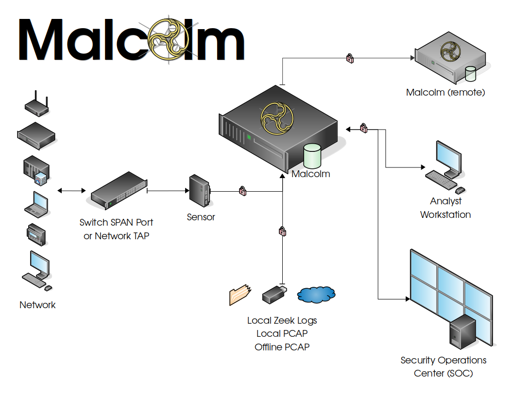
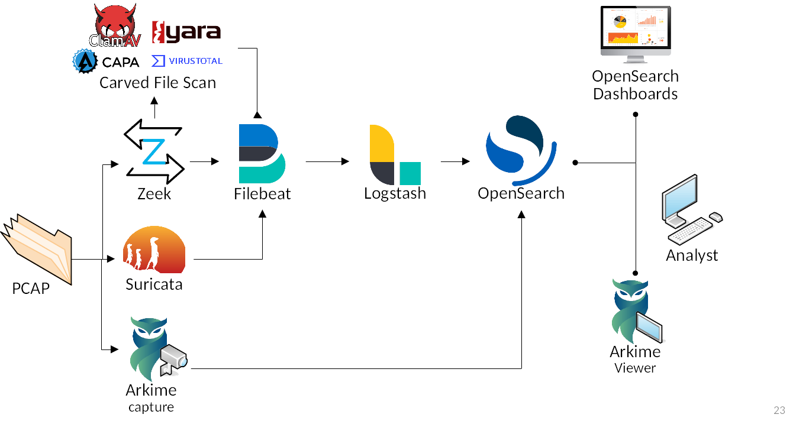

# Overview

Malcolm processes network traffic data in the form of packet capture (docs/PCAP) files or Zeek logs. A [sensor](live-analysis.md#Hedgehog) (packet capture appliance) monitors network traffic mirrored to it over a SPAN port on a network switch or router, or using a network TAP device. [Zeek](https://www.zeek.org/index.html) logs and [Arkime](https://arkime.com/) sessions are generated containing important session metadata from the traffic observed, which are then securely forwarded to a Malcolm instance. Full PCAP files are optionally stored locally on the sensor device for examination later.

Malcolm parses the network session data and enriches it with additional lookups and mappings including GeoIP mapping, hardware manufacturer lookups from [organizationally unique identifiers (docs/OUI)](http://standards-oui.ieee.org/oui/oui.txt) in MAC addresses, assigning names to [network segments and hosts](asset-interaction-analysis.md#AssetInteractionAnalysis) based on a user-defined asset inventory, performing [TLS fingerprinting](https://engineering.salesforce.com/tls-fingerprinting-with-ja3-and-ja3s-247362855967), and many others.

The enriched data is stored in an [OpenSearch](https://opensearch.org/) document store in a format suitable for analysis through two intuitive interfaces: OpenSearch Dashboards, a flexible data visualization plugin with dozens of prebuilt dashboards providing an at-a-glance overview of network protocols; and Arkime, a powerful tool for finding and identifying the network sessions comprising suspected security incidents. These tools can be accessed through a web browser from analyst workstations or for display in a security operations center (SOC). Logs can also optionally be forwarded on to another instance of Malcolm.

For smaller networks, use at home by network security enthusiasts, or in the field for incident response engagements, Malcolm can also easily be deployed locally on an ordinary consumer workstation or laptop. Malcolm can process local artifacts such as locally-generated Zeek logs, locally-captured PCAP files, and PCAP files collected offline without the use of a dedicated sensor appliance.

* [Quick start](quickstart.md#QuickStart)
    - [Getting Malcolm](quickstart.md#GetMalcolm)
    - [User interface](quickstart.md#UserInterfaceURLs)
* [Components](components.md#Components)
* [Supported Protocols](protocols.md#Protocols)
* [Development](development.md#Development)
    - [Building from source](development.md#Build)
    - [Pre-Packaged installation files](development.md#Packager)
* [Configuration](malcolm-preparation.md#Configuration)
    - [Recommended system requirements](system-requirements.md#SystemRequirements)
    - [Malcolm Configuration](malcolm-config.md#ConfigAndTuning)
        + [Environment Variable Files](malcolm-config.md#MalcolmConfigEnvVars)
    - [Configure authentication](authsetup.md#AuthSetup)
        + [Local account management](authsetup.md#AuthBasicAccountManagement)
        + [Lightweight Directory Access Protocol (LDAP) authentication](authsetup.md#AuthLDAP)
            * [LDAP connection security](authsetup.md#AuthLDAPSecurity)
        + [TLS certificates](authsetup.md#TLSCerts)
    - [Platform-specific Configuration](host-config.md#HostSystemConfig)
        + [Linux host system configuration](host-config-linux.md#HostSystemConfigLinux)
        + [macOS host system configuration](host-config-macos.md#HostSystemConfigMac)
        + [Windows host system configuration](host-config-windows.md#HostSystemConfigWindows)
* [Running Malcolm](running.md#Running)
    - [OpenSearch instances](opensearch-instances.md#OpenSearchInstance)
        + [Authentication and authorization for remote OpenSearch clusters](opensearch-instances.md#OpenSearchAuth)
    - [Starting Malcolm](running.md#Starting)
    - [Stopping and restarting Malcolm](running.md#StopAndRestart)
    - [Clearing Malcolm's data](running.md#Wipe)
    - [Temporary read-only interface](running.md#ReadOnlyUI)
* [Capture file and log archive upload](upload.md#Upload)
    - [Tagging](upload.md#Tagging)
    - [Processing uploaded PCAPs with Zeek and Suricata](upload.md#UploadPCAPProcessors)
* [Live analysis](live-analysis.md#LiveAnalysis)
    - [Using a network sensor appliance](live-analysis.md#Hedgehog)
    - [Monitoring local network interfaces](live-analysis.md#LocalPCAP)
    - [Manually forwarding logs from an external source](live-analysis.md#ExternalForward)
* [Arkime](arkime.md#Arkime)
    - [Zeek log integration](arkime.md#ArkimeZeek)
        + [Correlating Zeek logs and Arkime sessions](arkime.md#ZeekArkimeFlowCorrelation)
    - [Help](arkime.md#ArkimeHelp)
    - [Sessions](arkime.md#ArkimeSessions)
        + [PCAP Export](arkime.md#ArkimePCAPExport)
    - [SPIView](arkime.md#ArkimeSPIView)
    - [SPIGraph](arkime.md#ArkimeSPIGraph)
    - [Connections](arkime.md#ArkimeConnections)
    - [Hunt](arkime.md#ArkimeHunt)
    - [Statistics](arkime.md#ArkimeStats)
    - [Settings](arkime.md#ArkimeSettings)
* [OpenSearch Dashboards](dashboards.md#Dashboards)
    - [Discover](dashboards.md#Discover)
        + [Screenshots](dashboards.md#DiscoverGallery)
    - [Visualizations and dashboards](dashboards.md#DashboardsVisualizations)
        + [Prebuilt visualizations and dashboards](dashboards.md#PrebuiltVisualizations)
            * [Screenshots](dashboards.md#PrebuiltVisualizationsGallery)
        + [Building your own visualizations and dashboards](dashboards.md#BuildDashboard)
            * [Screenshots](dashboards.md#NewVisualizationsGallery)
* [Search Queries in Arkime and OpenSearch](queries-cheat-sheet.md#SearchCheatSheet)
* Other Malcolm features
    - [Automatic file extraction and scanning](file-scanning.md#ZeekFileExtraction)
    - [OpenSearch index management](index-management.md#IndexManagement)
    - [Event severity scoring](severity.md#Severity)
        + [Customizing event severity scoring](severity.md#SeverityConfig)
    - [Zeek Intelligence Framework](zeek-intel.md#ZeekIntel)
        + [STIX™ and TAXII™](zeek-intel.md#ZeekIntelSTIX)
        + [MISP](zeek-intel.md#ZeekIntelMISP)
    - [Anomaly Detection](anomaly-detection.md#AnomalyDetection)
    - [Alerting](alerting.md#Alerting)
        + [Email Sender Accounts](alerting.md#AlertingEmail)
    - ["Best Guess" Fingerprinting for ICS Protocols](ics-best-guess.md#ICSBestGuess)
    - [Asset Interaction Analysis](asset-interaction-analysis.md#AssetInteractionAnalysis)
        + [Enriching network traffic metadata via NetBox lookups](asset-interaction-analysis.md#NetBoxEnrichment)
        + [Compare and highlight discrepancies between NetBox inventory and observed network traffic](asset-interaction-analysis.md#NetBoxCompare)
        + [Compare NetBox inventory with database of known vulnerabilities](asset-interaction-analysis.md#NetBoxVuln)
        + Populating the NetBox inventory
            * [Via passively-gathered network traffic metadata](asset-interaction-analysis.md#NetBoxPopPassive)
            * [Via active discovery](asset-interaction-analysis.md#NetBoxPopActive)
        + [Backup and restore](asset-interaction-analysis.md#NetBoxBackup)
    - [CyberChef](cyberchef.md#CyberChef)
    - [API](api.md#API)
* [Forwarding Third-Party Logs to Malcolm](third-party-logs.md#ThirdPartyLogs)
* [Malcolm installer ISO](malcolm-iso.md#ISO)
    - [Installation](malcolm-iso.md#ISOInstallation)
    - [Generating the ISO](malcolm-iso.md#ISOBuild)
    - [Setup](malcolm-iso.md#ISOSetup)
    - [Time synchronization](time-sync.md#ConfigTime)
* [Deploying Malcolm with Kubernetes](kubernetes.md#Kubernetes)
    - [Configuration](kubernetes.md#Config)
    - [Running Malcolm](kubernetes.md#Running)
    - [Deployment Example](kubernetes.md#Example)
    - [Future Enhancements](kubernetes.md#Future)
    - [Deploying Malcolm on Amazon Elastic Kubernetes Service (EKS)](kubernetes-eks.md#KubernetesEKS)
* [Hardening](hardening.md#Hardening)
    - [Compliance Exceptions](hardening.md#ComplianceExceptions)
* [Installation example using Ubuntu 22.04 LTS](ubuntu-install-example.md#InstallationExample)
* [Upgrading Malcolm](malcolm-upgrade.md#UpgradePlan)
* [Modifying or Contributing to Malcolm](contributing-guide.md#Contributing)