# Analytics

* [Malcolm Analytics](#Analytics)
    - [Visualizations](#Visualizations)
        + [Trees](#Trees)
            * [Connections Tree](#ConnTree)
            * [SSH Tree](#SSHTree)
            * [RDP Tree](#RDPTree)
        + [Trends](#Trends)
            * [Bacnet](#Bacnet)
            * [Modbus](#Modbus)
            * [DNP3](#DNP3)
    - [Dashboards](#Dashboards)
        + [Connections Tree Dashboard](#ConnTreeDash)

The Analytics described here are developed by the internal Malcolm Analytics team to assist in highlighting aspects of a network. The purpose of this page is to explain aspects of visualizations or dashboards that may not be intuitive or that would benefit from more in-depth explanation of features.

All analytics are subject to overarching OpenSearch filters, including the Time Range filter and the search query bar.

## Visualizations
* [Trees](#Trees)
    - [Connections Tree](#ConnTree)
    - [SSH Tree](#SSHTree)
    - [RDP Tree](#RDPTree)
* [Trends](#Trends)
    - [Bacnet](#Bacnet)
    - [Modbus](#Modbus)
    - [DNP3](#DNP3)

### Trees
All Trees share similar functionality and features.

### Connections Tree
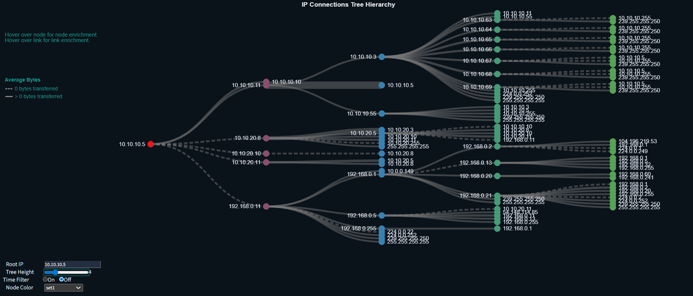

The IP Connections Tree purpose is to help identify potential avenues for lateral movement within a network, it allows you to visually focus in on Cyber Key Terrain (CKTs) and IP addresses that the user-defined root node communicates with. 

Communications between nodes __A → B → C__ implies that lateral movement could potentially happen from node __A → C__

In Connections Tree, the root node is only ever the source IP. In Connections Tree (Mirrored), the root node is only ever a destination IP. The dashboard displaying these visualizations side-by-side is [Connections Tree](https://training.malcolm.fyi/dashboards/app/dashboards#/view/89714140-a2d5-11f0-b5ae-e139a66d2205) (see documentation below at [Connections Tree Dashboard](#ConnTreeDash)). 

An example use case is if an Engineering Workstation of interest is identified, or an unknown device, entering the IP address as the root node will visualize observed communications between the source device of interest and any other devices/IP addresses.

#### Features

| Example Image                                 | Description |
|-----------------------------------------------|-------------| 
| 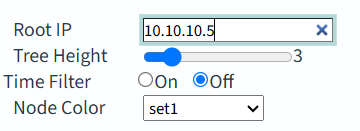    | <ul><li>Set the root IP address</li><li>Change the Tree height/depth up to 15 levels</li><li>Time Filter On only allows sequential connections to be displayed</li><li>Node Color provides several color options in order to take pretty screenshots</li></ul> |
| 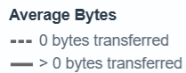       | The Average Bytes transferred between nodes/devices are represented by a dotted link for communications transferring 0 bytes, and a solid line for communications transferring one or more bytes. The heavier the line, the greater the average number of bytes transferred between nodes/devices across all their communications. The line thicknesses are normalized; if a node is collapsed, all the other line thicknesses will be adjusted. |
| 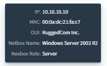      | Hovering over a Node provides additional enrichment. Some of this enrichment is provided by Netbox, and will not display unless Netbox enrichment is turned on and populated. <ul><li>IP address of the node/device</li><li>Detected MAC address of the node/device (if available)</li><li>Detected OUI of the node/device (if available)</li><li>Netbox-enriched name of the node/device</li><li>Netbox-enriched role of the node/device</li></ul> |
| 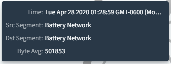      | Hovering over a Link line provides additional enrichment. Some of this enrichment is provided by Netbox, and will not display unless Netbox enrichment is turned on and populated. <ul><li>Time of the first observed connection between the two nodes</li><li>Netbox-enriched name of the source segment of the communication</li><li>Netbox-enriched name of the destination segment of the communication</li><li>Average bytes transferred during communications between the nodes/devices</li></ul> |
| 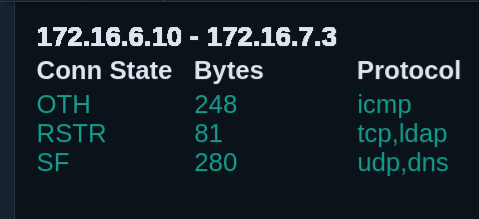 | When hovering over a link, additional details will appear in the top right corner, detailing the following for each individual communication between the src-dst IP pair: <ul><li>The Connection State</li><li>The number of bytes transferred</li><li>The protocol(s) observed during the communication</li></ul> |
| 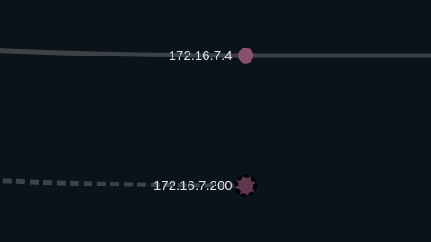 | Other quality-of-life features include:  <ul><li>You can collapse nodes to hide their communications by clicking on the node. Collapsed nodes are indicated by a dotted line encircling the node</li><li>You can zoom in and out on the tree, and click and drag the tree around in order to get a better look at crowded communications</li><li>Double-clicking in any blank space will reset the visual -- all nodes will be uncollapsed and the zoom will reset to default</li> | 

### SSH Tree

Protocol-specific Trees have the same visual features as [Connections Tree](#ConnTree) (zoom, collapse, etc), but the enriched data is specific to SSH. This visualization is now located on the SSH dashboard.

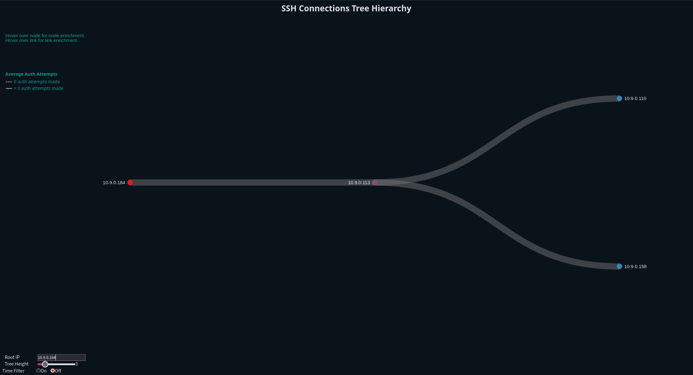

| Example Image | Description |
|---------------|-------------|
| 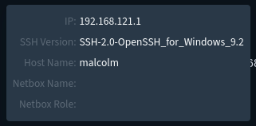 | Hovering over a Node provides additional enrichment. Some of this enrichment is provided by Netbox, and will not display unless Netbox enrichment is turned on and populated. <ul><li>IP address of the node/device</li><li>Detected MAC address of the node/device (if available)</li><li>Detected OUI of the node/device (if available)</li><li>Netbox-enriched name of the node/device</li><li>Netbox-enriched role of the node/device</li></ul> |
| 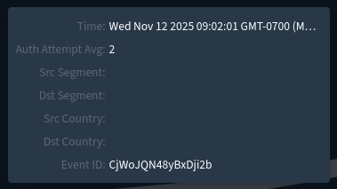 | Hovering over a Link line provides additional enrichment. Some of this enrichment is provided by Netbox, and will not display unless Netbox enrichment is turned on and populated. <ul><li>Time of the first observed connection between the two nodes</li><li>Netbox-enriched name of the source segment of the communication</li><li>Netbox-enriched name of the destination segment of the communication</li><li>Average bytes transferred during communications between the nodes/devices</li></ul> |
| 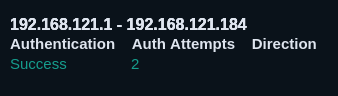 | When hovering over a link, additional details will appear in the top right corner, detailing the following for each individual SSH session between the src-dst IP pair: <ul><li>Whether the SSH session authenticated successfully</li><li>How many authorization attempts were made</li><li>The protocol(s) observed during the communication</li></ul> |

### RDP Tree

Protocol-specific Trees have the same visual features as [Connections Tree](#ConnTree) (zoom, collapse, etc), but the enriched data is specific to RDP. This visualization is now located on the RDP dashboard.

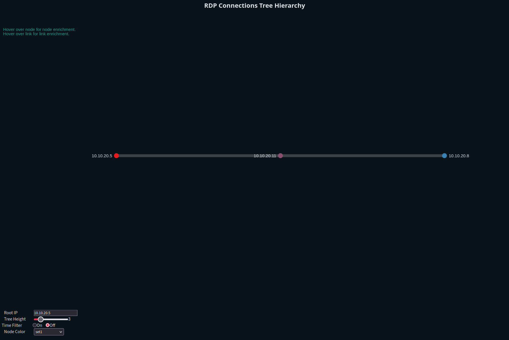

| Example Image | Description |
|---------------|-------------|
| 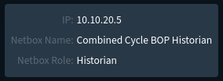 | Hovering over a Node provides additional enrichment. Some of this enrichment is provided by Netbox, and will not display unless Netbox enrichment is turned on and populated. <ul><li>IP address of the node/device</li><li>Netbox-enriched name of the node/device</li><li>Netbox-enriched role of the node/device</li></ul> |
| 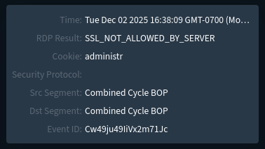 | Hovering over a Link line provides additional enrichment. Some of this enrichment is provided by Netbox, and will not display unless Netbox enrichment is turned on and populated. <ul><li>Time of the first observed connection between the two nodes</li><li>The most common result of the RDP connections</li><li>The most commonly observed RDP session cookie</li><li>The security protocol being used</li><li>Netbox-enriched name of the source segment of the communication</li><li>Netbox-enriched name of the destination segment of the communication</li><li>The event ID of the first observed communication</li></ul>  |
| 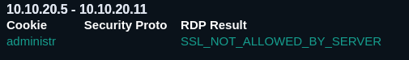 | When hovering over a link, additional details will appear in the top right corner, detailing the following for each individual RDP session between the src-dst IP pair: <ul><li>The cookie for each individual RDP session</li><li>The security protocol for the RDP session (if observed)</li><li>The result of the RDP session</li></ul> |

### Troubleshooting

<!-- Bugs to squash later, and commonly encountered problems -->

If an IP address does not exist in the data being examined, a message will appear above the "Root IP" input bar stating "__IP address not found. Try adjusting the time range__". 

This message can also appear due to object number limitations. Vega and Opensearch limit loading ten thousand object into the Vega table. If the IP address for certain exists elsewhere and cannot be found in Trees, consider limiting the time range further or utilize Malcolm's filters and reload the analytic.

If the IP addess was initially loaded into the Vega table but not all of its connections/connection IP addresses were loaded an error bar will appear at the top of the analytic, stating "_Maximum data response reached. Data my be truncated. Try adjusting timeframe_".

If you encounter a bug, please submit a bug report or an issue to the Malcolm repository.

### Trends

<!-- Colloquially known as "Squiggles" -->

Trends purpose is to standardize protocol behavior for analyst review. Analysts shouldn't necessarily have to understand what "normal" behavior looks like, or thoroughly understand the OT protocol, but given enough "normal" traffic, the analyst should be able to visually identify outlying traffic and can then take the data to an OT engineer to confirm whether the traffic is expected.

This analytic draws upon lessons learned from Stuxnet. The network traffic visualized on Trends should be unable to lie to an operator like an HMI may be able to.

The Trends graph plots the values for the PLc's addresses over time, as set by write functions for each of the covered OT protocols. 

|       | Descriptor                             |
|-------|----------------------------------------|
| Who   | Devices leveraging protocol            |
| What  | Behaviors being invoked on the devices |
| When  | Session/scope of the device behavior   |
| Where | Logical address on device              |
| How   | Function invoking behavior             |

The "Trends" Analytics share many features, described below.

| Protocol-agnostic features | Details |
| -------------------------- | -------- |
| PLC Address                | On the left side of the analytic are the PLC addresses observed for the selected IP address. Click on it to hide all other PL addresses on the analytic, and double click in an empty space. |
| IP Selection               | All IP addresses identified to be either the src or dst of the OT protocol are in a selection box on the right side of the analytic. Click one to select it. |
| Hover over node            | Hover over a node for protocol-specific enrichment. See the sections below to see lists of the enrichment/information for each protocol. |
| Overview Selection graph   | The overview selection graph shows a scaled-down version of all the PLC addresses for the selected IP address, you can zoom in on the primary graph by dragging and clicking to select a section on the Overview Selection Graph. To reset the view, double click on and blank space in the Overview Selection. |

#### BACnet

The BACnet Trends graph plots the __write_property + present_value__.

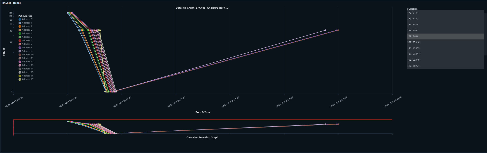

|     |     |
| --- | --- |
|  | BACnet-specific enrichment is available when you hover over the node.  <ul><li>Dataset denotes which log  </li><li>The IP address/port of the communications </li><li>Which PLC address is being observed</li><li> The BACnet function</li><li>The value being read/written/changed </li><li>Date/Time of communication</li><li>The Malcolm Event ID tied to this communication</li></ul>  |
| 

#### Modbus

The Modbus Trends graph plots the __write_single_coil__, __write_single_register__, __write_multiple_coils__, and __write_multiple_registers__.

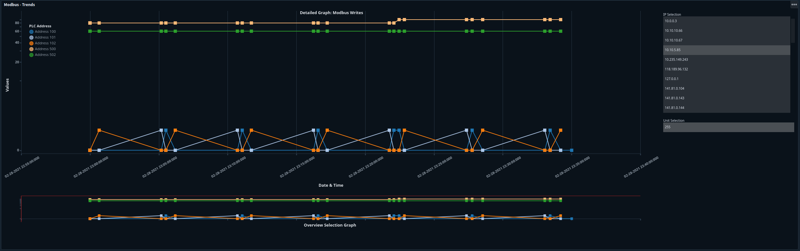

|     |     |
| --- | --- |
| 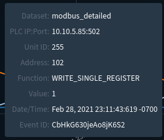 | Modbus-specific enrichment is available when you hover over the node.  <ul><li>Dataset denotes which log the data is pulled from </li><li>The IP address/port of the communications </li><li>Unit Id associated with the communication </li><li>Which PLC address is being observed</li><li> The Modbus function </li><li>The value being communicated </li><li> Date/Time of communication</li><li>The Malcolm Event ID tied to this communication</li></ul>  |
| 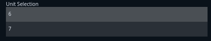 | If there is more than one modbus Unit ID available for the selected IP address, the Unit Selection box will appear below the IP Selection. |
| 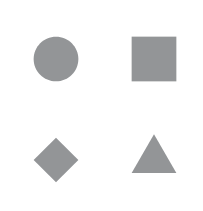 | Node shapes help differentiate between different Modbus functions at a glance.  <Sul><li> Square - Single Register Write </li><li> Circle - Single Coil Write </li><li> Diamond - Multi-Register Write </li><li> Triangle - Multi-Coil Write </li>| 

#### DNP3

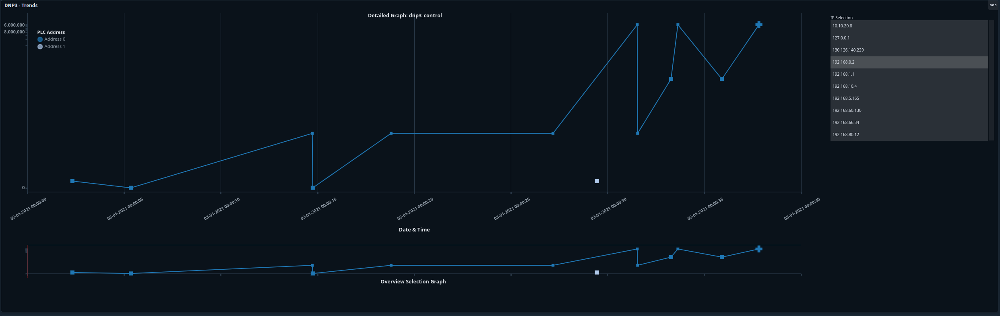

|     |     |
| --- | --- |
| 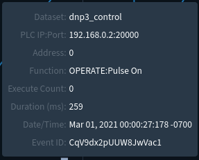 | DNP3-specific enrichment is available when you hover over the node.  <ul><li>Dataset denotes which log this data node originates from </li><li>The IP address/port of the communications </li><li>Which PLC address is being observed</li><li> The DNP3 function </li><li>The Execute count </li><li>The duration of the function in milliseconds </li><li>Date/Time of communication</li><li>The Malcolm Event ID tied to this communication</li></ul>  |
| 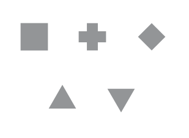 | Node shapes help differentiate between different DNP3 functions at a glance.  <ul><li> Square - "OPERATE", "OPERATE:Pulse On", or "OPERATE:Pulse On:Trip" </li><li> Circle - OPERATE: unknown function </li><li> Diamond - "DIRECT_OPERATE:Latch On", "DIRECT_OPERATE_NR:Latch On", or "DIRECT_OPERATE:Pulse Off"</li><li> Triangle - "RESPONSE:Latch On", "RESPONSE:Pulse On:Trip", or "RESPONSE:Pulse Off:Close"</li><li> Upside-down Triangle - "SELECT:Latch On", "SELECT:Pulse On:Trip", or "SELECT:Pulse Off:Close"</li>  The size of the nodes also scale according to the execute_count | 

### Troubleshooting

No known issues at this time. If you encounter a bug, please submit a bug report or an issue to the Malcolm repository.

## Dashboards
* [Connections Tree Dashboard](#ConnTreeDash)
<!-- Include other Links to dashboards here -->

### Connections Tree Dashboard
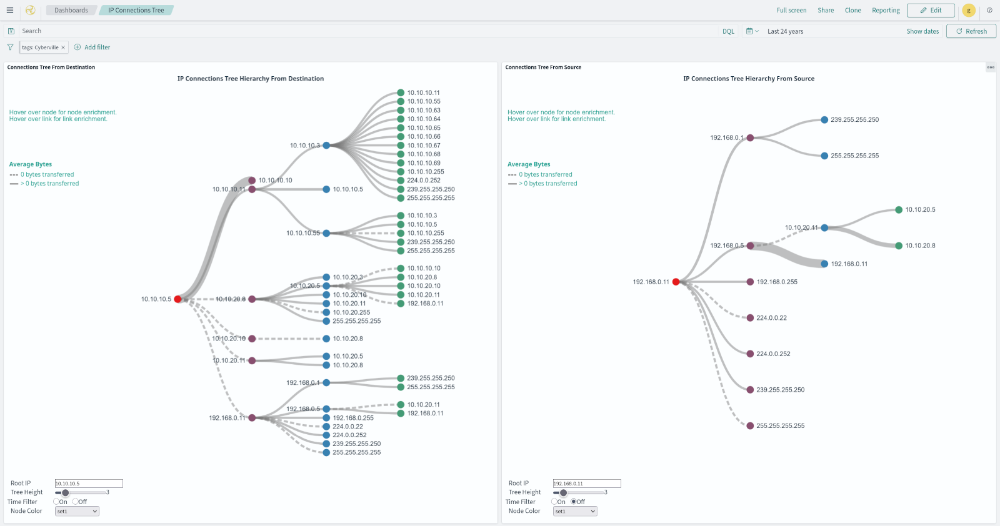

The [IP Connections Tree](https://training.malcolm.fyi/dashboards/app/dashboards#/view/89714140-a2d5-11f0-b5ae-e139a66d2205) purpose is to help identify potential avenues for lateral movement within a network, it allowsd you to visually focus in on Cyber Key Terrain (CKTs) and IP addresses that the user-defined root node communicates with. 

The root node exhibits different behaviors in the two visuals. On the left, the root node is only ever the source of communications. On the right, the root node is only ever a destination for communications.

An example use case would be if a Engineering Workstation (EWS) was identified, inputting the IP address of the EWS in both the left and right visuals would allow an analyst to see what devices the EWS is communicating with, and what devices communicate with the EWS. Another devices of interest may include jump boxes, domain controllers, or PLCs.

