# Arkime

* [Arkime](#Arkime)
    - [Zeek log integration](#ArkimeZeek)
        + [Correlating Zeek logs and Arkime sessions](#ZeekArkimeFlowCorrelation)
    - [Help](#ArkimeHelp)
    - [Sessions](#ArkimeSessions)
        + [PCAP Export](#ArkimePCAPExport)
    - [SPIView](#ArkimeSPIView)
    - [SPIGraph](#ArkimeSPIGraph)
    - [Connections](#ArkimeConnections)
    - [Hunt](#ArkimeHunt)
    - [Statistics](#ArkimeStats)
    - [Settings](#ArkimeSettings)

The Arkime interface will be accessible over HTTPS on port 443 at the docker hosts IP address (e.g., [https://localhost](https://localhost) if you are connecting locally).

## Zeek log integration

A stock installation of Arkime extracts all of its network connection ("session") metadata ("SPI" or "Session Profile Information") from full packet capture artifacts (PCAP files). Zeek (formerly Bro) generates similar session metadata, linking network events to sessions via a connection UID. Malcolm aims to facilitate analysis of Zeek logs by mapping values from Zeek logs to the Arkime session database schema for equivalent fields, and by creating new "native" Arkime database fields for all the other Zeek log values for which there is not currently an equivalent in Arkime:

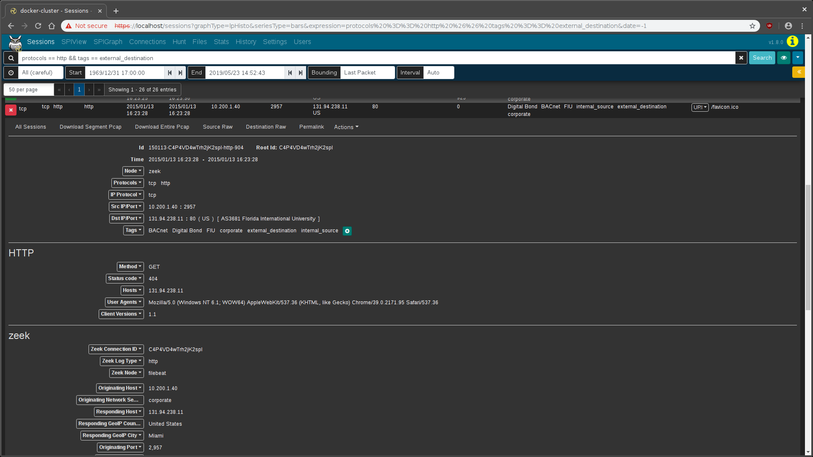

In this way, when full packet capture is an option, analysis of PCAP files can be enhanced by the additional information Zeek provides. When full packet capture is not an option, similar analysis can still be performed using the same interfaces and processes using the Zeek logs alone.

A few values of particular mention include **Data Source** (`event.provider` in OpenSearch), which can be used to distinguish from among the sources of the network traffic metadata record (e.g., `zeek` for Zeek logs and `arkime` for Arkime sessions); and, **Log Type** (`event.dataset` in OpenSearch), which corresponds to the kind of Zeek `.log` file from which the record was created. In other words, a search could be restricted to records from `conn.log` by searching `event.provider == zeek && event.dataset == conn`, or restricted to records from `weird.log` by searching `event.provider == zeek && event.dataset == weird`.

Click the icon of the owl **🦉** in the upper-left hand corner of to access the Arkime usage documentation (accessible at [https://localhost/help](https://localhost/help) if you are connecting locally), click the **Fields** label in the navigation pane, then search for `zeek` to see a list of the other Zeek log types and fields available to Malcolm.

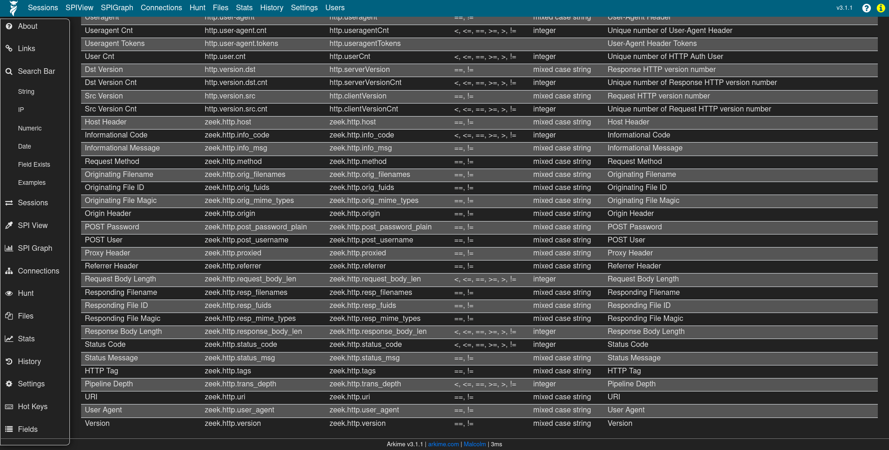

The values of records created from Zeek logs can be expanded and viewed like any native Arkime session by clicking the plus **➕** icon to the left of the record in the Sessions view. However, note that when dealing with these Zeek records the full packet contents are not available, so buttons dealing with viewing and exporting PCAP information will not behave as they would for records from PCAP files. Other than that, Zeek records and their values are usable in Malcolm just like native PCAP session records.

### Correlating Zeek logs and Arkime sessions

The Arkime interface displays both Zeek logs and Arkime sessions alongside each other. Using fields common to both data sources, one can [craft queries](queries-cheat-sheet.md#SearchCheatSheet) to filter results matching desired criteria.

A few fields of particular mention that help limit returned results to those Zeek logs and Arkime session records generated from the same network connection are [Community ID](https://github.com/corelight/community-id-spec) (`network.community_id`) and Zeek's [connection UID](https://docs.zeek.org/en/stable/examples/logs/#using-uids) (`zeek.uid`), which Malcolm maps to both Arkime's `rootId` field and the [ECS](https://www.elastic.co/guide/en/ecs/current/ecs-event.html#field-event-id) `event.id` field.

Community ID is specification for standard flow hashing [published by Corelight](https://github.com/corelight/community-id-spec) with the intent of making it easier to pivot from one dataset (e.g., Arkime sessions) to another (e.g., Zeek `conn.log` entries). In Malcolm both Arkime and [Zeek](https://github.com/corelight/zeek-community-id) populate this value, which makes it possible to filter for a specific network connection and see both data sources' results for that connection.

The `rootId` field is used by Arkime to link session records together when a particular session has too many packets to be represented by a single session. When normalizing Zeek logs to Arkime's schema, Malcolm piggybacks on `rootId` to store Zeek's [connection UID](https://docs.zeek.org/en/stable/examples/logs/#using-uids) to crossreference entries across Zeek log types. The connection UID is also stored in `zeek.uid`.

Filtering on community ID OR'ed with zeek UID (e.g., `network.community_id == "1:r7tGG//fXP1P0+BXH3zXETCtEFI=" || rootId == "CQcoro2z6adgtGlk42"`) is an effective way to see both the Arkime sessions and Zeek logs generated by a particular network connection.

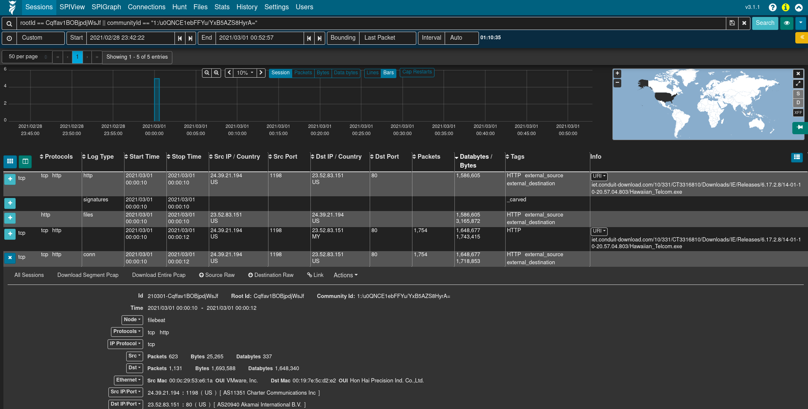

## Help

Click the icon of the owl 🦉 in the upper-left hand corner of to access the Arkime usage documentation (accessible at [https://localhost/help](https://localhost/help) if you are connecting locally), which includes such topics as [search syntax](https://localhost/help#search), the [Sessions view](https://localhost/help#sessions), [SPIView](https://localhost/help#spiview), [SPIGraph](https://localhost/help#spigraph), and the [Connections](https://localhost/help#connections) graph.

## Sessions

The **Sessions** view provides low-level details of the sessions being investigated, whether they be Arkime sessions created from PCAP files or [Zeek logs mapped](#ArkimeZeek) to the Arkime session database schema.

The **Sessions** view contains many controls for filtering the sessions displayed from all sessions down to sessions of interest:

* [search bar](https://localhost/help#search): Indicated by the magnifying glass **🔍** icon, the search bar allows defining filters on session/log metadata
* [time bounding](https://localhost/help#timebounding) controls: The **🕘**, **Start**, **End**, **Bounding**, and **Interval** fields, and the **date histogram** can be used to visually zoom and pan the time range being examined.
* search button: The **Search** button re-runs the sessions query with the filters currently specified.
* views button: Indicated by the eyeball **👁** icon, views allow overlaying additional previously-specified filters onto the current sessions filters. For convenience, Malcolm provides several Arkime preconfigured views including filtering on the `event.dataset` field. 

* map: A global map can be expanded by clicking the globe **🌎** icon. This allows filtering sessions by IP-based geolocation when possible.

Some of these filter controls are also available on other Arkime pages (such as SPIView, SPIGraph, Connections, and Hunt).

The number of sessions displayed per page, as well as the page currently displayed, can be specified using the paging controls underneath the time bounding controls.

The sessions table is displayed below the filter controls. This table contains the sessions/logs matching the specified filters.

To the left of the column headers are two buttons. The **Toggle visible columns** button, indicated by a grid **⊞** icon, allows toggling which columns are displayed in the sessions table. The **Save or load custom column configuration** button, indicated by a columns **◫** icon, allows saving the current displayed columns or loading previously-saved configurations. This is useful for customizing which columns are displayed when investigating different types of traffic. Column headers can also be clicked to sort the results in the table, and column widths may be adjusted by dragging the separators between column headers.

Details for individual sessions/logs can be expanded by clicking the plus **➕** icon on the left of each row. Each row may contain multiple sections and controls, depending on whether the row represents a Arkime session or a [Zeek log](#ArkimeZeek). Clicking the field names and values in the details sections allows additional filters to be specified or summary lists of unique values to be exported.

When viewing Arkime session details (ie., a session generated from a PCAP file), an additional packets section will be visible underneath the metadata sections. When the details of a session of this type are expanded, Arkime will read the packet(s) comprising the session for display here. Various controls can be used to adjust how the packet is displayed (enabling **natural** decoding and enabling **Show Images & Files** may produce visually pleasing results), and other options (including PCAP download, carving images and files, applying decoding filters, and examining payloads in [CyberChef](https://github.com/gchq/CyberChef)) are available.

See also Arkime's usage documentation for more information on the [Sessions view](https://localhost/help#sessions).

### PCAP Export

Clicking the down arrow **▼** icon to the far right of the search bar presents a list of actions including **PCAP Export** (see Arkime's [sessions help](https://localhost/help#sessions) for information on the other actions).  When full PCAP sessions are displayed, the **PCAP Export** feature allows you to create a new PCAP file from the matching Arkime sessions, including controls for which sessions are included (open items, visible items, or all matching items) and whether or not to include linked segments. Click **Export PCAP** button to generate the PCAP, after which you'll be presented with a browser download dialog to save or open the file. Note that depending on the scope of the filters specified this might take a long time (or, possibly even time out).

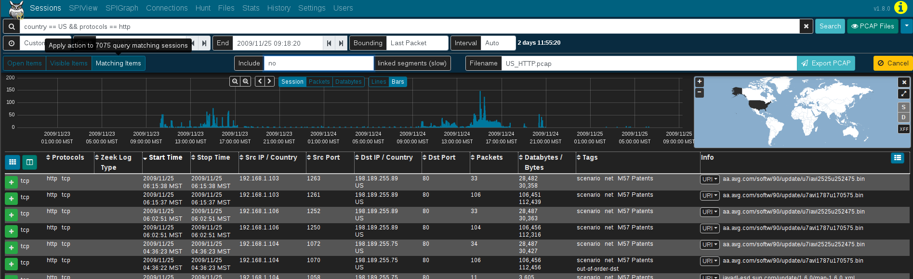

## SPIView

Arkime's **SPI** (**S**ession **P**rofile **I**nformation) **View** provides a quick and easy-to-use interface for  exploring session/log metrics. The SPIView page lists categories for general session metrics (e.g., protocol, source and destination IP addresses, sort and destination ports, etc.) as well as for all of various types of network traffic understood by Malcolm. These categories can be expanded and the top *n* values displayed, along with each value's cardinality, for the fields of interest they contain.

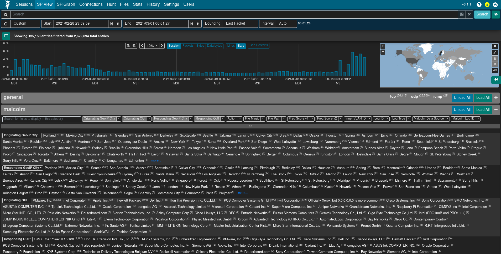

Click the the plus **➕** icon to the right of a category to expand it. The values for specific fields are displayed by clicking the field description in the field list underneath the category name. The list of field names can be filtered by typing part of the field name in the *Search for fields to display in this category* text input. The **Load All** and **Unload All** buttons can be used to toggle display of all of the fields belonging to that category. Once displayed, a field's name or one of its values may be clicked to provide further actions for filtering or displaying that field or its values. Of particular interest may be the **Open [fieldname] SPI Graph** option when clicking on a field's name. This will open a new tab with the SPI Graph ([see below](#ArkimeSPIGraph)) populated with the field's top values.

Note that because the SPIView page can potentially run many queries, SPIView limits the search domain to seven days (in other words, seven indices, as each index represents one day's worth of data). When using SPIView, you will have best results if you limit your search time frame to less than or equal to seven days. This limit can be adjusted by editing the `spiDataMaxIndices` setting in [config.ini]({{ site.github.repository_url }}/blob/{{ site.github.build_revision }}/arkime/etc/config.ini) and rebuilding the `ghcr.io/idaholab/malcolm/arkime` docker container.

See also Arkime's usage documentation for more information on [SPIView](https://localhost/help#spiview).

## SPIGraph

Arkime's **SPI** (**S**ession **P**rofile **I**nformation) **Graph** visualizes the occurrence of some field's top *n* values over time, and (optionally) geographically. This is particularly useful for identifying trends in a particular type of communication over time: traffic using a particular protocol when seen sparsely at regular intervals on that protocol's date histogram in the SPIGraph may indicate a connection check, polling, or beaconing (for example, see the `llmnr` protocol in the screenshot below).

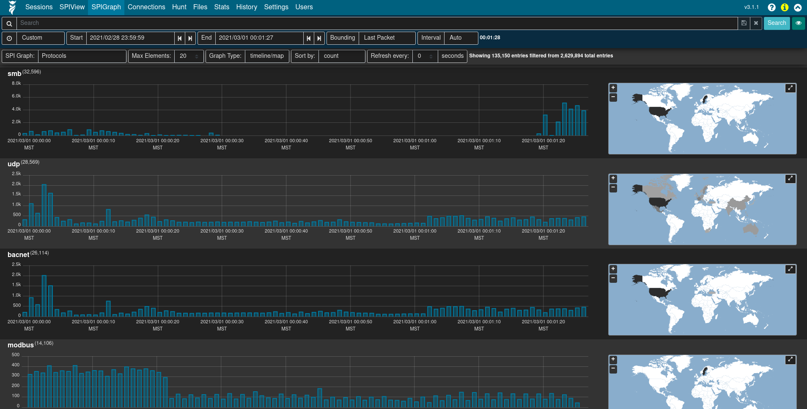

Controls can be found underneath the time bounding controls for selecting the field of interest, the number of elements to be displayed, the sort order, and a periodic refresh of the data.

See also Arkime's usage documentation for more information on [SPIGraph](https://localhost/help#spigraph).

## Connections

The **Connections** page presents network communications via a force-directed graph, making it easy to visualize logical relationships between network hosts.

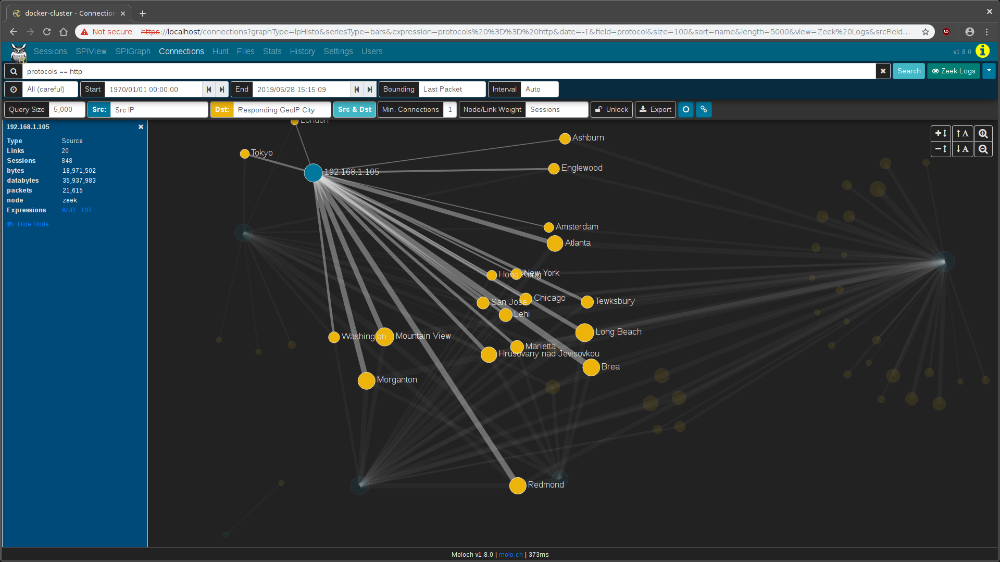

Controls are available for specifying the query size (where smaller values will execute more quickly but may only contain an incomplete representation of the top *n* sessions, and larger values may take longer to execute but will be more complete), which fields to use as the source and destination for node values, a minimum connections threshold, and the method for determining the "weight" of the link between two nodes. As is the case with most other visualizations in Arkime, the graph is interactive: clicking on a node or the link between two nodes can be used to modify query filters, and the nodes themselves may be repositioned by dragging and dropping them. A node's color indicates whether it communicated as a source/originator, a destination/responder, or both.

While the default source and destination fields are *Src IP* and *Dst IP:Dst Port*, the Connections view is able to use any combination of fields. For example:

* *Src OUI* and *Dst OUI* (hardware manufacturers)
* *Src IP* and *Protocols*
* *Originating Network Segment* and *Responding Network Segment* (see [CIDR subnet to network segment name mapping](host-and-subnet-mapping.md#SegmentNaming))
* *Originating GeoIP City* and *Responding GeoIP City*

or any other combination of these or other fields.

See also Arkime's usage documentation for more information on the [Connections graph](https://localhost/help#connections).

## Hunt

Arkime's **Hunt** feature allows an analyst to search within the packets themselves (including payload data) rather than simply searching the session metadata. The search string may be specified using ASCII (with or without case sensitivity), hex codes, or regular expressions. Once a hunt job is complete, matching sessions can be viewed in the [Sessions](#ArkimeSessions)  view.

Clicking the **Create a packet search job** on the Hunt page will allow you to specify the following parameters for a new hunt job:

* a packet search job **name**
* a **maximum number of packets** to examine per session
* the **search string** and its format (*ascii*, *ascii (case sensitive)*, *hex*, *regex*, or *hex regex*)
* whether to search **source packets**, **destination packets**, or both
* whether to search **raw** or **reassembled** packets

Click the **➕ Create** button to begin the search. Arkime will scan the source PCAP files from which the sessions were created according to the search criteria. Note that whatever filters were specified when the hunt job is executed will apply to the hunt job as well; the number of sessions matching the current filters will be displayed above the hunt job parameters with text like "ⓘ Creating a new packet search job will search the packets of # sessions."

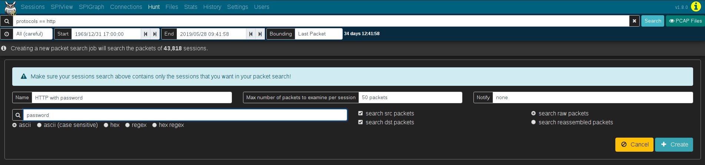

Once a hunt job is submitted, it will be assigned a unique hunt ID (a long unique string of characters like `yuBHAGsBdljYmwGkbEMm`) and its progress will be updated periodically in the **Hunt Job Queue** with the execution percent complete, the number of matches found so far, and the other parameters with which the job was submitted. More details for the hunt job can be viewed by expanding its row with the plus **➕** icon on the left.

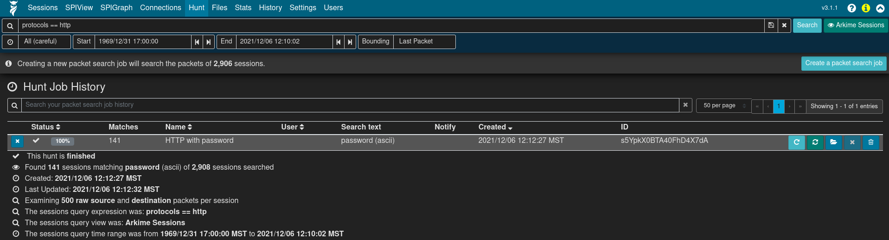

Once the hunt job is complete (and a minute or so has passed, as the `huntId` must be added to the matching session records in the database), click the folder **📂** icon on the right side of the hunt job row to open a new [Sessions](#ArkimeSessions) tab with the search bar prepopulated to filter to sessions with packets matching the search criteria.

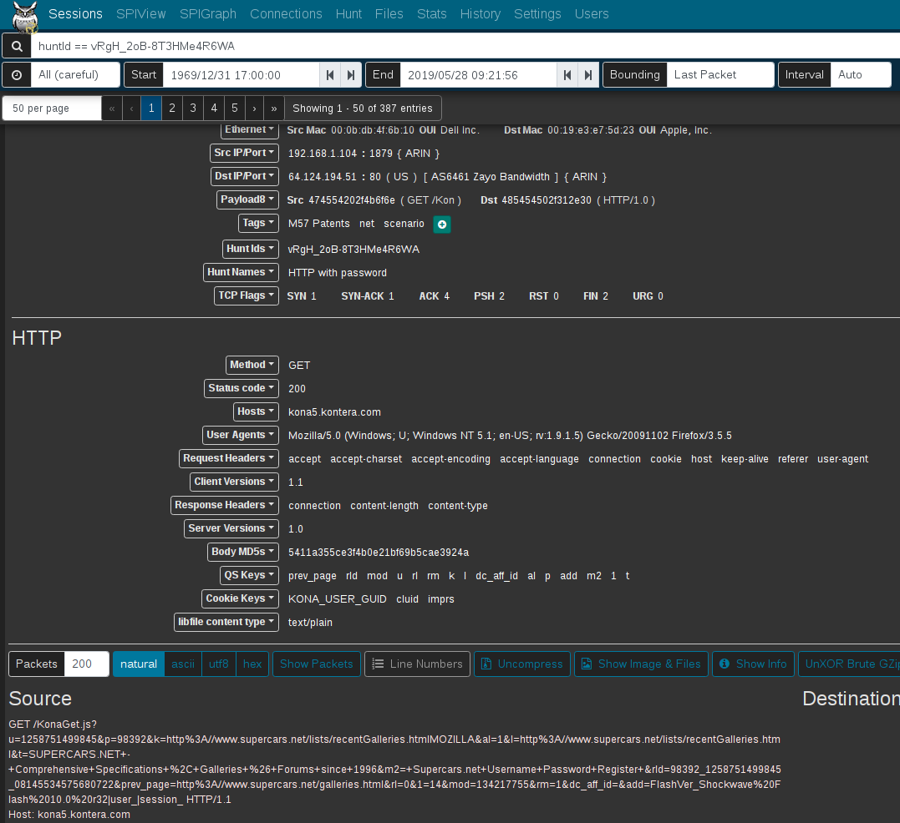

From this list of filtered sessions you can expand session details and explore packet payloads which matched the hunt search criteria.

The hunt feature is available only for sessions created from full packet capture data, not Zeek logs. This being the case, it is a good idea to click the eyeball **👁** icon and select the **Arkime Sessions** view to exclude Zeek logs from candidate sessions prior to using the hunt feature.

See also Arkime's usage documentation for more information on the [hunt feature](https://localhost/help#hunt).

## Statistics

Arkime provides several other reports which show information about the state of Arkime and the underlying OpenSearch database.

The **Files** list displays a list of PCAP files processed by Arkime, the date and time of the earliest packet in each file, and the file size:

The **ES Indices** list (available under the **Stats** page) lists the OpenSearch indices within which log data is contained:

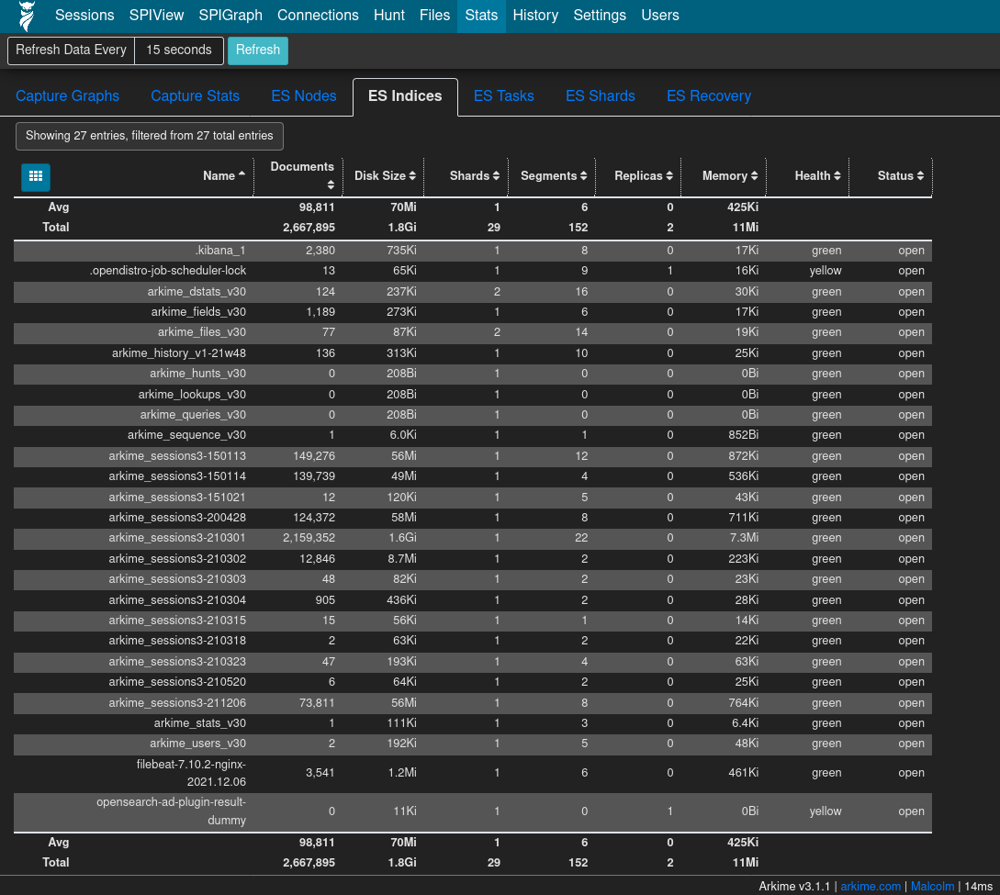

The **History** view provides a historical list of queries issues to Arkime and the details of those queries:

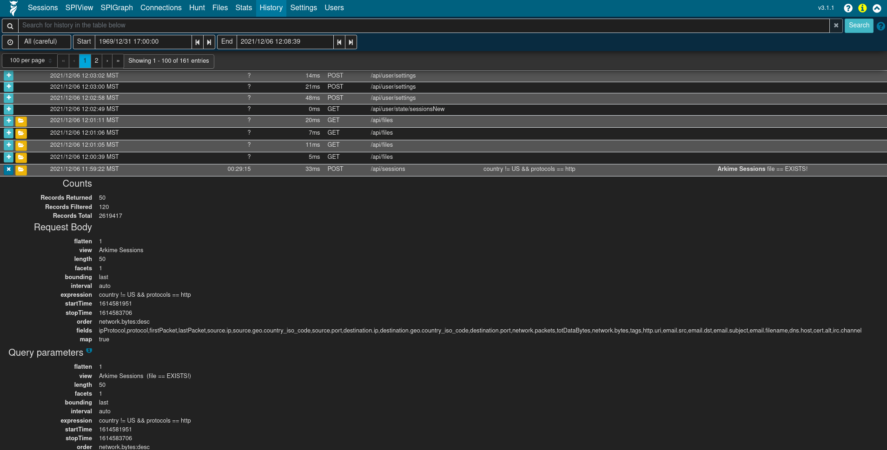

See also Arkime's usage documentation for more information on the [Files list](https://localhost/help#files), [statistics](https://localhost/help#files), and [history](https://localhost/help#history).

## Settings

### General settings

The **Settings** page can be used to tweak Arkime preferences, defined additional custom views and column configurations, tweak the color theme, and more.

See Arkime's usage documentation for more information on [settings](https://localhost/help#settings).

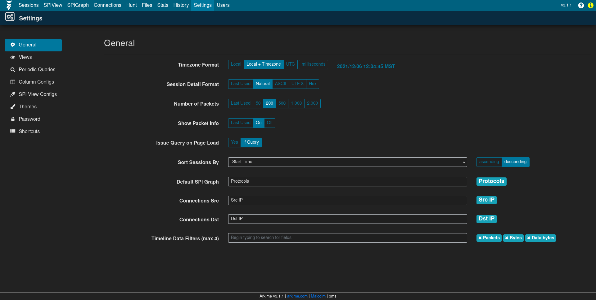

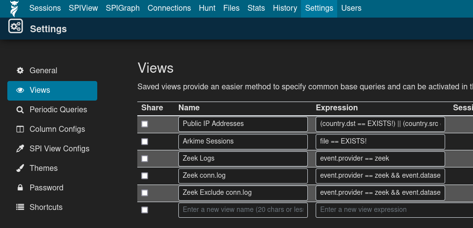