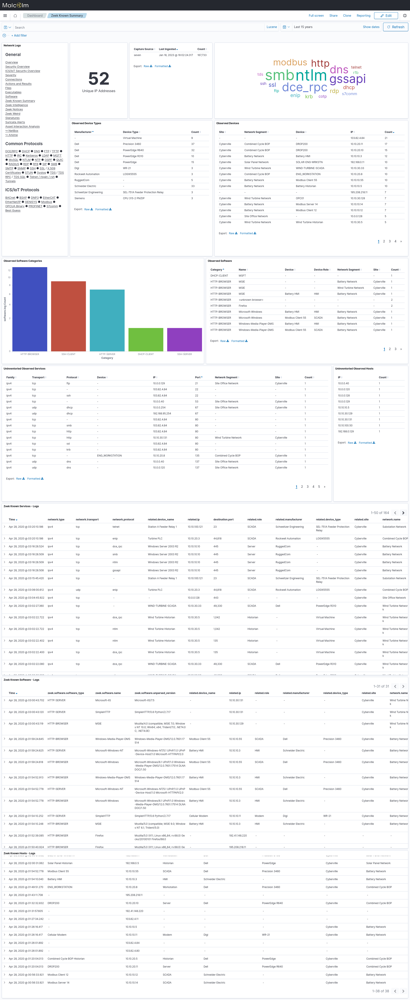
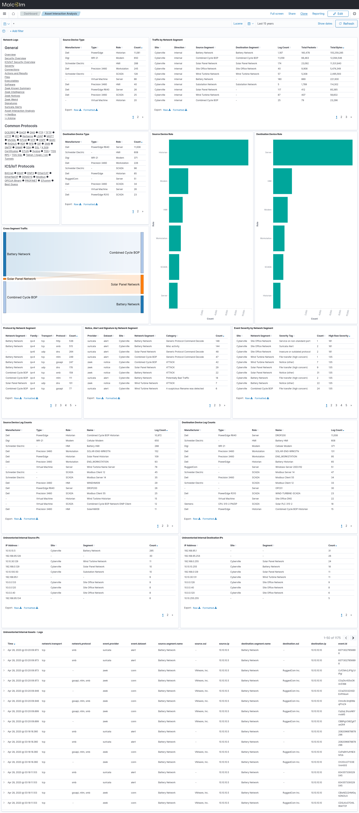

# <a name="AssetInteractionAnalysis"></a>Asset Interaction Analysis

* [Enriching network traffic metadata via NetBox lookups](#NetBoxEnrichment)
* [Compare and highlight discrepancies between NetBox inventory and observed network traffic](#NetBoxCompare)
* [Compare NetBox inventory with database of known vulnerabilities](#NetBoxVuln)
* Populating the NetBox inventory
    - [Via passively-gathered network traffic metadata](#NetBoxPopPassive)
    - [Via active discovery](#NetBoxPopActive)
* [Backup and restore](#NetBoxBackup)

Malcolm provides an instance of [NetBox](https://netbox.dev/), an open-source "solution for modeling and documenting modern networks." The NetBox web interface is available at at [https://localhost/netbox/](https://localhost/netbox/) if you are connecting locally.

The design of a potentially deeper integration between Malcolm and Netbox is a [work in progress](https://github.com/idaholab/Malcolm/issues/131).

Please see the [NetBox page on GitHub](https://github.com/netbox-community/netbox), its [documentation](https://docs.netbox.dev/en/stable/) and its [public demo](https://demo.netbox.dev/) for more information.

## <a name="NetBoxEnrichment"></a>Enriching network traffic metadata via NetBox lookups

As Zeek logs and Suricata alerts are parsed and enriched (if the `LOGSTASH_NETBOX_ENRICHMENT` [environment variable in `./config/logstash.env`](malcolm-config.md#MalcolmConfigEnvVars) is set to `true`) the NetBox API will be queried for the associated hosts' information. If found, the information retrieved by NetBox will be used to enrich these logs through the creation of the following new fields. See [the NetBox API](https://demo.netbox.dev/api/docs/) documentation and [the NetBox documentation](https://demo.netbox.dev/static/docs/introduction/).

* `destination.…`
    - `destination.device.cluster` (`/virtualization/clusters/`) (for [Virtual Machine](https://demo.netbox.dev/static/docs/coe-functionality/virtualization/) device types)
    - [`destination.device.device_type`](https://demo.netbox.dev/static/docs/core-functionality/device-types/) (`/dcim/device-types/`)
    - `destination.device.id` (`/dcim/devices/{id}`)
    - `destination.device.manufacturer` (`/dcim/manufacturers/`)
    - `destination.device.name` (`/dcim/devices/`)
    - `destination.device.role` (`/dcim/device-roles/`)
    - [`destination.device.service`](https://demo.netbox.dev/static/docs/core-functionality/services/#service-templates) (`/ipam/services/`)
    - `destination.device.site` (`/dcim/sites/`)
    - `destination.device.url` (`/dcim/devices/`)
    - `destination.device.details` (full JSON object, [only with `LOGSTASH_NETBOX_ENRICHMENT_VERBOSE: 'true'`](malcolm-config.md#MalcolmConfigEnvVars))
    - `destination.segment.id` (`/ipam/vrfs/{id}`)
    - `destination.segment.name` (`/ipam/vrfs/`)
    - `destination.segment.site` (`/dcim/sites/`)
    - `destination.segment.tenant` (`/tenancy/tenants/`)
    - `destination.segment.url` (`/ipam/vrfs/`)
    - `destination.segment.details` (full JSON object, [only with `LOGSTASH_NETBOX_ENRICHMENT_VERBOSE: 'true'`](malcolm-config.md#MalcolmConfigEnvVars))
* `source.…` same as `destination.…`
* collected as `related` fields (the [same approach](https://www.elastic.co/guide/en/ecs/current/ecs-related.html) used in ECS)
    - `related.device_type`
    - `related.device_name`
    - `related.manufacturer`
    - `related.role`
    - `related.segment`
    - `related.service`
    - `related.site`

For Malcolm's purposes, both physical devices and virtualized hosts will be stored as described above: the `device_type` field can be used to distinguish between them.

NetBox has the concept of [sites](https://demo.netbox.dev/static/docs/core-functionality/sites-and-racks/). Sites can have overlapping IP address ranges, of course. The value of the `NETBOX_DEFAULT_SITE` variable in [environment variable in `netbox-common.env`](malcolm-config.md#MalcolmConfigEnvVars) will be used as a query parameter for these enrichment lookups.

This feature was implemented as described in [idaholab/Malcolm#132](https://github.com/idaholab/Malcolm/issues/132).

## <a name="NetBoxCompare"></a>Compare and highlight discrepancies between NetBox inventory and observed network traffic

As Malcolm cross-checks network traffic with NetBox's model (as described [above](#NetBoxEnrichment)), the resulting enrichment data (or lack thereof) can highlight devices and services observed in network traffic for which there is no corresponding entry in the list of inventoried assets.

These uninventoried devices and services are highlighted in two dashboards:

* **Zeek Known Summary** - this dashboard draws from the [periodically-generated `known_` logs and `software` logs](https://docs.zeek.org/en/master/logs/known-and-software.html) to provide a summary of the known devices and services in the network. The **Uninventoried Observed Services** and **Uninventoried Observed Hosts** tables show [services](https://docs.zeek.org/en/master/scripts/policy/protocols/conn/known-services.zeek.html) and [hosts](https://docs.zeek.org/en/master/scripts/policy/protocols/conn/known-hosts.zeek.html) (by IP address) that weren't found when searched via the NetBox API.



* **Asset Interaction Analysis** - this dashboard contains a lot of the same information from the **Zeek Known Summary** dashboard, but it is from a traffic standpoint rather than just an "observed" standpoint. The **Uninventoried Internal Source IPs**, **Uninventoried Internal Destination IPs** and **Uninventoried Internal Assets - Logs** tables highlight communications involving devices that weren't found when searched via the NetBox API.



This feature was implemented as described in [idaholab/Malcolm#133](https://github.com/idaholab/Malcolm/issues/133).

## <a name="NetBoxVuln"></a>Compare NetBox inventory with database of known vulnerabilities

See [idaholab/Malcolm#134](https://github.com/idaholab/Malcolm/issues/134).

## <a name="NetBoxPopPassive"></a>Populate NetBox inventory via passively-gathered network traffic metadata

The purpose of an asset management system is to document the intended state of a network: were Malcolm to actively and agressively populate NetBox with the live network state, a network configuration fault could result in an incorrect documented configuration. The Malcolm development team is investigating what data, if any, should automatically flow to NetBox based on traffic observed (enabled via the `NETBOX_CRON` [environment variable in `netbox-common.env`](malcolm-config.md#MalcolmConfigEnvVars)), and what NetBox inventory data could be used, if any, to enrich Malcolm's network traffic metadata. Well-considered suggestions in this area are welcome.

See [idaholab/Malcolm#135](https://github.com/idaholab/Malcolm/issues/135).

## <a name="NetBoxPopActive"></a>Populate NetBox inventory via active discovery

See [idaholab/Malcolm#136](https://github.com/idaholab/Malcolm/issues/136).

## <a name="NetBoxBackup"></a>Backup and Restore

The NetBox database may be backed up and restored using `./scripts/netbox-backup` and `./scripts/netbox-restore`, respectively. While Malcolm is running, run the following command from within the Malcolm installation directory to backup the entire NetBox database:

```
$ ./scripts/netbox-backup
NetBox configuration database saved to ('malcolm_netbox_backup_20230110-133855.gz', 'malcolm_netbox_backup_20230110-133855.media.tar.gz')
```

To clear the existing NetBox database and restore a previous backup, run the following command (substituting the filename of the `netbox_….gz` you wish to restore) from within the Malcolm installation directory while Malcolm is running:

```
./scripts/netbox-restore --netbox-restore ./malcolm_netbox_backup_20230110-125756.gz

```

Note that some of the data in the NetBox database is cryptographically signed with the value of the `SECRET_KEY` environment variable in the `./netbox/env/netbox-secret.env` environment file. A restored NetBox backup **will not work** if this value is different from when it was created.
