# <a name="AuthSetup"></a>Configure authentication

* [Configure authentication](#AuthSetup)
    - [Local account management](#AuthBasicAccountManagement)
    - [Lightweight Directory Access Protocol (LDAP) authentication](#AuthLDAP)
        + [LDAP connection security](#AuthLDAPSecurity)
    - [Keycloak](#AuthKeycloak)
        + [Using a remote Keycloak instance](#AuthKeycloakRemote)
        + [Using the embedded Keycloak instance](#AuthKeycloakEmbedded)
        + [Known Limitation with Hedgehog Linux](#AuthKeycloakHedgehog)
        + [Groups and roles](#AuthKeycloakGroupsRoles)
            * [Role-based access control](#AuthKeycloakRBAC)
            * [System-wide required user groups and realm roles](#AuthKeycloakReqGroupsRoles)
            * [Configuring Keycloak to pass groups and roles to Malcolm](#AuthKeycloakGroupsAndRolesConfig)
    - [TLS certificates](#TLSCerts)
    - [Command-line arguments](#CommandLineConfig)
* [Log Out of Malcolm](#LoggingOut)

Malcolm requires authentication to access the [user interface](quickstart.md#UserInterfaceURLs). [Nginx](https://nginx.org/) can authenticate users with either local TLS-encrypted HTTP basic authentication or a remote Lightweight Directory Access Protocol (LDAP) authentication server.

With the local basic authentication method, user accounts are managed by Malcolm and can be created, modified, and deleted using a [user management web interface](#AuthBasicAccountManagement). This method is suitable in instances where accounts and credentials do not need to be synced across many Malcolm installations.

LDAP authentication is managed on a remote directory service, such as a [Microsoft Active Directory Domain Services](https://docs.microsoft.com/en-us/windows-server/identity/ad-ds/get-started/virtual-dc/active-directory-domain-services-overview) or [OpenLDAP](https://www.openldap.org/).

Kecloak authentication can either be managed by Malcolm's [embedded Keycloak](#AuthKeycloakEmbedded) instance, or it can be [managed by a remote Keycloak](#AuthKeycloakRemote) instance.

Malcolm's authentication method is defined in the [`auth-common.env` configuration file](malcolm-config.md#MalcolmConfigEnvVars) file with the `NGINX_AUTH_MODE` environment variable: valid values are `basic` (or `true` for legacy compatibility), to use [TLS-encrypted HTTP basic](#AuthBasicAccountManagement) authentication (default); `ldap` (or `false` for legacy compatibility) to use [Lightweight Directory Access Protocol (LDAP)](#AuthLDAP) authentication; `keycloak` to use [authentication managed by Malcolm's embedded Keycloak](#AuthKeycloakEmbedded) instance;  `keycloak_remote` to use [authentication managed by a remote Keycloak](#AuthKeycloakRemote) instance; or, `no_authentication` to disable authentication.

Whichever method is chosen, users **must** run `./scripts/auth_setup` before starting Malcolm for the first time in order to:

* define the local Malcolm administrator account username and password (although these credentials will only be used for basic authentication, not LDAP authentication)
* specify whether or not to (re)generate the self-signed certificates used for HTTPS access
    * key and certificate files are located in the `nginx/certs/` directory
* specify whether or not to (re)generate the self-signed certificates used by a remote log forwarder (see the `BEATS_SSL` environment variable above)
    * certificate authority, certificate, and key files for Malcolm's Logstash instance are located in the `logstash/certs/` directory
    * certificate authority, certificate, and key files to be copied to and used by the remote log forwarder are located in the `filebeat/certs/` directory; if using [Hedgehog Linux](live-analysis.md#Hedgehog), these certificates should be copied to the `/opt/sensor/sensor_ctl/logstash-client-certificates` directory on the sensor
* configure [Keycloak](#AuthKeycloak) if it to be used
* specify whether or not to [store the username/password](https://opensearch.org/docs/latest/monitoring-plugins/alerting/monitors/#authenticate-sender-account) for [OpenSearch Alerting email sender accounts](https://opensearch.org/docs/latest/monitoring-plugins/alerting/monitors/#create-destinations)
    * these parameters are stored securely in the OpenSearch keystore file `opensearch/opensearch.keystore`

See [the **the end-to-end Malcolm installation example**](malcolm-hedgehog-e2e-iso-install.md#MalcolmAuthSetup) for a step-by-step guide to the `auth_setup` script.

## <a name="AuthBasicAccountManagement"></a>Local account management

[`auth_setup`](#AuthSetup) is used to define the username and password for the administrator account. Once Malcolm is running, the administrator account can be used to manage other user accounts via a **Malcolm User Management** page at **https://localhost/auth** if connecting locally.

Malcolm user accounts can be used to access the [interfaces](quickstart.md#UserInterfaceURLs) of all of its [components](components.md#Components), including Arkime. Arkime uses its own internal database of user accounts, so when a Malcolm user account logs in to Arkime for the first time, Malcolm creates a corresponding Arkime user account automatically. This being the case, it is *not* recommended to use the Arkime **Users** settings page or change the password via the **Password** form under the Arkime **Settings** page, as those settings would not be consistently used across Malcolm.

Users may change their passwords via the **Malcolm User Management** page by clicking **User Self Service**.

## <a name="AuthLDAP"></a>Lightweight Directory Access Protocol (LDAP) authentication

The [nginx-auth-ldap](https://github.com/kvspb/nginx-auth-ldap) module serves as the interface between Malcolm's [Nginx](https://nginx.org/) web server and a remote LDAP server. When you run [`auth_setup`](#AuthSetup) for the first time, a sample LDAP configuration file is created at `nginx/nginx_ldap.conf`. 

```
# This is a sample configuration for the ldap_server section of nginx.conf.
# Yours will vary depending on how your Active Directory/LDAP server is configured.
# See https://github.com/kvspb/nginx-auth-ldap#available-config-parameters for options.

ldap_server ad_server {
  url "ldap://ds.example.com:3268/DC=ds,DC=example,DC=com?sAMAccountName?sub?(objectClass=person)";

  binddn "bind_dn";
  binddn_passwd "bind_dn_password";

  group_attribute member;
  group_attribute_is_dn on;
  require group "CN=Malcolm,CN=Users,DC=ds,DC=example,DC=com";
  require valid_user;
  satisfy all;
}

auth_ldap_cache_enabled on;
auth_ldap_cache_expiration_time 10000;
auth_ldap_cache_size 1000;
```

This file is mounted into the `nginx` container when Malcolm is started to provide connection information for the LDAP server.

The contents of `nginx_ldap.conf` will vary depending on how the LDAP server is configured. Some of the [avaiable parameters](https://github.com/kvspb/nginx-auth-ldap#available-config-parameters) in that file include:

* **`url`** - the `ldap://` or `ldaps://` connection URL for the remote LDAP server, which has the [following syntax](https://www.ietf.org/rfc/rfc2255.txt): `ldap[s]://<hostname>:<port>/<base_dn>?<attributes>?<scope>?<filter>`
* **`binddn`** and **`binddn_password`** - the account credentials used to query the LDAP directory
* **`group_attribute`** - the group attribute name that contains the member object (e.g., `member` or `memberUid`)
* **`group_attribute_is_dn`** - whether or not to search for the user's full distinguished name as the value in the group's member attribute
* **`require`** and **`satisfy`** - `require user`, `require group` and `require valid_user` can be used in conjunction with `satisfy any` or `satisfy all` to limit the users that are allowed to access the Malcolm instance

Before starting Malcolm, edit `nginx/nginx_ldap.conf` according to the specifics of your LDAP server and directory tree structure. Using a LDAP search tool such as [`ldapsearch`](https://www.openldap.org/software/man.cgi?query=ldapsearch) in Linux or [`dsquery`](https://social.technet.microsoft.com/wiki/contents/articles/2195.active-directory-dsquery-commands.aspx) in Windows may be of help as you formulate the configuration. Your changes should be made within the curly braces of the `ldap_server ad_server { … }` section. You can troubleshoot configuration file syntax errors and LDAP connection or credentials issues by running `./scripts/logs` (or `docker compose logs nginx`) and examining the output of the `nginx` container.

Note that as an alternative to the nginx LDAP integration described in this section, [Keycloak](#AuthKeycloak) can also be configured to [federate one or more LDAP servers](https://www.keycloak.org/docs/latest/server_admin/index.html#_ldap).

The **Malcolm User Management** page described above is not available when using LDAP authentication.

### <a name="AuthLDAPSecurity"></a>LDAP connection security

Authentication over LDAP can be done using one of three methods, [two of which](https://docs.microsoft.com/en-us/openspecs/windows_protocols/ms-adts/8e73932f-70cf-46d6-88b1-8d9f86235e81) offer data confidentiality protection: 

* **StartTLS** - the [standard extension](https://tools.ietf.org/html/rfc2830) to the LDAP protocol to establish an encrypted SSL/TLS connection within an already established LDAP connection
* **LDAPS** - a commonly used (though unofficial and considered deprecated) method in which SSL negotiation takes place before any commands are sent from the client to the server
* **Unencrypted** (cleartext) (***not recommended***)

In addition to the `NGINX_AUTH_MODE` environment variable being set to `ldap` in the [`auth-common.env` configuration file](malcolm-config.md#MalcolmConfigEnvVars) file, the `NGINX_LDAP_TLS_STUNNEL` and `NGINX_LDAP_TLS_STUNNEL` environment variables are used in conjunction with the values in `nginx/nginx_ldap.conf` to define the LDAP connection security level. Use the following combinations of values to achieve the connection security methods above, respectively:

* **StartTLS**
    - `NGINX_LDAP_TLS_STUNNEL` set to `true` in [`auth-common.env`](malcolm-config.md#MalcolmConfigEnvVars)
    - `url` should begin with `ldap://` and its port should be either the default LDAP port (389) or the default Global Catalog port (3268) in `nginx/nginx_ldap.conf` 
* **LDAPS**
    - `NGINX_LDAP_TLS_STUNNEL` set to `false` in [`auth-common.env`](malcolm-config.md#MalcolmConfigEnvVars)
    - `url` should begin with `ldaps://` and its port should be either the default LDAPS port (636) or the default LDAPS Global Catalog port (3269) in `nginx/nginx_ldap.conf` 
* **Unencrypted** (clear text) (***not recommended***)
    - `NGINX_LDAP_TLS_STUNNEL` set to `false` in [`auth-common.env`](malcolm-config.md#MalcolmConfigEnvVars)
    - `url` should begin with `ldap://` and its port should be either the default LDAP port (389) or the default Global Catalog port (3268) in `nginx/nginx_ldap.conf` 

For encrypted connections (whether using **StartTLS** or **LDAPS**), Malcolm will require and verify certificates when one or more trusted CA certificate files are placed in the `nginx/ca-trust/` directory. Otherwise, any certificate presented by the domain server will be accepted.

## <a name="AuthKeycloak"></a>Keycloak

Malcolm can utilize Keycloak, an identity and access management (IAM) tool, to provide a more robust authentication and authorization experience, including single sign-on (SSO) functionality.

The guides in this section cover configuring Malcolm to use Keycloak for authentication, but do not go into the details of the many capabilities Keycloak provides, including [identity providers](https://www.keycloak.org/docs/latest/server_admin/index.html#_identity_broker), [SSO protocols](https://www.keycloak.org/docs/latest/server_admin/index.html#sso-protocols), [federate one or more LDAP or Kerberos servers](https://www.keycloak.org/docs/latest/server_admin/index.html#_user-storage-federation), and more. Refer to the Keycloak [Server Administration Guide](https://www.keycloak.org/docs/latest/server_admin/index.html) for information on these and other topics.

### <a name="AuthKeycloakRemote"></a>Using a remote Keycloak instance

This section outlines how to use an existing Keycloak instance managed separately from Malcolm. See [**Using the embedded Keycloak instance**](#AuthKeycloakEmbedded) for how to configure Malcolm to use its own embedded Keycloak instance. In addition to the `NGINX_AUTH_MODE` variable in `auth-common.env` described above, Malcolm uses [environment variables](malcolm-config.md#MalcolmConfigEnvVars) in `keycloak.env` to configure its use of Keycloak.

These first two steps are performed during [configuration](malcolm-hedgehog-e2e-iso-install.md#MalcolmConfig):

1. Prior to starting Malcolm, during configuration, the user is asked **Which IP version does the network support? (IPv4, IPv6, or both)?** This question is used to configure the [resolver directive](https://nginx.org/en/docs/http/ngx_http_core_module.html#resolver) for Malcolm's nginx reverse proxy. Note that this selection does not affect Malcolm's ability to capture or inspect IPv4/IPv6 traffic: it is only used if and when nginx itself needs to resolve hostnames in the network in which Malcolm resides (for example, to resolve the Keycloak URL if Malcolm is configured to be accessible via a host name rather than an IP address). See related settings for nginx in the [`nginx.env`](malcolm-config.md#MalcolmConfigEnvVars) configuration file.


2. A few steps later, the user is prompted to **Select authentication method**. Selecting `keycloak_remote` will use a remote Keycloak instance.

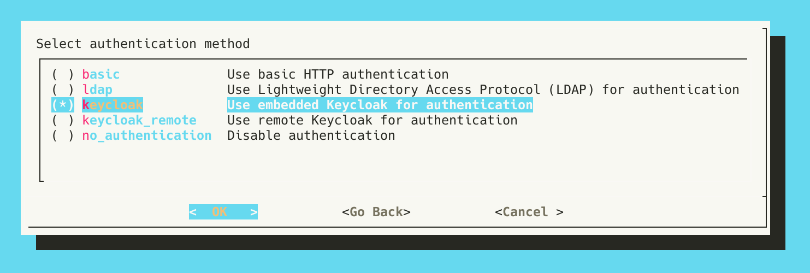

The next steps happen in the context of `auth_setup`.

3. Run `./scripts/auth_setup` and select **Configure Keycloak**.

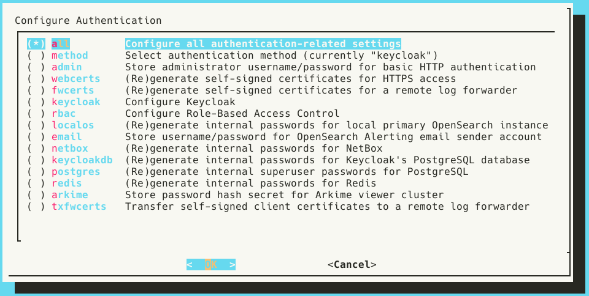

4. Specify the name of the Keycloak [realm](https://www.keycloak.org/docs/latest/server_admin/index.html#_configuring-realms) to use.


5. Provide the relative path which is the Malcolm URI to which Keycloak will redirect users after a successful authentication. The default is `/index.html`, which will redirect users to the Malcolm landing page.


6. Provide the Keycloak URL, or the URL to which Malcolm should direct authentication requests for Keycloak. This should be the URL of the existing keycloak provider.


7. Enter the client ID and client secret that should be used by Malcolm to authenticate.


8. Enter group membership restrictions and user realm role restrictions to limit the set of users permitted to authenticate to Malcolm to those that meeting those requirements. Blank values mean that no restriction of that type will be enforced. Multiple values may be specified as a comma-separated list. See [**System-wide required user groups and realm roles**](#AuthKeycloakReqGroupsRoles) below for more information. These restrictions are separate from [role-based access controls](#AuthKeycloakRBAC).

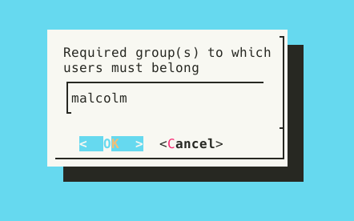

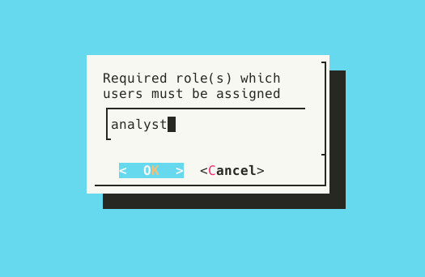

9. The values for temporary bootstrap username and password may be left blank, as they are irrelevant when using a remote Keycloak instance.

With the remote Keycloak configuration complete, [start Malcolm](running.md#Starting).

10. Run `./scripts/start` and wait a few minutes for Malcolm to start.

11. Open a web browser and navigate to the hostname or IP address where Malcolm can be reached (e.g., `https://malcolm.example.com`), which should redirect to the **Sign in to your account** Keycloak page provided by the remote Keycloak instance. Enter valid credentials, then click **Sign in**.

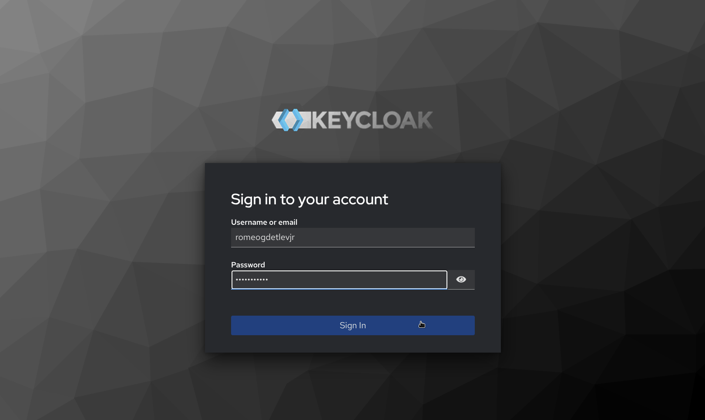

12. After successfully signing in, Keycloak redirects back to the Malcolm landing page.

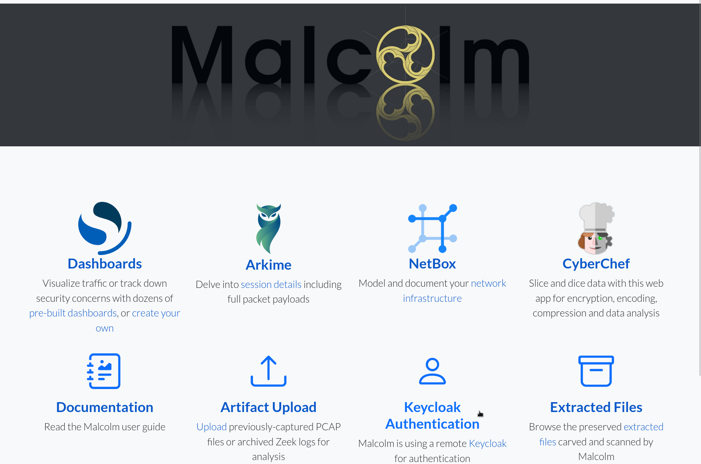

### <a name="AuthKeycloakEmbedded"></a>Using the embedded Keycloak instance

This section outlines how to configure an embedded Keycloak instance managed by Malcolm. See [**Using a remote Keycloak instance**](#AuthKeycloakRemote) for how to configure Malcolm to use a remote Keycloak instance already extant in the network infrastructure. In addition to the `NGINX_AUTH_MODE` variable in `auth-common.env` described above, Malcolm uses [environment variables](malcolm-config.md#MalcolmConfigEnvVars) in `keycloak.env` to configure its use of Keycloak.

As Keycloak is a much more full-featured authentication provider than the local basic authentication method, **configuring Malcolm's embedded Keycloak instance** is a bit more involved. The following steps outline how this is done.

These first two steps are performed during [configuration](malcolm-hedgehog-e2e-iso-install.md#MalcolmConfig):

1. Prior to starting Malcolm, during configuration, the user is asked **Which IP version does the network support? (IPv4, IPv6, or both)?** This question is used to configure the [resolver directive](https://nginx.org/en/docs/http/ngx_http_core_module.html#resolver) for Malcolm's nginx reverse proxy. Note that this selection does not affect Malcolm's ability to capture or inspect IPv4/IPv6 traffic: it is only used if and when nginx itself needs to resolve hostnames in the network in which Malcolm resides (for example, to resolve the Keycloak URL if Malcolm is configured to be accessible via a host name rather than an IP address). See related settings for nginx in the [`nginx.env`](malcolm-config.md#MalcolmConfigEnvVars) configuration file.


2. A few steps later, the user is prompted to **Select authentication method**. Selecting `keycloak` will use Malcolm's embedded Keycloak instance.


The next steps happen in the context of `./scripts/auth_setup`.

3. If the internal passwords for Keycloak's PostgreSQL database were not generated during the initial run of `auth_setup`, this should be done now. If this step has already been done, the user will be warned about regenerating passwords over the top of those that already exist; this is only a concern if the PostgreSQL database already contains data.


4. Next, running `auth_setup` again, select **Configure Keycloak**.


5. Specify the name of the Keycloak [realm](https://www.keycloak.org/docs/latest/server_admin/index.html#_configuring-realms) to use. The default, as defined by Keycloak itself, is [`master`](https://www.keycloak.org/docs/latest/server_admin/index.html#the-master-realm).


6. Provide the relative path which is the Malcolm URI to which Keycloak will redirect users after a successful authentication. The default is `/index.html`, which will redirect users to the Malcolm landing page.


7. Provide the Keycloak URL, or the URL to which Malcolm should direct authentication requests for Keycloak. Since this guide is to configure the embedded Keycloak instance, this host portion of the URL should be the hostname or IP address at which Malcolm is available, followed by **/keycloak**.

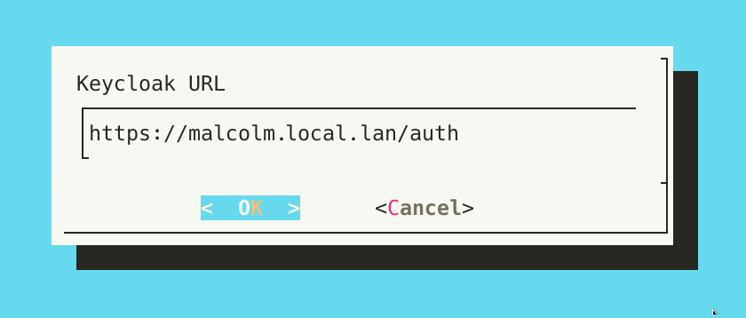

8. When configuring Keycloak for the first time, a Keycloak client has not yet been created, and its secret has not yet been generated. Specify the [client](https://www.keycloak.org/docs/latest/server_admin/index.html#core-concepts-and-terms) ID to be automatically created when Keycloak first starts up. Leave the secret blank for now.


9. Enter group membership restrictions and user realm role restrictions to limit the set of users permitted to authenticate to Malcolm to those that meeting those requirements. Blank values mean that no restriction of that type will be enforced. Multiple values may be specified as a comma-separated list. See [**System-wide required user groups and realm roles**](#AuthKeycloakReqGroupsRoles) below for more information. These restrictions are separate from [role-based access controls](#AuthKeycloakRBAC).


10. When Keycloak starts up for the first time and no users exist, it will [bootstrap](https://www.keycloak.org/server/bootstrap-admin-recovery) a temporary admin account with the username and password provided to the next two questions. These values will only be used once, after which it is recommended to delete this temporary account in the Keycloak user management interface.

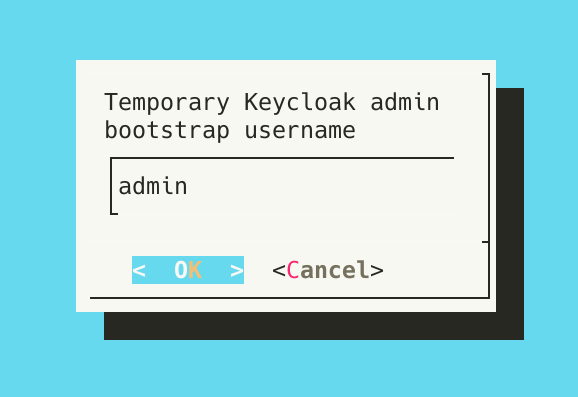

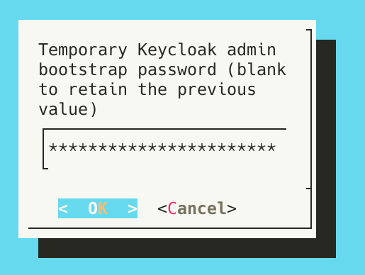

With the initial configuration complete, [start Malcolm](running.md#Starting).

11. Run `./scripts/start` and wait a few minutes for Malcolm to start.

12. Open a web browser and enter the Keycloak URL specified above (i.e., the hostname or IP address at which Malcolm is available followed by **/keycloak**), then log in with the bootstrap username and password. Navigating to any other Malcolm URI will result in a "client not found" error until the Keycloak configuration is finished.


13. Once logged in, Keycloak warns "You are logged in as a temporary admin user. To harden security, create a permanent admin account and delete the temporary one." Navigate to the **Users** page under **Manage** on the navigation sidebar, then click **Add user**.

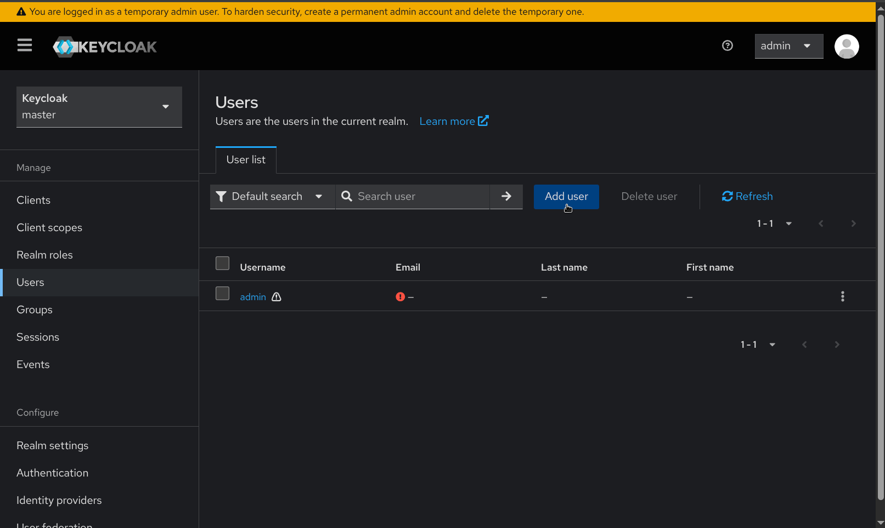

14. The **Create user** page requires that a username for the new admin user be provided. Other details such as name and email may also be supplied. Click **Create** after providing these details.

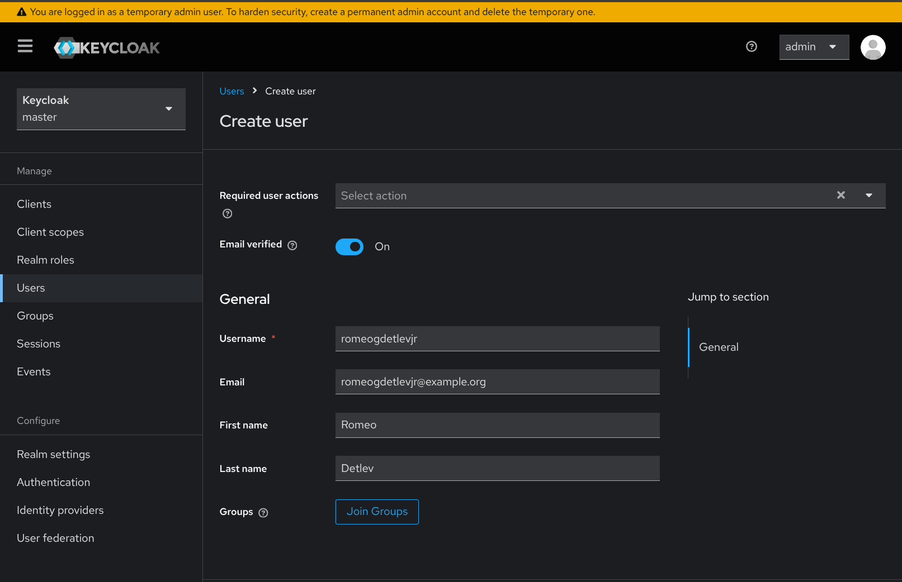

15. Once the new user has been created, navigate to the **Credentials** tab in the user details screen for the new user, and click **Set password**. Set a password for the newly created user.

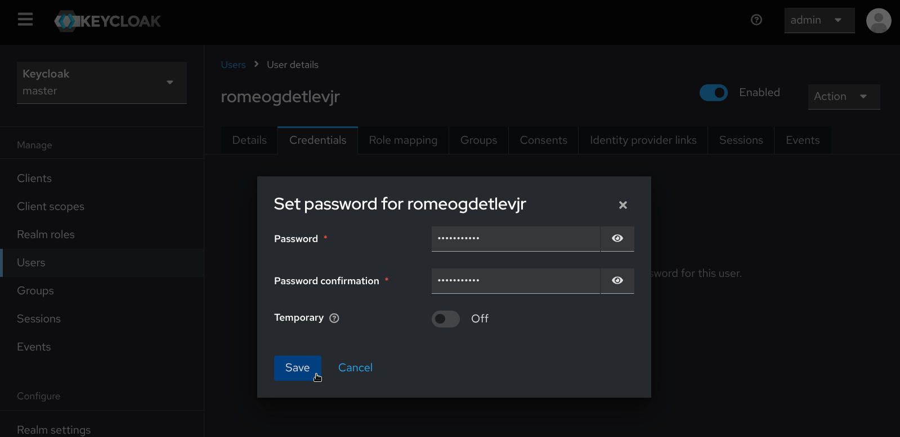

16. Navigate to the **Role mapping** tab and click the **Assign role** button. Select **Filter by realm roles**, then check the box next to the **admin** role, then click **Assign**, after which the **User role mapping successfully updated** confirmation will appear.

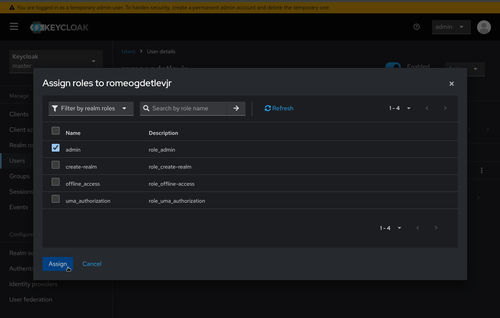

17. In the upper-right hand corner of the page, click on the username for the temporary admin account and select **Sign out**.

18. Sign in again with the username and password for the new admin user created in the previous steps.

19. Once again, navigate to the **Users** page under **Manage** on the navigation sidebar. Select the temporary bootstrap admin user account and click **Delete user**, then confirm by clicking **Delete**.

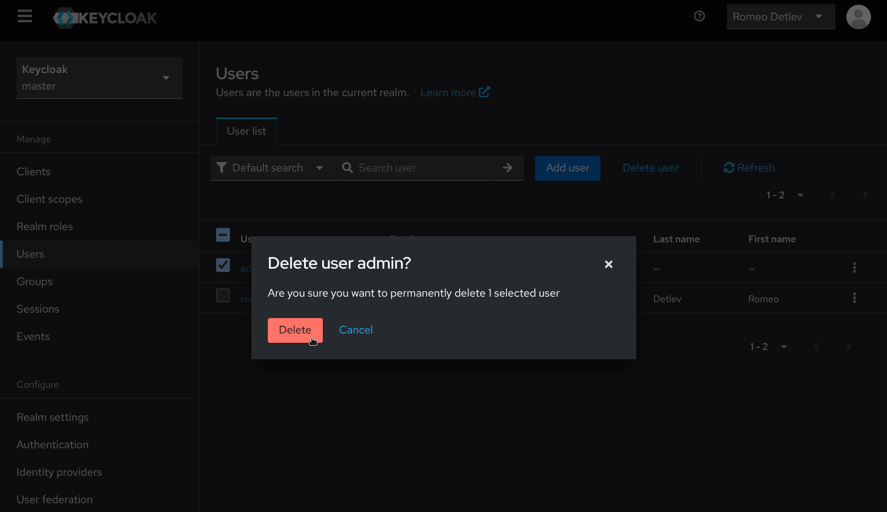

During startup, Malcolm's embedded Keycloak instance will automatically create and configure a Keycloak [client](https://www.keycloak.org/docs/latest/server_admin/index.html#core-concepts-and-terms) using the value in `KEYCLOAK_CLIENT_ID` as its name, which will be used by Malcolm's nginx reverse proxy to handle user authentication. To create additional clients (optional), follow steps 20 through 23. Otherwise, continue with step 24.

20. Navigate to the **Clients** page under **Manage** on the navigation sidebar and click **Create client**.

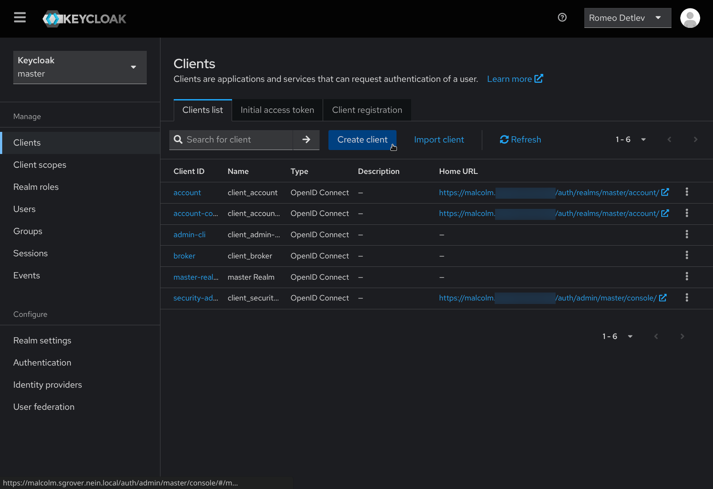

21. Provide a **Client ID** (e.g., `malcolm` or `myclient`) to identify the new client, then click **Next**.

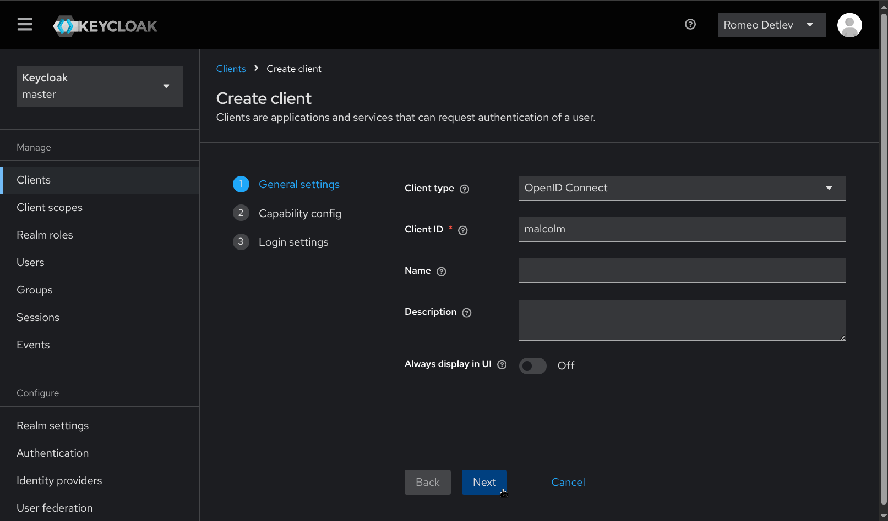

22. Enable **Client authentication**, then click **Next**.

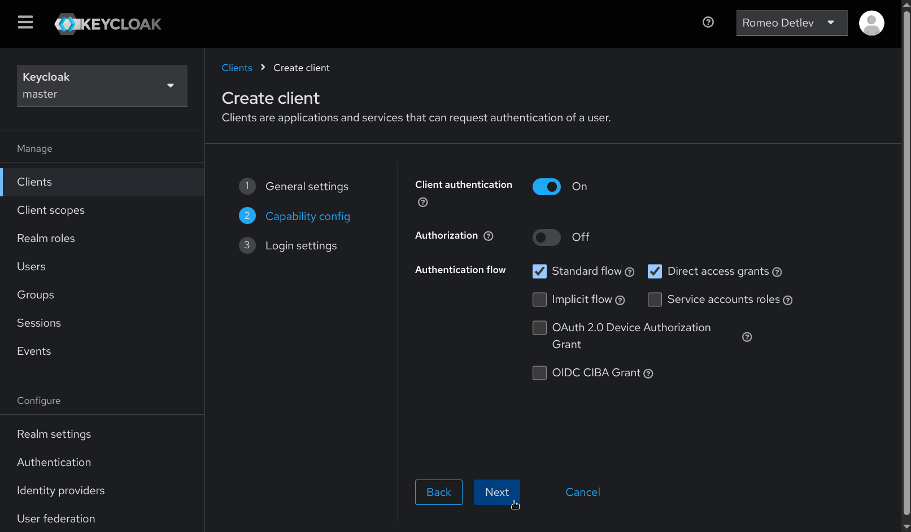

23. Under **Login settings** provide the following values, replacing `malcolm.example.com` with the hostname or IP address of the Malcolm instance. Then click **Save**.
    * **Root URL**: `https://malcolm.example.com`
    * **Home URL**: `https://malcolm.example.com`
    * **Valid redirect URIs**: `/*`
    * **Valid post logout redirect URIs**: `https://malcolm.example.com/keycloak`
    * **Web origins**: `https://malcolm.example.com`

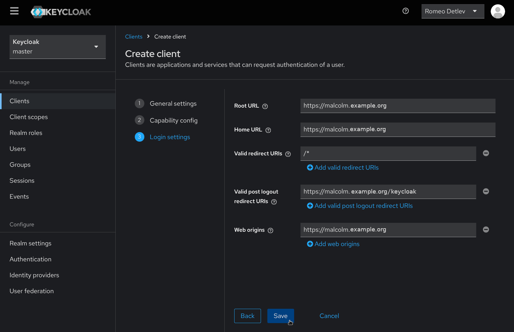

24. From the **Client details** page for the new client, click the **Credentials** tab. Copy the **Client Secret** to the clipboard or make note of it so that it can be used in the following step.

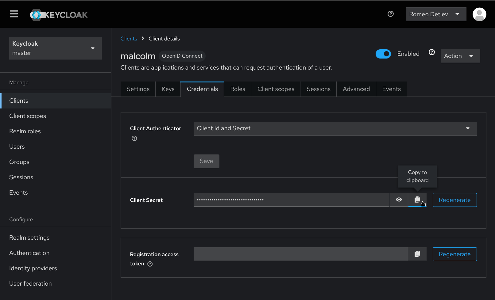

25. Return to a command prompt in the Malcolm installation directory and re-run `./scripts/auth_setup`, then select **Configure Keycloak**.

26. Leave the realm, redirect URI, and keycloak URL unchanged. Enter the client ID and client secret when prompted. The values for temporary bootstrap username and password can also be left unchanged, as they are irrelevant and will not be used again.


27. The `nginx-proxy` container needs to be updated with these new values. Restart the `nginx-proxy` container by running `./scripts/restart -s nginx-proxy` (pressing CTRL+C to interrupt the debug log output once the service has restarted), or [restart Malcolm](running.md#StopAndRestart) entirely.

```
/scripts/restart -s nginx-proxy
Stopped Malcolm's ['nginx-proxy'] services

Removed Malcolm's ['nginx-proxy'] services

NAME                    IMAGE                                          COMMAND                  SERVICE       CREATED        STATUS                                     PORTS
malcolm-nginx-proxy-1   ghcr.io/idaholab/malcolm/nginx-proxy:{{ site.malcolm.version }}   "/sbin/tini -- /usr/…"   nginx-proxy   1 second ago   Up Less than a second (health: starting)

nginx-proxy-1  | root
nginx-proxy-1  | uid=0(root) gid=0(root) groups=0(root),0(root),1(bin),2(daemon),3(sys),4(adm),6(disk),10(wheel),11(floppy),20(dialout),26(tape),27(video)
nginx-proxy-1  | 2025-03-11 17:29:02,866 INFO Set uid to user 0 succeeded
nginx-proxy-1  | 2025-03-11 17:29:02,873 INFO RPC interface 'supervisor' initialized
nginx-proxy-1  | 2025-03-11 17:29:02,873 CRIT Server 'unix_http_server' running without any HTTP authentication checking
nginx-proxy-1  | 2025-03-11 17:29:02,873 INFO supervisord started with pid 37
nginx-proxy-1  | 2025-03-11 17:29:03,876 INFO spawned: 'logaccess' with pid 111
nginx-proxy-1  | 2025-03-11 17:29:03,878 INFO spawned: 'logerrors' with pid 112
nginx-proxy-1  | 2025-03-11 17:29:03,879 INFO spawned: 'nginx' with pid 113
nginx-proxy-1  | 2025-03-11 17:29:14,283 INFO success: logaccess entered RUNNING state, process has stayed up for > than 10 seconds (startsecs)
nginx-proxy-1  | 2025-03-11 17:29:14,283 INFO success: logerrors entered RUNNING state, process has stayed up for > than 10 seconds (startsecs)
nginx-proxy-1  | 2025-03-11 17:29:14,283 INFO success: nginx entered RUNNING state, process has stayed up for > than 10 seconds (startsecs)
^C
```

28. Open a web browser and navigate to the hostname or IP address where Malcolm can be reached (e.g., `https://malcolm.example.com`), which should redirect to the **Sign in to your account** Keycloak page. Enter the username and password for the user created above, then click **Sign in**.


29. After successfully signing in, Keycloak redirects back to the Malcolm landing page. Additional users can now be added by navigating to Keycloak (by clicking the **👤 Keycloak Authentication** link) and repeating steps 11 and 12 for each new user to be added.

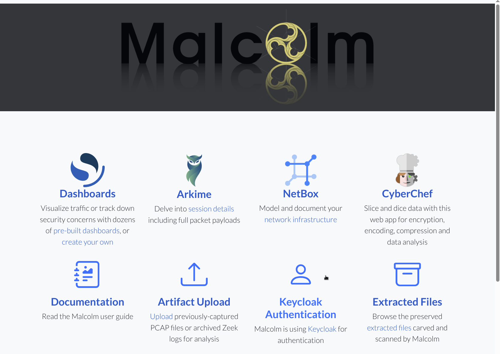

### <a name="AuthKeycloakHedgehog"></a>Known Limitation with Hedgehog Linux

Due to known compatibility issues between Arkime capture on [Hedgehog Linux](live-analysis.md#Hedgehog), Malcolm’s nginx reverse proxy, and Keycloak, special authentication handling is required when using a [local OpenSearch instance](opensearch-instances.md#OpenSearchInstance) exposed to external hosts as well as Malcolm's instance of Arkime's [WISE service](arkime.md#ArkimeWISE).

For the WISE service, and if Malcolm is using a local OpenSearch service (typically accessible via port 9200/tcp), [HTTP basic](#AuthBasicAccountManagement) authentication must be enabled for those endpoints — even when Keycloak is selected as Malcolm’s primary authentication method.

When specifying the remote Malcolm aggregator credentials on Hedgehog Linux (e.g., *Store username/password for OpenSearch/Elasticsearch instance?* in `auth_setup`), use the Malcolm credentials described in the [**Local Account Management**](#AuthBasicAccountManagement) section — *not* Keycloak credentials. In this setup:

* The basic administrator account is used to manage other basic accounts via the **Malcolm User Management** page (https://<malcolm-host>/auth).
* These basic credentials apply *only* to Malcolm’s OpenSearch API and Arkime WISE endpoints.

This limitation does not apply if Malcolm is connected to a remote OpenSearch or Elasticsearch [instance](opensearch-instances.md#OpenSearchInstance).

### <a name="AuthKeycloakGroupsRoles"></a>Groups and roles

Malcolm can use Keycloak's realm roles to implement [role-based access controls](#AuthKeycloakRBAC). It can also use realm roles or user groups as the basis for [system-wide authentication requirements](#AuthKeycloakReqGroupsRoles).

Groups can be managed in Keycloak by selecting the appropriate realm from the drop down at the top of the navigation panel and selecting **Groups** under **Manage**.

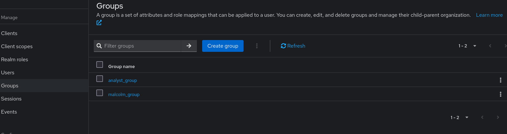

Users can be joined to groups by clicking on a username on the Keycloak **Users** page, selecting the **Groups** tab, then clicking **Join Group**.

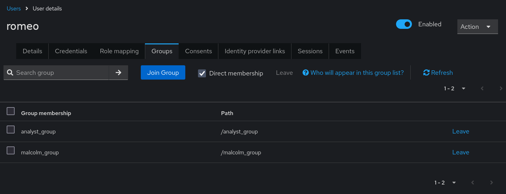

Realm roles can be managed in Keycloak by selecting the appropriate realm from the drop down at the top of the navigation panel and selecting **Realm roles** under **Manage**.

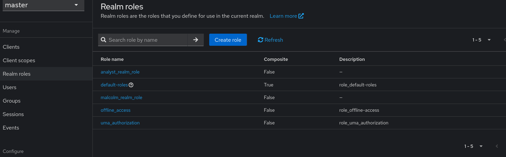

Users can be assigned realm roles by clicking on a username on the Keycloak **Users** page, selecting the **Role mapping** tab, then clicking **Assign role**. Select **Filter by realm roles**, then check the box next to the desired role(s), then click **Assign**, after which the **User role mapping successfully updated** confirmation will appear.


For a discussion of roles vs. groups, see [**Assigning permissions using roles and groups**](https://www.keycloak.org/docs/latest/server_admin/index.html#assigning-permissions-using-roles-and-groups) in the Keycloak Server Administration Guide.

#### <a name="AuthKeycloakRBAC"></a>Role-based access control

Role-based access control is only available when the authentication method is `keycloak` or `keycloak_remote`. With other authentication methods such as [HTTP basic](#AuthBasicAccountManagement) or [LDAP](#AuthLDAP), or when role-based access control is disabled, all Malcolm users effectively have administrator privileges.

Having chosen `keycloak` or `keycloak_remote` in `auth_setup`, select **Configure Role-Based Access Control**.

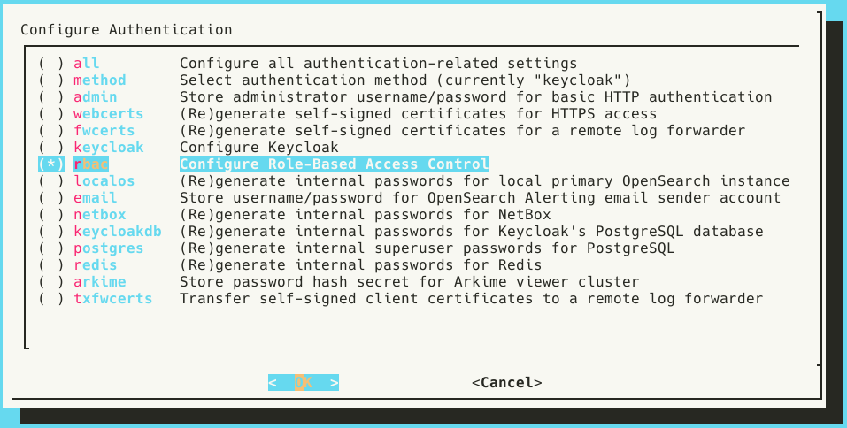

Select **Yes** when prompted to **Enable role-based access control**.

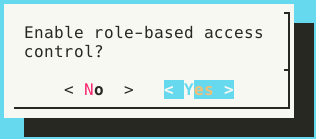

The `auth_setup` dialog instructs the user to **See Keycloak or [`auth-common.env`](malcolm-config.md#MalcolmConfigEnvVars) for realm roles.**

`auth-common.env` contains the [environment variables]({{ site.github.repository_url }}/blob/{{ site.github.build_revision }}/config/auth-common.env.example) that define the names of Malcolm's "back-end" roles which are in turn mapped to roles used internally by Malcolm's several components (e.g., NetBox, OpenSearch, etc.). When using Malcolm's [embedded Keycloak](#AuthKeycloakEmbedded) instance realm roles with these names are automatically created when Keycloak starts up. When using a [remote Keycloak instance](#AuthKeycloakRemote) the user must create these realm roles manually.

These environment variables are divided into two sections:

* General access roles
    * `ROLE_ADMIN` - Unrestricted administrator access
    * `ROLE_READ_ACCESS` - Read-only access across all Malcolm components
    * `ROLE_READ_WRITE_ACCESS` - Read/write access across all Malcolm components, excluding some administrator functions
* Fine-grained roles
    * `ROLE_ARKIME_ADMIN` - Maps to Arkime's [built-in](https://arkime.com/roles) `arkimeAdmin` role
    * `ROLE_ARKIME_READ_ACCESS` - Maps to a [custom Arkime role](https://arkime.com/settings#user-role-mappings) with read-only Viewer access
    * `ROLE_ARKIME_READ_WRITE_ACCESS` - Maps to a custom Arkime role with read/write Viewer access
    * `ROLE_ARKIME_PCAP_ACCESS` - Maps to a custom Arkime role with access to viewing/exporting PCAP payloads in Viewer
    * `ROLE_ARKIME_HUNT_ACCESS` - Maps to a custom Arkime role with access to [Hunt](arkime.md#ArkimeHunt) (packet search) in Viewer
    * `ROLE_ARKIME_WISE_READ_ACCESS` - Maps to Arkime's built-in `wiseUser` role
    * `ROLE_ARKIME_WISE_READ_WRITE_ACCESS` - Maps to Arkime's built-in `wiseAdmin` role
    * `ROLE_DASHBOARDS_READ_ACCESS` - Read-only access to [OpenSearch Dashboards](dashboards.md#Dashboards) visualizations, but not all Dashboards apps
    * `ROLE_DASHBOARDS_READ_ALL_APPS_ACCESS` - Read-only access to all OpenSearch Dashboards visualizations and apps
    * `ROLE_DASHBOARDS_READ_WRITE_ACCESS` - Read/write access to OpenSearch Dashboards visualizations, but not all Dashboards apps
    * `ROLE_DASHBOARDS_READ_WRITE_ALL_APPS_ACCESS` - Read/write access to OpenSearch Dashboards visualizations and apps
    * `ROLE_EXTRACTED_FILES` - Access to [extracted file downloads](file-scanning.md#ZeekFileExtractionUI)
    * `ROLE_NETBOX_READ_ACCESS` - Read-only access to [NetBox](asset-interaction-analysis.md#AssetInteractionAnalysis)
    * `ROLE_NETBOX_READ_WRITE_ACCESS` - Read/write access to NetBox
    * `ROLE_UPLOAD` - Access to [upload artifact interface](upload.md#Upload)
    * `ROLE_CAPTURE_SERVICE` - Internal-use role for service account used by Arkime capture on remote [network sensor](live-analysis.md#Hedgehog)

Note that the general access roles are supersets of combinations of the fine-grained roles: e.g., the role named by the `ROLE_READ_ACCESS` variable includes read-only access to Dashboards, Arkime, and NetBox.

With role-based access control enabled, realm roles must exist that correspond to the names defined by these `ROLE_…` environment variables, and users must be [assigned those realm roles](#AuthKeycloakGroupsRoles) in order to use the Malcolm features to which they correspond. Users attempting to access features for which they are authorized will be presented with a ["forbidden"](https://en.wikipedia.org/wiki/HTTP_403) error message.

#### <a name="AuthKeycloakReqGroupsRoles"></a>System-wide required user groups and realm roles

As a simpler alternative to [role-based access control](#AuthKeycloakRBAC), Malcolm can be configured to require Keycloak-authenticated users to belong to groups and assigned realm roles, respectively. The values for these groups and/or roles are specified when running `./scripts/auth_setup` under **Configure Keycloak** and are saved as `NGINX_REQUIRE_GROUP` and `NGINX_REQUIRE_ROLE` in the [`auth-common.env` configuration file](malcolm-config.md#MalcolmConfigEnvVars). An empty value for either of these settings means no restriction of that type is applied. Multiple values may be specified with a comma-separated list. These requirements are cumulative: users must match **all** of the items specified. Note that [LDAP authentication](#AuthLDAP) can also require group membership, but that is specified in `nginx_ldap.conf` by setting `require group` rather than in `auth-common.env`.

#### <a name="AuthKeycloakGroupsAndRolesConfig"></a>Configuring Keycloak to pass groups and roles to Malcolm

When using Malcolm's [embedded Keycloak](#AuthKeycloakEmbedded) instance, the default client is automatically created and configured. For [remote Keycloak instances](#AuthKeycloakRemote) or manually-created clients, Keycloak does not include group or realm role information in authentication tokens by default; clients must be configured to include this information in order for users to log in to Malcolm with group and/or role restrictions set. This can be done by navigating to the Keycloak **Clients** page, selecting the desired client, then clicking the **Client scopes** tab. Click on the name of the assigned client scope beginning with the client ID and ending in **-dedicated**, which will also have a description of "Dedicated scope and mappers for this client." Once on this **Clients** > **Client details** > **Dedicated scopes** screen, click the down arrow on the **Add mapper** button and select **By configuration**.

To include group information in the Keycloak token for this client, select **Group Membership** from the **Configure a new mapper** list. The important information to provide for this Group Membership mapper before clicking **Save** is:

* **Mapper type**: Group Membership
* **Name**: *provide any name for this mapper*
* **Token Claim Name**: `groups`
* **Full group path**: If set to **On**, users will need to include the full path for the group name(s) in `NGINX_REQUIRE_GROUP` (e.g., `/top/level1/malcolm_group`); if set to **Off**, just specify the group name (e.g., `malcolm_group`)
* **Add to ID token**: On
* **Add to access token**: On
* **Add to token introspection**: On

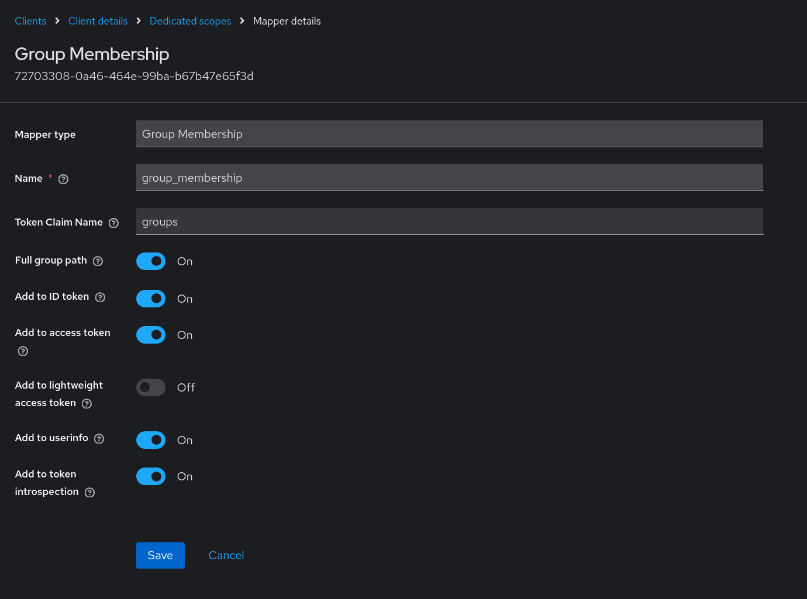

To include user realm role information in the Keycloak token for this client, once again click the down arrow on the **Add mapper** button and select **Byte configuration**. Select **User Realm Role** from the **Configure a new mapper** list. The important information to provide for this User Realm Role mapper before clicking **Save** is:

* **Mapper type**: User Realm Role
* **Name**: *provide any name for this mapper*
* **Multivalued**: On
* **Token Claim Name**: `realm_access.roles`
* **Claim JSON Type**: String
* **Add to ID token**: On
* **Add to access token**: On
* **Add to token introspection**: On

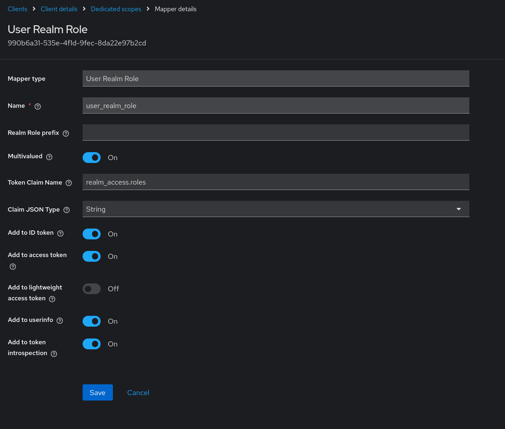

Once the mapper(s) have been created, the list of mappers on the **Clients** > **Client details** > **Dedicated scopes** page will look something like this:

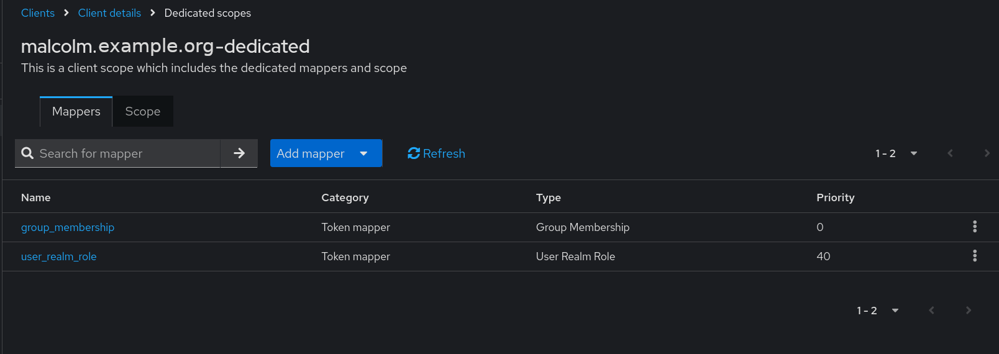

## <a name="TLSCerts"></a>TLS certificates

When users [set up authentication](#AuthSetup) for Malcolm a set of unique [self-signed](https://en.wikipedia.org/wiki/Self-signed_certificate) TLS certificates are created which are used to secure the connection between clients (e.g., your web browser) and Malcolm's browser-based interface. This is adequate for most Malcolm instances as they are often run locally or on internal networks, although your browser will most likely require users to add a security exception for the certificate when first connecting to Malcolm.

Another option is for users to generate their own certificates (or have them issued directly) and have them placed in the `nginx/certs/` directory. The certificate and key file should be named `cert.pem` and `key.pem`, respectively.

A third possibility is to use a third-party reverse proxy (e.g., [Traefik](https://doc.traefik.io/traefik/) or [Caddy](https://caddyserver.com/docs/quick-starts/reverse-proxy)) to handle the issuance of the certificates and to broker the connections between clients and Malcolm. Reverse proxies such as these often implement the [ACME](https://datatracker.ietf.org/doc/html/rfc8555) protocol for domain name authentication and can be used to request certificates from certificate authorities such as [Let's Encrypt](https://letsencrypt.org/how-it-works/). In this configuration, the reverse proxy will be encrypting the connections instead of Malcolm, so users will need to set the `NGINX_SSL` environment variable to `false` in [`nginx.env`](malcolm-config.md#MalcolmConfigEnvVars) (or set the **Require HTTPS Connections** setting in `./scripts/configure` to `No`). If you are setting `NGINX_SSL` to `false`, **make sure** users must understand precisely what they are doing, ensuring that external connections cannot reach ports over which Malcolm will be communicating without encryption, including verifying local firewall configuration. Also note: in some circumstances disabling SSL in NGINX while leaving SSL enabled in Arkime can result in a "Missing token" Arkime error. This is due to Arkime's Cross-Site Request Forgery mitigation cookie being passed to the browser with the "secure" flag enabled. 

## <a name="CommandLineConfig"></a>Command-line arguments

The `./scripts/auth_setup` script can also be run noninteractively which can be useful for scripting Malcolm setup. This behavior can be selected by supplying the `--auth-noninteractive` option on the command line. Running with the `--help` option will list the arguments accepted by the script:

```
$ ./scripts/auth_setup --help
usage: auth_setup <arguments>

Malcolm control script

options:
  -v [DEBUG], --verbose [DEBUG]
                        Verbose output
  -f <string>, --file <string>
                        Docker compose or kubeconfig YML file
  -e <string>, --environment-dir <string>
                        Directory containing Malcolm's .env files

…

Authentication Setup:
  --auth [CMDAUTHSETUP]
                        Configure Malcolm authentication
  --auth-noninteractive [CMDAUTHSETUPNONINTERACTIVE]
                        Configure Malcolm authentication (noninteractive using arguments provided)
  --auth-method <basic|ldap|keycloak|keycloak_remote|no_authentication>
                        Authentication method (for --auth-noninteractive)
  --auth-ldap-mode <openldap|winldap>
                        LDAP server compatibility type (for --auth-noninteractive when --auth-method is ldap)
  --auth-ldap-start-tls [true|false]
                        Use StartTLS (rather than LDAPS) for LDAP connection security (for --auth-noninteractive when --auth-method is ldap)
  --auth-admin-username <string>
                        Administrator username (for --auth-noninteractive)
  --auth-admin-password-openssl <string>
                        Administrator password hash from "openssl -passwd -1" (for --auth-noninteractive)
  --auth-admin-password-htpasswd <string>
                        Administrator password hash from "htpasswd -n -B username | cut -d: -f2" (for --auth-noninteractive)
  --auth-arkime-password <string>
                        Password hash secret for Arkime viewer cluster (for --auth-noninteractive)
  --auth-generate-webcerts [AUTHGENWEBCERTS]
                        (Re)generate self-signed certificates for HTTPS access (for --auth-noninteractive)
  --auth-generate-fwcerts [AUTHGENFWCERTS]
                        (Re)generate self-signed certificates for a remote log forwarder
  --auth-netbox-token <string>
                        API token for remote NetBox instance (for --auth-noninteractive when NETBOX_MODE=remote in netbox-common.env)
  --auth-generate-netbox-passwords [AUTHGENNETBOXPASSWORDS]
                        (Re)generate internal passwords for NetBox
  --auth-generate-redis-password [AUTHGENREDISPASSWORD]
                        (Re)generate internal passwords for Redis
  --auth-generate-postgres-password [AUTHGENPOSTGRESPASSWORD]
                        (Re)generate internal superuser passwords for PostgreSQL
  --auth-generate-opensearch-internal-creds [AUTHGENOPENSEARCHCREDS]
                        (Re)generate internal credentials for embedded OpenSearch instance
  --auth-generate-keycloak-db-password [AUTHGENKEYCLOAKDBPASSWORD]
                        (Re)generate internal passwords for Keycloak's PostgreSQL database
  --auth-keycloak-realm <string>
                        Keycloak realm
  --auth-keycloak-redirect-uri <string>
                        Keycloak redirect URI
  --auth-keycloak-url <string>
                        Keycloak URL
  --auth-keycloak-client-id <string>
                        Keycloak client ID
  --auth-keycloak-client-secret <string>
                        Keycloak client secret
  --auth-keycloak-bootstrap-user <string>
                        Temporary Keycloak admin bootstrap username
  --auth-keycloak-bootstrap-password <string>
                        Temporary Keycloak admin bootstrap password
  --auth-require-group <string>
                        Required group(s) to which users must belong (--auth-method is keycloak|keycloak_remote)
  --auth-require-role <string>
                        Required role(s) which users must be assigned (--auth-method is keycloak|keycloak_remote)
  --auth-role-based-access-control [AUTHRBACENABLED]
                        Enable Role-Based Access Control (--auth-method is keycloak|keycloak_remote)
…
```

In order to avoid specifying passwords as command line arguments, when setting the administrator password noninteractively the user must instead provide hashes generated by [`openssl -passwd -1`](https://www.openssl.org/docs/man1.1.1/man1/openssl-passwd.html) and [`htpasswd -n -B username`](https://httpd.apache.org/docs/2.4/programs/htpasswd.html).

# <a name="LoggingOut"></a>Log Out of Malcolm

When using [Keycloak](#AuthKeycloak), Malcolm users can log out of Malcolm by navigating to the Keycloak user interface, opening the drop-down with their name or username in the upper-right corner of the page, and selecting **Sign out**.

For the other authentication methods which use HTTP basic authentication, users should exit their browser to log out of Malcom. On the next browser restart, Malcolm will prompt the user for credentials. Another way to log out of Malcolm is for a user to manually clear their browser's active sessions.
