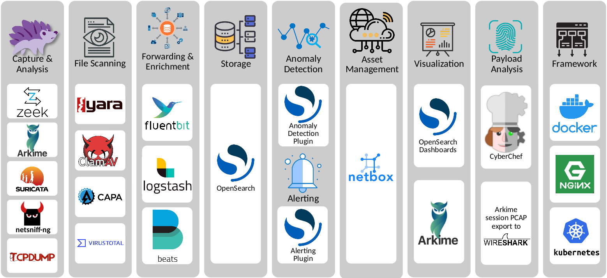

# Components

Malcolm leverages the following excellent open source tools, among others.

* [Arkime](https://arkime.com/) (formerly Moloch) - for PCAP file processing, browsing, searching, analysis, and carving/exporting; Arkime itself consists of two parts:
    * [capture](https://github.com/arkime/arkime/tree/master/capture) - a tool for traffic capture, as well as offline PCAP parsing and metadata insertion into OpenSearch
    * [viewer](https://github.com/arkime/arkime/tree/master/viewer) - a browser-based interface for data visualization
* [OpenSearch](https://opensearch.org/) - a search and analytics engine for indexing and querying network traffic session metadata 
* [Logstash](https://www.elastic.co/products/logstash) and [Filebeat](https://www.elastic.co/products/beats/filebeat) - for ingesting and parsing [Zeek](https://www.zeek.org/index.html) [Log Files](https://docs.zeek.org/en/stable/script-reference/log-files.html) and ingesting them into OpenSearch in a format that Arkime understands in the same way it natively understands PCAP data
* [OpenSearch Dashboards](https://opensearch.org/docs/latest/dashboards/index/) - for creating additional ad-hoc visualizations and dashboards beyond that which is provided by Arkime viewer
* [Zeek](https://www.zeek.org/index.html) - a network analysis framework and IDS
* [Suricata](https://suricata.io/) - an IDS and threat detection engine
* [Yara](https://github.com/VirusTotal/yara) - a tool used to identify and classify malware samples
* [Capa](https://github.com/fireeye/capa) - a tool for detecting capabilities in executable files
* [ClamAV](https://www.clamav.net/) - an antivirus engine for scanning files extracted by Zeek
* [CyberChef](https://github.com/gchq/CyberChef) - a "swiss-army knife" data conversion tool 
* [jQuery File Upload](https://github.com/blueimp/jQuery-File-Upload) - for uploading PCAP files and Zeek logs for processing
* [Docker](https://www.docker.com/) and [Docker Compose](https://docs.docker.com/compose/) - for simple, reproducible deployment of the Malcolm appliance across environments and to coordinate communication between its various components
* [NetBox](https://netbox.dev/) - a suite for modeling and documenting modern networks
* [PostgreSQL](https://www.postgresql.org/) - a relational database for persisting NetBox's data
* [Redis](https://redis.io/) - an in-memory data store for caching NetBox session information
* [Nginx](https://nginx.org/) - for HTTPS and reverse proxying Malcolm components
* [nginx-auth-ldap](https://github.com/kvspb/nginx-auth-ldap) - an LDAP authentication module for nginx
* [Fluent Bit](https://fluentbit.io/) - for forwarding metrics to Malcolm from [network sensors](live-analysis.md#Hedgehog) (packet capture appliances)
* [Mark Baggett](https://github.com/MarkBaggett)'s [freq](https://github.com/MarkBaggett/freq) - a tool for calculating entropy of strings
* [Florian Roth](https://github.com/Neo23x0)'s [Signature-Base](https://github.com/Neo23x0/signature-base) Yara ruleset
* [Bart Blaze](https://github.com/bartblaze)'s [Yara ruleset](https://github.com/bartblaze/Yara-rules)
* These Zeek plugins:
    * some of Amazon.com, Inc.'s [ICS protocol](https://github.com/amzn?q=zeek) analyzers
    * Andrew Klaus's [Sniffpass](https://github.com/cybera/zeek-sniffpass) plugin for detecting cleartext passwords in HTTP POST requests
    * Andrew Klaus's [zeek-httpattacks](https://github.com/precurse/zeek-httpattacks) plugin for detecting noncompliant HTTP requests
    * ICS protocol analyzers for Zeek published by [DHS CISA](https://github.com/cisagov/ICSNPP) and [Idaho National Lab](https://github.com/idaholab/ICSNPP)
    * Corelight's ["bad neighbor" (CVE-2020-16898)](https://github.com/corelight/CVE-2020-16898) plugin
    * Corelight's ["Log4Shell" (CVE-2021-44228)](https://github.com/corelight/cve-2021-44228) plugin
    * Corelight's ["OMIGOD" (CVE-2021-38647)](https://github.com/corelight/CVE-2021-38647) plugin
    * Corelight's [Apache HTTP server 2.4.49-2.4.50 path traversal/RCE vulnerability (CVE-2021-41773)](https://github.com/corelight/CVE-2021-41773) plugin
    * Corelight's [bro-xor-exe](https://github.com/corelight/bro-xor-exe-plugin) plugin
    * Corelight's [callstranger-detector](https://github.com/corelight/callstranger-detector) plugin
    * Corelight's [community ID](https://github.com/corelight/zeek-community-id) flow hashing plugin
    * Corelight's [DCE/RPC remote code execution vulnerability (CVE-2022-26809)](https://github.com/corelight/cve-2022-26809) plugin
    * Corelight's [HTTP More Filenames](https://github.com/corelight/http-more-files-names) plugin
    * Corelight's [HTTP protocol stack vulnerability (CVE-2021-31166)](https://github.com/corelight/CVE-2021-31166) plugin
    * Corelight's [OpenSSL RCE buffer overrun vulnerability (CVE-2022-3602)](https://github.com/corelight/CVE-2022-3602) plugin
    * Corelight's [pingback](https://github.com/corelight/pingback) plugin
    * Corelight's [ripple20](https://github.com/corelight/ripple20) plugin
    * Corelight's [SIGred](https://github.com/corelight/SIGred) plugin
    * Corelight's [VMware Workspace ONE Access and Identity Manager RCE vulnerability (CVE-2022-22954)](https://github.com/corelight/cve-2022-22954) plugin
    * Corelight's [Zerologon](https://github.com/corelight/zerologon) plugin
    * Corelight's [Microsoft Excel privilege escalation detection (CVE-2021-42292)](https://github.com/corelight/CVE-2021-42292) plugin
    * J-Gras' [Zeek::AF_Packet](https://github.com/J-Gras/zeek-af_packet-plugin) plugin
    * Johanna Amann's [CVE-2020-0601](https://github.com/0xxon/cve-2020-0601) ECC certificate validation plugin and [CVE-2020-13777](https://github.com/0xxon/cve-2020-13777) GnuTLS unencrypted session ticket detection plugin
    * Lexi Brent's [EternalSafety](https://github.com/0xl3x1/zeek-EternalSafety) plugin
    * MITRE Cyber Analytics Repository's [Bro/Zeek ATT&CK®-Based Analytics (BZAR)](https://github.com/mitre-attack/car/tree/master/implementations) script
    * Salesforce's [gQUIC](https://github.com/salesforce/GQUIC_Protocol_Analyzer) analyzer
    * Salesforce's [HASSH](https://github.com/salesforce/hassh) SSH fingerprinting plugin
    * Salesforce's [JA3](https://github.com/salesforce/ja3) TLS fingerprinting plugin
    * Zeek's [Spicy](https://github.com/zeek/spicy) plugin framework
* [GeoLite2](https://dev.maxmind.com/geoip/geoip2/geolite2/) - Malcolm includes GeoLite2 data created by [MaxMind](https://www.maxmind.com)

