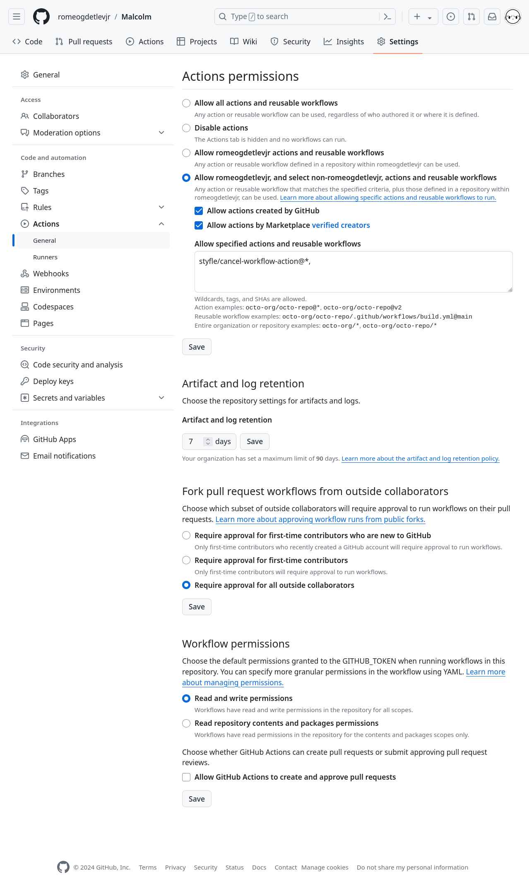
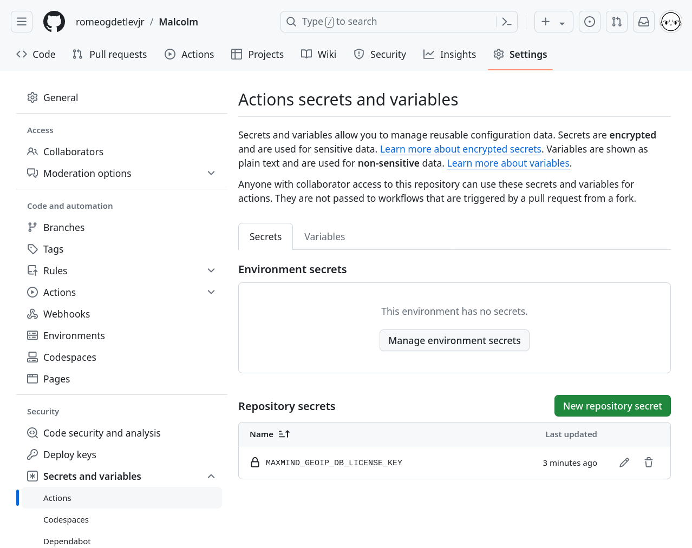
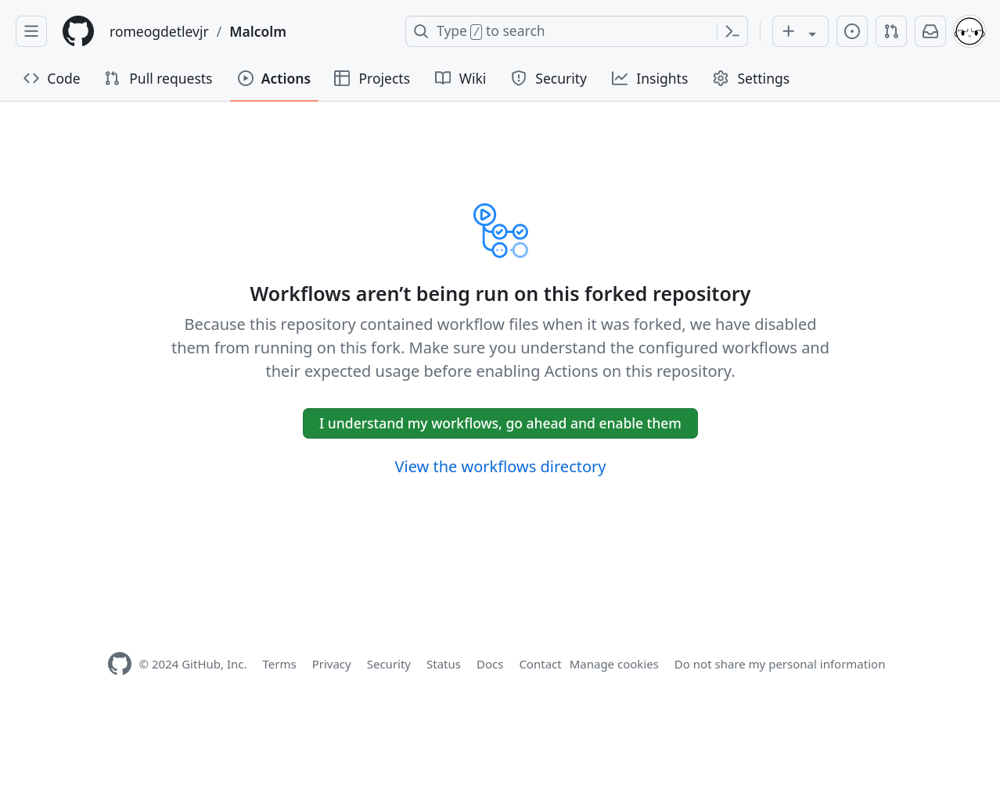
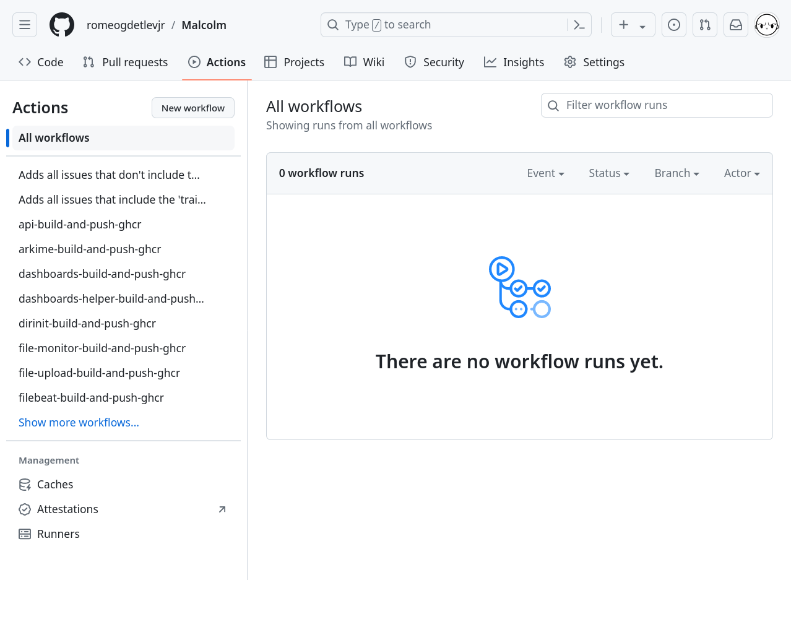
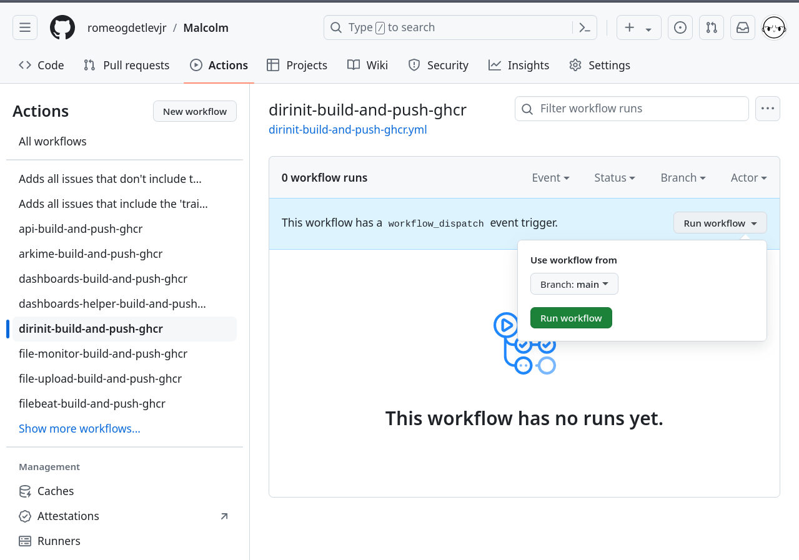
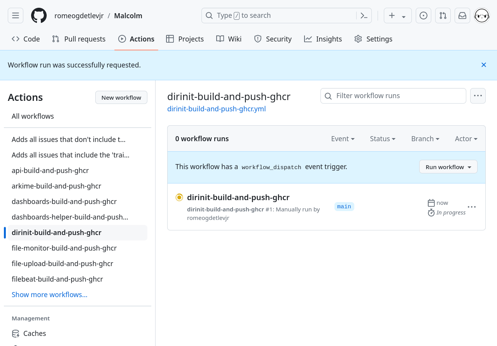
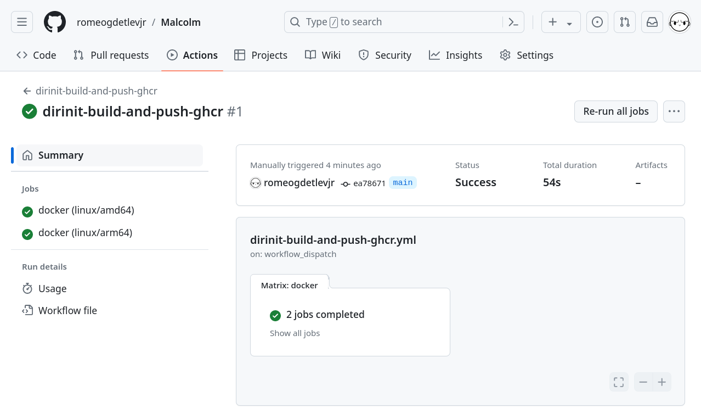
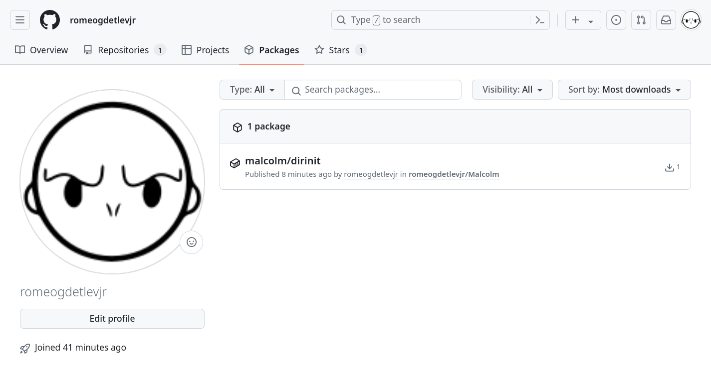
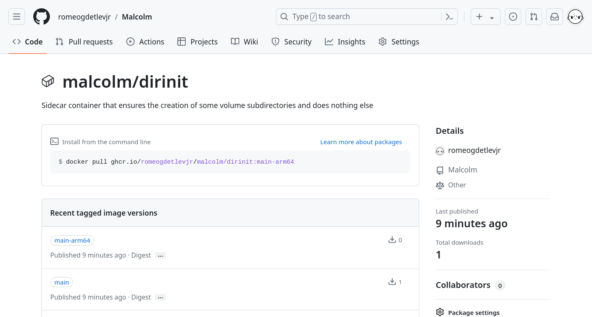

# <a name="GitHubRunners"></a>Using GitHub runners to build Malcolm images

Users who have [forked](https://docs.github.com/en/pull-requests/collaborating-with-pull-requests/working-with-forks/fork-a-repo) Malcolm on [GitHub]({{ site.github.repository_url }}) can use GitHub-hosted [runners](https://docs.github.com/en/actions/using-github-hosted-runners/about-github-hosted-runners) to build Malcolm images, as well as [sensor](live-analysis.md#Hedgehog) and [Malcolm](malcolm-iso.md#ISO) installer ISOs, and push those images to GitHub's [ghcr.io container registry](https://docs.github.com/en/packages/working-with-a-github-packages-registry/working-with-the-container-registry).

The resulting images are named according to the pattern `ghcr.io/username/malcolm/image:branch` (e.g., if the user has forked Malcolm with the GitHub user `romeogdetlevjr`, the `Arkime` container built for the `main` branch would be named `ghcr.io/romeogdetlevjr/malcolm/arkime:main`). To run a local instance of Malcolm using these images instead of the official `ghcr.io/idaholab` ones, users will need to edit their `docker-compose.yml` file(s) and replace the `image:` tags according to this new pattern, or use the Bash helper script `./shared/bin/github_image_helper.sh` to pull and re-tag the images.

[Workflow files]({{ site.github.repository_url }}/tree/{{ site.github.build_revision }}/.github/workflows/) are provided that contain instructions to build the images using GitHub-hosted runners, as well as [sensor](live-analysis.md#Hedgehog) and [Malcolm](malcolm-iso.md#ISO) installer ISOs. 

This document outlines the steps needed to configure and use GitHub runners to build Malcolm images.

## GitHub actions

### Configuring GitHub actions

Users should log into GitHub and navigate to their Malcolm fork. Click **⚙ Settings** along the top of the page, then open the **▶ Actions** menu from the left panel and select **General**.

Select **Allow *username*, and select non-*username*, actions and reusable workflows** and check the boxes for **Allow actions created by GitHub** and **Allow actions by Marketplace verified creators**. Malcolm's workflows also use a third-party action ([styfle/cancel-workflow-action](https://github.com/styfle/cancel-workflow-action)) for canceling running workflows when new ones are started, so add the text `styfle/cancel-workflow-action@*,` under **Allow specified actions and reusable workflows**. Click **Save** underneath that section.

Under **Fork pull request workflows from outside collaborators**, select **Require approval for all outside collaborators** (or read [Approving workflow runs from public forks](https://docs.github.com/en/actions/managing-workflow-runs/approving-workflow-runs-from-public-forks) and make another selection). Click **Save** for that section.

Under **Workflow permissions**, select **Read and write permissions** to allow the GitHub workflow actions to write packages to the container registry. Malcolm workflows do not create and approve pull request, so **Allow GitHub Actions to create and approve pull requests** may be left unchecked. Click **Save** for that section.



### <a name="secrets-and-variables"></a>Secrets and variables

Expand **✴ Secrets and variables** in the left menu panel under **Security**, then select **Actions** from that menu.

Malcolm uses MaxMind's free GeoLite2 databases for GeoIP lookups. As of December 30, 2019, these databases are [no longer available](https://blog.maxmind.com/2019/12/18/significant-changes-to-accessing-and-using-geolite2-databases/) for download via a public URL. Instead, they must be downloaded using a MaxMind license key (available without charge [from MaxMind](https://www.maxmind.com/en/geolite2/signup)). This license key should be specified here as a repository secret so that the workflows may download the GeoLite2 databases to embed into the container images that use them. Keep in mind that MaxMind has a daily rate for the number of downloads allowed per license key.

Click **New repository secret** and create a secret with the name `MAXMIND_GEOIP_DB_LICENSE_KEY` and the **Secret** value containing the user's free license key obtained from MaxMind. Then click **Add secret**. Click **New repository secret** and create a secret with the name `MAXMIND_GEOIP_DB_LICENSE_KEY` and the **Secret** value containing the user's free license key obtained from MaxMind. Then click **Add secret**. 



As an alternative to (or fallback for) `MAXMIND_GEOIP_DB_LICENSE_KEY`, a URL prefix may be specified in `MAXMIND_GEOIP_DB_ALTERNATE_DOWNLOAD_URL` (e.g., `https://example.org/foo/bar`) which will be used as a fallback. This URL should serve up `.tar.gz` files in the same format as those provided by the official source:

```bash
$ ls
GeoLite2-ASN.mmdb.tar.gz  GeoLite2-City.mmdb.tar.gz  GeoLite2-Country.mmdb.tar.gz

$ for FILE in *.tar.gz; do tar -tvf "$FILE"; done
drwxr-xr-x user/user 0 2024-09-17 14:34 GeoLite2-ASN/
-rw-r--r-- user/user 8655479 2024-09-17 13:48 GeoLite2-ASN/GeoLite2-ASN.mmdb
drwxr-xr-x user/user 0 2024-09-17 14:34 GeoLite2-City/
-rw-r--r-- user/user 61133703 2024-09-17 13:48 GeoLite2-City/GeoLite2-City.mmdb
drwxr-xr-x user/user 0 2024-09-17 14:34 GeoLite2-Country/
-rw-r--r-- user/user 7529760 2024-09-17 13:48 GeoLite2-Country/GeoLite2-Country.mmdb
```

### Enabling workflows

Click the **▶ Actions** tab along the top of the page. Users will be prompted with this message:



If desired, the [Malcolm workflow files]({{ site.github.repository_url }}/tree/{{ site.github.build_revision }}/.github/workflows/) may be reviewed here prior to enabling them. Click **I understand my workflows, go ahead and enable them** to enable these workflows on the user's Malcolm fork.

### Testing a workflow run

Once workflows have been enabled, users are presented with a view of past workflow runs, which will initially be empty:



Initiate a test workflow run by clicking on a workflow from the menu on the left (`dirinit-build-and-push-ghcr` is one that will build quickly). Expand the **Run workflow ⛛** menu on the right hand side of the page, then click the **Run workflow** button to initiate the build.



Users will be presented with a **Workflow run was successfully requested** message and will notice that a workflow run is in progress:



Depending on which workflow was run -- some of Malcolm's workflows will complete in less than a minute, while others may take up to an hour to finish -- the icon to the left of the workflow run should show a white check mark with a green background (✅) to indicate it completed successfully. Clicking on the name of the workflow run (e.g., `dirinit-build-and-push-ghcr`) will show details about its execution:



Further details, including the output of the build jobs themselves, can be examined by clicking on a job from the menu on the left side of the screen and expanding the sections of interest that are displayed on the right. Most of the details relevant to a build will be under a step called **Build and push**.

### Verifying the workflow run

As the product of Malcolm's workflow runs are container images pushed to GitHub's [ghcr.io container registry](https://docs.github.com/en/packages/working-with-a-github-packages-registry/working-with-the-container-registry), users can verify the image was built and pushed by navigating back to the main page of their Malcolm fork and clicking **Packages** from the right panel of that page, or by navigating to `https://github.com/username?tab=packages&repo_name=Malcolm`. A list of the packages published is displayed:



Clicking on a package name will show details about that package. Note that most Malcolm container images are built with two tags, one for x86-64 platforms tagged with the branch name (`main`) and another for arm64 platforms tagged with the branch name and `-arm64` (`main-arm64`).



## Modifying workflow files

### <a name="triggers"></a>Triggers

[Malcolm's workflow files]({{ site.github.repository_url }}/tree/{{ site.github.build_revision }}/.github/workflows/) are configured to build when any of the following [triggers](https://docs.github.com/en/actions/using-workflows/events-that-trigger-workflows) occur (found in the `on:` section at the top of each workflow file):

* Per container when files relevant to that container are pushed to the repository
    - The file '.trigger_workflow_build' may be modified and pushed (its contents are irrelevant) to trigger all containers' builds.
* Per container upon a [workflow dispatch](https://docs.github.com/en/actions/using-workflows/events-that-trigger-workflows#workflow_dispatch) (e.g., when clicking the **Run workflow** button as described in the example above or via API)
* Repository-wide upon a [repository dispatch](https://docs.github.com/en/actions/using-workflows/events-that-trigger-workflows#repository_dispatch) executed via API

These triggers may be modified according to the users' needs.

### Platforms

Each container build workflow actually runs two paths in parallel: one for building and pushing the x86-64 images and one for building and pushing the arm64 images. As of the writing of this document, [Arm-based Linux runners](https://github.blog/changelog/2024-06-03-actions-arm-based-linux-and-windows-runners-are-now-in-public-beta/) are not yet publicly available (but are expected to be offered for open source and personal accounts by the end of 2024). For this reason, the arm64 builds are emulated with [QEMU](https://github.com/marketplace/actions/docker-setup-qemu). These emulated builds take *much* longer than their native x86-64 counterparts. Users who do not need the arm64 images may comment out that platform (by adding a `#` to the beginning of its line) under `jobs.docker.strategy.matrix.platform` in the workflow YML file.

## <a name="convenience-scripts-for-development"></a>Convenience scripts for development

As mentioned earlier, Malcolm images built using the instructions in this document are are named according to the pattern `ghcr.io/username/malcolm/image:branch`. However, note that the `image:` values found in [`docker-compose.yml`]({{ site.github.repository_url }}/blob/{{ site.github.build_revision }}/docker-compose.yml) (and in the [Kubernetes](kubernetes.md#Kubernetes) [manifests]({{ site.github.repository_url }}/blob/{{ site.github.build_revision }}/kubernetes/)) look like `ghcr.io/idaholab/malcolm/opensearch:{{ site.malcolm.version }}`, using the OpenSearch container as an example. To run a local instance of Malcolm using these images instead of the official `ghcr.io/idaholab` ones, users will need to edit their `docker-compose.yml` file(s) and replace the `image:` tags according to this new pattern, or use the bash helper script [`./scripts/github_image_helper.sh`]({{ site.github.repository_url }}/blob/{{ site.github.build_revision }}/scripts/github_image_helper.sh) to pull the repository images and re-tag them with `ghcr.io/idaholab` and the current Malcolm version (e.g., `{{ site.malcolm.version }}`).

Before explaining that script, a discussion of the workflow files for the [Malcolm](malcolm-iso.md#ISO) ([malcolm-iso-build-docker-wrap-push-ghcr.yml
]({{ site.github.repository_url }}/tree/{{ site.github.build_revision }}/.github/workflows/malcolm-iso-build-docker-wrap-push-ghcr.yml)) (and its Hedgehog run profile variant) installer ISO is warranted. The installer images are [ISO 9660](https://en.wikipedia.org/wiki/ISO_9660)-formatted files, not container images, so one may reasonably wonder about the purpose of the `ghcr.io/username/malcolm/malcolm:main` and `ghcr.io/username/malcolm/hedgehog:main` images pushed to ghcr.io. 

Examining [`malcolm-iso/Dockerfile`]({{ site.github.repository_url }}/tree/{{ site.github.build_revision }}/malcolm-iso/Dockerfile), one will see that these container images are just [thin wrappers](https://github.com/mmguero/docker-qemu-live-iso) around the ISO 9660 image files built during their respective workflows. These wrapper images serve two purposes:

* To provide an HTTP server from which the ISO itself can be downloaded
* To boot a live ISO image in QEMU (based on [`tianon/qemu:native`](https://github.com/tianon/docker-qemu))

Since the Malcolm [Malcolm](malcolm-iso.md#ISO) ([malcolm-iso-build-docker-wrap-push-ghcr.yml
]({{ site.github.repository_url }}/tree/{{ site.github.build_revision }}/.github/workflows/malcolm-iso-build-docker-wrap-push-ghcr.yml)) installer ISO workflow also includes a snapshot of the rest of the Malcolm container images (built from the user's Malcolm fork as described above) in its file system, it should not be executed until all of the other container images have been built and pushed at least once. In other words, the Malcolm installer ISO will contain the container images from the fork's most recent workflow runs.

Running [`github_image_helper.sh`]({{ site.github.repository_url }}/blob/{{ site.github.build_revision }}/scripts/github_image_helper.sh) presents the following menu:

```
$ ./scripts/github_image_helper.sh 
0   pull and extract everything
1   ExtractAndLoadImagesFromGithubWorkflowBuildISO
2   ExtractISOsFromGithubWorkflowBuilds
3   GithubTriggerPackagesBuild
4   PullAndTagGithubWorkflowImages
5   PullAndTagGithubWorkflowISOImages
```

These menu options are described below:

0. pull and extract everything
    * This option is the same as if the user had selected steps 5, 1, 2, and 4 in that order. It will result in the pulling of the Malcolm and Hedgehog Linux installer ISO wrapper container images from ghcr.io and the loading of the rest of the Malcolm container images from the copy stored internally in the ISO's file system (to conserve bandwidth).
1. ExtractAndLoadImagesFromGithubWorkflowBuildISO
    * This option extracts and loads the Malcolm container images (built from the user's Malcolm fork) that were embedded into the file system of the Malcolm installer ISO wrapper container image.
2. ExtractISOsFromGithubWorkflowBuilds
    * This option extracts the ISO 9660 image files for the Malcolm and Hedgehog Linux installer ISOs from their respective wrapper container images, and writes these files (with the `.iso` extension) to the local file system.
3. GithubTriggerPackagesBuild
    * This option will trigger a [repository dispatch](https://docs.github.com/en/actions/using-workflows/events-that-trigger-workflows#repository_dispatch) via the [GitHub API](https://docs.github.com/en/rest/actions/workflows?apiVersion=2022-11-28#create-a-workflow-dispatch-event) using `curl`. In order for this operation to work, an environment variable named `GITHUB_OAUTH_TOKEN` must be defined containing a [personal access token](https://docs.github.com/en/rest/authentication/authenticating-to-the-rest-api?apiVersion=2022-11-28#basic-authentication) created for your GitHub user account with the "Actions (write)" repository permission.
4. PullAndTagGithubWorkflowImages
    * This option will pull latest Malcolm container images (excluding the installer ISO wrapper container images) from ghcr.io for the user's Malcolm fork, and re-tag them with `ghcr.io/idaholab` and the current Malcolm version (e.g., `{{ site.malcolm.version }}`) so that they may be run without modifying the local `docker-compose.yml` file. This is probably the option users will select most often. Note that this is different from the action performed in steps 1 and 0 above: this pulls the images directly from the container registry, it does **not** extract them from the Malcolm installer ISO wrapper container image.
5. PullAndTagGithubWorkflowISOImages
    * This option will pull latest Malcolm installer ISO wrapper container images from ghcr.io for the user's Malcolm fork, and re-tag them with `ghcr.io/idaholab` and the current Malcolm version (e.g., `{{ site.malcolm.version }}`).
    
The script can also be run non-interactively by specifying the option number on the command line (e.g., `./scripts/github_image_helper.sh 4`).

In addition to requiring Docker or Podman, some of the options above also require the [xorriso](https://www.gnu.org/software/xorriso/) and [squashfs-tools](https://github.com/plougher/squashfs-tools) packages to extract from the ISO 9660 image file embedded in the Malcolm installer ISO wrapper container image. Consult your distribution's documentation for how to install these tools (something like `sudo apt-get -y install xorriso squashfs-tools` should work on distributions that use the apt package manager).

### Example

For example, here is a workflow for building the Malcolm container images using GitHub runners and pulling them from the ghcr.io container registry.

First, a build is initiated for all containers:

```bash
$ ./scripts/github_image_helper.sh 
0   pull and extract everything
1   ExtractAndLoadImagesFromGithubWorkflowBuildISO
2   ExtractISOsFromGithubWorkflowBuilds
3   GithubTriggerPackagesBuild
4   PullAndTagGithubWorkflowImages
5   PullAndTagGithubWorkflowISOImages
Operation:3
GithubTriggerPackagesBuild
Issuing repository_dispatch on romeogdetlevjr/Malcolm
```

The user would then wait for about 45 minutes for the workflows to complete. These may be monitored at `https://github.com/username/malcolm/actions`, with an `is:in_progress` filter to only show the workflows that are still executing. Remember that the arm64 builds will take much longer than the x86-64 builds; users working in an x86-64 environment may check on the status of a particular running workflow and know that it's safe to continue if the `linux/amd64` job is complete even if the `linux/arm64` job is still running.

Once all the workflows are finished, the containers may be pulled:

```bash
$ ./scripts/github_image_helper.sh
0   pull and extract everything
1   ExtractAndLoadImagesFromGithubWorkflowBuildISO
2   ExtractISOsFromGithubWorkflowBuilds
3   GithubTriggerPackagesBuild
4   PullAndTagGithubWorkflowImages
5   PullAndTagGithubWorkflowISOImages
Operation:4
PullAndTagGithubWorkflowImages
Pulling images from ghcr.io/romeogdetlevjr (main) and tagging as {{ site.malcolm.version }}...
main: Pulling from romeogdetlevjr/malcolm/api
Digest: sha256:xxxxxxxxxxxxxxxxxxxxxxxxxxxxxxxxxxxxxxxxxxxxxxxxxxxxxxxxxxxxxxxx
Status: Image is up to date for ghcr.io/romeogdetlevjr/malcolm/api:main
ghcr.io/romeogdetlevjr/malcolm/api:main
xxxxxxxxxxxx: Pull complete 
...
main: Pulling from romeogdetlevjr/malcolm/zeek
Digest: sha256:xxxxxxxxxxxxxxxxxxxxxxxxxxxxxxxxxxxxxxxxxxxxxxxxxxxxxxxxxxxxxxxx
Status: Image is up to date for ghcr.io/romeogdetlevjr/malcolm/zeek:main
ghcr.io/romeogdetlevjr/malcolm/zeek:main
xxxxxxxxxxxx: Pull complete 
```

Verify that the images were pulled. Note that users will see two tags for each image: one tagged with the username and branch (e.g., `ghcr.io/romeogdetlevjr/malcolm/api:main`) and another tagged with `ghcr.io/idaholab` and the Malcolm version (e.g., `ghcr.io/idaholab/malcolm/api:{{ site.malcolm.version }}`).

```bash
$ docker images | grep romeogdetlevjr/malcolm
ghcr.io/idaholab/malcolm/zeek                   {{ site.malcolm.version }}       xxxxxxxxxxxx   10 minutes ago   1.39GB
ghcr.io/romeogdetlevjr/malcolm/zeek             main          xxxxxxxxxxxx   10 minutes ago   1.39GB
ghcr.io/idaholab/malcolm/dashboards             {{ site.malcolm.version }}       xxxxxxxxxxxx   13 minutes ago   1.55GB
ghcr.io/romeogdetlevjr/malcolm/dashboards       main          xxxxxxxxxxxx   13 minutes ago   1.55GB
ghcr.io/idaholab/malcolm/suricata               {{ site.malcolm.version }}       xxxxxxxxxxxx   14 minutes ago   339MB
ghcr.io/romeogdetlevjr/malcolm/suricata         main          xxxxxxxxxxxx   14 minutes ago   339MB
ghcr.io/idaholab/malcolm/file-monitor           {{ site.malcolm.version }}       xxxxxxxxxxxx   15 minutes ago   712MB
ghcr.io/romeogdetlevjr/malcolm/file-monitor     main          xxxxxxxxxxxx   15 minutes ago   712MB
ghcr.io/idaholab/malcolm/redis                  {{ site.malcolm.version }}       xxxxxxxxxxxx   15 minutes ago   55.4MB
ghcr.io/romeogdetlevjr/malcolm/redis            main          xxxxxxxxxxxx   15 minutes ago   55.4MB
ghcr.io/idaholab/malcolm/nginx-proxy            {{ site.malcolm.version }}       xxxxxxxxxxxx   16 minutes ago   160MB
ghcr.io/romeogdetlevjr/malcolm/nginx-proxy      main          xxxxxxxxxxxx   16 minutes ago   160MB
ghcr.io/idaholab/malcolm/pcap-capture           {{ site.malcolm.version }}       xxxxxxxxxxxx   16 minutes ago   137MB
ghcr.io/romeogdetlevjr/malcolm/pcap-capture     main          xxxxxxxxxxxx   16 minutes ago   137MB
ghcr.io/idaholab/malcolm/htadmin                {{ site.malcolm.version }}       xxxxxxxxxxxx   16 minutes ago   246MB
ghcr.io/romeogdetlevjr/malcolm/htadmin          main          xxxxxxxxxxxx   16 minutes ago   246MB
ghcr.io/romeogdetlevjr/malcolm/file-upload      main          xxxxxxxxxxxx   16 minutes ago   250MB
ghcr.io/idaholab/malcolm/file-upload            {{ site.malcolm.version }}       xxxxxxxxxxxx   16 minutes ago   250MB
ghcr.io/idaholab/malcolm/logstash-oss           {{ site.malcolm.version }}       xxxxxxxxxxxx   16 minutes ago   1.49GB
ghcr.io/romeogdetlevjr/malcolm/logstash-oss     main          xxxxxxxxxxxx   16 minutes ago   1.49GB
ghcr.io/idaholab/malcolm/netbox                 {{ site.malcolm.version }}       xxxxxxxxxxxx   17 minutes ago   1.66GB
ghcr.io/romeogdetlevjr/malcolm/netbox           main          xxxxxxxxxxxx   17 minutes ago   1.66GB
ghcr.io/romeogdetlevjr/malcolm/filebeat-oss     main          xxxxxxxxxxxx   18 minutes ago   405MB
ghcr.io/idaholab/malcolm/filebeat-oss           {{ site.malcolm.version }}       xxxxxxxxxxxx   18 minutes ago   405MB
ghcr.io/romeogdetlevjr/malcolm/postgresql       main          xxxxxxxxxxxx   18 minutes ago   303MB
ghcr.io/idaholab/malcolm/postgresql             {{ site.malcolm.version }}       xxxxxxxxxxxx   18 minutes ago   303MB
ghcr.io/idaholab/malcolm/arkime                 {{ site.malcolm.version }}       xxxxxxxxxxxx   18 minutes ago   802MB
ghcr.io/romeogdetlevjr/malcolm/arkime           main          xxxxxxxxxxxx   18 minutes ago   802MB
ghcr.io/idaholab/malcolm/opensearch             {{ site.malcolm.version }}       xxxxxxxxxxxx   18 minutes ago   1.42GB
ghcr.io/romeogdetlevjr/malcolm/opensearch       main          xxxxxxxxxxxx   18 minutes ago   1.42GB
ghcr.io/idaholab/malcolm/pcap-monitor           {{ site.malcolm.version }}       xxxxxxxxxxxx   18 minutes ago   176MB
ghcr.io/romeogdetlevjr/malcolm/pcap-monitor     main          xxxxxxxxxxxx   18 minutes ago   176MB
ghcr.io/idaholab/malcolm/dashboards-helper      {{ site.malcolm.version }}       xxxxxxxxxxxx   18 minutes ago   233MB
ghcr.io/romeogdetlevjr/malcolm/dashboards-helpermain          xxxxxxxxxxxx   18 minutes ago   233MB
ghcr.io/idaholab/malcolm/freq                   {{ site.malcolm.version }}       xxxxxxxxxxxx   18 minutes ago   153MB
ghcr.io/romeogdetlevjr/malcolm/freq             main          xxxxxxxxxxxx   18 minutes ago   153MB
ghcr.io/idaholab/malcolm/api                    {{ site.malcolm.version }}       xxxxxxxxxxxx   18 minutes ago   169MB
ghcr.io/romeogdetlevjr/malcolm/api              main          xxxxxxxxxxxx   18 minutes ago   169MB
ghcr.io/idaholab/malcolm/keycloak               {{ site.malcolm.version }}       xxxxxxxxxxxx   18 minutes ago   533MB
ghcr.io/romeogdetlevjr/malcolm/keycloak         main          xxxxxxxxxxxx   18 minutes ago   533MB
```
