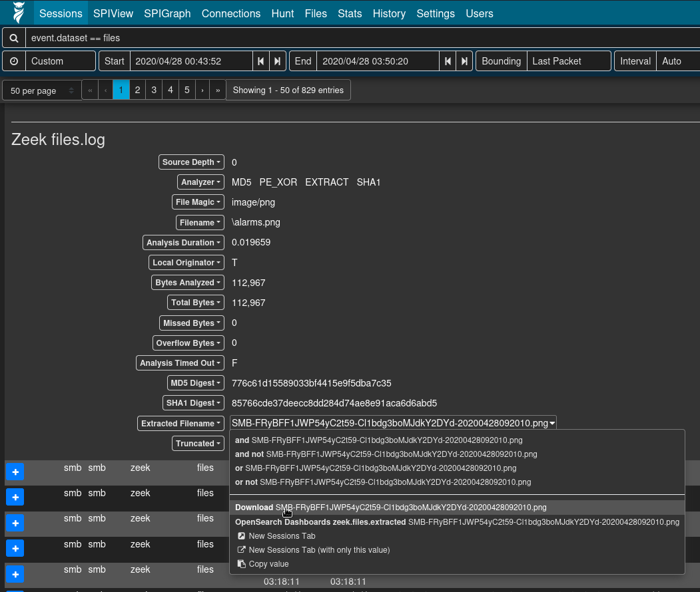
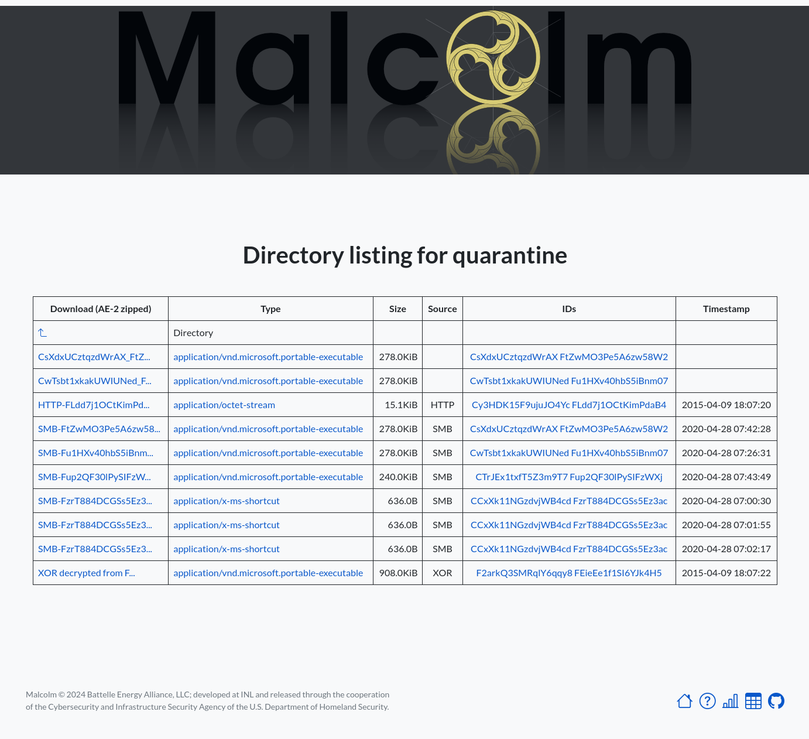

# Automatic file extraction and scanning

* [Automatic file extraction and scanning](#ZeekFileExtraction)
    - [User interface](#ZeekFileExtractionUI)

Malcolm can leverage Zeek's knowledge of network protocols to automatically detect file transfers and extract those files from PCAPs as Zeek processes them. This behavior can be enabled globally by modifying the `ZEEK_EXTRACTOR_MODE` [variable in `zeek.env`](malcolm-config.md#MalcolmConfigEnvVars), or on a per-upload basis for PCAP files uploaded via the [browser-based upload form](upload.md#Upload) when **Analyze with Zeek** is selected.

To specify which files should be extracted, the following values are acceptable in `ZEEK_EXTRACTOR_MODE`:

* `none`: no file extraction
* `interesting`: extraction of files with mime types of common attack vectors
* `notcommtxt`: extraction of all files except common plain text files
* `mapped`: extraction of files with recognized mime types
* `known`: extraction of files for which any mime type can be determined
* `all`: extract all files

Extracted files can be examined through any of the following methods:

* submitting file hashes to [**VirusTotal**](https://www.virustotal.com/en/#search); to enable this method, specify the `VTOT_API2_KEY` [environment variable in `zeek-secret.env`](malcolm-config.md#MalcolmConfigEnvVars)
* scanning files with [**ClamAV**](https://www.clamav.net/); to enable this method, set the `EXTRACTED_FILE_ENABLE_CLAMAV` [environment variable in `zeek.env`](malcolm-config.md#MalcolmConfigEnvVars) to `true`
* scanning files with [**Yara**](https://github.com/VirusTotal/yara); to enable this method, set the `EXTRACTED_FILE_ENABLE_YARA` [environment variable in `zeek.env`](malcolm-config.md#MalcolmConfigEnvVars) to `true`
* scanning PE (portable executable) files with [**Capa**](https://github.com/fireeye/capa); to enable this method, set the `EXTRACTED_FILE_ENABLE_CAPA` [environment variable in `zeek.env`](malcolm-config.md#MalcolmConfigEnvVars) to `true`

Files flagged via any of these methods will be logged as Zeek `signatures.log` entries, and can be viewed in the **Signatures** dashboard in OpenSearch Dashboards.

The `EXTRACTED_FILE_PRESERVATION` [environment variable in `zeek.env`](malcolm-config.md#MalcolmConfigEnvVars) determines the behavior for preservation of Zeek-extracted files:

* `quarantined`: preserve only flagged files in `./zeek-logs/extract_files/quarantine`
* `all`: preserve flagged files in `./zeek-logs/extract_files/quarantine` and all other extracted files in `./zeek-logs/extract_files/preserved`
* `none`: preserve no extracted files

The `EXTRACTED_FILE_HTTP_SERVER_…` [environment variables in `zeek.env` and `zeek-secret.env`](malcolm-config.md#MalcolmConfigEnvVars) configure access to the Zeek-extracted files path through the means of a simple HTTPS directory server accessible at **https://localhost/extracted-files/** if connecting locally. Beware that Zeek-extracted files may contain malware. As such, these files may be optionally ZIP archived (without a password or password-protected according to the [WinZip AES encryption specification](https://www.winzip.com/en/support/aes-encryption/)) or encrypted (to be decrypted using `openssl`, e.g., `openssl enc -aes-256-cbc -d -in example.exe.encrypted -out example.exe`) upon download. In other words:

* to disable the extracted files server:
    - `EXTRACTED_FILE_HTTP_SERVER_ENABLE=false`
* to enable the extracted file server:
    - `EXTRACTED_FILE_HTTP_SERVER_ZIP=true`
    - downloaded files are zipped, without a password:
        + `EXTRACTED_FILE_HTTP_SERVER_ZIP=true`
        + `EXTRACTED_FILE_HTTP_SERVER_KEY=`
    - downloaded files are zipped, [AES-encrypted](https://www.winzip.com/en/support/aes-encryption/) with a password:
        + `EXTRACTED_FILE_HTTP_SERVER_ZIP=true`
        + `EXTRACTED_FILE_HTTP_SERVER_KEY=xxxxxxxxxxxxx`
    - downloaded files are OpenSSL AES-256-CBC-compatibly encrypted:
        + `EXTRACTED_FILE_HTTP_SERVER_ZIP=false`
        + `EXTRACTED_FILE_HTTP_SERVER_KEY=xxxxxxxxxxxxx`
    - downloaded files are downloaded as-is, without archival or compression:
        + `EXTRACTED_FILE_HTTP_SERVER_ZIP=false`
        + `EXTRACTED_FILE_HTTP_SERVER_KEY=`

## User interface

The files extracted by Zeek and the data about those files can be accessed through several of Malcolm's user interfaces.

* The [Files dashboard](dashboards.md#PrebuiltVisualizations) summarizes the file transfers observed in network traffic. The **Extracted File Downloads** table provides download links for the extracted files matching the currently applied filters. Note that the presence of these links don't necessarily imply that the files they represent are available: depending on factors such as file preservation settings (above) and retention policies, files that were extracted and scanned may no longer be available. When this is the case, clicking one of the file download links will result in a "file not found" error. If one of these links refers to a file that was extracted and scanned on a [Hedgehog Linux](hedgehog.md) network sensor, Malcolm must be able to communicate with that sensor in order to retrieve and download the file.

* Viewing logs from Zeek's `files.log` (e.g., `event.provider == zeek && event.dataset == files`), the Arkime [session](arkime.md#ArkimeSessions) detail's **Extracted Filename URL** field can be clicked for a context menu item to download the extracted file, if it was preserved as described above.

* Malcolm provides an extracted files directory listing to browse and download Zeek-extracted files. This interface is available at **https://localhost/extracted-files/** if connecting locally. The Zeek `uid` and `fuid` values associated with these files and the sessions from which they were extracted are listed in the **IDs** column as filter links back into Dashboards. Similarly, files extracted and preserved on a [Hedgehog Linux](hedgehog.md) network sensor can be accessed at **https://localhost/hh-extracted-files/X.X.X.X/**, where **X.X.X.X** represents the IP address or hostname of the sensor (e.g., `https://localhost/hh-extracted-files/192.168.122.57/` if the sensor's IP address were 192.168.122.57).

