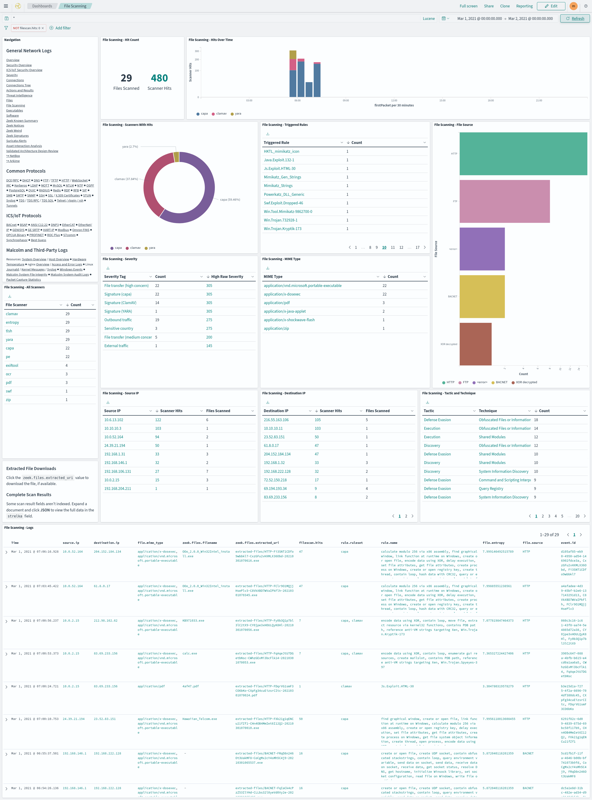

# <a name="ZeekFileExtraction"></a>Automatic file extraction and scanning

* [Automatic file extraction and scanning](#ZeekFileExtraction)
    - [User interface](#ZeekFileExtractionUI)

Malcolm can leverage Zeek's knowledge of network protocols to automatically detect file transfers and extract those files from PCAPs as Zeek processes them. This behavior can be enabled globally by modifying the `ZEEK_EXTRACTOR_MODE` [variable in `zeek.env`](malcolm-config.md#MalcolmConfigEnvVars), or on a per-upload basis for PCAP files uploaded via the [browser-based upload form](upload.md#Upload) when **Analyze with Zeek** is selected.

To specify which files should be extracted, the following values are acceptable in `ZEEK_EXTRACTOR_MODE`:

* `none`: no file extraction
* `interesting`: extraction of files with mime types of common attack vectors (recommended)
* `notcommtxt`: extraction of all files except common plain text files
* `all`: extract all files
* `mapped`: extraction of files with recognized mime types
* `known`: extraction of files for which any mime type can be determined

Depending on the volume of files extracted from network traffic, file scanning can be resource-intensive. When enabled, it is recommended to select `interesting` or `notcommtxt` unless running on a high-performance system.

Extracted files are scanned by [Strelka](https://target.github.io/strelka/#/), an [open-source](https://github.com/target/strelka) "real-time, container-based file scanning system used for threat hunting, threat detection, and incident response."

Individual Strelka [scanners](https://target.github.io/strelka/#/?id=scanner-list) can be toggled or configured by editing [`strelka/config/backend/backend.yaml`]({{ site.github.repository_url }}/blob/{{ site.github.build_revision }}/strelka/config/backend/backend.yaml). To disable a scanner, comment it out by adding `#` to each line of its section under `scanners:`, including the scanner's name:

```yaml
⋯
scanners:
  ⋯
#  'ScanDocx':
#    - positive:
#        flavors:
#          - 'application/vnd.openxmlformats-officedocument.wordprocessingml.document'
#          - "docx_file"
#      priority: 5
#      options:
#        extract_text: False
  ⋯
```

To enable a scanner, uncomment its section:

```yaml
⋯
scanners:
  ⋯
  'ScanDocx':
    - positive:
        flavors:
          - 'application/vnd.openxmlformats-officedocument.wordprocessingml.document'
          - "docx_file"
      priority: 5
      options:
        extract_text: False
  ⋯
```

It's recommended to validate this configuration file after making changes to it. This could be done using an [online YAML validator](https://www.yamllint.com/) or locally depending on available tools:

* `python3 -c 'import sys, yaml; yaml.safe_load(sys.stdin)' < ./strelka/config/backend/backend.yaml`
* `ruby -ryaml -e "YAML.load_file('./strelka/config/backend/backend.yaml')"`

Each scanner may have configurable options; see the [scanner list](https://target.github.io/strelka/#/?id=scanner-list) for more details. Other Strelka-related configuration files can be found under [`strelka/config/`]({{ site.github.repository_url }}/blob/{{ site.github.build_revision }}/strelka/config/). Consult the [Strelka documentation](https://target.github.io/strelka/#/?id=configuration-files) for more details.

For the [**YARA**](https://github.com/VirusTotal/yara) scanner, Malcolm's [default YARA rule set]({{ site.github.repository_url }}/blob/{{ site.github.build_revision }}/strelka/backend/yara_rules_setup.sh) and/or [user-defined custom YARA rules](custom-rules.md#YARA) are used for scanning.

The `RULES_UPDATE_ENABLED` [environment variable](malcolm-config.md#MalcolmConfigEnvVars) in [`pipeline.env`]({{ site.github.repository_url }}/blob/{{ site.github.build_revision }}/config/pipeline.env) controls whether or not to regularly pull signature/rule definitions from the internet for file scanning engines, including [**ClamAV**](https://www.clamav.net/) signatures and Malcolm's [default YARA rule set]({{ site.github.repository_url }}/blob/{{ site.github.build_revision }}/strelka/backend/yara_rules_setup.sh).

The `FILESCAN_PRESERVATION` [environment variable](malcolm-config.md#MalcolmConfigEnvVars) in [`filescan.env`]({{ site.github.repository_url }}/blob/{{ site.github.build_revision }}/config/filescan.env) determines the behavior for preservation of scanned files:

* `quarantined`: preserve only files in `./zeek-logs/extract_files` that are flagged by the YARA, ClamAV, or [**Capa**](https://github.com/fireeye/capa) scanners
* `all`: preserve all extracted files  files in `./zeek-logs/extract_files`
* `none`: preserve no extracted files

The `FILESCAN_HTTP_SERVER_…` [environment variables](malcolm-config.md#MalcolmConfigEnvVars) in [`filescan.env` and `filescan-secret.env`]({{ site.github.repository_url }}/blob/{{ site.github.build_revision }}/config/) configure browsing and download access to the scanned files through the means of a simple HTTPS directory server accessible at **https://localhost/extracted-files/** if connecting locally. Beware that these files may contain malware. As such, these files may be optionally ZIP archived (without a password or password-protected according to the [WinZip AES encryption specification](https://www.winzip.com/en/support/aes-encryption/)) or encrypted (to be decrypted using `openssl`, e.g., `openssl enc -aes-256-cbc -d -in example.exe.encrypted -out example.exe`) upon download. In other words:

* to disable the extracted files server:
    - `FILESCAN_HTTP_SERVER_ENABLE=false`
* to enable the extracted file server:
    - `FILESCAN_HTTP_SERVER_ZIP=true`
    - downloaded files are zipped, without a password:
        + `FILESCAN_HTTP_SERVER_ZIP=true`
        + `FILESCAN_HTTP_SERVER_KEY=`
    - downloaded files are zipped, [AES-encrypted](https://www.winzip.com/en/support/aes-encryption/) with a password:
        + `FILESCAN_HTTP_SERVER_ZIP=true`
        + `FILESCAN_HTTP_SERVER_KEY=xxxxxxxxxxxxx`
    - downloaded files are OpenSSL AES-256-CBC-compatibly encrypted:
        + `FILESCAN_HTTP_SERVER_ZIP=false`
        + `FILESCAN_HTTP_SERVER_KEY=xxxxxxxxxxxxx`
    - downloaded files are downloaded as-is, without archival or compression:
        + `FILESCAN_HTTP_SERVER_ZIP=false`
        + `FILESCAN_HTTP_SERVER_KEY=`

## <a name="ZeekFileExtractionUI"></a>User interface

The files extracted by Zeek and the data about those files can be accessed through several of Malcolm's user interfaces.

* The [**File Scanning** dashboard](dashboards.md#PrebuiltVisualizations) summarizes the results of the file scans performed by Strelka.
    * Click a `zeek.files.extracted_uri` value  in the **File Scanning - Logs** table to download the associated file, if available. Note that the presence of these links don't necessarily imply that the files they represent are available: depending on factors such as file preservation settings (above) and retention policies, files that were extracted and scanned may no longer be available. When this is the case, clicking one of the file download links will result in a "file not found" error. If one of these links refers to a file that was extracted and scanned on a [Hedgehog Linux](hedgehog.md) network sensor, Malcolm must be able to communicate with that sensor in order to retrieve and download the file.
    * Some scan result fields aren't indexed. Expand a document and click **JSON** to view the full scan result's data in the `strelka` field.




* The [Files dashboard](dashboards.md#PrebuiltVisualizations) summarizes the file transfers observed in network traffic.
    * The **Extracted File Downloads** table provides download links for the extracted files matching the currently applied filters, if it was preserved as described above.


* Viewing logs from Zeek's `files.log` (e.g., `event.provider == zeek && event.dataset == files`) or the file scan results (e.g., `event.provider == filescan`), the Arkime [session](arkime.md#ArkimeSessions) detail's **Extracted Filename URL** field can be clicked for a context menu item to download the extracted file, if it was preserved as described above.


* Malcolm provides an extracted files directory listing to browse and download Zeek-extracted files. This interface is available at **https://localhost/extracted-files/** if connecting locally. The Zeek `uid` and `fuid` values associated with these files and the sessions from which they were extracted are listed in the **IDs** column as filter links back into Dashboards. Similarly, files extracted and preserved on a [Hedgehog Linux](hedgehog.md) network sensor can be accessed at **https://localhost/hh-extracted-files/X.X.X.X/**, where **X.X.X.X** represents the IP address or hostname of the sensor (e.g., `https://localhost/hh-extracted-files/192.168.122.57/` if the sensor's IP address were 192.168.122.57).


