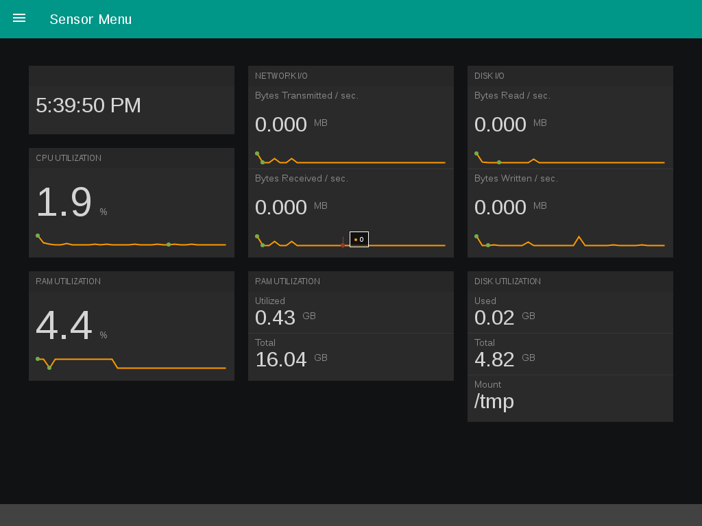
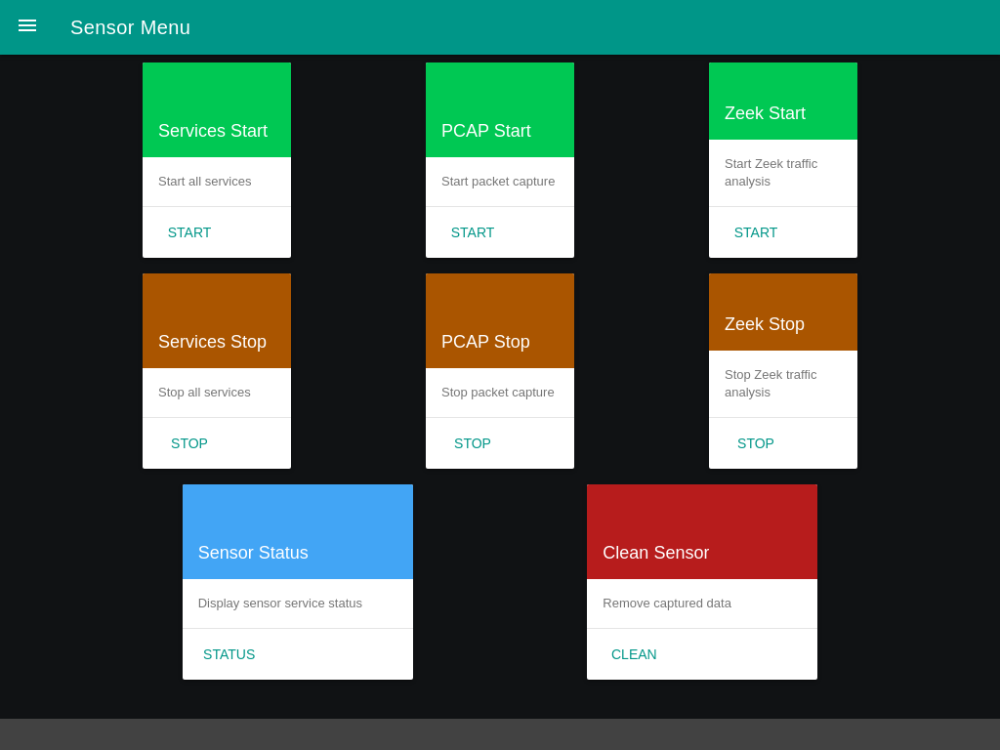

# Boot

Each time the sensor boots, a grub boot menu will be shown briefly, after which the sensor will proceed to load.

## Kiosk mode

The sensor automatically logs in as the sensor user account and runs in **kiosk mode**, which is intended to show an at-a-glance view of system resource utilization. Clicking the **☰** icon allows users to switch between the resource statistics view and the services view.

The kiosk's services screen (designed with large clickable labels for small portable touch screens) can be used to start and stop essential services, get a status report of the currently running services, and clean all captured data from the sensor.

