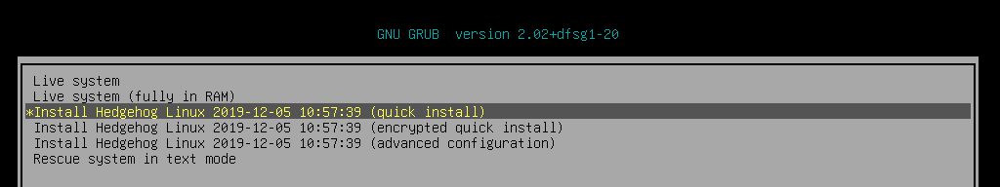

# Sensor installation

## Image boot options

The Hedgehog Linux installation image, when provided on an optical disc, USB thumb drive, or other removable medium, can be used to install or reinstall the sensor software.

The boot menu of the sensor installer image provides several options:

* **Live system** and **Live system (fully in RAM)** may also be used to run the sensor in a "live USB" mode without installing any software or making any persistent configuration changes on the sensor hardware.
* **Install Hedgehog Linux** and **Install Hedgehog Linux (encrypted)** are used to [install the sensor](#HedgehogInstaller) onto the current system. Both selections install the same operating system and sensor software, the only difference being the **encrypted** option encrypts the hard disks with a password (provided in a subsequent step during installation) that must be provided each time the sensor boots. There is some CPU overhead involved in an encrypted installation, so it is recommended that encrypted installations only be used for mobile installations (e.g., on a sensor that may be shipped or carried for an incident response) and that the unencrypted option be used for fixed sensors in secure environments.
* **Install Hedgehog Linux (advanced configuration)** allows users to configure installation fully using all of the [Debian installer](https://www.debian.org/releases/stable/amd64/) settings and should only be selected for advanced users very familiar with Linux installation processes
* **Rescue system** is included for debugging and/or system recovery and should not be needed in most cases.

## Installer

The sensor installer is designed to require as little user input as possible. For this reason, there are NO user prompts or confirmations about partitioning and reformatting hard disks for use by the sensor. The  installer assumes all non-removable storage media (eg., SSD, HDD, NVMe, etc.) are available for use and ⛔🆘😭💀 ***will partition and format them without warning*** 💀😭🆘⛔.

The installer will ask for a few pieces of information prior to installing the sensor operating system:

* **Root password** – a password for the privileged root account, which is rarely needed (only during the configuration of the sensors network interfaces and setting the sensor host name)
* **User password** – a password for the non-privileged sensor account under which the various sensor capture and forwarding services run
* **Encryption password** (optional) – if the encrypted installation option was selected at boot time, the encryption password must be entered every time the sensor boots

Each of these passwords must be entered twice to ensure they were entered correctly.

After the passwords have been entered, the installer will proceed to format the system drive and install Hedgehog Linux.

At the end of the installation process, the installer will prompt users with few self-explanatory yes/no questions:

* **Disable IPv6?**
* **Automatically login to the GUI session?**
* **Should the GUI session be locked due to inactivity?**
* **Display the [Standard Mandatory DoD Notice and Consent Banner](https://www.stigviewer.com/stig/application_security_and_development/2018-12-24/finding/V-69349)?** *(only applies when installed on U.S. government information systems)*
* **Allow SSH password authentication?** *(Caution: password authentication is less secure than public/private key pairs)*

Following these prompts, the installer will reboot and Hedgehog Linux will boot.