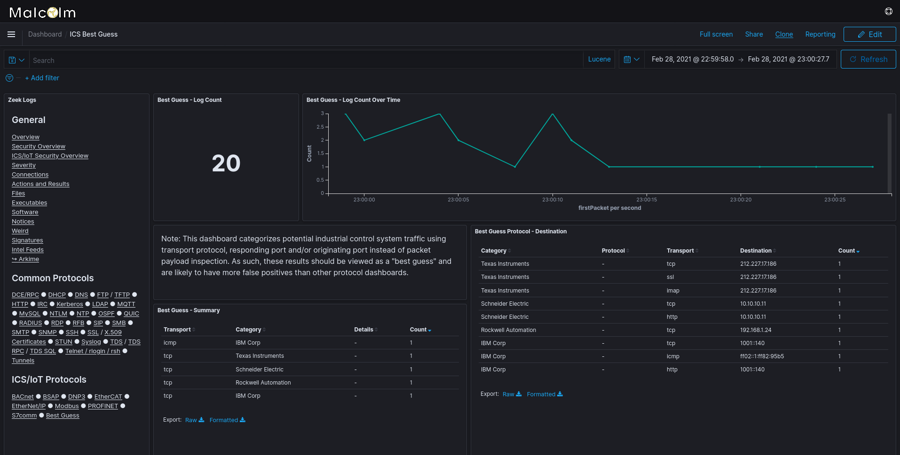

# "Best Guess" Fingerprinting for ICS Protocols

There are many ICS (industrial control systems) protocols. While Malcolm's collection of [protocol parsers](protocols.md#Protocols) includes a number of them, many, particularly those that are proprietary or less common, are unlikely to be supported with a full parser in the foreseeable future.

In an effort to help identify more ICS traffic, Malcolm can use "best guess" method based on transport protocol (e.g., TCP or UDP) and port(s) to categorize potential traffic communicating over some ICS protocols without full parser support. This feature involves a [mapping table]({{ site.github.repository_url }}/blob/{{ site.github.build_revision }}/zeek/config/guess_ics_map.txt) and a [Zeek script]({{ site.github.repository_url }}/blob/{{ site.github.build_revision }}/zeek/config/guess.zeek) to look up the transport protocol and destination and/or source port to make a best guess at whether a connection belongs to one of those protocols. These potential ICS communications are categorized by vendor where possible.

Naturally, these lookups could produce false positives, so these connections are displayed in their own dashboard (the **Best Guess** dashboard found under the **ICS** section of Malcolm's [OpenSearch Dashboards](dashboards.md#DashboardsVisualizations) navigation pane). Values such as IP addresses, ports, or UID can be used to [pivot to other dashboards](arkime.md#ZeekArkimeFlowCorrelation) to investigate further.

This feature is disabled by default, but it can be enabled by clearing (setting to `''`) the value of the `ZEEK_DISABLE_BEST_GUESS_ICS` [environment variable in `zeek.env`](malcolm-config.md#MalcolmConfigEnvVars).