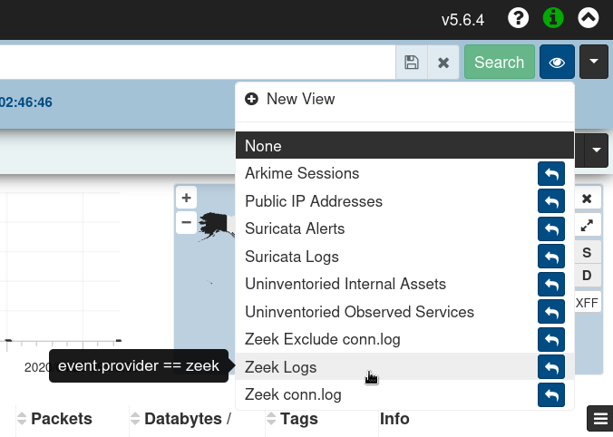

# <a name="InstallationExample"></a> End-to-end Malcolm and Hedgehog Linux ISO Installation

This document outlines how to install [Malcolm]({{ site.github.repository_url }}) and [Hedgehog Linux](hedgehog.md) using the project's installer ISOs. These instructions apply to installing this software both on a "bare metal" system or in a virtual machine environment using VMware, VirtualBox, QEMU/KVM, etc.

The Malcolm and Hedgehog Linux installers as described in these instructions are intended to be used to **replace** the existing operating system (if any) of the respective systems onto which they are installed; and, as such, are designed to require as little user input as possible. For this reason, there are NO user prompts or confirmations about partitioning and reformatting hard disks for use by the operating system. The installer assumes that all non-removable storage media (eg., SSD, HDD, NVMe, etc.) are available for use and ⛔🆘😭💀 ***will partition and format them without warning*** 💀😭🆘⛔.

In contrast to using the ISO installer, Malcolm can also be installed on any x86-64 (also known as x64, x86_64, AMD64, and Intel 64) or AArch64 (also known as ARM64) platform capable of running Docker or Podman. See the [installation example using Ubuntu 24.04 LTS](ubuntu-install-example.md#InstallationExample) for that method of installation and configuration, or [Windows host system configuration](host-config-windows.md#HostSystemConfigWindows) and [macOS host system configuration](host-config-macos.md#HostSystemConfigMac) for those platforms.

### <a name="TableOfContents"></a> Table of Contents

* [Obtaining the Installation ISOs](#ISODownload)
* ["Burning" the Installation ISOs to USB Flash Drive](#ISOBurning)
* [Booting the Installation Media](#BootUSB)
* [Malcolm Installation and Configuration](#MalcolmInstallAndConfig)
    - [ISO Installation](#ISOInstallMalcolm)
    - [Desktop Environment](#MalcolmDesktop)
    - [Configure Network Interfaces](#NetConf)
    - [Configure Hostname, Time Sync, and SSH Access](#MalcolmTimeSync)
    - [Configure Malcolm](#MalcolmConfig)
        + [Malcolm Configuration Menu Items](#MalcolmConfigItems)
    - [Setting up Authentication](#MalcolmAuthSetup)
* [Hedgehog Linux Installation and Configuration](#HedgehogInstallAndConfig)
    - [Configuring Communication Between Hedgehog and Malcolm](#HedgehogCommConfig)
* [Verifying Traffic Capture and Forwarding](#Verify)
* [Tuning Live Analysis](live-analysis.md#LiveAnalysisTuning)

## <a name="ISODownload"></a> Obtaining the Installation ISOs

Please see [**Downloading Malcolm**](download.md#DownloadMalcolm) for instructions on how to obtain the Malcolm and Hedgehog Linux installation ISOs.

As an alternative to the official release ISOs, instructions are provided for building the [Malcolm installer ISO](malcolm-iso.md#ISOBuild) and Hedgehog Linux installer ISO (Malcolm's dedicated [network sensor appliance OS](hedgehog.md)) from scratch.

## <a name="ISOBurning"></a> "Burning" the Installation ISOs to USB Flash Drive

Various methods can be used to write the contents of an installer ISO image to a USB flash drive. One simple free and open-source application for doing so is [Etcher](https://www.balena.io/etcher), which can be used on Windows, macOS, and Linux platforms.

Alternatively, instructions specific to a particular operating system may be found online (e.g., [Arch Linux](https://wiki.archlinux.org/title/USB_flash_installation_medium), [Debian Linux](https://www.debian.org/releases/stable/amd64/ch04s03.en.html), [Ubuntu Linux](https://ubuntu.com/tutorials/create-a-usb-stick-on-ubuntu#1-overview)).

Using one of these methods, write the Malcolm and Hedgehog Linux installer ISOs to two 8GB or larger USB flash drives, respectively.

Alternatively, the ISO images could be burned to writable optical media (e.g., DVD±R). The Malcolm installer will likely need to be written to DVD±R DL ("dual layer" or "double layer") media as the image exceeds the 4.7 GB storage provided by standard DVDs.


*Using Etcher on macOS*


*Using dd on Linux*

## <a name="BootUSB"></a> Booting the Installation Media

The ISO installers are compatible with systems that support EFI-mode and legacy (BIOS) booting. The procedure for configuring a system's firmware to allow booting from USB or optical media varies from manufacturer to manufacturer. Manufacturers typically provide a "one-time boot" menu upon a specific keypress (e.g., F12 for Dell, F9 for HP, etc.). If needed, consult the documentation provided by the hardware manufacturer on how to access the boot options menu and boot from the newly-burned USB flash media or DVD±R.


*An example of an EFI boot manager in QEMU*


*An example of a BIOS boot options menu in QEMU*

## <a name="MalcolmInstallAndConfig"></a> Malcolm Installation and Configuration

### <a name="ISOInstallMalcolm"></a> ISO Installation

Upon Booting the Malcolm installation ISO, users are presented with the following **Boot menu**. Use the arrow keys to select **Install Malcolm**, and press Enter.


*The first screen of the installer*

The next screen of the installer presents the following options relevant to installation:

* **Quick Install** - Installs Malcolm without full disk encryption using default partitioning.
* **Quick Install** (no LVM) - The same as **Quick Install**, only does not use Logical Volume Management (LVM) framework.
* **Encrypted Quick Install** - Installs Malcolm with full disk encryption using default partitioning. Users will be prompted for a password for full disk encryption during installation which must be entered each time the system boots.
* **Expert Install** - Allows users to configure the options of the [Debian](https://wiki.debian.org/DebianInstaller)-based installation system. Only recommended when needed for expert Linux users.
* **Virtual Machine Single Partition Quick Install** - The same as **Quick Install** except that all system files are stored in a single partition. Use this option (or the equivalent **no LVM** option) when installing Malcolm onto a virtual machine.
* **Virtual Machine Single Partition Quick Install (no LVM)** - The same as **Virtual Machine Single Partition Quick Install**, only does not use Logical Volume Management (LVM) framework. Use this option (or the preceding one) when installing Malcolm onto a virtual machine.


*The **Install Malcolm** menu*

After users select the type of Malcolm install to perform, the installer will ask for several pieces of information prior to installing the Malcolm base operating system:

* **Hostname** - the name of the Malcolm system used to identify itself on the network
* **Domain name** - (optional) the name of the local network domain
* **Root password** – (optional) a password for the privileged root account that is rarely needed; if unspecified, the non-privileged user account will be added to the `sudo` group
* **User name** - the name for the non-privileged service account user account under which the Malcolm processes run
* **User password** – a password for the non-privileged user account
* **Encryption password** – (optional) if the encrypted installation option was selected at boot, the encryption password must be entered every time the system boots


After the passwords have been entered, the installer will proceed to format the system drive and install Malcolm.


At the end of the installation process, users will be prompted with a few self-explanatory yes/no questions:

* **Format non-OS drive(s) for artifact storage?** *(Note that if the [**Encrypted Quick Install**](#ISOInstallMalcolm) installation option was chosen, any non-OS drives formatted for artifact storage will also be configured with full-disk encryption)*
* **Disable IPv6?**
* **Automatically login to the GUI session?**
* **Should the GUI session be locked due to inactivity?**
* **Display the [Standard Mandatory DoD Notice and Consent Banner](https://www.stigviewer.com/stig/application_security_and_development/2018-12-24/finding/V-69349)?** *(only applies when installed on U.S. government information systems)*
* **Allow SSH password authentication?** *(Caution: password authentication is less secure than public/private key pairs)*

Following these prompts, the installer will reboot and the Malcolm base operating system will boot.

The Malcolm installer does not require an Internet connection to complete successfully. If the installer prompts users to configure network connectivity, they may choose "do not configure the network at this time."

### <a name="MalcolmDesktop"></a> Desktop Environment

The Malcolm base operating system is a [hardened](hardening.md#Hardening) Linux installation based on the current [stable release](https://wiki.debian.org/DebianStable) of [Debian](https://www.debian.org/) [running](https://wiki.debian.org/Xfce) the [XFCE desktop environment](https://www.xfce.org/). The system has been preloaded with all of the [components](components.md#Components) that make up Malcolm.

[NetworkManager](https://wiki.debian.org/NetworkManager) can be used to configure networking for Malcolm. NetworkManager can be configured by clicking the 🖧 (networked computers) icon in the system tray in the upper-right, or right-clicking the icon and selecting **Edit Connections...** to modify the properties of a given connection.

Display resolution should be detected and adjusted automatically. To make changes to display properties, click the **Applications** menu and select **Settings** → **Display**.

The panel bordering the top of the Malcolm desktop is home to a number of useful shortcuts:


### <a name="NetConf"></a>Configure Network Interfaces

The Malcolm base operating system does not use Dynamic Host Configuration Protocol (DHCP) to assign IP addresses to any ethernet interfaces by default. To configure DHCP for network interfaces intended for access and management, click the icon for the NetworkManager applet in the system tray and select **Auto Ethernet**:


Alternatively, to configure a network interface with a static IP address (recommended):

1. Right-click the icon for the NetworkManager applet in the system tray and select **Edit Connections**


2. Click the plus ➕ icon on the **Network Connections** dialog


3. Select **Ethernet** for the Connection Type


4. On the **Ethernet** tab, select the **Device** (e.g., `eth0`, `enp1s0`, etc.) on


5. On the **IPv4 Settings** tab, set the method **Manual** and add the address/netmask/gateway and specify DNS servers, if applicable


6. Click **Save**

All network interfaces intended for **capture only** should have their method set to **Disabled** under the **IPv4 Settings** tab:


### <a name="MalcolmTimeSync"></a> Configure Hostname, Time Sync, and SSH Access

If users wish to change Malcolm's hostname or configure system time synchronization, they can open a terminal (the icon immediately to the right of the **Applications** menu icon at the top of the Malcolm desktop) and run `system-quickstart` then enter the user (if the user is part of the `sudo` group) or `root` password.

Here users can configure Malcolm to keep its time synchronized with either an NTP server (using the NTP protocol), another [Malcolm]({{ site.github.repository_url }}) aggregator or another HTTP/HTTPS server. On the next dialog, choose the time synchronization method to configure.


If **htpdate** is selected, users will be prompted to enter the URL of an HTTP/HTTPS server (for another Malcolm instance, either port `443` or port `9200` over `https` may be used) and the time synchronization check frequency in minutes. A test connection will be made to determine if the time can be retrieved from the server.


If *ntpdate* is selected, users will be prompted to enter the IP address or hostname of the NTP server.


Upon configuring time synchronization, a "Time synchronization configured successfully!" message will be displayed, after which users will be returned to the welcome screen. Select **Cancel**.

This same utility can be used to enable SSH password authentication. *(Caution: password authentication is less secure than public/private key pairs.)*

### <a name="MalcolmConfig"></a> Configure Malcolm

The first time the Malcolm base operating system boots the **Malcolm Configuration** wizard will start automatically. This same configuration script can be run again later by running [`./scripts/configure`](malcolm-config.md#ConfigAndTuning) from the Malcolm installation directory, or clicking the **Configure Malcolm** 🔳 icon in the top panel.


The configuration script's dialog- and terminal-based user interfaces identical configuration workflows with only slightly different presentations. This document will use the terminal-based ("TUI") interface, which can be forced by running `install.py` with the `--tui` flag, as opposed to the dialog-based ("DUI") interface, which can be forced with the `--dui` flag.

Users will first be presented with a Malcolm logo splash screen unless the `--skip-splash` flag is specified.
```
user@host:~/Malcolm$ ./scripts/configure

                                                     Welcome To

 ██████   ██████        █████        ████              ██████████████     █████     ████              ██████   ██████
░░██████ ██████       ███░░░███     ░░███             ░░███░░░░░░░░░██   ███  ██   ░░███             ░░██████ ██████ 
 ░███░█████░███      ███   ░░███     ░███              ░███        ░░   █████████   ░███              ░███░█████░███ 
 ░███░░███ ░███     █████████████    ░███              ░███             ████ ████   ░███              ░███░░███ ░███ 
 ░███ ░░░  ░███    ░███░░░░░░░███    ░███              ░███             ████ ████   ░███              ░███ ░░░  ░███ 
 ░███      ░███    ░███      ░███    ░███              ░███             █ ███████   ░███              ░███      ░███ 
 ░███      ░███    ░███      ░███    ░███              ░███         ██  ██████ ██   ░███              ░███      ░███ 
 █████     █████   █████     █████   ██████████████    ██████████████    ███████    ██████████████    █████     █████
░░░░░     ░░░░░   ░░░░░     ░░░░░   ░░░░░░░░░░░░░░    ░░░░░░░░░░░░░░      █████    ░░░░░░░░░░░░░░    ░░░░░     ░░░░░ 

                                       v{{ site.malcolm.version }}. Press any key to continue...
```

The items in the **Malcolm Configuration Menu** are arranged hierarchically, with the current setting displayed next to each option. For the most part, each option in the menu corresponds to an [environment variable](malcolm-config.md#MalcolmConfigEnvVars) stored in the [`./config`]({{ site.github.repository_url }}/blob/{{ site.github.build_revision }}/config) directory, used by Malcolm to determine runtime behavior.

```
--- Malcolm Configuration Menu ---
Select an item number to configure, or an action:
├── 1. Container Runtime (current: docker)
│   ├── 2. Container Network Name (current: empty)
│   ├── 3. Malcolm Restart Policy (current: No)
│   ├── 4. Process Group ID (current: 1000)
│   └── 5. Process User ID (current: 1000)
├── 6. Run Profile (current: malcolm)
│   ├── 7. Dark Mode for Dashboards (current: Yes)
│   ├── 8. Extra Tags (current: [])
│   ├── 9. Forward AIDE Results (current: No)
│   ├── 10. Forward Audit Log (current: No)
│   ├── 11. Forward CPU Utilization (current: No)
│   ├── 12. Forward Disk Operation Statistics (current: No)
│   ├── 13. Forward Disk Utilization (current: No)
│   ├── 14. Forward Kernel Messages (current: No)
│   ├── 15. Forward Logs to Remote Secondary Store (current: No)
│   ├── 16. Forward Memory Utilization (current: No)
│   ├── 17. Forward Network Activity (current: No)
│   ├── 18. Forward Systemd Journal Logs (current: No)
│   ├── 19. Forward Thermal Readings (current: No)
│   ├── 20. Logstash Memory (current: 3g)
│   ├── 21. Logstash Workers (current: 3)
│   ├── 22. OpenSearch Memory (current: 24g)
│   └── 23. Primary Document Store (current: opensearch-local)
├── 24. Require HTTPS Connections (current: No)
├── 25. IPv4 for nginx Resolver Directive (current: Yes)
├── 26. IPv6 for nginx Resolver Directive (current: No)
├── 27. Traefik Labels (current: No)
├── 28. Use Default Storage Location (current: Yes)
├── 29. Clean Up Artifacts (current: Yes)
│   ├── 30. Delete Old Indices (current: Yes)
│   │   ├── 31. Index Prune Threshold (current: 1T)
│   │   └── 32. Prune Indices by Name (current: No)
│   └── 33. Delete Old PCAP (current: Yes)
│       └── 34. Delete PCAP Threshold (current: 5%)
├── 35. Enable Arkime Index Management (current: No)
├── 36. Enable Arkime Analysis (current: Yes)
│   ├── 37. Allow Arkime WISE Configuration (current: No)
│   └── 38. Enable Arkime WISE (current: Yes)
├── 39. Enable Suricata Analysis (current: Yes)
│   └── 40. Enable Suricata Rule Updates (current: Yes)
├── 41. Enable Zeek Analysis (current: Yes)
│   ├── 42. Enable Zeek File Extraction (current: Yes)
│   │   └── 43. File Extraction Mode (current: interesting)
│   │       ├── 44. Extracted File Percent Threshold (current: 0)
│   │       ├── 45. Extracted File Size Threshold (current: 100G)
│   │       ├── 46. File Preservation (current: quarantined)
│   │       ├── 47. Preserved Files HTTP Server (current: Yes)
│   │       │   ├── 48. Downloaded Preserved File Password (current: ********)
│   │       │   └── 49. Zip Downloads (current: Yes)
│   │       ├── 50. Scan with capa (current: Yes)
│   │       ├── 51. Scan with ClamAV (current: Yes)
│   │       ├── 52. Scan with YARA (current: Yes)
│   │       ├── 53. Update Scan Rules (current: Yes)
│   │       └── 54. VirusTotal API Key (current: empty)
│   ├── 55. Enable Zeek ICS/OT Analyzers (current: Yes)
│   │   └── 56. Enable Zeek ICS "Best Guess" (current: Yes)
│   └── 57. Use Threat Feeds for Zeek Intelligence (current: Yes)
│       ├── 58. Cron Expression for Threat Feed Updates (current: 0 0 * * *)
│       ├── 59. Intel::item_expiration Timeout (current: -1min)
│       ├── 60. Pull Threat Intelligence Feeds on Startup (current: Yes)
│       └── 61. Threat Indicator "Since" Period (current: 7 days ago)
├── 62. Enrich with Reverse DNS Lookups (current: Yes)
├── 63. Enrich with Manufacturer (OUI) Lookups (current: Yes)
├── 64. Enrich with Frequency Scoring (current: Yes)
├── 65. NetBox Mode (current: Local)
│   ├── 66. Auto-Create Subnet Prefixes (current: Yes)
│   ├── 67. Auto-Populate NetBox Inventory (current: Yes)
│   ├── 68. NetBox Enrichment (current: Yes)
│   ├── 69. NetBox IP Autopopulation Filter (current: empty)
│   └── 70. NetBox Site Name (current: Malcolm)
├── 71. Expose Malcolm Service Ports (current: Yes)
├── 72. Network Traffic Node Name (current: host)
└── 73. Capture Live Network Traffic (current: Yes)
    ├── 74. Analyze Live Traffic with Suricata (current: Yes)
    ├── 75. Analyze Live Traffic with Zeek (current: Yes)
    ├── 76. Capture Filter (current: empty)
    ├── 77. Capture Interface(s) (current: eth0)
    ├── 78. Capture Live Traffic with netsniff-ng (current: Yes)
    ├── 79. Capture Live Traffic with tcpdump (current: No)
    ├── 80. Gather Traffic Capture Statistics (current: Yes)
    └── 81. Optimize Interface Settings for Capture (current: Yes)

--- Actions ---
  s. Save and Continue Installation
  w. Where Is...? (search for settings)
  x. Exit Installer
---------------------------------

Enter item number or action: 
```

For some settings, additional sub-items will become available when that setting is enabled. For example, enabling **Zeek File Extraction** exposes the settings related to that feature:
```
…
├── 23. Enable Zeek Analysis (current: Yes)
│   ├── 24. Enable Zeek File Extraction (current: No)
│   ├── 25. Enable Zeek ICS/OT Analyzers (current: No)
…
Enter item number or action: 24

Enable Zeek File Extraction (current: No)
Enable file extraction with Zeek? (y / N): Y
```

```
…
├── 23. Enable Zeek Analysis (current: Yes)
│   ├── 24. Enable Zeek File Extraction (current: Yes)
│   │   └── 25. File Extraction Mode (current: interesting)
│   │       ├── 26. Extracted File Percent Threshold (current: 0)
│   │       ├── 27. Extracted File Size Threshold (current: empty)
│   │       ├── 28. File Preservation (current: quarantined)
│   │       ├── 29. Preserved Files HTTP Server (current: Yes)
│   │       │   ├── 30. Downloaded Preserved File Password (current: empty)
│   │       │   └── 31. Zip Downloads (current: No)
│   │       ├── 32. Scan with capa (current: Yes)
│   │       ├── 33. Scan with ClamAV (current: Yes)
│   │       ├── 34. Scan with YARA (current: Yes)
│   │       ├── 35. Update Scan Rules (current: Yes)
│   │       └── 36. VirusTotal API Key (current: empty)
│   ├── 37. Enable Zeek ICS/OT Analyzers (current: No)
…
Enter item number or action: 25
File Extraction Mode (current: interesting)
1: none
2: known
3: mapped
4: all
5: interesting
6: notcommtxt
Enter choice number (interesting): 4
…
```

Once the desired Malcolm configuration options have been selected, select **s** to save the settings and proceed to the final configuration summary for confirmation. Then, select **y** to write the changed configuration to the corresponding [environment variable](malcolm-config.md#MalcolmConfigEnvVars) files.


```
…
--- Actions ---
  s. Save and Continue
  w. Where Is...? (search for settings)
  x. Exit Installer
---------------------------------

Enter item number or action: s
```

```
============================================================
FINAL CONFIGURATION SUMMARY
============================================================
Configuration Only                                : Yes
Configuration Directory                           : /home/user/Malcolm/config
Container Runtime                                 : docker
Run Profile                                       : malcolm
Process UID/GID                                   : 1000/1000
Container Restart Policy                          : unless-stopped
Container Network                                 : default
Default Storage Locations                         : Yes
HTTPS/SSL                                         : Yes
Node Name                                         : host
============================================================

Proceed with Malcolm installation using the above configuration? (y / N): y
```


### <a name="MalcolmConfigItems"></a> Malcolm Configuration Menu Items

* **Container Runtime**
    - When deployed locally (i.e., not via Kubernetes), Malcolm can run under [Docker](https://docs.docker.com/get-started/docker-overview/) or [Podman](https://podman.io/). However, for brevity's sake, the term "Docker" is used throughout this documentation. It should be noted that if rootless Podman is used, Malcolm itself cannot perform [traffic capture on local network interfaces](live-analysis.md#LocalPCAP), although it can accept network traffic metadata forwarded from a [a network sensor appliance](live-analysis.md#Hedgehog).
    - **Container Network Name**
        + This configures Malcolm to use [custom container networks](https://docs.docker.com/compose/networking/#specify-custom-networks). If unsure, leave this blank.
    - **Malcolm Restart Policy**
        + This setting specifies Docker's [restart policy](https://docs.docker.com/config/containers/start-containers-automatically/#use-a-restart-policy) for Malcolm (i.e., the behavior used to restart Malcolm should the system be shut down or rebooted, or should one of Malcolm's components crash). Possible options are:
            * `no` - do not automatically restart the container
            * `on-failure` - restart the container if it exits due to an error, which manifests as a non-zero exit code
            * `always` - always restart the container if it stops
            * `unless-stopped` - similar to `always`, except that when the container is stopped (manually or otherwise), it is not restarted even after Docker daemon restarts; this is usually a good choice
    - **Process Group ID** and **Process User ID**
        + Docker runs all of its containers as the privileged `root` user by default. For better security, Malcolm immediately drops to non-privileged user accounts for executing internal processes wherever possible. The `PUID` (**p**rocess **u**ser **ID**) and `PGID` (**p**rocess **g**roup **ID**) environment variables allow Malcolm to map internal non-privileged user accounts to a corresponding [user account](https://en.wikipedia.org/wiki/User_identifier) on the host.
* **Run Profile**
    - Malcolm can be run in [either](live-analysis.md#Profiles) of two [profiles](https://docs.docker.com/compose/profiles/): the `malcolm` profile runs all containers including those for log enrichment and indexing, while the `hedgehog` profile (named as a nod to [Hedgehog Linux](hedgehog.md), Malcolm's [dedicated network sensor OS](live-analysis.md#Hedgehog)) runs only the containers required for [live traffic analysis](live-analysis.md#LocalPCAP). When using the `hedgehog` profile, captured network artifacts must be forwarded to another Malcolm instance: its [OpenSearch instance](opensearch-instances.md#OpenSearchInstance) connection parameters (e.g., `https://192.168.122.5:9200`) and Logstash connection parameters (e.g., `192.168.122.5:5044`) must be specified later on in the configuration. See [idaholab/Malcolm#254](https://github.com/idaholab/Malcolm/issues/254) for the origin of this feature.
    - **Dark Mode for Dashboards**
        + Select **Y** for dark-themed dashboards or **N** for light-themed ones.
    - **Extra Tags**
        + Provide a comma-separated list of values to be added to the `tags` field for logs processed by Malcolm. These tags may make it easier to identify or search for data during analysis.
    - **Forward Logs to Remote Secondary Store**
        + Whether the primary OpenSearch instance is a locally maintained single-node instance or remote cluster, Malcolm can also be configured to forward logs to a secondary remote OpenSearch instance. See [OpenSearch and Elasticsearch instances](opensearch-instances.md#OpenSearchInstance) for more information about forwarding logs to another OpenSearch instance. If this option is enabled, sub-items will become available to configure the secondary document store type (`opensearch-remote` vs `elasticsearch-remote`) and URL.
    - **Forward …**
        + Malcolm uses [Fluent Bit](https://fluentbit.io/) to gather miscellaneous system resource metrics (CPU, network I/O, disk I/O, memory utilization, temperature, etc.) and the [Beats](https://www.elastic.co/guide/en/beats/filebeat/current/filebeat-input-tcp.html) protocol to forward these metrics to its [Logstash](https://www.elastic.co/products/logstash) service for further enrichment prior to indexing into the [OpenSearch](https://opensearch.org/) database. Metrics categories can be enabled/disabled with the remaining **Forward …** options under the **Run Profile** section.
    - **Primary Document Store**
        + Malcolm's default standalone configuration is to use a local [OpenSearch](https://opensearch.org/) instance in a container to index and search network traffic metadata. See [OpenSearch and Elasticsearch instances](opensearch-instances.md#OpenSearchInstance) for more information about using a remote OpenSearch or Elasticsearch cluster instead. The **Primary Document Store** option allows the user to select `opensearch-local` (for Malcolm to maintain its own OpenSearch instance), `opensearch-remote`, or `elasticsearch-remote`. In the case of the `-remote` options, the user can also specify the corresponding URL for the remote instance.
    - **OpenSearch Memory** and **Logstash Memory**
        + Two of Malcolm's main components, OpenSearch and Logstash, require a substantial amount of memory. The configuration script will suggest defaults for these values based on the amount of physical memory the system has. The minimum recommended amount of system memory for Malcolm is 24 GB. Users should not use a value under 10 GB for OpenSearch and 2500 MB for Logstash.
    - **Logstash Workers**
        + This setting is used to tune the performance and resource utilization of the the `logstash` container. The default is calculated based on the number of logical CPUs the system has. See [Tuning and Profiling Logstash Performance](https://www.elastic.co/guide/en/logstash/current/tuning-logstash.html), [`logstash.yml`](https://www.elastic.co/guide/en/logstash/current/logstash-settings-file.html) and [Multiple Pipelines](https://www.elastic.co/guide/en/logstash/current/multiple-pipelines.html).
* **Require HTTPS Connections**
    - Malcolm uses [TLS](authsetup.md#TLSCerts) encryption for its web browser-accessible user interfaces. Setting **Y** for this option is almost always preferred. The only situation where **N** would be appropriate would be when running Malcolm behind a third-party reverse proxy (e.g., [Traefik](https://doc.traefik.io/traefik/) or [Caddy](https://caddyserver.com/docs/quick-starts/reverse-proxy)) to handle the issuance of the certificates automatically and to broker the connections between clients and Malcolm. Reverse proxies such as these often implement the [ACME](https://datatracker.ietf.org/doc/html/rfc8555) protocol for domain name authentication and can be used to request certificates from certificate authorities such as [Let's Encrypt](https://letsencrypt.org/how-it-works/). In this configuration, the reverse proxy will be encrypting the connections instead of Malcolm. Users should ensure they understand these implications and ensure that external connections cannot reach ports over which Malcolm will be communicating without encryption, including verifying the local firewall configuration, when setting this to **N**.
* **IPv4 for nginx Resolver Directive** and **IPv6 for nginx Resolver Directive**
    - These settings configure the [resolver directives](https://nginx.org/en/docs/http/ngx_http_core_module.html#resolver) for Malcolm's nginx reverse proxy. Note that this selection does not affect Malcolm's ability to capture or inspect IPv4/IPv6 traffic: it is only used if and when nginx itself needs to resolve hostnames in the network in which Malcolm resides. See related settings for nginx in the [`nginx.env`](malcolm-config.md#MalcolmConfigEnvVars) configuration file.
* **Traefik Labels**
    - If Malcolm is configured behind Traefik, a [Docker-aware remote proxy](https://doc.traefik.io/traefik/reference/install-configuration/providers/docker/), Malcolm needs to be able to identify its endpoints to the proxy service. Enabling this setting exposes sub-items for specifying the values for the labels used for Traefik.
* **Use Default Storage Location**
    - Malcolm generates a number of large file sets during normal operation: PCAP files, Zeek or Suricata logs, OpenSearch indices, etc. By default all of these are stored in subdirectories in the Malcolm installation directory. This option and its sub-items allows users to specify alternative storage location(s) (for example, a separate dedicated drive or RAID volume) for these artifacts.
* **Clean Up Artifacts**
    - Choose **Y** to expose the the following sub-items used to [manage the data storage](malcolm-config.md#DiskUsage) used by Malcolm.
    - **Delete Old Indices** and **Index Prune Threshold**
        - Most of the configuration around OpenSearch [Index State Management](https://opensearch.org/docs/latest/im-plugin/ism/index/) and [Snapshot Management](https://opensearch.org/docs/latest/opensearch/snapshots/sm-dashboards/) can be done in OpenSearch Dashboards. In addition to (or instead of) the OpenSearch index state management operations, Malcolm can also be configured to delete the oldest network session metadata indices when the database exceeds a certain size to prevent filling up all available storage with OpenSearch indices.
    - **Delete Old PCAP** and **Delete PCAP Threshold**
        - Selecting **Y** allows Arkime to prune (delete) old PCAP files based on available disk space (see https://arkime.com/faq#pcap-deletion). When [Arkime PCAP-deletion](https://arkime.com/faq#pcap-deletion) is enabled, rkime will delete PCAP files when **free space** is lower than this threshold value, specified as integer gigabytes (e.g., `500`) or a percentage (e.g., `10%`)
* **Enable Arkime Index Management**
    - Choose **Y** to expose to the following sub-items for [using ILM/ISM with Arkime](index-management.md#ArkimeIndexPolicies).
    - **History Retention (Weeks)**
        - This defines the retention period (in weeks) for `arkime-history` indices.
    - **Hot Node Time Period**
        - This allows users to specify how long an Arkime index should remain in the **hot** state before moving into a **warm** state.
    - **Optimize Segments**
        - This defines the number of segments to use for optimization.
    - **Replica Count (Warm)**
        - This defines how many additional copies of older session indices Arkime should store.
    - **SPI Data Retention**
        - This defines the maximum age at which Arkime session indices are deleted.
    - **Use Hot/Warm Indexing**
        - This specifies whether Arkime should store non-session indices (`arkime-history`) indices in a warm index. This requires additional configuration as demonstrated in the [Arkime documentation](https://arkime.com/faq#ilm).
* **Enable Arkime Analysis**
    - This option is used to enable [Arkime](https://arkime.com/) to analyze PCAP files uploaded to Malcolm via its upload web interface.
    - **Enable Arkime WISE**, **Allow Arkime WISE Configuration**, and **Arkime WISE URL**
        + These settings control the [Arkime WISE](arkime.md#ArkimeWISE) configuration.
* **Enable Suricata Analysis**
    - This option is used to enable [Suricata](https://suricata.io/) (an IDS and threat detection engine) to analyze PCAP files uploaded to Malcolm via its upload web interface.
    - **Enable Suricata Rule Updates**
        + If the Malcolm instance has Internet connectivity, select **Y** to [enable automatic updates](https://suricata-update.readthedocs.io/en/latest/) of the Suricata rules used by Malcolm. This setting also applies to the rules used for live analysis when **Analyze Live Traffic with Suricata** is enabled.
* **Enable Zeek Analysis**
    - This option is used to enable [Zeek](https://www.zeek.org/index.html) (a network analysis framework and IDS) to analyze PCAP files uploaded to Malcolm via its upload web interface.
    - **Enable Zeek File Extraction**
        + Select **Y** to indicate that Zeek should [extract files](file-scanning.md#ZeekFileExtraction) transfered in observed network traffic.
        + **File Extraction Mode**
            * This determines which files Zeek should extract for scanning:
                - `none`: no file extraction
                - `interesting`: extraction of files with mime types of common attack vectors
                - `mapped`: extraction of files with recognized mime types
                - `known`: extraction of files for which any mime type can be determined
                - `all`: extract all files
                - `notcommtxt`: extract all files except common plain text files
        + **Extracted File Percent Threshold** and **Extracted File Size Threshold**
            * Files [extracted by Zeek](file-scanning.md#ZeekFileExtraction) can be periodically pruned to ensure the disk storage they consume does not exceed a user-specified threshold. See the documentation on [managing Malcolm's disk usage](malcolm-config.md#DiskUsage) for more information.
        + **File Preservation**
            * This determines the behavior for preservation of Zeek-extracted files:
                -  `quarantined`: preserve only flagged files in `./zeek-logs/extract_files/quarantine`
                - `all`: preserve flagged files in `./zeek-logs/extract_files/quarantine` and all other extracted files in `./zeek-logs/extract_files/preserved`
                - `none`: preserve no extracted files
        + **Preserved Files HTTP Server**
            * Choosing **Y** enables access to the Zeek-extracted files path through the means of a simple HTTPS directory server at **https://﹤Malcolm host or IP address﹥/extracted-files/**. Beware that Zeek-extracted files may contain malware.
        + **Downloaded Preserved File Password**
            * A non-blank value will be used as either the ZIP archive file password (if **Zip Downloads** is enabled) or as the encryption key for the file to be AES-256-CBC-encrypted in an `openssl enc`-compatible format (e.g., `openssl enc -aes-256-cbc -d -in example.exe.encrypted -out example.exe`).
        + **Zip Downloads**
            * Selecting **Y** will cause that Zeek-extracted file downloads will be archived using the ZIP file format.
        + **Scan with capa**
            * Select **Y** to scan extracted executable files with [Capa](https://github.com/fireeye/capa), a tool for detecting capabilities in executable files.
        + **Scan with ClamAV**
            * Select **Y** to scan extracted files with [ClamAV](https://www.clamav.net/), an antivirus engine.
        + **Scan with YARA**
            * Select **Y** to scan extracted files with [Yara](https://github.com/VirusTotal/yara), a tool used to identify and classify malware samples.
        + **Update Scan Rules**
            * If the Malcolm instance has Internet connectivity, choose **Y** to enable periodic downloads of signatures used by ClamAV and YARA.
        + **VirusTotal API Key**
            * Specifying the [**VirusTotal**](https://www.virustotal.com/en/#search) [API key](https://support.virustotal.com/hc/en-us/articles/115002100149-API) to be used for submitting the hashes of extracted files to VirusTotal. Only specify this option if the Malcolm instance has Internet connectivity.
    - **Enable Zeek ICS/OT Analyzers**
        + If using Malcolm in a control systems (OT/ICS) network, select **Y** to enable Malcolm's ICS protocol analyzers for Zeek.
        + **Enable Zeek ICS "Best Guess"**
            * If using Malcolm in a control systems (OT/ICS) network, select **Y** to enable ["Best Guess" Fingerprinting for ICS Protocols](ics-best-guess.md#ICSBestGuess).
    - **Use Threat Feeds for Zeek Intelligence**
        + Select **Y** to configure pulling from threat intelligence feeds to populate the [Zeek intelligence framework](zeek-intel.md#ZeekIntel).
        + **Cron Expression for Threat Feed Updates**
            + Specifies a [cron expression](https://en.wikipedia.org/wiki/Cron#CRON_expression) (using [`cronexpr`](https://github.com/aptible/supercronic/tree/master/cronexpr#implementation)-compatible syntax) indicating the refresh interval for generating the [Zeek Intelligence Framework](zeek-intel.md#ZeekIntel) files.
        + **`Intel::item_expiration` Timeout**
            + Specifies the value for Zeek's [`Intel::item_expiration`](https://docs.zeek.org/en/current/scripts/base/frameworks/intel/main.zeek.html#id-Intel::item_expiration) timeout as used by the [Zeek Intelligence Framework](zeek-intel.md#ZeekIntel) (default `-1min`, which disables item expiration).
        + **Pull Threat Intelligence Feeds on Startup**
            + Select **Y** for Malcolm to pull from threat intelligence feeds when the `zeek-offline` container starts up.
        + **Threat Indicator "Since" Period**
            + When querying a [TAXII](zeek-intel.md#ZeekIntelSTIX), [MISP](zeek-intel.md#ZeekIntelMISP), [Google](zeek-intel.md#ZeekIntelGoogle), or [Mandiant](zeek-intel.md#ZeekIntelMandiant) threat intelligence feed, only process threat indicators created or modified since the time represented by this value; it may be either a fixed date/time (`01/01/2025`) or relative interval (`24 hours ago`). Note that this value can be overridden per-feed by adding a `since:` value to each feed's respective configuration YAML file.
* **Enrich with Reverse DNS Lookups**
    - If enabled, this option will perform reverse [DNS lookups](https://www.elastic.co/guide/en/logstash/current/plugins-filters-dns.html) on IP addresses found in traffic and use the results to enrich network logs. Select **Y** if the Malcolm instance has access to a DNS server to perform these lookups.
* **Enrich with Manufacturer (OUI) Lookups**
    - Malcolm will [map MAC addresses](https://standards.ieee.org/products-programs/regauth/) to hardware manufacturer when possible. Users probably want to select **Y** for this setting.
* **Enrich with Frequency Scoring**
    - If enabled, domain names observed in network traffic (from DNS queries and SSL server names) will be assigned entropy scores as calculated by [`freq`](https://github.com/MarkBaggett/freq). Users probably want to select **Y** for this setting.
* **NetBox Mode**
    - Specifies whether Malcolm will use [NetBox](https://netbox.dev/), a tool for modeling networks and documenting network assets; options are `local` (use an embedded instance NetBox maintained by Malcolm), `remote` (use a remote instance of NetBox), or `disabled` (do not use NetBox).
    - **Auto-Create Subnet Prefixes**
        + Select **Y** to automatically create NetBox IP prefixes for private address space based on observed traffic.
    - **Auto-Populate NetBox Inventory**
        + Select **Y** to [populate the NetBox inventory](asset-interaction-analysis.md#NetBoxPopPassive) based on observed network traffic. Autopopulation is **not** recommended: [manual inventory population](asset-interaction-analysis.md#NetBoxPopManual) is the preferred method to create an accurate representation of the intended network design.
    - **NetBox Enrichment**
        + Select **Y** to [cross-reference](asset-interaction-analysis.md#AssetInteractionAnalysis) network traffic logs against the NetBox asset inventory.
    - **NetBox Site Name**
        + NetBox has the concept of [sites](https://demo.netbox.dev/static/docs/core-functionality/sites-and-racks/); this default site name will be used for NetBox enrichment lookups performed by Logstash and will be associated with traffic Malcolm itself [captures on local interfaces](live-analysis.md#LocalPCAP).
    - **NetBox IP Autopopulation Filter**
        + Defines the filter for [subnets considered for autopopulation](asset-interaction-analysis.md#NetBoxAutoPopSubnets), which can be used to excluding IP ranges (such as dynamic address ranges used by DHCP) which should not trigger autopopulation in NetBox.
* **Expose Malcolm Service Ports**
    - Select **yes** or **no** in order for Malcolm's firewall to allow or block connections for OpenSearch, Logstash, and Filebeat TCP, bypassing the following sub-items in this list. Select **customize** to proceed to enable or disable exposing of the following services individually:
    - **Expose Filebeat TCP**
        + Select **Y** in order for Malcolm's firewall to allow connections from a remote log forwarder (such as Hedgehog Linux for resource utilization metrics or other forwarders for other [third-Party logs](third-party-logs.md)) to TCP port 5045.
    - **Use Filebeat TCP Listener Defaults**
        + Select **Y** to use the defaults (recommended) or **N** to specify custom values for the Filebeat TCP listener.
        + **Filebeat TCP Log Format**
            * Possible choices include `json` and `raw`; users probably want to choose `json`.
            * **Filebeat TCP Drop Field**
                - Users most likely want this to be the default, `message`, to match the field name specified above.
            * **Filebeat TCP Source Field**
                - The default choice (and the one Hedgehog Linux will be sending) is `message`.
            * **Filebeat TCP Target Field**
                - The default choice (and the one that corresponds to Malcolm's dashboards built for the resource utilization metrics sent by Hedgehog Linux) is `miscbeat`.
            * **Filebeat TCP Tag**
                - The default is `_malcolm_beats`, which is used by Malcolm to recognize and parse metrics sent from Hedgehog Linux.
    - **Expose Logstash**
        + Select **Y** in order for Malcolm's firewall to allow connections from a remote log forwarder (such as Hedgehog Linux) to TCP port 5044 so that Zeek and Suricata logs can be ingested by Malcolm's Logstash instance.
    - **Expose OpenSearch**
        + Select **Y** in order for Malcolm's firewall to allow connections from a remote log forwarder (such as Hedgehog Linux) to TCP port 9200 so that Arkime sessions can be written to Malcolm's OpenSearch database.
    - **Expose SFTP**
        + Users should select **N** unless they plan to use SFTP/SCP to [upload](upload.md#Upload) PCAP files to Malcolm; select **Y** will expose TCP port 8022 in Malcolm's firewall for SFTP/SCP connections
    - **Syslog TCP Port** and **Syslog UDP Port**
        + Specify the port numbers on which over which to accept syslog messages according to the RFC3164 and RFC5424 standards over TCP or UDP, respectively, or `0` to disable that listener. Other options for configuring how Malcolm accepts and processes syslog messages can be configured via environment variables in [`filebeat.env`](malcolm-config.md#MalcolmConfigEnvVars).
        + If Malcolm is running in an instance installed via the [Malcolm installer ISO](malcolm-iso.md#ISO), please see also [ISO-installed Desktop Environment Firewall](third-party-logs.md#SyslogISOFirewall).
* **Network Traffic Node Name**
    * Specifies the node name (usually the Malcolm instance's host name) to associate with network traffic metadata.
* **Capture Live Network Traffic**
    - Malcolm itself can perform [live analysis](live-analysis.md#LocalPCAP) of traffic it sees on another network interface (ideally not the same one used for its management). Select **no** to this question in installations where Hedgehog Linux will be handling all network traffic capture. If users want Malcolm to observe and capture traffic instead of, or in addition to, a sensor running Hedgehog Linux, they should select **yes** and proceed to configure the following sub-items individually.
    - **Analyze Live Traffic with Suricata**
        + Selecting **Y** will allow Malcolm itself to perform [live traffic analysis](live-analysis.md#LocalPCAP) using Suricata.
    - **Analyze Live Traffic with Zeek**
        + Selecting **Y** will allow Malcolm itself to perform [live traffic analysis](live-analysis.md#LocalPCAP) using Zeek.
    - **Capture Filter**
        + If Malcolm is doing its own [live traffic analysis](live-analysis.md#LocalPCAP) as described above, users may optionally provide a capture filter. This filter will be used to limit what traffic the PCAP service ([netsniff-ng](http://netsniff-ng.org/) or [tcpdump](https://www.tcpdump.org/)) and the traffic analysis services ([Zeek](https://www.zeek.org/) and [Suricata](https://suricata.io/)) will see. Capture filters are specified using [Berkeley Packet Filter (BPF)](http://biot.com/capstats/bpf.html) syntax. For example, to indicate that Malcolm should ignore the ports it uses to communicate with Hedgehog Linux, users could specify `not port 5044 and not port 5045 and not port 8005 and not port 8006 and not port 9200`.
    - **Capture Interface(s)**
        + Specify the network interface(s) for [live traffic analysis](live-analysis.md#LocalPCAP) if it is enabled for netsniff-ng, tcpdump, Suricata or Zeek as described above. For multiple interfaces, separate the interface names with a comma (e.g., `enp0s25` or `enp10s0,enp11s0`).
    - **Capture Live Traffic with netsniff-ng**
        + Select **Y** to use [netsniff-ng](http://netsniff-ng.org/) to generate PCAP files to be periodically rotated into Arkime for analysis. netsniff-ng is Malcolm's preferred tool for capturing network traffic.
    - **Capture Live Traffic with tcpdump**
        + Select **Y** to use [tcpdump](https://www.tcpdump.org/) (instead of netsniff-ng) to generate PCAP files to be periodically rotated into Arkime for analysis.
    - **Capture Live Traffic with Arkime**
        + When running the ["Hedgehog" run profile](live-analysis.md#Profiles), when using [a remote OpenSearch or Elasticsearch instance](opensearch-instances.md#OpenSearchInstance), or in a [Kubernetes-based deployment](kubernetes.md#Kubernetes), users may choose to have Arkime's `capture` tool monitor live traffic on the network interface without using netsniff-ng or tcpdump to generate intermediate PCAP files. See [**Live Analysis**](live-analysis.md#LocalPCAP) for more information. If the sensor is capturing locally but *not* forwarding to a Malcolm aggregator, use netsniff-ng or tcpdump instead.
    - **Gather Traffic Capture Statistics**
        + If Malcolm is doing its own [live traffic analysis](live-analysis.md#LocalPCAP) and users enable this setting, Malcolm will gather capture statistics for [Zeek](https://docs.zeek.org/en/master/scripts/policy/misc/stats.zeek.html#type-Stats::Info) and [Suricata](https://docs.suricata.io/en/latest/configuration/suricata-yaml.html#stats) to populate the **Packet Capture Statistics** dashboard.
    - **Optimize Interface Settings for Capture**
        + If Malcolm is doing its own [live traffic analysis](live-analysis.md#LocalPCAP) and this option is enabled, Malcolm will [use `ethtool`]({{ site.github.repository_url }}/blob/{{ site.github.build_revision }}/shared/bin/nic-capture-setup.sh) to disable NIC hardware offloading features and adjust ring buffer sizes for capture interface(s) to improve performance; this should be enabled if the interface(s) are being used for capture **only**, otherwise select **N**. If unsure, users should probably answer **N**.

### <a name="MalcolmAuthSetup"></a> Setting up Authentication

Once the [configuration](#MalcolmConfig) questions have been completed as described above, users can click the "play" icon (▷) in the panel at the top of the [desktop](#MalcolmDesktop) to start Malcolm. As authentication has not yet been configured, users will be prompted to do so. This authentication setup can be run again later by running [`./scripts/auth_setup`](authsetup.md#AuthSetup) from the Malcolm installation directory.


*The Configure Authentication dialog*

As this is the first time setting up authentication, ensure the **all** option is selected and press **OK**.

Users will be prompted to do the following:

* **Select authentication method**
    - Choose **basic**, to use [TLS-encrypted HTTP basic](authsetup.md#AuthBasicAccountManagement) authentication (default); **ldap** [Lightweight Directory Access Protocol (LDAP)](authsetup.md#AuthLDAP) authentication; **keycloak** to use [authentication managed by Malcolm's embedded Keycloak](authsetup.md#AuthKeycloakEmbedded) instance;  **keycloak_remote** to use [authentication managed by a remote Keycloak](authsetup.md#AuthKeycloakRemote) instance; or, **no_authentication** to disable authentication (not recommended)
* **Select LDAP server compatibility type**
    - This question allows users to specify Microsoft Active Directory compatibility (**winldap**) or generic LDAP compatibility (**openldap**, for OpenLDAP, glauth, etc.) when using [LDAP authentication](authsetup.md#AuthLDAP)
* **Use StartTLS (rather than LDAPS) for LDAP connection security?**
    - When using LDAP authentication, this question allows users to configure [LDAP connection security](authsetup.md#AuthLDAPSecurity)
* **Store administrator username/password for local Malcolm access**
    - This allows the user to specify the administrator credentials when using [local account management](authsetup.md#AuthBasicAccountManagement) (instead of LDAP) for authentication.
* **(Re)generate self-signed certificates for HTTPS access**
    - This generates the self-signed [TLS certificates](authsetup.md#TLSCerts) used for encrypting the connections between users' web browsers and Malcolm.
* **(Re)generate self-signed certificates for a remote log forwarder**
    - This generates the self-signed [TLS certificates](authsetup.md#TLSCerts) for communications from a remote log forwarder (such as Hedgehog Linux or forwarders for other [third-party logs](third-party-logs.md)).
* **Configure Keycloak**
    - Users may answer **Y** to configure [Keycloak](https://www.keycloak.org/) as Malcolm's provider of user authentication. See [**Configure authentication: Keycloak**](authsetup.md#AuthKeycloak) for more information.
* **Configure Role-Based Access Control**
    - If using Keycloak, users may enable role-based access control. See [**Role-based access control**](authsetup.md#AuthKeycloakRBAC) for more information.
* **Store username/password for OpenSearch/Elasticsearch instance**
    - Users should answer **N** if using Malcolm's local OpenSearch instance, or **Y** to specify credentials for a remote OpenSearch or Elasticsearch cluster (see [OpenSearch and Elasticsearch instances](opensearch-instances.md#OpenSearchInstance)).
* **Store username/password for OpenSearch Alerting email sender account**
    - Users may answer **Y** to specify credentials for [Email Sender Accounts](alerting.md#AlertingEmail) to be used with OpenSearch Dashboards' alerting plugin.
* **(Re)generate internal passwords for NetBox**
    - If users answered **Y** to "Should Malcolm run and maintain an instance of NetBox...?" during the configuration questions, they should also answer **Y** to this question the first time authentication is configured. Note that once NetBox data has been populated, regenerating these passwords will make it impossible for Malcolm to access that existing data. For this reason, subsequent operations to generate these passwords will warn the user: "Internal passwords for NetBox already exist. Overwriting them will break access to a populated NetBox database. Are you sure?" Users should use make a [backup](asset-interaction-analysis.md#NetBoxBackup) of NetBox data before regenerating these passwords.
* **(Re)generate internal superuser passwords for PostgreSQL**
    - Malcolm uses PostgreSQL to store the configuration and state of several components, including NetBox. Users should answer **Y** to this question the first time authentication is configured. The same warning described for the previous question applies here: users should not regenerate the internal superuser passwords for PostgreSQL without first backing up their existing NetBox configuration to restore again afterwards.
* **(Re)generate internal passwords for Redis**
    - Malcolm uses Redis to store session information for several components, including NetBox. Users should answer **Y** to this question the first time authentication is configured.
* **Store password hash secret for Arkime viewer cluster**
    - This value corresponds to the `passwordSecret` value in Arkime's [config.ini file](https://arkime.com/settings). Arkime uses this value to secure communication (specifically, the connection used when Arkime viewer retrieves a PCAP payload for display in its user interface) between Arkime viewers in instances of Malcolm and Hedgehog Linux. In other words, this value needs to be the same for the Malcolm instance and all of the instances of Hedgehog Linux forwarding Arkime sessions to that Malcolm instance. The corresponding value should be provided when running `auth_setup` on the Hedgehog Linux sensor.
* **Transfer self-signed client certificates to a remote log forwarder**
    - In order for a sensor running Hedgehog Linux to securely communicate with Malcolm, it needs a copy of the client certificates generated when "(Re)generate self-signed certificates for a remote log forwarder" was selected earlier. Malcolm can facilitate the secure transfer of these certificates. If users will be continuing on to configure a sensor running Hedgehog Linux, they should answer **Y** here. They will be prompted to "Run auth_setup on the sensor and select 'Receive client certificates from Malcolm'". Users should continue on with the instructions for [Hedgehog Linux Installation and Configuration](#HedgehogInstallAndConfig), then return here and press **Enter** once they have chosen the corresponding `auth_setup` operation [below](#HedgehogCommConfig). After that process is complete, users may press **OK** and Malcolm will continue to start up.
    * 

## <a name="HedgehogInstallAndConfig"></a> Hedgehog Linux Installation and Configuration

As of Malcolm v25.12.0, the same base operating system is used for both Malcolm and Hedgehog Linux. All of the sections above under [Malcolm Installation and Configuration](#MalcolmInstallAndConfig) also apply to Hedgehog Linux.

The following section outlines the Hedgehog-specific steps needed to establish communication between the Hedgehog Linux sensor and the Malcolm aggregator.

### <a name="HedgehogCommConfig"></a> Configuring Communication Between Hedgehog and Malcolm

Follow the Malcolm guidelines above for [**Configuring Network Interfaces**](#NetConf) and [**Configuring Hostname, Time Sync, and SSH Access**](#MalcolmTimeSync).

The first time Hedgehog Linux boots the **Malcolm Configuration** wizard will start automatically. This same configuration script can be run again later by running [`./scripts/configure`](malcolm-config.md#ConfigAndTuning) from the Malcolm installation directory, or clicking the **Configure Malcolm** 🔳 icon in the top panel.

The sections above for [**Configuring Malcolm**](#MalcolmConfig) and the [**Malcolm Configuration Menu Items**](#MalcolmConfigItems) are applicable for Hedgehog Linux, with the following notable exceptions:

* Several configuration items deal with how Hedgehog Linux components communicate with the remote Malcolm aggregator:
    * **Primary Document Store**
        * The [document store type](opensearch-instances.md#OpenSearchInstance) (either `opensearch-remote` or `elasticsearch-remote`) of the Malcolm aggregator
    * **Remote Malcolm Hostname or IP**
        * Specifying the IP address or hostname of the Malcolm aggregator here will automatically populate the following items (or, they can be set or overriden individually):
            * **Primary OpenSearch/Elasticsearch URL**
                * The URL of the remote OpenSearch/Elasticsearch instance to be used as the data store (e.g., `https://malcolm.example.org:9200` or `https://service.whatever.org/elasticsearch/`)
            * **Logstash Host**
                * The IP address or hostname of the Malcolm aggregator, a colon (`:`), and the Logstash port (5044). If the sensor is capturing locally but *not* forwarding to a Malcolm aggregator, explicitly set this to `disabled`.
            * **Arkime WISE URL**
                * The URL for the Malcolm aggregator's [Arkime WISE](arkime.md#ArkimeWISE) service. If the sensor is capturing locally but *not* forwarding to a Malcolm aggregator, explicitly set this to `disabled`.
            * **Malcolm Reachback ACL**
                * A list of IP addresses used to populate a firewall access control list (ACL) for hosts allowed to connect back to the sensor for retrieving session payloads from its PCAP files (over port `8005/tcp`) for display in Arkime viewer and for downloading files (over port `8006/tcp`) [extracted and preserved by Zeek](file-scanning.md#ZeekFileExtraction). Minimally, this list should include the IP address of the Malcolm aggregator. This is only automatically populated from **Remote Malcolm Hostname or IP** if its value is an IP address.
    * **NetBox Site Name**
        * This site name will be associated with the traffic captured on this sensor and used for NetBox enrichment lookups performed by the Malcolm aggregator.
* Some examples of these values:

```
--- Malcolm Configuration Menu ---
…
│   ├── 18. Logstash Host (current: malcolm.home.arpa:5044)
│   ├── 19. Malcolm Reachback ACL (current: ['192.168.122.1', '192.168.122.5', '10.9.0.215'])
│   └── 20. Primary Document Store (current: opensearch-remote)
│       ├── 21. Primary OpenSearch/Elasticsearch URL (current: https://malcolm.home.arpa:9200)
…
├── 30. Enable Arkime Analysis (current: Yes)
│   └── 31. Arkime WISE URL (current: https://malcolm.home.arpa/wise/)
…
├── 55. NetBox Mode (current: Remote)
│   └── 56. NetBox Site Name (current: Remote Site ABC)
…
```

* Hedgehog Linux uses [Fluent Bit](https://fluentbit.io/) to gather miscellaneous system resource metrics (CPU, network I/O, disk I/O, memory utilization, temperature, etc.) and the [Beats](https://www.elastic.co/guide/en/beats/filebeat/current/filebeat-input-tcp.html) protocol to forward these metrics to a Malcolm aggregator's [Logstash](https://www.elastic.co/products/logstash) service for further enrichment prior to insertion into its [OpenSearch](https://opensearch.org/) database. Metrics categories can be enabled/disabled with the **Forward …** options under the **Run Profile** section:


```
--- Malcolm Configuration Menu ---
…
├── 6. Run Profile (current: hedgehog)
…
│   ├── 8. Forward AIDE Results (current: Yes)
│   ├── 9. Forward Audit Log (current: Yes)
│   ├── 10. Forward CPU Utilization (current: Yes)
│   ├── 11. Forward Disk Operation Statistics (current: Yes)
│   ├── 12. Forward Disk Utilization (current: Yes)
│   ├── 13. Forward Kernel Messages (current: Yes)
│   ├── 14. Forward Memory Utilization (current: Yes)
│   ├── 15. Forward Network Activity (current: Yes)
│   ├── 16. Forward Systemd Journal Logs (current: Yes)
│   ├── 17. Forward Thermal Readings (current: Yes)
…
```

The `auth_setup` script on Hedgehog Linux has a **Receive client certifictes from Malcolm** option corresponding to Malcolm's **Transfer self-signed client certificates to a remote log forwarder** option described [above](#MalcolmAuthSetup). In order for a Hedgehog Linux to securely communicate with Malcolm, it needs the client certificates generated when users answered **Y** to **(Re)generate self-signed certificates for a remote log forwarder** during that setup. Malcolm can facilitate the secure transfer of these to a sensor running Hedgehog.

Select **Receive client certificates from Malcolm**, then press **OK** when prompted "Run auth_setup on Malcolm and select 'Transfer self-signed client certificates...'".


[Return](#MalcolmAuthSetup) to the Malcolm instance where `auth_setup` is running (or re-run it if needed) and press **OK**. Users will see a message with the title **ssl-client-transmit** that looks like this:


Note Malcolm's IP address (`192.168.122.5` in the screenshot above) and the single-use code phrase (`2033-inside-century-simon` in the screenshot above) and enter them on the Hedgehog:


After a few seconds a progress bar will update and show the files have been 100% transfered. They are automatically saved into the `~/Malcolm/filebeat/certs` directory on the sensor.


Once the has been completed, users can click the "play" icon (▷) in the panel at the top of the [desktop](#MalcolmDesktop) to start Malcolm under the [Hedgehog run profile](live-analysis.md#Profiles).

## <a name="Verify"></a>Verifying Traffic Capture and Forwarding

The easiest way to verify network traffic is being captured by the sensor and forwarded to Malcolm is through Malcolm's Arkime [Sessions](arkime.md#ArkimeSessions) interface.

If logged into the Malcolm [desktop environment](#MalcolmDesktop), click the Arkime icon (**🦉**) in the top panel. If connecting from another browser, connect to **https://<Malcolm host or IP address>**.

As Malcolm is using [self-signed TLS certificates](authsetup.md#TLSCerts), users will likely have to confirm a browser exception to allow the self-signed certificates to proceed. Enter the credentials specified during [the configure authentication process](#MalcolmAuthSetup).

Arkime's sessions view will be displayed. Filter on the `node` field to view records from a specific Hedgehog Linux sensor. In the search bar, enter `node == hedgehoghostname` (replacing `hedgehoghostname` with the [hostname](#MalcolmTimeSync) configured for Hedgehog Linux). See the [Search Queries in Arkime and OpenSearch](queries-cheat-sheet.md#SearchCheatSheet) cheat sheet for more search syntax hints.


*Arkime's sessions view with a filter on `node`*

Arkime's views button (indicated by the eyeball **👁** icon) allows overlaying additional previously-specified filters onto the current sessions filters. For convenience, Malcolm provides several Arkime preconfigured views including filtering on the `event.provider` and `event.dataset` fields. This can be combined with the `node` filter described above to verify different network log types (e.g., Arkime sessions, Zeek logs, Suricata alerts, etc.) are all being captured and forwarded correctly.


