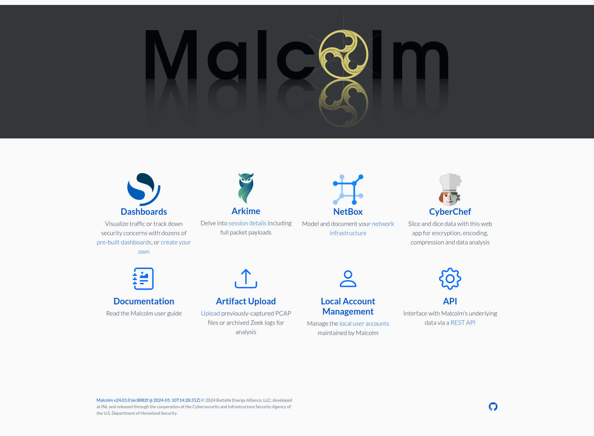

# <a name="QuickStart"></a>Quick start

* [Quick start](#QuickStart)
    - [Getting Malcolm](#GetMalcolm)
    - [User interface](#UserInterfaceURLs)

## <a name="GetMalcolm"></a>Getting Malcolm

For a `TL;DR` example of downloading, configuring, and running Malcolm in Docker on a Linux platform, see **[Installation example using Ubuntu 24.04 LTS](ubuntu-install-example.md#InstallationExample)**.

For a more in-depth guide convering installing both Malcolm and a [Hedgehog Linux](hedgehog.md) sensor using the [Malcolm installer ISO](malcolm-iso.md#ISO) and Hedgehog Linux installer ISO, see **[End-to-end Malcolm and Hedgehog Linux ISO Installation](malcolm-hedgehog-e2e-iso-install.md#InstallationExample)**.

### Source code

The files required to build and run Malcolm are available on its [GitHub page]({{ site.github.repository_url }}/tree/{{ site.github.build_revision }}). Malcolm's source-code is released under the terms of the Apache License, Version 2.0 (see [`LICENSE.txt`]({{ site.github.repository_url }}/blob/{{ site.github.build_revision }}/LICENSE.txt) and [`NOTICE.txt`]({{ site.github.repository_url }}/blob/{{ site.github.build_revision }}/NOTICE.txt) for the terms of its release).

### Building Malcolm from scratch

The `build.sh` script can build Malcolm's images from scratch. See [Building from source](development.md#Build) for more information.

### Initial configuration

The scripts to control Malcolm require Python 3.9 or higher. The [`install.py`](malcolm-config.md#ConfigAndTuning) script requires the [dotenv](https://github.com/theskumar/python-dotenv), [requests](https://docs.python-requests.org/en/latest/) and [ruamel.yaml](https://yaml.readthedocs.io/en/latest/) modules for Python 3, and will make use of the [pythondialog](https://pythondialog.sourceforge.io/) module for user interaction (on Linux) if it is available.

You must run [`auth_setup`](authsetup.md#AuthSetup) prior to pulling Malcolm's images. You should also ensure your system configuration and Malcolm settings are tuned by running `./scripts/install.py` and `./scripts/configure` (see [The Malcolm installation menu](ubuntu-install-example.md#InstallMenu) and [Malcolm Configuration Menu Items](malcolm-hedgehog-e2e-iso-install.md#MalcolmConfigItems)).

Users may wish to read the documentation on platform-specific host configuration:

* [Linux host system configuration](host-config-linux.md#HostSystemConfigLinux)
* [macOS host system configuration](host-config-macos.md#HostSystemConfigMac)
* [Windows host system configuration](host-config-windows.md#HostSystemConfigWindows)

### Pull Malcolm's Container images

Malcolm's images are periodically built and hosted on [GitHub](https://github.com/orgs/idaholab/packages?repo_name=Malcolm). If you already have [Docker](https://www.docker.com/) and [Docker Compose](https://docs.docker.com/compose/), these prebuilt images can be pulled by navigating into the Malcolm directory (containing the `docker-compose.yml` file) and running `docker compose --profile malcolm pull` like this:
```
$ docker compose --profile malcolm pull
Pulling api               ... done
Pulling arkime            ... done
Pulling dashboards        ... done
Pulling dashboards-helper ... done
Pulling file-monitor      ... done
Pulling filebeat          ... done
Pulling freq              ... done
Pulling htadmin           ... done
Pulling keycloak          ... done
Pulling logstash          ... done
Pulling netbox            ... done
Pulling nginx-proxy       ... done
Pulling opensearch        ... done
Pulling pcap-capture      ... done
Pulling pcap-monitor      ... done
Pulling postgresql        ... done
Pulling redis             ... done
Pulling suricata          ... done
Pulling upload            ... done
Pulling zeek              ... done
```

You can then observe the images have been retrieved by running `docker images`:
```
$ docker images
REPOSITORY                                                     TAG               IMAGE ID       CREATED      SIZE
ghcr.io/idaholab/malcolm/api                                   {{ site.malcolm.version }}           xxxxxxxxxxxx   3 days ago   158MB
ghcr.io/idaholab/malcolm/arkime                                {{ site.malcolm.version }}           xxxxxxxxxxxx   3 days ago   816MB
ghcr.io/idaholab/malcolm/dashboards                            {{ site.malcolm.version }}           xxxxxxxxxxxx   3 days ago   1.02GB
ghcr.io/idaholab/malcolm/dashboards-helper                     {{ site.malcolm.version }}           xxxxxxxxxxxx   3 days ago   184MB
ghcr.io/idaholab/malcolm/file-monitor                          {{ site.malcolm.version }}           xxxxxxxxxxxx   3 days ago   588MB
ghcr.io/idaholab/malcolm/file-upload                           {{ site.malcolm.version }}           xxxxxxxxxxxx   3 days ago   259MB
ghcr.io/idaholab/malcolm/filebeat-oss                          {{ site.malcolm.version }}           xxxxxxxxxxxx   3 days ago   624MB
ghcr.io/idaholab/malcolm/freq                                  {{ site.malcolm.version }}           xxxxxxxxxxxx   3 days ago   132MB
ghcr.io/idaholab/malcolm/htadmin                               {{ site.malcolm.version }}           xxxxxxxxxxxx   3 days ago   242MB
ghcr.io/idaholab/malcolm/keycloak                              {{ site.malcolm.version }}           xxxxxxxxxxxx   3 days ago   533MB
ghcr.io/idaholab/malcolm/logstash-oss                          {{ site.malcolm.version }}           xxxxxxxxxxxx   3 days ago   1.35GB
ghcr.io/idaholab/malcolm/netbox                                {{ site.malcolm.version }}           xxxxxxxxxxxx   3 days ago   1.01GB
ghcr.io/idaholab/malcolm/nginx-proxy                           {{ site.malcolm.version }}           xxxxxxxxxxxx   3 days ago   121MB
ghcr.io/idaholab/malcolm/opensearch                            {{ site.malcolm.version }}           xxxxxxxxxxxx   3 days ago   1.17GB
ghcr.io/idaholab/malcolm/pcap-capture                          {{ site.malcolm.version }}           xxxxxxxxxxxx   3 days ago   121MB
ghcr.io/idaholab/malcolm/pcap-monitor                          {{ site.malcolm.version }}           xxxxxxxxxxxx   3 days ago   213MB
ghcr.io/idaholab/malcolm/postgresql                            {{ site.malcolm.version }}           xxxxxxxxxxxx   3 days ago   268MB
ghcr.io/idaholab/malcolm/redis                                 {{ site.malcolm.version }}           xxxxxxxxxxxx   3 days ago   34.2MB
ghcr.io/idaholab/malcolm/suricata                              {{ site.malcolm.version }}           xxxxxxxxxxxx   3 days ago   278MB
ghcr.io/idaholab/malcolm/zeek                                  {{ site.malcolm.version }}           xxxxxxxxxxxx   3 days ago   1GB
```

### Import from pre-packaged tarballs

Once built, the `malcolm_appliance_packager.sh` script can be used to create pre-packaged Malcolm tarballs for import on another machine. See [Pre-Packaged Installation Files](development.md#Packager) for more information.

## Starting and stopping Malcolm

Use the scripts in the `scripts/` directory to start and stop Malcolm, view debug logs of a currently running
instance, wipe the database and restore Malcolm to a fresh state, etc.

## <a name="UserInterfaceURLs"></a>User interface

A few minutes after starting Malcolm (probably 5 or so for Logstash to be completely loaded, depending on the system), the Malcolm landing page and other services will be available via web browser by navigating to the hostname or IP address of the system.



## <a name="DockerVPodman"></a>Docker vs. Podman

Malcolm can run on [Podman](https://podman.io) as a rootless alternative to Docker. See the Linux instructions for [Installing and configuring Podman](host-config-linux.md#HostSystemConfigLinuxPodman) for more information.