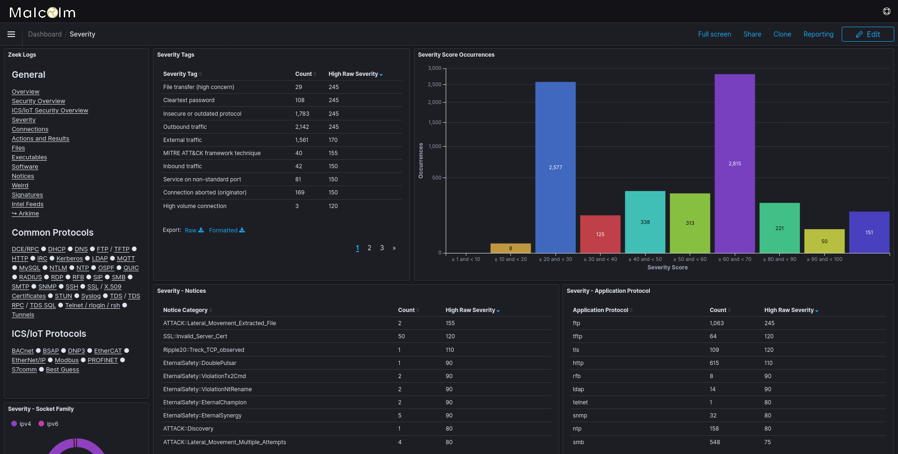

# <a name="Severity"></a>Event severity scoring

* [Event severity scoring](#Severity)
    - [Customizing event severity scoring](#SeverityConfig)

As Zeek logs are parsed and enriched prior to indexing, a severity score up to `100` (a higher score indicating a more severe event) can be assigned when one or more of the following conditions are met:

* cross-segment network traffic (if [network subnets were defined](asset-interaction-analysis.md#AssetInteractionAnalysis))
* connection origination and destination (e.g., inbound, outbound, external, internal)
* traffic to or from sensitive countries
    - The comma-separated list of countries (by [ISO 3166-1 alpha-2 code](https://en.wikipedia.org/wiki/ISO_3166-1_alpha-2#Current_codes)) can be customized by setting the `SENSITIVE_COUNTRY_CODES` environment variable in [`lookup-common.env`](malcolm-config.md#MalcolmConfigEnvVars)
* domain names (from DNS queries and SSL server names) with high entropy as calculated by [freq](https://github.com/MarkBaggett/freq)
    - The entropy threshold for this condition to trigger can be adjusted by setting the `FREQ_SEVERITY_THRESHOLD` environment variable in [`lookup-common.env`](malcolm-config.md#MalcolmConfigEnvVars). A lower value will only assign severity scores to fewer domain names with higher entropy (e.g., `2.0` for `NQZHTFHRMYMTVBQJE.COM`), while a higher value will assign severity scores to more domain names with lower entropy (e.g., `7.5` for `naturallanguagedomain.example.org`)
* file transfers (categorized by mime type)
* `notice.log`, [`intel.log`](zeek-intel.md#ZeekIntel) and `weird.log` entries, including those generated by Zeek plugins detecting vulnerabilities (see the list of Zeek plugins under [Components](components.md#Components))
* detection of cleartext passwords
* use of insecure or outdated protocols
* tunneled traffic or use of VPN protocols
* rejected or aborted connections
* common network services communicating over non-standard ports
* file scanning engine hits on [extracted files](file-scanning.md#ZeekFileExtraction)
* large connection or file transfer
    - The size (in megabytes) threshold for this condition to trigger can be adjusted by setting the `TOTAL_MEGABYTES_SEVERITY_THRESHOLD` environment variable in [`lookup-common.env`](malcolm-config.md#MalcolmConfigEnvVars)
* long connection duration
    - The duration (in seconds) threshold for this condition to trigger can be adjusted by setting the `CONNECTION_SECONDS_SEVERITY_THRESHOLD` environment variable in [`lookup-common.env`](malcolm-config.md#MalcolmConfigEnvVars)

As this [feature]({{ site.github.repository_url }}/issues/19) is improved, it is expected additional severity scoring categories will be identified and implemented.

When a Zeek log satisfies more than one of these conditions its severity scores will be summed, with a maximum score of `100`. A Zeek log's severity score is indexed in the `event.severity` field and the conditions that contributed to its score are indexed in `event.severity_tags`.



## <a name="SeverityConfig"></a>Customizing event severity scoring

The category severity scores can be customized by editing `logstash/maps/malcolm_severity.yaml`:

* Each category can be assigned a number between `1` and `100` for severity scoring.
* Any category may be disabled by assigning it a score of `0`.
* A severity score can be assigned for any [supported protocol](protocols.md#Protocols) by adding an entry with the key formatted like `"PROTOCOL_XYZ"`, where `XYZ` is the uppercased value of the protocol as stored in the `network.protocol` field. For example, to assign a score of `40` to Zeek logs generated for SSH traffic, you could add the following line to `malcolm_severity.yaml`:

```
"PROTOCOL_SSH": 40
```

Restart Logstash after modifying `malcolm_severity.yaml` for the changes to take effect.

Severity scoring can be disabled globally by setting the `LOGSTASH_SEVERITY_SCORING` environment variable to `false`  in the [`logstash.env`](malcolm-config.md#MalcolmConfigEnvVars) file and [restarting Malcolm](running.md#StopAndRestart).