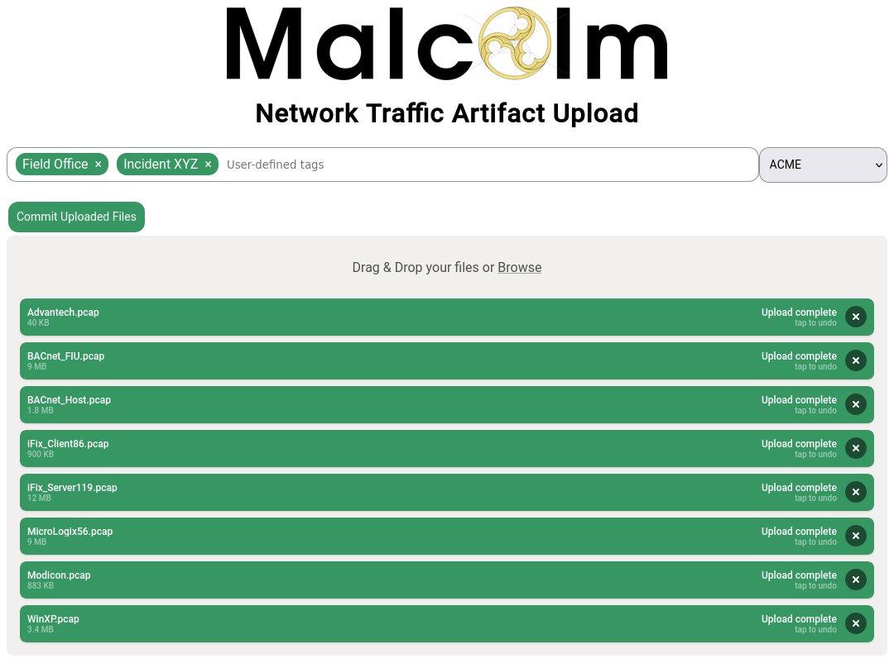

# Capture file and log archive upload

* [Capture file and log archive upload](#Upload)
    - [Tagging](#Tagging)
    - [Processing uploaded PCAPs with Zeek and Suricata](#UploadPCAPProcessors)

Malcolm serves a web browser-based upload form for uploading PCAP files and Zeek logs at **https://localhost/upload/** if connecting locally.

Additionally, there is a writable `files` directory on an SFTP server served on port 8022 (e.g., `sftp://USERNAME@localhost:8022/files/` if connecting locally).

The types of files supported are:

* PCAP files (of mime type `application/vnd.tcpdump.pcap` or `application/x-pcapng`)
    - PCAPNG files are *partially* supported: Zeek is able to process PCAPNG files, but not all of Arkime's packet examination features work correctly
* Zeek logs in archive files (`application/gzip`, `application/x-gzip`, `application/x-7z-compressed`, `application/x-bzip2`, `application/x-cpio`, `application/x-lzip`, `application/x-lzma`, `application/x-rar-compressed`, `application/x-tar`, `application/x-xz`, or `application/zip`)
    - where the Zeek logs are found in the internal directory structure in the archive file does not matter

Files uploaded via these methods are monitored and moved automatically to other directories for processing, generally within 1 minute of completion of the upload.

## Tagging

In addition to being processed for uploading, Malcolm events will be tagged according to the components of the filenames of the PCAP files or Zeek log archives files from which the events were parsed. For example, records created from a PCAP file named `ACME_Scada_VLAN10.pcap` would be tagged with `ACME`, `Scada`, and `VLAN10`. Tags are extracted from filenames by splitting on the characters `,` (comma), `-` (dash), and `_` (underscore). These tags are viewable and searchable (via the `tags` field) in Arkime and OpenSearch Dashboards. This behavior can be changed by modifying the `AUTO_TAG` [environment variable in `upload-common.env`](malcolm-config.md#MalcolmConfigEnvVars).

Tags may also be specified manually with the [browser-based upload form](#Upload).

## Processing uploaded PCAPs with Zeek and Suricata

The **Analyze with Zeek** and **Analyze with Suricata** checkboxes may be used when uploading PCAP files to cause them to be analyzed by Zeek and Suricata, respectively. This is functionally equivalent to the `ZEEK_AUTO_ANALYZE_PCAP_FILES` and `SURICATA_AUTO_ANALYZE_PCAP_FILES` environment variables [described above](malcolm-config.md#MalcolmConfigEnvVars), only on a per-upload basis. Zeek can also automatically carve out files from file transfers; see [Automatic file extraction and scanning](file-scanning.md#ZeekFileExtraction) for more details.
